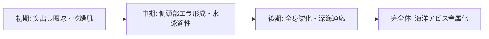

# クトゥルフ・パンク・正気度・インスマス変異力学 (Cthulhu Punk, Sanity & Innsmouth Traits)

本ドキュメントは、現代（2026年）におけるクトゥルフ神話的存在（CMB）、3d6基準の正気度・恐怖判定（Sanity / Fright Checks）、東京湾アビス水棲変異「インスマス面」、および呪曲・音波魔術力学を定めた公式基準書です。

---

## 1. クトゥルフ神話的存在 (CMB) と正気度力学 (Sanity Mechanics)

### 1.1 3d6 恐怖・正気度判定 (Fright Checks)
アビス異界生物や旧支配者の尖兵を目撃した際、**意志力（Will ± 恐怖修正）** で判定を行う。

| 恐怖度修正 | 目撃対象・状況例 | 判定失敗時の影響 (3d6 + 失敗度) |
| :--- | :--- | :--- |
| **0 (軽度)** | 低級アビス変異生物の死骸、血痕。 | 一時的フリーズ（1d 秒硬直）、鳥肌。 |
| **-2 〜 -4 (中度)** | 生きた食屍鬼、スライムの捕食現場。 | 気絶（1d 分）、激しい嘔吐、失禁。 |
| **-5 〜 -8 (重度)** | 古のもの、次元断層の開口、精神汚染波。 | パニック逃亡、短期狂気（緊張病・幻覚 1d 日）。 |
| **-10+ (破滅的)** | 宇宙からの色、旧支配者の顕現。 | **恒久狂気**、完全精神崩壊、心臓発作（HT判定）。 |

---

## 2. 東京湾アビス水棲変異「インスマス面」 (The Innsmouth Look)

東京湾アビス・ベイ沿岸のスラム（夢の島・有明メガフロート）の住民に発現する水棲・魚類形質変異。

### 2.1 生体特徴とゲームデータ
- **水棲適応 (Amphibious / 10 CP)**: 水中での呼吸可能、水中移動力 = 通常移動力。
- **圧力耐性 (Pressure Support / 5 CP)**: 水深 500m までの高水圧に完全耐性。
- **不利な特徴**:
  - *インスマス面 (Unattractive〜Monstrous)*: 容貌ペナルティ（一般人からの反応 -2〜-4）。
  - *皮膚乾燥症 (Dehydration)*: 1日に1回海水に浸からないと毎時間 1 FP 喪失。

---

## 3. 呪曲・音波共鳴魔術 (Cursed Hymns & Sonic Magic)

特定の周波数・アビス音波を声帯または楽器で奏でることで、生体の神経と精神を直接破壊・狂乱させる術式。

- **神経共鳴パルス**: 聴覚を持つ全生物に **DR無視の 2d fat（疲労ダメージ）** ＋ 激痛。
- **狂乱誘発**: 聴いた対象に意志力判定を強制し、失敗した者を凶暴化させて同士討ちを起こさせる。
