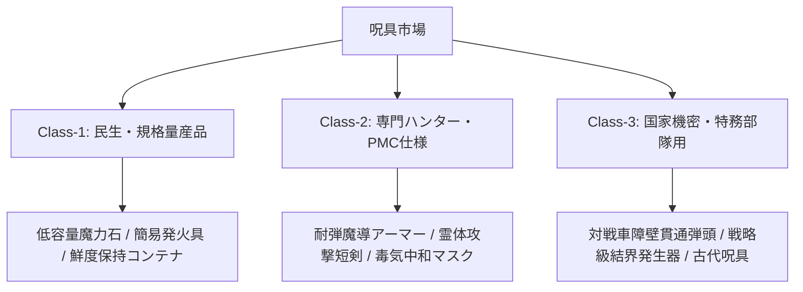

# 魔化力学・魔法の品物と現代呪具経済 (Enchantment & Magic Items)

本ドキュメントは、ガープス第4版『魔法大全』第2章「魔法の品物（Magic Items）」および関連データ（`magic_page_109`〜`136`）を基に、魔化（Enchanting）の原理、品物のパワー、魔力石（パワーストーン）の力学、および2026年現代社会（メガコーポ支配・軍事PMC・ハンター市場）における呪具経済を構造化した公式設定資料です。

---

## 1. 魔化の基本原理と呪具力学

### 1.1 魔化（Enchantment）の定義
魔化とは、特定の呪文効果を物品・道具・生体に恒久的に定着させる高度な魔術工学プロセスです。
- **生体媒介の原則**: 物理的機械そのものに魔力が宿るのではなく、術士の生体電位・意志・霊的共鳴を媒介として物質の微細構造（結晶格子や分子結合）にマナの指向性パターンを刻み込みます。
- **素質要求**: 原則として魔化の実施には「魔術の素質（Magery）2レベル以上」を必要とし、至難技能《魔化（Enchant）》および定着させたい個別呪文の習得が前提となります。

### 1.2 品物のパワー（Item's Power）
魔法の品物には、術士の呪文技能レベルに相当する「品物のパワー（Power）」が設定されます。
- **標準パワー**: 原則として「パワー15」。これは品物の使用者が呪文を発動する際、技能レベル15として成功判定を行うことを意味します。
- **エネルギー消費軽減**: パワー15の品物はエネルギー消費が1点軽減され、パワー20以上ではさらに軽減されます（高パワー品は製作コストが指数関数的に増大）。
- **マナレベルとの関係**:
  - **通常マナ地域**: 誰でも品物の効果を起動・使用可能（素質不要）。
  - **希薄マナ地域**: 魔術の素質を持つ者のみが起動可能（効果・パワーに-5ペナルティ）。
  - **濃厚マナ地域**: 起動判定に+5。意図しない暴走や過剰励起のリスクあり。
  - **マナ枯渇地域**: 完全に休眠し、機能停止（物理的破壊はされない）。

---

## 2. 魔化の二大製造プロセス

### 2.1 手軽で危ない魔化（Quick and Dirty Enchantment）
複数の術士が集まり、儀礼魔法の形式で短時間に一気に莫大なマナを注ぎ込む高速製造法。

| 項目 | 内容・規定 |
| :--- | :--- |
| **作業時間** | 100エネルギーあたり約1時間（小規模な品物なら数時間で完了） |
| **参加人数** | 主術士1名＋助手（全員が《魔化》と該当呪文を習得している必要あり） |
| **エネルギー上限** | 参加術士の最大FP合計＋使用可能なパワーストーンの容量 |
| **リスクとファンブル** | 判定失敗時は全エネルギーが喪失。ファンブル（大失敗）時は品物が激しく爆発・破損し、術士全員が深刻な霊的バックラッシュ（負傷・精神汚染・変異）を被る。 |
| **現代における適用** | メガコーポ（三ツ菱マナテック、ヤマト重工等）のクリーンルーム型魔導研究所で、高位術士チームによる特注品・試作品の短納期製造に用いられる。 |

### 2.2 ゆっくり確実な魔化（Slow and Sure Enchantment）
1名または少数の熟練術士が、毎日定時（1日8時間）の作業を数ヶ月〜数年間にわたり継続し、1日あたり1人「1エネルギー」ずつ地道に定着させる安全な製造法。

| 項目 | 内容・規定 |
| :--- | :--- |
| **作業ペース** | 1人の術士につき「1日1エネルギー」を蓄積。 |
| **作業中断の規則** | 病気・負傷・戦闘等で作業を中断した場合、累積日数に応じて判定ペナルティが発生。連続して数日以上休止するとそれまでの魔力が霧散し最初からやり直しとなる。 |
| **判定タイミング** | 全必要エネルギーが蓄積された最終日に1回のみ成功判定を実施。 |
| **ファンブル時の被害** | 製作中の品物は灰燼に帰すが、術士自身への肉体的被害は軽微（数ヶ月分の労力と素材が無駄になる経済的破滅）。 |
| **現代における適用** | 国防用古代結界柱の修復、特注の高知能竜種対策呪具、伝統工芸ギルド（刀鍛冶・巫女具工房）での長期製造。 |

---

## 3. 魔力石（パワーストーン）力学と歪み（Quirks）

### 3.1 魔力石（Powerstone）の性質
魔力石は、マナを蓄積・充填し、術士が詠唱時や魔化作業時にFP（疲労点）の代わりに消費できる特殊な宝石（または高純度シリカ・人工結晶）です。
- **再充填速度**: 通常マナ環境下で「1日あたり1エネルギー」自然回復。
- **共鳴干渉（近接制限）**: 複数の魔力石を互いに半径2メートル（約6フィート）以内に近づけると、マナ波が干渉し合って再充填が完全に停止する（保管時は専用の鉛・銀遮蔽ケースに個別に隔離する必要がある）。

### 3.2 魔力石の価格方程式
魔力石の価値は、宝石自体の原石価格（カラット数・透明度）に魔化エネルギーコストが上乗せされるため、容量（P点）に対して非線形（二次関数的）に高騰します。

$$\text{価格（基準市場価格）} = (\text{基本宝石代}) + (P \times 100\text{クレジット}) + (P^2 \times 40\text{クレジット})$$

*※現代（2026年）の日本円換算では、1点あたり約10万〜15万円、大容量（20P以上）の石は数千万〜数億円で取引される戦略物資。*

### 3.3 魔力石の歪み（Powerstone Quirks）
《魔力石》の魔化判定時や、過度なマナサージ・衝撃を受けた際、石に「霊的歪み（癖）」が恒久的に刻まれる場合があります。

| 出目 (3d6) | 歪み（Quirk）の内容 | 現代魔導科学における観測・影響 |
| :---: | :--- | :--- |
| **3-4** | **特定属性専用**: 特定系統の呪文にしかエネルギーを提供しない。 | 火霊専用石、電脳魔術専用石など。 |
| **5-6** | **使用者限定**: 特定のDNA配列、血液型、または新人類（エルフ等）しか起動できない。 | 生体認証ロック付き呪具として軍事PMCで高値取引。 |
| **7-8** | **発光・発熱**: エネルギー放出時に強い燐光を放つ、または触れないほど熱くなる。 | 隠密作戦には不向き。 |
| **9-11** | **微細な音・電磁ノイズ**: 充填・放出時に高周波ノイズ（コイル鳴き）を発生させる。 | 周辺の電子機器・無線通信に微弱な電波障害を誘発。 |
| **12-13** | **感情共鳴**: 使用者の怒り・恐怖・緊張に反応して勝手にマナが漏出する。 | 術士のメンタルケアが必須。 |
| **14-15** | **緩慢充填**: 充填速度が通常の2倍（2日に1点）かかる。 | 二級品としてディスカウント流通。 |
| **16-18** | **致命的欠陥**: 最後の1点を使い切ると破損・粉砕する、またはマナドレインを引き起こす。 | 危険物指定（Class-C呪具）。 |

---

## 4. 複数魔化・品物なし魔化・常動型呪具

### 4.1 複数魔化（Multiply Enchanted Items）
同一の物品に複数の呪文を魔化する場合、工程を重ねるごとに難易度が上昇します。
- **ペナルティ**: 2つ目の呪文以降、対象にすでに付与されている呪文1つにつき魔化判定に **-1**（または必要エネルギー+20%）。
- **調和魔化（Link）**: 複数の呪文を連動させて自動起動させる場合、《連動（Link）》呪文を事前に魔化する必要がある。

### 4.2 常動型の品物（"Always On" Items）
装備しているだけで常に防御・知覚・身体強化効果を発揮するパッシブ呪具。
- **エネルギー維持**: 術士のFP消費なしで効果が半永久持続するよう設計されている。
- **着脱時の同期ラグ**: 装備してから生体オーラと同期して効果が発動するまでに「1秒〜数分」のタイムラグが発生する場合がある。

### 4.3 品物なしの魔化（場所・建造物・生体への魔化）
物品ではなく、特定の部屋、防護壁、結界ゲート、または生体自身に魔術を定着させる技法。
- **結界都市への応用**: 東京の第1〜第3同心円要塞線、春日部地下放水路神殿、皇居コア・セーフゾーンの防壁には、この技術で《強固》《防御結界》《侵入感知》が恒久定着されている。

---

## 5. 2026年現代メガコーポ社会における呪具経済

### 5.1 魔法の工業化（量産化）の限界
現代のテクノロジー（精密旋盤、半導体リソグラフィ、AI設計）をもってしても、魔化の完全自動化・ベルトコンベア量産は**原理的に不可能**です。
- **生体霊格のボトルネック**: マナは術士の生体・魂を通じてしか物質に定着しないため、どれほど巨大な工場であっても「高位術士が直接手を下す工程」を省略できない。
- **メガコーポの囲い込み**: 世界BIG5（レンラク、ヤマト、アレス等）およびテイコク製薬、三ツ菱マナテックは、高適性の新人類（エルフ系術士等）を専属技術者として囲い込み、クリーンルーム内でシフト制の魔化作業を行わせている。

### 5.2 現代軍事・ハンター市場における流通グレード

1. **民生・規格量産品（Class-1）**:
   - 豊洲中央流通HDや一般アウトドアショップで認可販売。キャンプ用着火具、Class-A魔獣肉保存用冷蔵庫の鮮度保持刻印など。
2. **専門ハンター・PMC仕様（Class-2）**:
   - 認可ハンターライセンスおよび魔力適性者IDが必要。剛毛巌猪のシリカ牙を加工した耐摩耗ブレード、対霊体用銀・チタン合金ナイフなど。
3. **国家機密・特務部隊用（Class-3）**:
   - 自衛隊専門魔法部隊やメガコーポ特殊作戦班にのみ配備される一点物の戦略呪具。
