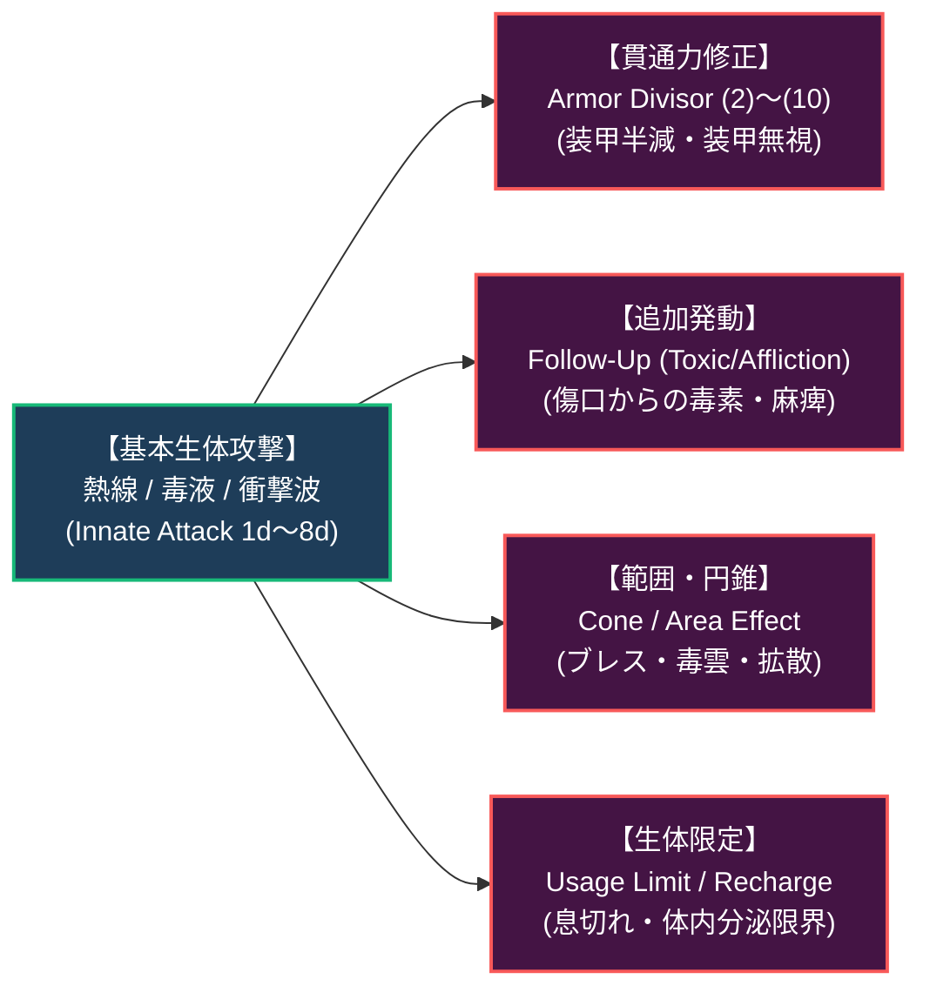

# 魔獣生体異能・エネルギーリザーブ・才能力学 (Creature Innate Powers, Energy Reserves & Talents)

本ドキュメントは、ガープス第4版（『GURPS Powers』『GURPS Power-Ups 1〜4, 8』『Basic Set: Characters』B99〜110P, B162〜164P等）に準拠した**魔獣の生体異能（Innate Attacks）、貫通力修正（Armor Divisor）、活力供給源（Energy Reserves: ER）、専門才能（Talents）、およびガジェット（呪具・発明品）限定力学**の完全構造化アーカイブです。  
図鑑記事（`TEMPLATE.md`）の魔獣能力（ブレス、毒腺、電撃、生体装甲）および現代PMC・術士のエネルギー・才能設計基準を定めます。

---

## 1. 魔獣の生体異能と攻撃修正 (Innate Attacks & Modifiers)

魔獣が生まれ持つ生体武器（ブレス、毒牙、放電、シリカ剛毛射出等）は、ガープスの「生来の攻撃（Innate Attack）」として定量化される。

### 1.1 貫通力修正 (Armor Divisor: 装甲除数) と現代装甲突破
魔獣の特殊攻撃や術士の徹甲術式には、対象の防護点（DR）を特定倍率で除算（軽減）する**貫通力修正**が付与される。

| 貫通力修正 | 原書表記 | DR除算倍率 | 増強コスト | 現代兵器・魔獣攻撃の実例 |
| :---: | :---: | :---: | :---: | :--- |
| **装甲半減** | Armor Divisor (2) | DR $\div 2$ | ＋50％ | 7.62mm AP（徹甲弾）、Crag Boarのシリカ結晶牙突進 |
| **装甲3分割** | Armor Divisor (3) | DR $\div 3$ | ＋100％ | 12.7mm SLAP弾（軽装甲貫通弾）、濃縮酸ブレス |
| **装甲5分割** | Armor Divisor (5) | DR $\div 5$ | ＋150％ | 対戦車HEAT弾（成形炸薬弾頭）、プラズマ熱線 |
| **装甲10分割**| Armor Divisor (10) | DR $\div 10$ | ＋200％ | 超電導レールキャノン、上位アビス魔獣の次元振動爪 |
| **装甲無視** | Ignores DR | DR無効 | ＋300％ | 生体電撃（体内通電）、接触毒雲、純粋精神攻撃 |

---

## 2. 活力供給源 (Energy Reserves: ER)

魔導術士および高マナ変異魔獣は、生体代謝の「疲労点（FP）」とは完全に独立した霊的エネルギー蓄積プール**「活力供給源（Energy Reserve: ER）」［3CP/点］**を保持する。

### 2.1 ERの力学的特性と利点
1. **生体疲労との完全分離**:
   - 術式詠唱やブレス放射でERを全消費しても、術士・魔獣は息切れ・疲労状態（FP減少ペナルティ）に陥らない。
   - 体力が限界（FP 0）であっても、ERが残っていれば魔術・生体障壁を発動可能。
2. **回復サイクル**:
   - 通常のマナ環境下で**10分に1点**自然回復する（「高速回復」増強により1秒に1点まで短縮可能）。
3. **メガコーポにおける工業的ERバッテリー**:
   - ヤマト重工・三ツ菱マナテック製「生体サイバーデッキ」や特務スーツには、魔力石をベースとした人工ERユニット（ER 10〜30）が換装されている。

---

## 3. 専門才能体系 (Talents & Job Training)

才能（Talent）は、関連する一連の技能判定すべてに $+1 \sim +4$ のボーナスを与え、学習時間を短縮する天性の資質である（5〜15CP/レベル）。

### 3.1 現代魔導・メガコーポ社会における主要才能

| 才能名（原書名） | コスト | 適用技能グループ | 現代社会・軍事での実態 |
| :--- | :---: | :--- | :--- |
| **工学の天分 (Artificer)** | 10CP/L | 〈機械修理〉〈電子修理〉〈兵器工学〉〈鍛冶〉 | ヤマト重工の兵器エンジニア、ドワーフ系整備工。 |
| **治癒の天分 (Healer)** | 10CP/L | 〈診断〉〈第一治療〉〈外科〉〈医師〉〈薬学〉 | テイコク製薬の医療術士、野戦病院救命トリアージ。 |
| **電脳同調 (Cyber-Attuned)** | 5CP/L | 〈コンピュータ操作〉〈コンピュータプログラミング〉〈電子作戦〉 | 生体媒介電脳魔術師（サイバーメイジ）。 |
| **魔境追跡 (Tracker)** | 5CP/L | 〈追跡〉〈自然科学/動物学〉〈わな〉〈変装/偽装〉 | 壁外プロハンター、自衛隊斥候部隊、マタギ。 |
| **戦闘の天分 (Combat Talent)** | 15CP/L | 〈射撃〉〈白兵武器〉〈戦術〉〈格闘〉 | 特殊作戦群、PMC精鋭オペレーター。 |

---

## 4. ガジェット限定と現代呪具・装備 (Gadget Rules)

物理的な道具・兵器・端末を介して発動する魔術的特徴・異能には、**ガジェット限定（Gadget Limitations）**が適用され、CPコストが割引される。

1. **壊れる（Breakable）［-5％〜-35％］**:
   - 道具が物理攻撃や爆風で破壊される危険性（DR値およびSMに応じて割引率が決定）。
2. **盗まれる（Can Be Stolen）［-10％〜-40％］**:
   - 近接戦闘で奪取される、あるいは隙を見てスリ取られる危険性。
3. **代わりがない（Unique）［-25％］**:
   - 世界に1つしか存在しない古代呪具や、失われたマナ結晶祭具。

---

## 5. 超越種・宇宙パワー力学 (Cosmic Mechanics)

Threat Level V（高知能古代龍、4大アビス特異点の主、神性存在）が有する**「宇宙パワー（Cosmic）」［＋50％〜＋300％］**。
- **絶対障壁突破（Cosmic: Irresistible attack）**: あらゆる物理装甲・魔術障壁・結界を完全に無視して本体にダメージを通す。
- **能動防御不可（Cosmic: No active defense）**: 標的の「よけ」「受け」「止め」の機会を奪う超高速・不可避攻撃。
- **常時完全制御（Cosmic: Complete maneuverability）**: 慣性を無視した亜音速機動および瞬間加速。
- **軍事対処指針**: このレベルの存在に対しては、通常兵器はおろか戦略核・戦略魔術ですら無効化されるため、**「交戦禁止・絶対不可侵条約」**が国際法上義務付けられている。
