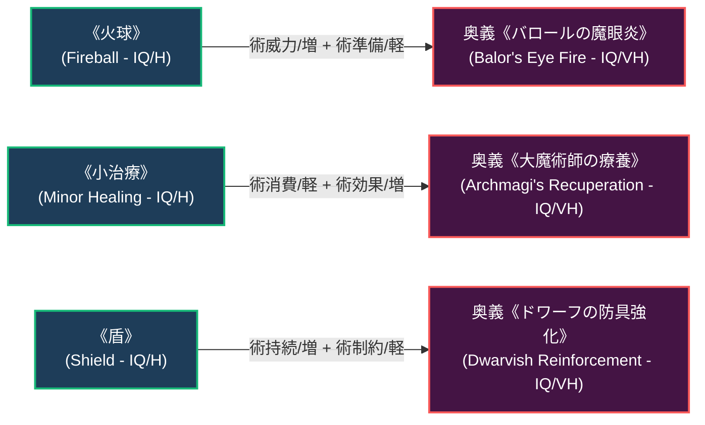

# 魔法流派・特典・奥義呪文力学 (Magical Styles, Perks & Secret Spells)

本ドキュメントは、ガープス第4版（『GURPS Thaumatology: Magical Styles』『GURPS Power-Ups 2: Perks』『Pyramid #3/76: Dungeon Fantasy IV』等）に準拠した**魔法系特典（Magical Perks）**、**奥義呪文（Secret Spells）**、および**魔法流派・改造オプション体系**の完全構造化アーカイブです。  
現代のメガコーポ専売術式、軍事機密呪文、新人類（メタヒューマン）の血統秘伝、および民間PMCのカスタム術式の設計基準を定めます。

---

## 1. 魔法系特典 (Magical Perks)

魔法系特典は、術士が魔術の訓練・実戦経験・特殊な血統によって獲得する1CPの有利な特徴（超常系・精神系・所作系）です。
- **習得基準**: 呪文に20CP費やすごとに1つ習得可能（特定の公認魔法流派に所属している場合は、流派呪文/技能10CPごとに1つ習得可能）。

### 1.1 主要な魔法系特典の分類一覧

| 分類 | 特典名（原書名） | 効果概要 | 現代魔導・メガコーポでの実態 |
| :--- | :--- | :--- | :--- |
| **背景・流派** | **奥義魔法 / 種別** (Secret Spell) | 特定の秘伝奥義呪文を習得・使用する権利を得る。 | メガコーポの特許術式や軍事機密呪文のアクセス権。 |
| **背景・流派** | **学歴適合 / 流派** (Magical Style Adaptation) | 別の魔法流派の秘伝・特典を自流派の枠組みで習得可能。 | 複数メガコーポの技術提携術士や亡命術士の技能統合。 |
| **背景・流派** | **重装時詠唱** (Armored Casting) | 特定の防弾ベスト・防護装甲を着用していても詠唱ペナルティを軽減。 | 特殊部隊・PMC前線術士の標準タクティカル訓練。 |
| **背景・流派** | **流血魔法** (Blood Magic) | 自らのHP（血液）を消費してマナ・FP不足を補填する。 | スラム街の裏魔術師や過酷な壁外サバイバル術。 |
| **背景・流派** | **真名識者 / 隠匿** (Knower / Obscure True Name) | 自らの霊的識別名（真名）を隠蔽、または他者の真名を見抜く。 | 電脳ハッキング防御・霊体契約時の対乗っ取り防壁。 |
| **所作・運用** | **標準操作手順 / 種別** (Standard Operating Procedure) | 特定の防御呪文や警戒動作を常時自動で維持・実行。 | 「接敵即障壁」「宿営即警戒」の身体反射化。 |
| **所作・運用** | **簡易小魔法** (Intuitive Cantrip) | 生活・便利小呪文を無詠唱・無消費で直感的に行使。 | スラムの新人類や下級術士の日常生活での魔力利用。 |
| **呪文機能** | **呪文前提緩和** (Shortcut to Power / Charms) | 特定呪文の前提条件ツリーを1〜2段階スキップして習得。 | メガコーポの短期養成プログラムによる促成魔術師。 |
| **呪文機能** | **抵抗上限拡張** (Rule of 17) | 抵抗呪文の対抗判定において通常の上限16を17まで突破。 | 精鋭魔法部隊のエクソシスト・対術士無力化スペシャリスト。 |
| **アイテム** | **銘刻 / 種別** (Named Possession) | 自らの愛用する杖や銃・端末を呪具化し、魔力同調を高める。 | サイバーデッキや特注ライフルとの生体神経同調。 |
| **社会・資格** | **免許 / 許可** (License / Permit) | 国家・自治体から特定の危険呪文・軍事術式の行使を公認される。 | 防衛省「対魔獣重火器併用魔導免許」「Class-B解体免許」。 |

---

## 2. 奥義呪文体系 (Secret Spells System)

奥義呪文とは、一般的な魔導書や学校では公開されていない、特定の門閥、メガコーポ、または軍事秘密組織のみが独占する強化型・特殊派生呪文です。

### 2.1 奥義呪文の基本仕様とスロット力学
- **習得難易度**: すべての奥義呪文は原則として**「知力 / 至難（IQ/VH）」**となる。
- **前提特徴**:
  - **一般奥義呪文**: 特典「奥義呪文 / [呪文名]」［1CP］が必要。
  - **上級奥義呪文 (Advanced Secret Spell)**: 有利な特徴「特殊な背景 / [上級奥義呪文名]」［5CP］が必要。
- **強化スロット数**:
  - 元が「知力 / 難（IQ/H）」の呪文をベースにする場合：**2スロット**の強化オプションを付与。
  - 元が「知力 / 至難（IQ/VH）」の呪文をベースにする場合：**1スロット**の強化オプションを付与。
  - **上級奥義呪文**の場合：**4スロット**の強化オプションを付与。
- **欠点相殺ルール (Drawbacks)**:
  - 呪文に最大2つまでの「欠点（オプションの逆効果）」を意図的に組み込むことで、その数だけ追加の強化スロットを獲得可能（最大スロット数 = 基本スロット + 欠点数）。

---

## 3. 奥義呪文の強化オプション・欠点リスト (Spell Options)

| オプション名（原書名） | 強化版（+1スロット）の効果 | 欠点版（Drawback / -1）の効果 |
| :--- | :--- | :--- |
| **術難度 / 軽 (Easy to Learn)** | 習得難易度が至難から難（または難から並）へ1段階低下。 | 習得難易度が1段階上昇（至難+1扱い）。 |
| **術消費 / 軽 (Energy Efficient)** | 基本消費エネルギーが-1（または維持コスト半減）。 | 基本消費エネルギーが+1〜+2増加。 |
| **術威力 / 増 (Enhanced Damage)** | ダメージダイス+1d、またはダメージ修正+2。 | ダメージが-1dまたは半減。 |
| **術持続 / 増 (Lasting)** | 持続時間が1段階延長（秒→分、分→時間、時間→日）。 | 持続時間が1段階短縮（分→秒等）。 |
| **術範囲 / 増 (Mass’tery)** | 効果範囲・基本半径が2倍、または範囲ペナルティ半減。 | 効果範囲が半減、または単体対象に限定。 |
| **術準備 / 軽 (Quick)** | 詠唱・準備時間が半減（または1秒短縮、最低1秒）。 | 準備時間が2倍（または+1〜2秒延長）。 |
| **術制約 / 軽 (Rules-Breaker)** | 特定の基本制約（接触必須、対象の視界必須等）を撤廃。 | より厳しい制約（特定の触媒必須、詠唱中の静止等）が追加。 |
| **術効果 / 増 (Unique Effect)** | 付随効果（朦朧、毒傷、ノックバック、盲目等）を追加。 | 対象に有利な副効果、または術者に軽微な反動。 |

---

## 4. 現代における主要な奥義呪文・派生術式の例

### 4.1 メガコーポ・国家機関の独占奥義例
1. **ヤマト重工製《超電導加速徹甲弾》（Armored Rail-Shot / 運動・技術系奥義）**:
   - ベース: 《金属射出》＋【術威力/増】【術準備/軽】。
   - 12.7mmタングステン弾頭に魔導加速を付与し、初速2,000m/s超・DR20貫通の運動エネルギー弾を単独発射する対障壁決戦術式。
2. **テイコク製薬製《神経遮断死毒》（Synaptic Neuro-Toxin / 毒系奥義）**:
   - ベース: 《毒投与》＋【術制約/軽（非接触）】【術効果/増（呼吸停止）】。
   - 遠隔から標的のシナプス伝達を直接停止させ、暗殺・証拠隠滅を行う特許指定禁忌術式。
3. **防衛省特務魔法部隊《春日部結界防壁》（Metropolitan Aegis / 防御系上級奥義）**:
   - ベース: 《防護》＋【術範囲/増】【術持続/増】【術消費/軽】【術効果/増】。
   - 首都圏外郭放水路の要塞神殿から送電網と同心円要塞線に多重展開される、戦略級物理・霊的ハイブリッド防衛結界。
