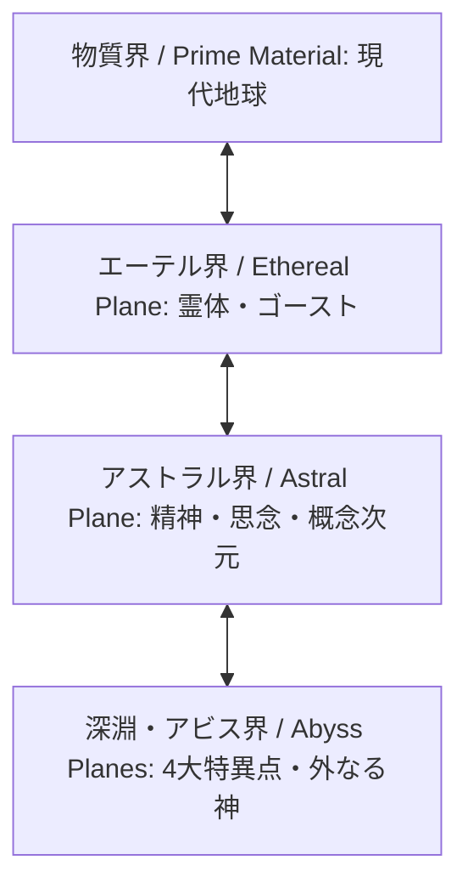

# 異界次元・アストラル界・アビス特異点侵食力学 (Planes of Existence, Astral Projection & Abyss Reality Incursions)

本ドキュメントは、現代（2026年）における4大アビス特異点（マリアナ海溝、ツングースカ、サハラ、バミューダ）、物質界と重なるエーテル界・アストラル界、アストラル投射（幽体離脱）、および異界からの「現実侵食（Reality Incursions）」力学を定めた公式基準書です。

---

## 1. 多層次元構造体系 (Planes of Existence)

世界は物質界単独で存在するのではなく、マナ覚醒以降、複数の霊的・異界次元と重なり合っている。

### 1.1 3大隣接次元の特徴
1. **物質界 (Prime Material)**: 物理法則とシリコン半導体が支配する現代地球。
2. **エーテル界 (Ethereal Plane)**: 物質界と完全に重なり合う薄膜次元。物理壁を透過するが、霊体・ゴースト・残留思念が存在。通常兵器は完全無効。
3. **アストラル界 (Astral Plane)**: 距離と時間の概念が希薄な精神次元。銀のコード（Silver Cord）で肉体と接続された意識のみが移動可能。

---

## 2. アストラル投射・幽体離脱力学 (Astral Projection)

術士が自らのアストラル体（精神体）を肉体から分離して次元潜行を行う力学。

### 2.1 投射中の生体・戦闘ルール
- **肉体の無防備化**: 投射中、物質界に残された肉体は「昏睡（Coma）」状態となり、完全無防備。
- **アストラル銀コード (Silver Cord)**: 肉体とアストラル体を結ぶ不可視の霊的命綱。これが切断されると肉体は即座に脳死し、魂はアビスへ漂流する。
- **アストラル戦闘**: 筋力（ST）や敏捷（DX）の代わりに、**知力（IQ）と意志力（Will）** を用いて攻撃・防御判定を行う。

---

## 3. 4大アビス特異点と現実侵食力学 (Abyss Singularities & Reality Incursions)

西暦2000年のミレニアム・アウェイクニングで世界4箇所に開いた大断層から、異次元生態系と狂気の物理法則が物質界へ流入する現象。

### 3.1 4大アビス特異点の現況
| 特異点名称 | 所在地 | 侵食環境・現象 | 危険種・生態系 |
| :--- | :--- | :--- | :--- |
| **マリアナ大断層** | 太平洋深海 | 超高圧マナ熱水噴出孔、空間歪曲海流 | 超巨大海棲クラーケン、深海変異種 |
| **ツングースカ大空洞** | シベリア極寒 | 永久凍土下の古代氷結マナ結晶、絶対零度嵐 | 古代氷結龍、霊体マンモス |
| **サハラ・オアシス** | アフリカ砂漠 | 空間重力逆転、結晶砂漠化、超濃縮マナ嵐 | 砂漠神性精霊、鉱物化変異獣 |
| **バミューダ歪曲海域** | 大西洋海域 | 時間遅延・過去未来の残骸漂流、空間跳躍の歪み | 異次元漂流ゴースト船、時空捕食獣 |

### 3.2 現実侵食力学 (Reality Incursion Mechanics)
アビス特異点の近傍（マナ汚染指定地域・アウトランド深部）では、物質界の現実が書き換えられる：
- **局所マナレベルの暴走**: 「超濃マナ（Very High Mana）」または「狂気マナ（Wild Mana）」化。詠唱ファンブルが壊滅的厄災を引き起こす。
- **物理定数の歪み**: 重力変動（0.5G〜2.0G）、時間流の局所遅延（外の世界の1時間が内部の1日）。
- **精神汚染（アビス狂気）**: 侵食域に 1時間滞在するごとに **意志力判定（SC 12以下）**。失敗で妄想、恐怖症、または狂乱変異を発症。
