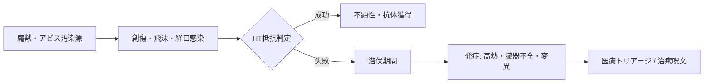

# 毒・病気・薬物依存・感染症力学 (Poisons, Diseases, Drugs & Contagions)

本ドキュメントは、現代（2026年）における魔獣生体毒、化学・合成毒素、アルコール・戦闘用薬物・依存症、および人獣共通感染症・アビス流行病のメカニズムを定めた公式基準書です。

---

## 1. 毒素・生体毒の総合力学 (Poison Mechanics)

### 1.1 毒の4大投与経路 (Delivery Methods)
1. **接触毒 (Contact)**: 皮膚・粘膜に触れるだけで浸透。通常の防具（DR）を無視（密閉スーツのみ防御可）。
2. **血液毒 / 注入毒 (Injected / Blood Agent)**: 刺創・切創・咬傷により血流に侵入（最低 1 点のダメージ突き抜けが必要）。
3. **呼吸毒 / 吸入毒 (Inhaled / Respiratory)**: 空気中の有毒ガス・粉塵・胞子を吸入。ガスマスクや密閉ヘルメットで無効化可能。
4. **消化毒 / 経口毒 (Ingested / Digestive)**: 汚染された飲食物、未処理のClass-B/C魔獣肉の摂取により発症。

### 1.2 毒のステータス構造 (Poison Profile)
すべての毒は以下の標準パラメータで定義される：
- **遅延時間 (Onset)**: 曝露から症状発現までの時間（即時〜数時間・数日）。
- **抵抗判定 (Resistance Roll)**: **生命力（HT ± 修正値）**。
- **効果・致傷ダメージ**:
  - 抵抗成功：無効、または半減ダメージ。
  - 抵抗失敗：毒ダメージ（tox）、疲労ダメージ（fat）、または特定状態異常（麻痺、激痛、心停止）。
- **持続時間と反復 (Duration & Cycles)**: 解毒されない限り、一定間隔（1時間毎、1日毎）で抵抗判定が繰り返される。

---

## 2. 飲酒・薬物・依存症・過剰摂取 (Alcohol, Drugs & Addiction)

### 2.1 アルコールと酩酊力学 (Alcohol & Intoxication)
- **飲酒量と判定**: 標準的な酒（ビール1杯、ショット1杯）を短時間で複数摂取するごとに **生命力（HT）判定**。
- **酩酊段階**:
  - **ほろ酔い (Tipsy)**: HT判定 -1回失敗。知力・敏捷判定に **-1**。多幸感。
  - **酩酊 (Drunk)**: HT判定 -2回失敗。全技能判定に **-2**、移動力 -1、反応判定変化。
  - **泥酔 (Very Drunk)**: HT判定 -3回失敗。全技能判定に **-4**、意志力半減、視覚朦朧。
  - **急性アルコール中毒**: HT判定 -4回以上失敗。意識不明（昏睡）、心不全判定。
- **二日酔い (Hangover)**: 覚醒後、失われたFPの自然回復が停止し、激しい頭痛（全知力判定 -2）が数時間持続。

### 2.2 戦闘用刺激剤・メガコーポ製合成ドラッグ (Combat Stimulants)
現代のPMCや術士、裏社会で使用される生体強化薬。

| 薬物名 | 用途・強化効果 | 代償・副作用 | 依存度・禁断症状 |
| :--- | :--- | :--- | :--- |
| **テイコク製薬「ハイパー・アドレナリン」** | 30分間、ST+2、移動力+1、苦痛完全無視（大怪我ペナルティ無効）。 | 効果終了後、**4 FP 喪失**、激しい疲労と脱力。 | 軽度心理依存（意志力判定）。 |
| **三ツ菱マナテック「シナプス・アンプ」** | 1時間、知力・感覚+2、詠唱時間 1秒短縮。 | 神経過熱。効果終了後、知力-2（24時間持続）。 | 中度依存。禁断症状：手の震え、集中力崩壊。 |
| **裏社会密造「アビス・ダスト」** | 10分間、魔力適性（Magery）+2、恐怖完全耐性。 | アビス精神汚染。服用毎に意志力-3判定（失敗で狂気獲得）。 | **重度肉体依存**。禁断症状：激痛、自傷衝動。 |

### 2.3 薬物過剰摂取力学 (Overdose Mechanics)
同一または複数系統の薬物を規定時間内に許容量を超えて摂取した場合、即座に **HT-4 判定**。
- **失敗**: 激しい薬物中毒ショック。**3d の内臓致傷ダメージ (tox)**、心室細動・心停止。

---

## 3. 感染症・疫病・人獣共通感染症 (Diseases & Contagions)

### 3.1 感染力学 (Infection Mechanics)
- **感染経路**: 飛沫感染（呼吸）、接触感染、創傷感染（魔獣の爪・牙）、媒介動物（マダニ、蚊、アビス吸血ヒル）。
- **感染判定**: 病原体に曝露された時点で、病原体の感染力に応じた **生命力（HT ± 修正値）判定**。
- **潜伏期 (Incubation)**: 判定失敗後、数時間〜数週間の無症状期間を経て発症。

### 3.2 現代魔獣・アビス由来の3大感染症

1. **アビス変異熱 (Abyss Fever)**:
   - *感染経路*: 特異点汚染水、Class-C魔獣の体液接触。
   - *潜伏期*: 12〜24時間。
   - *症状*: 40度超の高熱、皮膚の結晶化変異。毎日常に **1d の毒ダメージ**。HT-2 判定に3回連続成功するまで治癒しない。
2. **人獣共通胞子肺炎 (Spore Pneumonia)**:
   - *感染経路*: 奥多摩・樹海魔境の菌類魔獣が放つ微細胞子の吸入。
   - *症状*: 肺組織の真菌増殖。激しい咳、喀血、**呼吸困難（FP上限が1/2に固定）**。抗真菌薬または風霊・治癒系呪文が必要。
3. **魔獣狂騒ウイルス (Beast Rage Rabies)**:
   - *感染経路*: 感染した肉食魔獣の咬傷。
   - *症状*: 狂犬病の超変異型。恐水症、極度の攻撃性・錯乱、中枢神経壊死。発症後の致死率は 99%（発症前の迅速ワクチン接種必須）。
