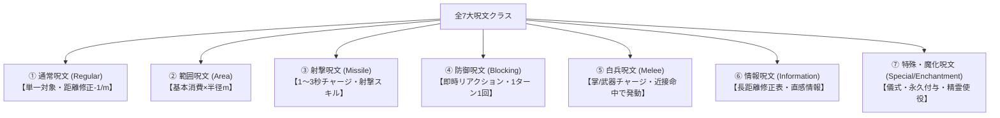

# ガープスマジック基本原則・呪文力学 (Thaumaturgical Principles & Dynamics)

**主管部署**: 魔導科学・理論研究部  
**準拠文献**: 『ガープス第4版 魔法大全（GURPS Magic）』第1章「魔法の法則」pp.5-15、各種公式ルール（magic_page_017〜058, 090〜100）  
**準拠憲章**: `AGENTS.md` (ガープスマジック基準出力・完全並行・生体媒介原則)

---

## 1. マナ（環境魔力）とマナレベル

マナは空間に充満する霊的エネルギーであり、世界各地の環境濃度（マナレベル）によって魔法の行使難易度・発現強度が決定される。

| マナレベル | 環境特性 | 詠唱・発現ルール | 現代における該当地域 |
| :--- | :--- | :--- | :--- |
| **マナなし (No Mana)** | マナが完全に枯渇した空間。 | **魔法行使不可**。常時発動の魔法具も停止。 | 2000年以前の人類社会、一部の完全人工遮蔽施設 |
| **疎マナ (Low Mana)** | マナが希薄な空間。 | 呪文判定に **-5のペナルティ**。 | 皇居コア結界の最深部、強力な浄化遮蔽区 |
| **通常マナ (Normal Mana)** | 地球上の標準的なマナ濃度。 | 通常通り判定・行使可能（素質保有者のみ）。 | 日本国内の大部分（結界都市・インナーゾーン） |
| **濃マナ (High Mana)** | マナが高濃度に滞留する魔境。 | **素質を持たない一般人でも呪文行使可能**。術者は消費FPの回復が加速。 | 奥多摩・秩父魔境、国道16号壁外アウトランド |
| **超濃マナ (Very High Mana)** | 臨界点を超えた異常空間。 | 詠唱した消費エネルギーが**即時全回復**。ファンブル時は壊滅的暴走。 | 4大アビス特異点（マリアナ大断層、ツングースカ等） |

---

## 2. 術者の素質（Magery）と詠唱・集中の力学

### 2.1 魔法の素質 (Magery)
- **素質0レベル (Magery 0)**: マナを感知し、基本的な呪文を学習・行使する生体適応資質。
- **素質1〜3レベル (Magery 1-3)**: 高位呪文の前提条件となり、射撃呪文のチャージ上限（1秒につき素質レベル点）や呪文成功率に直接ボーナスを与える。

### 2.2 詠唱時間とスキルレベルによる緩和
| スキルレベル | 準備時間 | 詠唱動作・発声 | エネルギー消費 |
| :--- | :--- | :--- | :--- |
| **SL 14以下** | 記載通りの準備時間 | 両手による大きなジェスチャー＋明瞭な詠唱音声必須 | 通常消費 |
| **SL 15〜19** | **準備時間 1秒短縮**（最低1秒） | 片手での簡単な合図＋静かな呟き（小声）で可能 | **消費エネルギー -1点** |
| **SL 20〜24** | **準備時間 半減**（最低1秒） | 完全無言＋わずかな指先の動きのみで発動可能 | **消費エネルギー -2点** |
| **SL 25以上** | **即時発動可能** | 動作・発声不要（完全な精神集中のみ） | **消費エネルギー -3点** |

### 2.3 集中の乱れと負傷 (Distraction & Injury)
- 準備中・集中中に攻撃を受けたりダメージを被った場合、**意志力判定（または被ダメージ量に応じた修正判定）**に成功しなければ呪文は強制中断・失敗となる。
- 被術者が視界外へ逃亡した場合や、術者が転倒・ノックダウンされた場合も集中が切れる。

---

## 3. 呪文ファンブル表（大失敗時の暴走力学）

呪文判定で「18」のダイス目、または有効目標値より10以上高い目を出した場合、マナの局所的暴走が発生する。

| 3D6ロール | 暴走現象・ファンブル結果 |
| :--- | :--- |
| **3〜4** | 術式が逆流し、術者は通常の2倍のFP（またはHP）を強制喪失。 |
| **5〜6** | 呪文が意図しない無関係な対象（味方または周囲の無機物）へ誤爆。 |
| **7〜8** | 不快な幻覚・異臭・金属音が半径5mに充満し、術者は1分間朦朧状態。 |
| **9〜11** | 単純失敗。エネルギー（FP）のみが消費され、現象は何も起きない。 |
| **12〜13** | 局所マナ嵐が発生し、半径10m以内のすべての維持中呪文が強制解除。 |
| **14〜15** | 術者に一時的な魔力麻痺（1時間の素質喪失または身体硬直）が発生。 |
| **16** | 異界・アストラル界の低級霊（ゴースト・悪霊）が空間の歪みから引き寄せられる。 |
| **17〜18** | **壊滅的暴走**。術者に致命的マナ熱傷（3dダメージ）＋周囲の局所アビス汚染誘発。 |

---

## 4. 呪文クラス（発現形態）の詳細定義

1. **通常呪文 (Regular)**:
   - 単一の対象（生物・物体）に作用。術者からの距離1mにつき **-1の距離ペナルティ**。
2. **範囲呪文 (Area)**:
   - 指定した半径（ヘクス/メートル単位）の空間全体に作用。
   - **総消費エネルギー = 基本消費 × 半径（m）**。効果の高さは標準1.8m（ドーム状または柱状）。
3. **射撃呪文 (Missile)**:
   - 手元に魔力弾（火球・電撃・氷弾等）を形成。1〜3秒間チャージ可能（1秒につき素質レベル点まで）。
   - 投擲時に「呪文射撃（Innate Attack）」スキルで目標へ命中判定。
4. **防御呪文 (Blocking)**:
   - 敵の攻撃瞬間にリアクション（能動防御）として即時詠唱。他の能動防御（受け・よけ）の代わりに行使。
5. **白兵呪文 (Melee)**:
   - 掌や武器に魔力を保持（1回分）。近接格闘命中時に魔力ダメージ（炎・電撃・麻痺等）を上乗せ。
6. **情報呪文 (Information)**:
   - 遠隔地・隠蔽物の探知。長距離修正表（数百m〜数kmでペナルティ）を適用。
7. **特殊・魔化呪文 (Special & Enchantment)**:
   - 精霊召喚・支配・作成、永久的な魔法具の製造（ゆっくり確実な魔化 / 儀式魔術）。

---

## 5. エネルギー維持と抵抗力学

### 5.1 維持の累積ペナルティ
- 持続時間が設定された呪文は、指定の維持コスト（通常は基本消費の半分）を支払うことで効果を延長可能。
- **維持中の呪文1つにつき、以後のあらゆる新規呪文判定に -1 の累積ペナルティ**が課される。

### 5.2 呪文への抵抗 (Resistance)
- 知性体や生物を対象とする呪文は、対象の **生命力（HT）** または **意志力（Will）** による即対抗判定が行われる。
$$\text{実効効果} = \text{術者の判定成功度} - \text{対象の抵抗成功度} > 0$$
- 術者の成功度が対象を上回った場合のみ呪文が発動する。

---

## 6. 文明レベル（TL）と現代科学との境界

- **現代標準（TL8）**: 銃火器、コンピュータ、内燃機関、送電網。技術系呪文はTL8水準を標準として機能。
- **電脳魔術・テクノマジック（TL9黎明期）**: メガコーポの生体電位インターフェース実験。《電算機覚醒》《機械憑依》等は生体媒介を通じてのみ成立。
