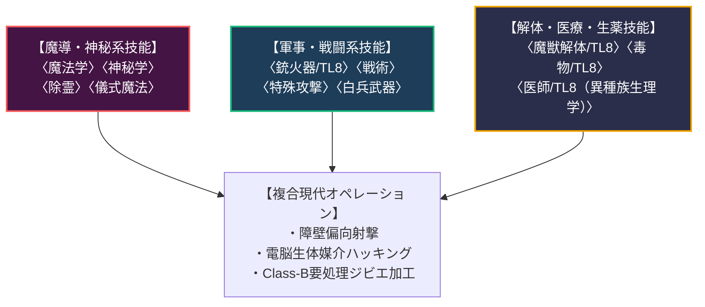

# 魔導科学・軍事・解体技能＆戦闘テクニック力学 (Thaumaturgical, Military, Bio-Harvesting Skills & Techniques)

本ドキュメントは、ガープス第4版（『Basic Set: Characters』B162〜225P『GURPS Power-Ups 7: Wildcard Skills』『GURPS Martial Arts』等）に準拠した**現代魔導技能、軍事・対魔獣交戦技能、魔獣解体・生薬技能、およびタクティカル・テクニック（Techniques）**の完全構造化アーカイブです。  
世界観憲章（`AGENTS.md`）および生物調査部（`TEMPLATE.md`）における現場ハンター、自衛隊・警察、メガコーポ研究員の技能運用基準を定めます。

---

## 1. 技能の習得難易度と文明レベル力学 (Skill Mechanics)

### 1.1 技能難易度とCPコスト表 (Skill Cost Table)
技能は能力値（ST/DX/IQ/HT）を基準とし、4段階の習得難易度（易・並・難・至難）によってCPコストが決定される。

| 達成レベル | 易 (Easy) | 並 (Average) | 難 (Hard) | 至難 (Very Hard) / 呪文 |
| :---: | :---: | :---: | :---: | :---: |
| **能力値 - 3** | - | - | - | 1CP |
| **能力値 - 2** | - | - | 1CP | 2CP |
| **能力値 - 1** | - | 1CP | 2CP | 4CP |
| **能力値 ± 0** | 1CP | 2CP | 4CP | 8CP |
| **能力値 + 1** | 2CP | 4CP | 8CP | 12CP |
| **能力値 + 2** | 4CP | 8CP | 12CP | 16CP |
| **能力値 + 3** | 8CP | 12CP | 16CP | 20CP |
| *以降 +1 ごと* | *+4CP* | *+4CP* | *+4CP* | *+4CP* |

### 1.2 技能なし値 (Defaults) と "20" の法則
- **技能なし値**: 正式に訓練を受けていない技能を、関連能力値や類似技能のマイナス修正で使用する判定（例: 〈第一治療〉は IQ-4）。
- **"20" の法則**: 基準能力値が20を超える超高能力値であっても、技能なし値の計算においては能力値の上限を「20」として扱う（過剰な無能判定の防止）。

### 1.3 設計・修理・使用の三位一体力学
魔導火器や生体サイバーデッキ等の高度装備は、以下の3技能が密接に連動する：
1. **使用 (Use)**: 〈銃火器/TL8〉〈コンピュータ操作/TL8〉（現場オペレーター）。
2. **修理・整備 (Repair)**: 〈機械修理/TL8〉〈電子修理/TL8〉（前線整備班・ドワーフ工員）。
3. **設計・発明 (Design)**: 〈兵器工学/TL8〉〈電子工学/TL8（魔導）〉（ヤマト重工・三ツ菱マナテック開発陣）。

---

## 2. 現代魔導・軍事・解体専門技能一覧

| 技能名 | 基準/難易度 | 技能なし値 | 現代魔導・軍事・市場での実態 |
| :--- | :---: | :---: | :--- |
| **〈魔法学〉** (Thaumatology) | IQ / 難 | IQ-6, 〈神秘学〉-5 | マナ濃度測定、魔導力学理論、障壁強度の数理計算。 |
| **〈神秘学〉** (Occultism) | IQ / 並 | IQ-5 | 伝統的魔術伝承、古代神話、ゴースト・悪霊の伝承解析。 |
| **〈除霊〉** (Exorcism) | 意志力 / 難 | 意志力-6 | 専門魔法部隊・神職による非物理霊体（ゴースト）の成仏・強制退散。 |
| **〈銃火器/TL8（小銃）〉** (Guns/TL8 (Rifle)) | DX / 易 | DX-4 | 自衛隊（89式/20式小銃）、PMCの5.56mm/7.62mm対魔獣射撃。 |
| **〈銃火器/TL8（重機関銃）〉** (Guns/TL8 (HMG)) | DX / 易 | DX-4 | 12.7mm重機関銃M2、対物ライフルによる魔獣障壁粉砕射撃。 |
| **〈特殊攻撃/種別〉** (Innate Attack) | DX / 易 | DX-4 | 射撃呪文（火球、電撃）やサイバーデッキ接続レーザーの照準。 |
| **〈戦術（対魔獣交戦）〉** (Tactics (Beast Combat)) | IQ / 難 | IQ-6 | 多層同心円防衛ラインでの小隊指揮、突進魔獣の十字砲火誘導。 |
| **〈魔獣解体/TL8〉** (Bio-Harvesting) | IQ / 並 | IQ-5, 〈サバイバル〉-3 | 八王子・豊洲市場でのClass-A/B魔獣の安全放血、シリカ剛毛・角質殻の採取。 |
| **〈毒物/TL8〉** (Poisons) | IQ / 難 | IQ-6, 〈化学〉-5, 〈薬学〉-3 | 魔獣毒腺の無毒化処理、テイコク製薬への原料卸し、神経毒抽出。 |
| **〈医師/TL8（異種族生理学）〉** (Physician (Xeno-Physiology)) | IQ / 難 | IQ-7, 〈第一治療〉-4 | エルフ・ドワーフ・トロール等新人類の代謝異常・マナ酔い治療。 |

---

## 3. タクティカル・テクニック体系 (Combat & Thaumaturgical Techniques)

テクニック（Technique）は、特定状況下でのペナルティを軽減・特化訓練した派生技能である（並：難易度-0から成長 / 難：難易度-1から成長）。

### 3.1 現代戦闘・魔導テクニック一覧

| テクニック名 | 基準技能 | 修正値 | 難易度 | 戦術的効果と実戦運用 |
| :--- | :--- | :---: | :---: | :--- |
| **急所狙い（頭部/眼）** (Targeted Attack: Skull/Eye) | 〈銃火器〉 | -7 / -9 | 難 | 装甲の薄い目や頭部を精密狙撃し、DRを無視して即死ダメージを与える。 |
| **障壁偏向射撃** (Barrier Deflection Shot) | 〈銃火器〉 | -4 | 難 | 魔術障壁の屈折率を計算し、障壁の継ぎ目や偏向角度を突いて弾丸を通す。 |
| **移動詠唱** (Mobile Casting) | 〈特定呪文〉 | -4 | 難 | 遮蔽から遮蔽へダッシュしながら呪文の詠唱・準備を完了させる前線術。 |
| **野戦迅速解体** (Rapid Field Dressing) | 〈魔獣解体〉 | -5 | 並 | 敵性魔獣の追撃が迫る壁外魔境で、解体所要時間を1/5（数分）に短縮。 |
| **除霊抜刀** (Spirit Banishing Strike) | 〈刀〉〈白兵〉 | -3 | 難 | 霊的エンチャント刃を用い、物理無効のゴースト・悪霊を即座に一刀両断。 |

---

## 4. 万能技能体系 (Wildcard Skills!)

万能技能（Wildcard Skills!）は、広範な技能群を1つの極めて高コストな技能（至難の3倍コスト / 12CPで能力値-2から開始）で包括するエリート特性である。

1. **〈魔術師! (Mage!)〉［IQ基準］**:
   - すべての呪文技能判定、〈魔法学〉〈神秘学〉〈呪具鑑定〉を包括。
2. **〈百戦錬磨のハンター! (Hunter!)〉［DX基準］**:
   - すべての銃火器、白兵武器、〈追跡〉〈わな〉〈魔獣解体〉〈サバイバル〉〈戦術〉を包括。
3. **〈電脳術士! (Cybermage!)〉［IQ基準］**:
   - 〈コンピュータ操作/プログラミング〉〈電子作戦〉〈生体魔導同調〉〈電脳ハッキング〉を包括。
