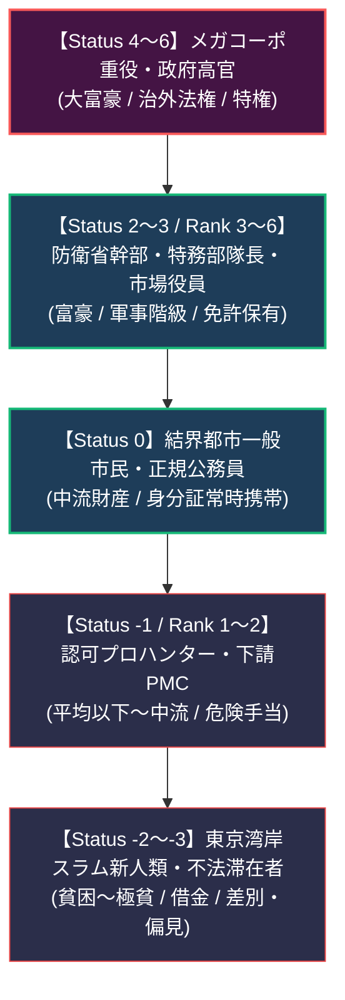

# 社会構造・新人類形質・特徴力学 (Social Status, Metahuman Traits & Technology Levels)

本ドキュメントは、ガープス第4版（『Basic Set: Characters』B22〜36P, B60P, B82P, B94P, B421P, B428〜429P等）に準拠した**文明レベル（TL）、社会階級（Status/Rank）、財産・名声、新人類（メタヒューマン）の生体特徴（Traits/Features）、および裏社会・身元力学**の完全構造化アーカイブです。  
世界観憲章（`AGENTS.md`）および歴史・社会設定（`world/history.md`）におけるメガコーポ支配、新人類差別、ID義務化、およびアビス精神汚染のゲーム的・科学的裏付けを定めます。

---

## 1. 文明レベル (Technology Level: TL) と魔法の並行

現代（2026年）の人類社会は、2000年のマナ覚醒を経ても物理・電子インフラが完全に機能しており、**基本TL8（デジタル・情報化時代）**に位置づけられる。

| 文明レベル | 時代・技術区分 | 社会的実態と魔導科学の関わり |
| :---: | :--- | :--- |
| **TL7** | 20世紀後半（冷戦期） | マナ覚醒前の既存工業技術・化石燃料・初期核エネルギー。一部の後進地域・壁外廃墟のインフラ水準。 |
| **TL8** | **現代（2000〜2026年）** | **世界標準文明レベル**。スマートフォン、光通信、GPS、複合装甲、5.56mm/7.62mm/12.7mm銃火器。生体媒介原則に基づく初期魔導研究。 |
| **TL9** | 近未来（メガコーポ特権層） | メガコーポ（ヤマト重工・テイコク製薬等）の研究所・特務部隊のみが独占する先端技術。電脳直接接続（生体サイバーデッキ）、超電導レール兵器、遺伝子標的血清。 |

- **有利な特徴「TLが高い（High TL）」［5CP/TL］**: 先端メガコーポの主任研究員や特務サイボーグ術士。
- **不利な特徴「TLが低い（Low TL）」［-5CP/TL］**: 奥多摩・秩父魔境の孤立集落（マタギ・隠れ里）やスラムの未認可難民。

---

## 2. 社会的地位 (Status)・階級 (Rank)・財産経済 (Wealth)

メガコーポによる寡占支配と新人類（メタヒューマン）差別が定着した東京モデルにおける階層構造。

### 2.1 地位・階級・財産一覧表

| 地位 (Status) | 階層区分 | 月収・生活費目安 | 典型的な役職・立場 | 付随する特徴・制限 |
| :---: | :--- | :--- | :--- | :--- |
| **Status 5〜6** | メガコーポ会長・閣僚 | $100,000〜/月 | 世界BIG5役員、日本メガコーポ総帥 | 財産「大富豪」［30CP］、治外法権、私設軍隊 |
| **Status 3〜4** | 上級幹部・上級術士 | $20,000〜/月 | ヤマト重工開発部長、防衛省魔法連隊長 | 財産「富豪」［20CP］、階級（軍事/企業）［15〜20CP］ |
| **Status 1〜2** | 専門職・現場指揮官 | $6,000〜/月 | 豊洲市場上級仲買人、PMC中隊長 | 財産「快適」［10CP］、階級［5〜10CP］、専門免許 |
| **Status 0** | **一般市民 (基準)** | **$3,000/月** | **第1・第2同心円居住者、一般会社員** | **財産「平均的」［0CP］、ID携帯義務** |
| **Status -1** | 境界労働者・下級ハンター | $1,500/月 | 壁外解体作業員、フリーランスPMC | 財産「生活苦」［-10CP］、危険手当依存 |
| **Status -2** | スラム居住者・非正規民 | $750/月 | 夢の島・有明特別居留区住民 | 財産「貧困」［-15CP］、社会的偏見［-10CP］ |
| **Status -3** | 不法滞在・債務奴隷 | $300以下/月 | 違法ドラッグ実験体、壁外密猟者 | 財産「極貧」［-25CP］、「借金」［-5〜-15CP］ |

---

## 3. 新人類（メタヒューマン）の生体特徴とガープス力学

西暦2000年のミレニアム・アウェイクニングで誕生した新人類は、人種差別・社会的隔離の対象であると同時に、固有の生体適応能力を有する。

### 3.1 新人類の種族テンプレートと特徴一覧

#### ① エルフ系形質（高マナ適性種）
- **外見・生体**: 尖った耳、高い骨格美、色素希薄（銀髪・碧眼等）、低体脂肪率。
- **有利な特徴**:
  - 「容貌 / 美しい〜絶世」［12〜16CP］
  - 「魔法の素質 (Magery) 1〜3」［15〜35CP］
  - 「老化遅延 (Extended Lifespan 1)」［2CP］または「寿命無限」［15CP］
  - 「声」［10CP］
- **社会的ペナルティ**:
  - 「社会的偏見 / 新人類（エルフ）」［-5〜-10CP］（一般市民からの嫉妬・不信感、高級風俗や違法組織からの人身売買リスク）。

#### ② ドワーフ系形質（強靭骨格・工学種）
- **外見・生体**: 低身長（1.3〜1.5m / SM -1）、極めて厚い胸郭・骨密度、高い筋肉量、密集した体毛。
- **有利な特徴**:
  - 体力「ST +2〜+4」［20〜40CP］
  - 生命力「HT +1〜+2」［10〜20CP］
  - 「毒耐性 (+3)」［3CP］
  - 「暗視」［5CP］
  - 「工学適性 (Talent: Artificer) 1〜2」［10〜20CP］
- **特色・不利な特徴**:
  - 体格「SM -1」［0CP / 特色］
  - 「変な容姿 (Unnatural Features 1)」［-1CP］
  - 「社会的偏見 / 新人類（ドワーフ）」［-5CP］（重工業・解体現場での過酷労働への固定配置）。

#### ③ 異形変異種（トロール・獣化変異体）
- **外見・生体**: 巨大体躯（2.5〜3m / SM +1）、角、頑強な角質外骨格、変異牙。
- **有利な特徴**:
  - 体力「ST +6〜+10」［60〜100CP］
  - 防護点「DR 2〜5 (角質装甲)」［10〜25CP］
  - 「大型打撃 (角・牙)」［3〜5CP］
- **不利な特徴**:
  - 体格「SM +1」［0CP / 特色］
  - 「容貌 / 醜悪」［-8CP］
  - 「変な容姿 (Unnatural Features 3)」［-3CP］
  - 「社会的偏見 / 怪物新人類」［-15CP］（都市中心部への立ち入り禁止、常時監視ID）。

---

## 4. 裏社会・情報屋・身元偽装力学 (Underground Mechanics)

### 4.1 偽名と身元偽装 (Alternate Identity)
結界都市における厳格な「魔力適性者ID携帯義務」を回避するため、スラムや壁外PMCでは身元偽装が日常化している。
- **有利な特徴「身元 (Alternate Identity)」［5CPまたは15CP］**:
  - **15CP（完全正規身元）**: 政府・メガコーポの電脳データベースに完全登録された身元。魔導IDスキャナーを完全通過可能。
  - **5CP（偽造身元）**: 偽造カード・簡易ハッキングによる身元。精密な生体検査や高位メイジの《真偽鑑定》で露見するリスクあり。

### 4.2 情報屋 (Contacts) と 豊洲・スラム情報網
- **情報屋の技能目標値**: 技能12（一般街頭）、技能15（専門ブローカー）、技能18（メガコーポ中枢・情報機関）。
- **信頼度**:
  - **信頼できる (Reliable)**: 虚偽情報を流さない（通常コスト）。
  - **やや信頼できる (Somewhat Reliable)**: 判定失敗で「情報なし」（コスト×2/3）。
  - **信頼できない (Unreliable)**: ファンブルで致命的な偽情報を流す（コスト×1/3）。

---

## 5. 精神汚染・アビス狂気と自制判定 (Self-Control Rolls)

アビス特異点の近傍（マリアナ、奥多摩深部等）や深淵・邪神呪術（アビス・ソーサリー）に接触した術士・探索者は、精神的ショックによる精神的不利な特徴を獲得する。

### 5.1 自制値 (Self-Control Number) と判定
獲得した狂気・精神疾患（パラノイア、幻覚、悪夢、狂戦士、血への渇望等）が発作を起こす際、3d6で**自制判定**を行う。

| 自制値 (SC) | 自制の容易さ | 不利な特徴のCP修正 | 精神状態の実態 |
| :---: | :--- | :---: | :--- |
| **SC 15** | ほとんど自制可能（極めて稀に発作） | $\times 0.5$ | 軽度のトラウマ・投薬でコントロール可能。 |
| **SC 12** | **標準的な自制難易度（一般的な発作）** | **$\times 1.0$ (基本値)** | **過度のストレス・アビス魔獣遭遇時に発作。** |
| **SC 9** | 自制が困難（頻繁に暴走・狂乱） | $\times 1.5$ | 前線任務不可・要隔離観察レベル。 |
| **SC 6** | ほぼ自制不能（常時衝動に支配） | $\times 2.0$ | 完全狂気・精神崩壊・バイオハザード処分対象。 |
