# 風霊系呪文 (Air Spells)

本ドキュメントは、ガープス第4版『魔法大全』第23章（pp.142-147）および公式拡張サプリメント（『Magic: Artillery Spells』『Magic: Death Spells』『Magic: The Least of Spells』『Magic: Plant Spells』等）に準拠した、**全63種**の風霊系呪文公式アーカイブです。マナ力学、生体媒介作用、ならびに2026年現代における結界都市防衛・軍事兵器工学・法規制（CR）の運用データを過不足なく完全網羅しています。

---

## 1. 風霊系呪文の力学体系

風霊系呪文は、マナの指向性周波数を介して対象の物理・生体・霊的パラメータを励起・変調・制御する魔術体系です。
- **生体媒介原則**: マナは術士の生体・神経系・霊体を介して作用し、直接の物質変換や物理エネルギー励起を行います。
- **現代技術インフラとの並行性**: 電子回路や通信網を直接破壊するのではなく、物理的現象（熱、圧力、電磁、物質変形等）を介して現代兵器や都市防護壁と相互作用します。

### 1.1 風霊系呪文 前提条件ツリー (Prerequisite Tree)

```mermaid
graph TD
    %% クラススタイル定義（高コントラスト・ダークモード規格）
    classDef spell fill:#0f172a,stroke:#38bdf8,stroke-width:1.5px,color:#ffffff;
    classDef root fill:#0369a1,stroke:#38bdf8,stroke-width:2px,color:#ffffff,font-weight:bold;
    classDef ext fill:#1e293b,stroke:#94a3b8,stroke-width:1px,color:#cbd5e1,stroke-dasharray: 5 5;
    classDef special fill:#4c1d95,stroke:#c084fc,stroke-width:1.5px,color:#ffffff;

    %% 系統内呪文ノード定義
    subgraph Sub_6C5987D5 ["49種"]
        PurifyAir["《空気浄化》<br>(Purify Air)"]:::root
        SeekAir["《空気探知》<br>(Seek Air)"]:::root
        CreateAir["《空気作成》<br>(Create Air)"]:::spell
        NoSmell["《消臭》<br>(No-Smell)"]:::spell
        Sp_5_C85B["《臭気》<br>(（旧名：悪臭）)"]:::spell
        DestroyAir["《空気破壊》<br>(Destroy Air)"]:::spell
        Odor["《芳香》<br>(Odor)"]:::spell
        ShapeAir["《空気変化》<br>(Shape Air)"]:::spell
        AirJet["《空気噴射》<br>(Air Jet)"]:::spell
        AirVision["《霧中視覚》<br>(Air Vision)"]:::spell
        BodyofAir["《肉体気化》<br>(Body of Air)"]:::spell
        Sp_12_2467["《空気悪化》<br>(（旧名：酸素除去）)"]:::spell
        Sp_13_28AC["《空気歩行》<br>(（旧名：空中歩行）)"]:::spell
        WallofWind["《風の壁》<br>(Wall of Wind)"]:::spell
        Windstorm["《風嵐》<br>(Windstorm)"]:::spell
        EarthtoAir["《土を空気》<br>(Earth to Air)"]:::spell
        Clouds["《雲》<br>(Clouds)"]:::spell
        Sp_18_5B62["《気象予測》<br>(（旧名：天候予測）)"]:::spell
        Wind["《風》<br>(Wind)"]:::spell
        Rain["《雨》<br>(Rain)"]:::spell
        Snow["《雪》<br>(Snow)"]:::spell
        Concussion["《爆裂衝球》<br>(Concussion)"]:::spell
        BreatheAir["《空中呼吸》<br>(Breathe Air)"]:::spell
        BreatheWater["《水中呼吸》<br>(Breathe Water)"]:::spell
        Sp_25_3A42["《真なる空気》<br>(（旧名：聖風）)"]:::spell
        ResistLightning["《防電》<br>(Resist Lightning)"]:::spell
        Lightning["《電光》<br>(Lightning)"]:::special
        AirVortex["《風の渦》<br>(Air Vortex)"]:::special
        ExplosiveLightning["《爆裂電光》<br>(Explosive Lightning)"]:::spell
        LightningWhip["《電光の鞭》<br>(Lightning Whip)"]:::spell
        ShockingTouch["《衝撃の手》<br>(Shocking Touch)"]:::spell
        SparkCloud["《雷雲》<br>(Spark Cloud)"]:::spell
        SparkStorm["《雷嵐》<br>(Spark Storm)"]:::spell
        AtmosphereDome["《大気避難所》<br>(Atmosphere Dome)"]:::spell
        WallofLightning["《電光の壁》<br>(Wall of Lightning)"]:::spell
        Warm["《温暖化》<br>(Warm)"]:::spell
        Cool["《寒冷化》<br>(Cool)"]:::spell
        BallofLightning["《電光弾》<br>(Ball of Lightning)"]:::spell
        LightningStare["《電光の瞳》<br>(Lightning Stare)"]:::spell
        BodyofLightning["《肉体電化》<br>(Body of Lightning)"]:::special
        LightningWeapon["《電撃武器》<br>(Lightning Weapon)"]:::special
        Sandstorm["《砂嵐》<br>(Sandstorm)"]:::spell
        Storm["《嵐》<br>(Storm)"]:::spell
        LightningMissiles["《電撃の弓》<br>(Lightning Missiles)"]:::spell
        LightningArmor["《電光の鎧》<br>(Lightning Armor)"]:::spell
        BodyofWind["《肉体風化》<br>(Body of Wind)"]:::special
        SummonAirElemental["《風霊召喚精霊召喚/風霊》<br>(Summon Air Elemental)"]:::special
        ControlAirElemental["《風霊支配精霊支配/風霊》<br>(Control Air Elemental)"]:::spell
        CreateAirElemental["《風霊作成精霊作成/風霊》<br>(Create Air Elemental)"]:::special
    end

    subgraph Sub_7C9AA8F4 ["MAS / MDS 拡張 6種"]
        CloudofDoom["《破滅の雲*》<br>(Cloud of Doom)"]:::special
        FallingSky["《気圧爆増*》<br>(Falling Sky)"]:::special
        TwistingTerror["《荒ぶる竜巻*》<br>(Twisting Terror)"]:::special
        ImprovedConcussion["《強化爆裂衝球*》<br>(Improved Concussion)"]:::special
        ChainLightning["《連鎖の電光*》<br>(Chain Lightning)"]:::special
        ImprovedExplosiveLightning["《強化爆裂電光*》<br>(Improved Explosive Lightning)"]:::special
    end

    subgraph Sub_E032978 ["MAS / MDS 拡張 2種"]
        Embolism["《塞栓症*》<br>(Embolism)"]:::special
        StealBreath["《呼吸破綻*》<br>(Steal Breath)"]:::special
    end

    %% 前提条件依存関係エッジ
    PurifyAir --> CreateAir
    SeekAir --> CreateAir
    PurifyAir --> NoSmell
    PurifyAir --> Sp_5_C85B
    CreateAir --> DestroyAir
    NoSmell --> Odor
    CreateAir --> ShapeAir
    ShapeAir --> AirJet
    ShapeAir --> AirVision
    ShapeAir --> BodyofAir
    DestroyAir --> Sp_12_2467
    ShapeAir --> Sp_13_28AC
    ShapeAir --> WallofWind
    ShapeAir --> Windstorm
    CreateAir --> EarthtoAir
    Ext_1 --> EarthtoAir
    Req_2 --> Clouds
    Req_3 --> Sp_18_5B62
    Windstorm --> Wind
    Clouds --> Rain
    Clouds --> Snow
    Ext_4 --> Snow
    ShapeAir --> Concussion
    Ext_5 --> Concussion
    Ext_6 --> BreatheAir
    DestroyAir --> BreatheAir
    CreateAir --> BreatheWater
    Ext_7 --> BreatheWater
    Req_8 --> Sp_25_3A42
    Req_8 --> ResistLightning
    Req_9 --> Lightning
    BodyofAir --> AirVortex
    Windstorm --> AirVortex
    Lightning --> ExplosiveLightning
    Lightning --> LightningWhip
    Lightning --> ShockingTouch
    ShapeAir --> SparkCloud
    Lightning --> SparkCloud
    Windstorm --> SparkStorm
    Lightning --> SparkStorm
    PurifyAir --> AtmosphereDome
    Ext_10 --> AtmosphereDome
    Lightning --> WallofLightning
    Ext_11 --> Warm
    Ext_12 --> Cool
    Ext_13 --> BallofLightning
    Lightning --> BallofLightning
    Lightning --> LightningStare
    ResistLightning --> LightningStare
    Lightning --> BodyofLightning
    Lightning --> LightningWeapon
    Windstorm --> Sandstorm
    Ext_14 --> Sandstorm
    Rain --> Storm
    Ext_15 --> Storm
    LightningWeapon --> LightningMissiles
    ResistLightning --> LightningArmor
    BodyofAir --> BodyofWind
    Windstorm --> BodyofWind
    Ext_16 --> SummonAirElemental
    Ext_17 --> ControlAirElemental
    Ext_18 --> CreateAirElemental
    Sp_12_2467 --> CloudofDoom
    Sp_5_C85B --> CloudofDoom
    Concussion --> FallingSky
    DestroyAir --> FallingSky
    Windstorm --> TwistingTerror
    Concussion --> ImprovedConcussion
    Ext_19 --> ImprovedConcussion
    BallofLightning --> ChainLightning
    ResistLightning --> ChainLightning
    ExplosiveLightning --> ImprovedExplosiveLightning
    BodyofAir --> Embolism
    Sp_25_3A42 --> Embolism
    Sp_12_2467 --> StealBreath

    %% 外部系統・特殊前提ノード
    Ext_1["【他系統: 《土変化》】"]:::ext
    Req_2["【前提: 水霊系2種、風霊系2種】"]:::ext
    Req_3["【前提: 風霊系4種】"]:::ext
    Ext_4["【他系統: 《霜》】"]:::ext
    Ext_5["【他系統: 《雷鳴》】"]:::ext
    Ext_6["【他系統: 《水作成》】"]:::ext
    Ext_7["【他系統: 《水破壊》】"]:::ext
    Req_8["【前提: 風霊系6種】"]:::ext
    Req_9["【前提: 素質1、 風霊系6種】"]:::ext
    Ext_10["【他系統: 《避難所》】"]:::ext
    Ext_11["【他系統: 《加熱》】"]:::ext
    Ext_12["【他系統: 《冷却》】"]:::ext
    Ext_13["【他系統: 《念動》】"]:::ext
    Ext_14["【他系統: 《土作成》】"]:::ext
    Ext_15["【他系統: 《雹》】"]:::ext
    Ext_16["【他系統: 《精霊召喚》】"]:::ext
    Ext_17["【他系統: 《風霊召喚》】"]:::ext
    Ext_18["【他系統: 《風霊支配》】"]:::ext
    Ext_19["【他系統: 《拡声》】"]:::ext
```

---

## 2. ガープス第4版『魔法大全』基本風霊系呪文（49種）

| 呪文名（日 / 英） | クラス | 持続時間 | 基本消費 / 維持 | 詠唱時間 | 前提条件 | 効果概要・力学 |
| :--- | :---: | :---: | :---: | :---: | :--- | :--- |
| **《空気浄化》** Purify Air | 範囲 | 一瞬 | 1 | 1秒 | - | 浄化・効果範囲の空気から、すべての不純物を取り除きます。 毒 ガス などを中和するのに役立つでしょう。 煙 の充満した部屋1つを1秒で浄化できることに注意してください――本当に致命的な ガス は一度にすべて浄化しなければ、洩れだしてくる危険があります。 また、古い「にごった」空気を新鮮な呼吸できる空気に変えること |
| **《空気探知》** Seek Air | 情報 | 一瞬 | 1 | 1秒 | - | 年03月28日(木) 20:53:26 履歴 |
| **《空気作成》** Create Air | 範囲 | 5秒# | 1 | 1秒 | 《空気浄化》ないし《空気探知》 | 年03月28日(木) 20:53:45 履歴 |
| **《消臭》** No-Smell | 通常 | 1時間 | 2/2 | 1秒 | 《空気浄化》 | 年03月28日(木) 20:54:07 履歴 |
| **《臭気》** （旧名：悪臭） Stench | 範囲 | 5分 | 1 | 1秒 | 《空気浄化》 | 詳細参照 |
| **《空気破壊》** Destroy Air | 範囲 | 一瞬 | 2 | 1秒 | 《空気作成》 | 年03月28日(木) 20:54:37 履歴 |
| **《芳香》** Odor | 範囲 | 1時間 | 1 | 1秒 | 《消臭》 | 年03月28日(木) 20:54:54 履歴 |
| **《空気変化》** Shape Air | 通常 | 1分 | 1〜10# | 1秒 | 《空気作成》 | 呪文 姿勢関連 姿勢関連 |
| **《空気噴射》** Air Jet | 通常 | 1秒 | 1〜3/同 | 1秒 | 《空気変化》 | 年05月19日(火) 00:01:40 履歴 |
| **《霧中視覚》** Air Vision | 通常 | 1秒 | 1/1.5km毎/半 | 1秒 | 《空気変化》 | 煙 、 霧 、埃、 砂嵐 の中でもはっきりとものが見えます。空気の状態による 視覚 の修正が無効化されます。 |
| **《肉体気化》** Body of Air | 通常/抵-生命力 | 1分 | 4/1 | 5秒 | 《空気変化》 | 年06月06日(土) 21:17:06 履歴 |
| **《空気悪化》** （旧名：酸素除去） Devitalize Air | 範囲 | さまざま | 2 | 1秒 | 《空気破壊》 | 呼吸関連 呪文 呼吸関連 |
| **《空気歩行》** （旧名：空中歩行） Walk on Air | 通常 | 1分 | 3/2 | 1秒 | 《空気変化》 | 年03月28日(木) 20:57:24 履歴 |
| **《風の壁》** Wall of Wind | 範囲 | 1分 | 2/半 | 一瞬# | 《空気変化》 | 年03月28日(木) 20:57:46 履歴 |
| **《風嵐》** Windstorm | 範囲 | 1分# | 2/半 | 一瞬# | 《空気変化》 | 年03月28日(木) 20:58:05 履歴 |
| **《土を空気》** Earth to Air | 通常 | 永久 | 1/1立方m毎# | 2秒 | 《空気作成》、《土変化》 | 土や石を空気に変えます。地底に閉じこめられたときには、役に立つでしょう。 術者 が エネルギー を多く費やすほど、空気に変わる土の量が増えます。しかし、最大量は最少量の4倍以下に制限されます。 |
| **《雲》** Clouds | 範囲 | 10分 | 1÷20/同 | 10秒 | 水霊系2種、風霊系2種 | 屋外にふつうの雲を作りだしたり、追いちらしたりできます（ 術者 の選択）。 |
| **《気象予測》** （旧名：天候予測） Predict Weather | 情報 | 一瞬 | さまざま | 5秒# | 風霊系4種 | 詳細参照 |
| **《風》** Wind | 特殊/範囲 | 1時間 | 1÷50/同 | 1分 | 《風嵐》 | その時点の戸外の風の状態を変更します。風向きを22.5度（たとえば西から西南西に）変更するか、風速を ビューフォート風力階級 で1段階上下させることができます。風向と風速を同時に変更したり、もっと大規模な変更を行なう場合は、比例して |
| **《雨》** Rain | 範囲 | 1時間 | 1÷10/同# | 1分 | 《雲》 | ふつうの屋外に降る25ミリの雨を作りだします（あるいは止ませます）。 |
| **《雪》** Snow | 範囲 | 1時間 | 1÷15# | 1秒 | 《雲》、《霜》 | ふつうの屋外に、2.5センチの雪を降らせます（あるいは止ませます）。正しい効果を発揮するには、気温が摂氏0度以下でなければなりません。気温が高ければ、小雨が降るでしょう。これは地面を湿らせる程度で、目立った水溜りは残しません。 これは でも、 でもあります。 |
| **《爆裂衝球》** Concussion | 射撃 | 一瞬 | 2〜2×素質# | 1〜3秒 | 《空気変化》、《雷鳴》 | 術者 の手元に高圧で圧縮した空気の球を作り出します。この球は、 目標 に命中すると 爆発 します。非常に大きな爆発音がするため、10メートル以内にいる者はすべて 生命力 -3の判定に成功しなければなりません。失敗すると 朦朧 状態になってしまいます。 朦朧 状態になった場合、毎 ターン 生命力 -3の判定を行ない、成功すると 朦朧 状態を |
| **《空中呼吸》** Breathe Air | 通常 | 1分 | 4/2 | 1秒 | 《水作成》、《空気破壊》 | 空気がまるで水であるかのように呼吸させます。この 呪文 は水棲生物が空気中で乾燥してしまうのも防ぎます。主として、魚や人魚などを水から出した状態で生かしておくのに役立ちます。この 呪文 の目標は、通常どおり水を使って呼吸することもできます。 |
| **《水中呼吸》** Breathe Water | 通常 | 1分 | 4/2 | 1秒 | 《空気作成》、《水破壊》 | 『 水中呼吸薬 』の旧名。 |
| **《真なる空気》** （旧名：聖風） Essential Air | 範囲 | 永久 | 2 | 3秒 | 風霊系6種 | と訳すのは語弊があるため、今の名称に修正されています。この傾向は 全般が当てはまります。 呪文 |
| **《防電》** Resist Lightning | 通常 | 1分 | 2/1 | 1秒 | 風霊系6種 | 防御・目標 と、 目標 が持ち運んでいるものすべてに、電光と 電気 の効果に耐性を与えます。低い 文明レベル では、ふつうは敵の 魔法 から身を守るために利用されます。文明が進化するにつれ、専門職にとって不可欠な道具となります。 |
| **《電光》** Lightning | 射撃 | 一瞬 | 1〜素質# | 1〜3秒 | 素質1、 風霊系6種 | 指先から電光の矢を放ちます。この矢は 半致傷距離 50、 最大射程 100、 正確さ +3です。この 呪文 に対しては、 金属鎧 の 防護点 はすべて1として扱います！ 目標 が傷を受けると、 生命力 を2点削られるごとに、-1の修正を受けて 生命力 判定を行なわねばなりません。失敗すると 朦朧 状態になります。以降、毎 ターン |
| **《風の渦》** Air Vortex | 範囲/抵-生命力か敏捷力 | 10秒 | 8/3 | 2秒 | 素質2、《肉体気化》、《風嵐》 | 共通性質 呪文 |
| **《爆裂電光》** Explosive Lightning | 射撃 | 一瞬 | 2〜2×素質# | 1〜3秒 | 《電光》 | 電気 呪文 爆発物 呪文 |
| **《電光の鞭》** Lightning Whip | 通常 | 10秒 | 1/2ｍ毎# | 2秒 | 《電光》 | 年03月28日(木) 21:04:16 履歴 |
| **《衝撃の手》** Shocking Touch | 白兵 | 一瞬 | 1〜3 | 1秒 | 《電光》 | 術者 の両手か 杖 に電光を帯びさせます。この 呪文 を発動させるには、 術者 は 目標 に攻撃を命中させなければなりません。 命中部位 は問いません。 呪文 の エネルギー 1点につき1D+1点の“ 焼き ”ダメージを 目標 に与えます。鎧では防げません。 電子機器 や伝導体のそばでは、と同様、予想外の効果が現われます。 |
| **《雷雲》** Spark Cloud | 範囲 | 10秒 | 1〜5/同 | 1〜5秒 | 《空気変化》、《電光》 | 地面に 電気 を帯びた火花の雲を作りだします。視界をさえぎることはありませんが、範囲内にいる全員に“ 焼き ”ダメージを与えます。 鎧 は通常どおりダメージを防ぎます（ 金属鎧 はの場合と同様、最小限のダメージしか防げません）。 |
| **《雷嵐》** Spark Storm | 範囲 | 1分# | 2,4,6/半 | 一瞬# | 《風嵐》、《電光》 | （かみなりあらし。Spark Storm） ふつうのを作りだしますが、さらに危険な効果が加わります。毎 ターン 、が効果範囲内にいる犠牲者1体をランダムに攻撃します。これを解決するには、 距離修正 を無視して、 術者 の 技能 で判定を行ないます。犠牲者は通常どおり |
| **《大気避難所》** Atmosphere Dome | 範囲 | 6時間 | 4/半 | 1秒 | 《空気浄化》、《避難所》 | と訳しているが、攻撃的にも使えるので「避難所」を用いるのは誤解を招きかねない。とかの方がより適切な訳かと。 「Dome」系の命名法則に揃えるなら「大気天蓋」「大気円蓋」あたりの名前になるかも。 呪文 防御・壁・《[[大気避難 |
| **《電光の壁》** Wall of Lightning | 通常 | 1分 | 2〜6/同 | 1秒 | 《電光》 | 壁・効果範囲の周囲に、ぱちぱちとはぜる 電光 の壁を作りだします。高さは4メートルですが、比例して エネルギー を消費することにより、もっと高くすることもできます（高さ8メートルなら2倍、12メートルなら3倍、以下同様に増えます）。 壁を横切ったり、それに手を触れたものは毎ターン、“ 焼き ”ダメージを受けま |
| **《温暖化》** Warm | 範囲 | 1時間 | 1÷10/同 | 1分# | 《加熱》、風霊系4種 | 周囲の気温を上昇させます。たとえば、この 呪文 でを無効にできます。摂氏38度以上に上昇させることはできません。この 呪文 は でもあります。 |
| **《寒冷化》** Cool | 範囲 | 1時間 | 1÷10/同 | 1分# | 《冷却》、風霊系4種 | 周囲の気温を下降させます。条件が整えば、霧が発生することもあります。気温を-4度以下にすることはできません。 |
| **《電光弾》** Ball of Lightning | 通常 | 1分 | 2〜6/半 | 1〜3秒 | 《念動》、《電光》 | 術者 の手の中に球状の 電光 を作りだします。通常のとは異なり、は 術者 の狙った場所に飛んでいきます。ふつうに投げることはできません。この球体はまったく無音で、最大 移動力 「 術者 の 技能 レベル÷5（端数切り捨て）」で、直線状に進みます。風や非金属の障害物の影響はまったく受けません。つまり窓やカー |
| **《電光の瞳》** Lightning Stare | 通常 | 1秒 | 1〜4 | 2秒 | 《電光》、《防電》 | 術者 の 目 から 電光 が放たれます。 術者 は 敏捷力 -4または〈 特殊攻撃 〉による 命中判定 を行ないます。 目標 のほうを向いていなければなりません。詠唱の 儀式 には、 動作 ではなく、 顔 の動きを使うのがふつうです。したがって、 技能レベル に関わらず、この 呪文 はいっさい 動作 なしで唱えることができま |
| **《肉体電化》** Body of Lightning | 通常/抵-生命力 | 1分 | 12/4 | 5秒 | 素質2、《電光》 | _ 生命力 、 目標 に一時的に「 電光の体 」の 共通性質 を与え、動く電光体に変えます。最大3キロまでの衣類も電光に変わりますが、 魔法 のものは魔力を失います。 を、をと同様に扱います。 |
| **《電撃武器》** Lightning Weapon | 通常 | 1分 | 4/1 | 2秒 | 素質2、《電光》 | 目標 の 白兵武器 が 電気 を帯びます。電光をまとい、ぱちぱちとはぜますが、使用者を傷つけることはありません。すくなくとも 武器 の一部が金属でなければなりません。すべて木/石でできた 武器 はこの 呪文 の対象にはなりません。この 武器 は敵の鎧を貫通して、ダメージ・ボーナスを適用した後のダメージが+2されます。さらに、 |
| **《砂嵐》** Sandstorm | 範囲 | 1分# | 3/半 | 一瞬# | 《風嵐》、《土作成》 | この 呪文 は っぽいが、 ではない。 |
| **《嵐》** Storm | 範囲 | 1時間 | 1÷50/同 | 1分 | 《雨》、《雹》 | 嵐を引きおこします（あるいは鎮めます）。周囲の気温と湿度によって、暴風だけでなく、雨や雪、雹まじりの暴風雨になったり、奇妙な雷を伴うこともあります。海上で唱えると、とりわけ有効です。この 呪文 は予想外の効果をもたらします。具体的になにが起こるかはGMが決定してください。 この 呪文 は嵐を鎮めるのにも使えます。その効力は、 |
| **《電撃の弓》** Lightning Missiles | 通常 | 1分 | 4/2# | 3秒 | 《電撃武器》 | と同じですが、これは 射撃武器 に対して唱えます。 武器 そのものが 電光 を帯びます。 武器 から放たれる矢弾はすべて電撃を帯び、と同様の方法で、2点の追加ダメージを与えます。矢弾の木製の部分は「敵に命中する」か「10秒経過する」かした瞬間、灰になってしまいます。 |
| **《電光の鎧》** Lightning Armor | 通常 | 1分 | 7/4 | 1秒 | 《防電》を含む電光系呪文6種 | ぱちぱちとはぜる 電光 で 目標 を覆います。 目標 や 目標 の所持している物には悪影響はありません（の 呪文 がかかっているのと同様に扱います）。 目標 が 白兵攻撃 を行なうと、電撃による1点の追加ダメージが発生します。 逆に、敵が金属製の 武器 で 目標 を攻撃すると、1D-1点の“ 焼き ”ダメージが跳 |
| **《肉体風化》** Body of Wind | 通常/抵-生命力 | 1分 | 8/4 | 2秒 | 素質3、《肉体気化》、《風嵐》、5系統から各1種# | 年03月28日(木) 21:10:20 履歴 |
| **《風霊召喚精霊召喚/風霊》** Summon Air Elemental | 特殊 | 1時間 | 4# | 30秒 | 素質1、風霊系8種あるいは「風霊系4種と他の《精霊召喚》1種」 | 年03月28日(木) 21:10:46 履歴 |
| **《風霊支配精霊支配/風霊》** Control Air Elemental | 特殊 | 1分 | 特殊 | 2秒 | 《風霊召喚》 | 詳細参照 |
| **《風霊作成精霊作成/風霊》** Create Air Elemental | 特殊 | 永久 | 特殊 | 特殊 | 素質2、《風霊支配》 | 詳細参照 |

---

## 3. 魔導兵器・砲兵戦術拡張呪文（MAS / MDS 拡張 6種）

| 呪文名（日 / 英） | クラス | 持続時間 | 基本消費 / 維持 | 詠唱時間 | 前提条件 | 効果概要・力学 |
| :--- | :---: | :---: | :---: | :---: | :--- | :--- |
| **《破滅の雲*》** Cloud of Doom* | 範囲/抵-特殊 | 5秒 | 5 | 1秒 | 素質4、《空気悪化》と《臭気》含む風霊系呪文10種 | magic_artillery_spells |
| **《気圧爆増*》** Falling Sky* | 範囲 | 一瞬 | 2〜10 | 1秒/基本消費2点毎 | 素質4、《爆裂衝球》と《空気破壊》含む風霊系呪文8種 | magic_artillery_spells |
| **《荒ぶる竜巻*》** Twisting Terror* | 通常 | 1秒# | 偶数点# | 1秒 | 素質4、《風嵐》含む風霊系呪文10種 | （至難）（Twisting Terror (VH)） p.10 （至難） 地面を裂き、行く手を阻むもの全てを粉砕する小型竜巻を召喚します。 術者 は開始地点を選択しなければりません（ としての 距離修正 はその開始地点へのものを用います）。竜巻はそこに出現し、幅1ｍの帯を描きながら、 呪文 の |
| **《強化爆裂衝球*》** Improved Concussion* | 射撃 | 一瞬 | 3〜3×素質 | 1〜3秒 | 素質4、《爆裂衝球》と《拡声》を含む音声系呪文7種 | （至難）（Improved Concussion (VH)） p.25 （至難） と同様ですが、 爆発 半径が広くなっています。中心から1ｍ以上離れた対象へのダメージは、距離の3倍ではなく、距離（1メートル）で割ります。 朦朧 を回避するために 生命力 -3判定が必要となる範囲は |
| **《連鎖の電光*》** Chain Lightning* | 射撃 | 一瞬 | 2〜2×素質 | 1〜3秒 | 素質4、《電光弾》、《防電》 | magic_artillery_spells |
| **《強化爆裂電光*》** Improved Explosive Lightning* | 射撃 | 一瞬 | 3〜3×素質 | 1〜3秒 | 素質4、《爆裂電光》を含む「風霊系呪文か天候系呪文」10種 | （至難）（Improved Explosive Lightning (VH)） （至難） と同様ですが、 爆発 半径が広くなっています。中心から1ｍ以上離れた対象へのダメージは、距離の3倍ではなく、距離（1メートル）で割ります。 これも です。 |

---

## 4. 魔導兵器・砲兵戦術拡張呪文（MAS / MDS 拡張 2種）

| 呪文名（日 / 英） | クラス | 持続時間 | 基本消費 / 維持 | 詠唱時間 | 前提条件 | 効果概要・力学 |
| :--- | :---: | :---: | :---: | :---: | :--- | :--- |
| **《塞栓症*》** Embolism * | 通常/抵-生命力 | 一瞬 | 12 | 3秒 | 素質3、《肉体気化》、《真なる空気》 | （至難）（Embolism (VH)） p.9 （至難） ＿ 生命力 対象の循環器系内にあり得ないほど巨大な気泡を発生させます。対象が抵抗に失敗すると、脳卒中になります。これは 致命傷 として扱います――被害者は直ちに意識を失い、30分ごとに 生命力 判定しなければならず、失敗すると死亡します。 TL6 以上では |
| **《呼吸破綻*》** Steal Breath * | 通常/抵-生命力 | 一瞬 | 13 | 3秒 | 素質3、および、《空気悪化》含む風霊系呪文7種 | （至難）（Steal Breath (VH)） p.9 （至難） _ 生命力 肺の虚脱、血液の酸素欠乏など、酸素を必須システムに送る身体能力を奪うことで、生きている犠牲者の “ 生命のエッセンス ” を奪います。ほとんどの場合、「 心臓発作 」として扱います。対象はマイナス FP に低下し、意識を失い、 蘇生 されない限り |

---

## 5. 魔導兵器・砲兵戦術拡張呪文（MAS / MDS 拡張 6種）

| 呪文名（日 / 英） | クラス | 持続時間 | 基本消費 / 維持 | 詠唱時間 | 前提条件 | 効果概要・力学 |
| :--- | :---: | :---: | :---: | :---: | :--- | :--- |
| **《息止め延長》（並）** （Diver’s Blessing (A)） | 通常 | 不定# | 2 | 1秒 | -（簡単呪文なので） | （並）（Diver’s Blessing (A)） p.6 （並） 対象の 息を止める 時間を2倍にします (「 呼吸中断 /1L」と同様)。対象は 呪文 を唱えた直後に自分の ターン で 息を止める 必要があります。そうしないと 呪文 はすぐに終了します。皮膚に吸収されたガスや、 締め による 叩き |
| **《強めの息》（並）** （Mighty Breath (A)） | 通常 | 1秒 | 1・同 | 1秒 | -（簡単呪文なので） | （並）（Mighty Breath (A)） p.6 （並） 術者 は2m離れたところから、ほこりを散らし、ろうそくの火を確実に消すのに十分な強さの空気の流れを吐き出します。 戦闘 価値はなく、蒸気のような存在や空中の 群れ に対しても効果はありません。通常は、家事や誕生日ケーキへの願い事に使用されます。 若い見習いたちは、 |
| **《鼻つまみ》（並）** （Stinkguard (A)） | 通常 | 一瞬 | 1・同 | 1秒 | -（簡単呪文なので） | （並）（Stinkguard (A)） p.6 （並） 防御・同意した対象の嗅覚をフィルタリングし、臭いによって引き起こされる「 吐き気 」や「 嘔吐 」を防ぎます。空気運びによる 窒息 、酸欠、 疲労 、または 負傷 、さらには嗅覚依存によるそれらにも効果はありません。また、臭いが原因でない「 吐き気 」や |
| **《追う雲》（並）** （Cloud (A)） | 通常/抵-意志力 | 1分 | 1・同 | 1秒 | -（簡単呪文なので） | （並）（Cloud (A)） p.17 _ 意志力 これをと混同しないでください！ 小さな雲が対象者の2〜25cmほど上に集まり、対象者を追いかけます。これは何もしません（雨を降らせたり、電光を撃ったりなどもってのほかです）が、誰かをマークするのに便利な方 |
| **《ジョルト》（並）** （Jolt (A)） | 射撃 | 1分 | 1 | 1秒 | -（簡単呪文なので） | （並）（Jolt (A)） p.17 術者 の手から 電気 （アーク放電）が発射されます。 正確さ は0、 半致傷距離 5、 最大射程 10。命中させるには、〈 特殊攻撃 /射出物〉を使用します。 命中した者は、 生命力 +1で 抵抗判定 しなければなりません。抵抗ボーナスは被害者の DR に等しく ( 金 |
| **《風害微減》（並）** （Storm Shelter (A)） | 通常 | 1時間 | 1・同 | 2秒 | -（簡単呪文なので） | （並）（Storm Shelter (A)） p.17 防御・悪天候は、 ビューフォート風力階級 で1段階緩和されているかのように、対象者 (家や 乗り物 ではなく) に個人的に影響します。ほとんどの場合、船外への 落下 を回避したり、豪雨の中で物事を見るなどの判定で、ペナルティが-1修正分 |

---

## 6. 2026年現代戦術・都市防衛・法規制（CR）における運用

### 6.1 警察・自衛隊・PMCにおける実戦配備
結界都市（セーフゾーン）警備および壁外アウトランドへの遠征作戦において、風霊系呪文は索敵・突入支援・防壁維持・目標無力化の標準プロトコルとして統合運用されています。特に部隊随伴術士による即時展開は、通常兵器との複合火力（コンバインド・アームズ）として極めて高い戦闘効率を発揮します。

### 6.2 メガコーポ支配と特許利権
ヤマト重工、テイコク製薬、サエデル・シュティフトゥング、アレス等のメガコーポは、風霊系呪文の工業・医療・防衛利用に関する独占特許を保有しており、民間術士に対するライセンス管理や魔導触媒・霊薬の市場流通を掌握しています。

### 6.3 国際魔導協定（IMA）および法規制（CR）
破壊力・精神汚染・非人道性の高い高位呪文は、国家公安委員会および国際魔導協定により**規制等級CR3〜CR4（要特別国家許可・戦時国際法規制）**に指定されており、無認可での行使・研究は厳罰に処されます。