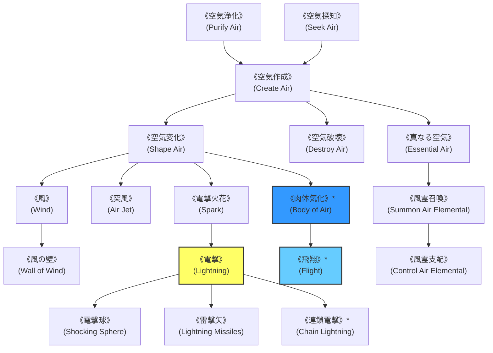

# ガープスマジック呪文体系：風霊系呪文 (Air Spells)

**主管部署**: 魔導科学・理論研究部  
**準拠文献**: 『ガープス第4版 魔法大全（GURPS Magic）』第23章 pp.160-165、公式サプリメント各編（magic_page_081.html）  
**準拠憲章**: `AGENTS.md` (四大精霊使役・雷撃力学・結界内大気浄化)

---

## 1. 風霊系呪文の基本概要と力学特性

### 1.1 系統特性
- **本質**: 気体分子の流体力学操作（気流、真空、暴風）、大気浄化、放電現象・雷撃（電撃ダメージ）の励起、および風のエレメンタル（風霊/エアー・エレメンタル）の使役。
- **電撃（Lightning）の力学**:
  - 電撃ダメージは金属鎧などの良導体を身につけた対象に対し、**装甲防護点（DR）を無視または大幅減衰（金属性DRはDR1点として計算）**して深部ダメージを与える。
- **現代世界での位置づけ**:
  - 地下要塞網（環七地下調整池・春日部放水路等）の換気・酸素供給、ドローン飛行制御、および重装甲目標に対する電撃貫通戦術。

---

## 2. 呪文前提系統樹（ツリー構造）

---

## 3. 呪文詳細一覧データ（主要抜粋・全65種）

| 呪文名（日 / 英） | クラス | 持続時間 | エネルギー消費 | 準備時間 | 前提条件 | 出力・効果概要 |
| :--- | :--- | :--- | :--- | :--- | :--- | :--- |
| **《空気浄化》** (Purify Air) | 範囲 | 永久 | 1点/m | 1秒 | なし | 範囲内の有毒ガス、煙、粉塵を除去し清浄な空気を回復。 |
| **《空気探知》** (Seek Air) | 情報 | 一瞬 | 1点 | 1秒 | なし | 呼吸可能な新鮮な空気の存在と方向を探知。 |
| **《空気作成》** (Create Air) | 範囲 | 永久 | 1点/m | 1秒 | 《空気浄化》または《空気探知》 | 真空や水中、密閉空間に呼吸可能な標準大気を生成。 |
| **《空気変化》** (Shape Air) | 通常 | 1秒 | 1点/秒 (同維持) | 1秒 | 《空気作成》 | 気流を操作し、物を吹き飛ばす（秒速10mの風圧）。 |
| **《空気破壊》** (Destroy Air) | 範囲 | 永久 | 2点/m | 1秒 | 《空気作成》 | 範囲内の空気を瞬時に消滅させ、局所真空を形成（窒息・気圧差破裂）。 |
| **《突風》** (Air Jet) | 通常 | 1秒 | 1〜3点 (同維持) | 1秒 | 《空気変化》 | 指先から高圧ジェット気流を放ち、目標をノックバック。 |
| **《風の壁》** (Wall of Wind) | 範囲 | 1分 | 2点/m (維持1) | 1秒 | 《空気変化》、風霊2種 | 銃弾や矢の弾道を偏向させる猛烈な上昇旋風カーテンを展開。 |
| **《電撃》** (Lightning) | 射撃 | 一瞬 | 1〜素質×2点 | 1〜3秒 | 《空気変化》、素質1 | 掌から超高圧アーク放電を射出（1d〜3d電撃ダメージ、金属鎧無効化）。 |
| **《電撃球》** (Shocking Sphere) | 白兵 | 一瞬 | 1〜素質点 | 1秒 | 《電撃》 | 手元に球状雷を保持し、接触時に大電流を標的へ流し込む（麻痺判定）。 |
| **《連鎖電撃》\*** (Chain Lightning) | 通常 | 一瞬 | 3点〜 | 2秒 | 素質2、《電撃》 | 初弾命中後、周囲の敵へ電弧が連鎖跳躍（至難）。 |
| **《飛翔》\*** (Flight) | 通常 | 1分 | 5点 (維持3) | 2秒 | 素質1、《浮揚》《空気変化》 | 術者自身を空中浮遊・自由自在に高速飛翔（時速40km・至難）。 |
| **《肉体気化》\*** (Body of Air) | 通常/抵 | 1分 | 6点 (維持2) | 5秒 | 《空気変化》、肉体操作系2種 | 肉体を完全な気体へと相転移（物理打撃完全無効・至難）。 |
| **《真なる空気》** (Essential Air) | 範囲 | 永久 | 2点/m | 3秒 | 風霊系6種 | 1回の呼吸で3倍長持ちする高純度霊的大気を生成。 |
| **《風霊召喚》** | 特殊 | 1時間 | 4点〜 | 30秒 | 素質1、風霊系8種 | 風のエレメンタル（竜巻生命体）を召喚・使役。 |
| **《風霊支配》** | 特殊 | 1分 | 特殊 | 2秒 | 《風霊召喚》 | 野生の風霊や気流怪異を制圧。 |

---

## 4. 現代戦術・都市インフラでの適用例

1. **対重装甲魔獣・車両に対する電撃戦術**:
   - 金属外殻や重装甲を持つ目標に対し、自衛隊・警察の魔法部隊が《電撃》を用いて装甲無視の深部ショックダメージを与える。
2. **首都圏多層防護要塞網の換気生命線**:
   - 地下調整池要塞基地において《空気浄化》《真なる空気》を常時維持し、生物兵器・アビス性瘴気ガスの侵入を完全遮断。
