# 動物系呪文 (Animal Spells)

本ドキュメントは、ガープス第4版『魔法大全』第20章（pp.122-126）および公式拡張サプリメント（『Magic: Artillery Spells』『Magic: Death Spells』『Magic: The Least of Spells』『Magic: Plant Spells』等）に準拠した、**全28種**の動物系呪文公式アーカイブです。マナ力学、生体媒介作用、ならびに2026年現代における結界都市防衛・軍事兵器工学・法規制（CR）の運用データを過不足なく完全網羅しています。

---

## 1. 動物系呪文の力学体系

動物系呪文は、マナの指向性周波数を介して対象の物理・生体・霊的パラメータを励起・変調・制御する魔術体系です。
- **生体媒介原則**: マナは術士の生体・神経系・霊体を介して作用し、直接の物質変換や物理エネルギー励起を行います。
- **現代技術インフラとの並行性**: 電子回路や通信網を直接破壊するのではなく、物理的現象（熱、圧力、電磁、物質変形等）を介して現代兵器や都市防護壁と相互作用します。

### 1.1 動物系呪文 前提条件ツリー (Prerequisite Tree)

```mermaid
graph TD
    %% クラススタイル定義（高コントラスト・ダークモード規格）
    classDef spell fill:#0f172a,stroke:#38bdf8,stroke-width:1.5px,color:#ffffff;
    classDef root fill:#0369a1,stroke:#38bdf8,stroke-width:2px,color:#ffffff,font-weight:bold;
    classDef ext fill:#1e293b,stroke:#94a3b8,stroke-width:1px,color:#cbd5e1,stroke-dasharray: 5 5;
    classDef special fill:#4c1d95,stroke:#c084fc,stroke-width:1.5px,color:#ffffff;

    %% 系統内呪文ノード定義
    subgraph Sub_3F144C14 ["22種"]
        BeastSoother["《静かに》<br>(Beast-Soother)"]:::spell
        BeastRouser["《動物煽り》<br>(Beast-Rouser)"]:::spell
        Sp_3_61B8["《動物制御》<br>(（旧名：（動物）制御　昆虫制御　魚類制御　爬虫類制御　鳥類制御　哺乳類制御）)"]:::spell
        HybridControl["《合成獣制御*》<br>(Hybrid Control)"]:::spell
        Sp_5_4B75["《動物寄せ》<br>(（旧名：動物召喚）)"]:::spell
        Master["《お座り》<br>(Master)"]:::spell
        BeastLink["《動物感応》<br>(Beast Link)"]:::spell
        Sp_8_6482["《獣語》<br>(（旧名：動物会話）)"]:::spell
        Sp_9_47AB["《動物撃退》<br>(（旧名：（動物）撃退　昆虫撃退　魚類撃退　爬虫類撃退　鳥類撃退　哺乳類撃退）)"]:::spell
        RepelHybrids["《合成獣撃退*》<br>(Repel Hybrids)"]:::spell
        Rider["《騎手》<br>(Rider)"]:::spell
        Sp_12_4F3E["《動物潜望》<br>(（旧名：動物知覚）)"]:::spell
        SpiderSilk["《蜘蛛の糸》<br>(Spider Silk)"]:::special
        BeastSeeker["《動物探知》<br>(Beast Seeker)"]:::spell
        Sp_15_201D["《動物憑依》<br>(（旧名：動物支配）)"]:::spell
        Sp_16_3EC0["《完全動物憑依*》<br>(（旧名：完全動物支配）)"]:::special
        ProtectAnimal["《動物保護》<br>(Protect Animal)"]:::spell
        Sp_18_2722["《動物変身*》<br>(（旧名：変身）)"]:::special
        ShapeshiftOthers["《他者変身*》<br>(Shapeshift Others)"]:::special
        PermanentShapeshifting["《完全変身*》<br>(Permanent Shapeshifting)"]:::special
        PartialShapeshifting["《部位変身*》<br>(Partial Shapeshifting)"]:::special
        GreatShapeshift["《大変身*》<br>(Great Shapeshift)"]:::special
    end

    subgraph Sub_260CCBA7 ["MAS / MDS 拡張 1種"]
        CreepingPlague["《毒這虫の群れ*》<br>(Creeping Plague)"]:::special
    end

    subgraph Sub_E032978 ["MAS / MDS 拡張 2種"]
        AbominableAlteration["《死の部位変身*》<br>(Abominable Alteration)"]:::special
        ThousandLeggedDemise["《千脚の崩壊*》<br>(Thousand-Legged Demise)"]:::special
    end

    %% 前提条件依存関係エッジ
    Ext_1 --> BeastSoother
    Ext_2 --> BeastRouser
    BeastSoother --> Sp_3_61B8
    Sp_3_61B8 --> HybridControl
    BeastSoother --> Sp_5_4B75
    BeastSoother --> Master
    Sp_5_4B75 --> BeastLink
    Sp_5_4B75 --> Sp_8_6482
    Sp_3_61B8 --> Sp_9_47AB
    Ext_3 --> RepelHybrids
    Sp_3_61B8 --> Rider
    Sp_3_61B8 --> Sp_12_4F3E
    Req_4 --> SpiderSilk
    Sp_5_4B75 --> BeastSeeker
    Ext_5 --> BeastSeeker
    Sp_12_4F3E --> Sp_15_201D
    Ext_6 --> Sp_15_201D
    Sp_15_201D --> Sp_16_3EC0
    Ext_7 --> ProtectAnimal
    Ext_8 --> ProtectAnimal
    Req_9 --> Sp_18_2722
    Ext_10 --> ShapeshiftOthers
    Ext_10 --> PermanentShapeshifting
    Ext_11 --> PartialShapeshifting
    Ext_12 --> PartialShapeshifting
    Ext_12 --> GreatShapeshift
    Ext_10 --> GreatShapeshift
    Sp_5_4B75 --> CreepingPlague
    Ext_13 --> CreepingPlague
    Ext_14 --> CreepingPlague
    Ext_12 --> AbominableAlteration
    Ext_11 --> AbominableAlteration
    Ext_13 --> ThousandLeggedDemise
    Ext_11 --> ThousandLeggedDemise

    %% 外部系統・特殊前提ノード
    Ext_1["【他系統: 《説得》】"]:::ext
    Ext_2["【他系統: 《不機嫌》】"]:::ext
    Ext_3["【他系統: 《合成獣制御》】"]:::ext
    Req_4["【前提: 素質1、動物系2種】"]:::ext
    Ext_5["【他系統: 《方向探知》】"]:::ext
    Ext_6["【他系統: 《憑依術》】"]:::ext
    Ext_7["【他系統: 《魔鎧》】"]:::ext
    Ext_8["【他系統: 《番犬》】"]:::ext
    Req_9["【前提: 素質1、呪文6種】"]:::ext
    Ext_10["【他系統: 《動物変身》】"]:::ext
    Ext_11["【他系統: 《他者変身》】"]:::ext
    Ext_12["【他系統: 《体変え》】"]:::ext
    Ext_13["【他系統: 《昆虫制御》】"]:::ext
    Ext_14["【他系統: 《動物作成》】"]:::ext
```

---

## 2. ガープス第4版『魔法大全』基本動物系呪文（22種）

| 呪文名（日 / 英） | クラス | 持続時間 | 基本消費 / 維持 | 詠唱時間 | 前提条件 | 効果概要・力学 |
| :--- | :---: | :---: | :---: | :---: | :--- | :--- |
| **《静かに》** Beast-Soother | 通常 | 永久# | 1〜3 | 1秒 | 《説得》ないし「動物共感」 | 1体の 動物 を静めます。 術者 に対する 反応判定 の出目に、この 呪文 に消費した エネルギー の2倍を加えます。 |
| **《動物煽り》** Beast-Rouser | 通常 | 1時間# | 1〜3 | 1秒 | 《不機嫌》ないし「動物共感」 | 動物 1体の機嫌を悪くします。 動物 の 反応判定 （誰に対しても）の出目から、この 呪文 に消費した エネルギー の2倍を差し引きます。 |
| **《動物制御》** （旧名：（動物）制御　昆虫制御　魚類制御　爬虫類制御　鳥類制御　哺乳類制御） Animal Control | 通常/抵-意志力 | 1分 | さまざま | 1秒 | 《静かに》 | 要専門化技能 呪文 要専門化技能 |
| **《合成獣制御*》** Hybrid Control* | 通常/抵-意志力 | 1分 | 6/3 | 1秒 | 《動物制御》2種# | 詳細参照 |
| **《動物寄せ》** （旧名：動物召喚） Beast Summoning | 通常 | 1分 | 3/2# | 1秒 | 《静かに》 | 。 呪文 召喚・指定した種類の 動物 （ 知力 5以下）を一匹、呼び寄せます。この 呪文 に距離は関係ありません。 呪文 の判定に成功すると、指定した種類の 動物 の中でもっとも近くにいるものの場所と、その生き物がやってくるまでにかかる時間がわかります。 |
| **《お座り》** Master | 通常/防御/抵-知力 | 不定 | 2 | 1秒 | 《静かに》 | または _ 知力 、 目を合わせ 集中 を続けるかぎり、 動物 をじっとさせておきます。あたりが暗いと目を合わせることはできません！ 術者 の白兵 戦闘 距離に 動物 が入ろうとしたとき――たとえば 攻撃 に、 として唱えることもできます。 |
| **《動物感応》** Beast Link | 通常 | 特殊 | 3 | 5秒 | 《動物寄せ》 | 召喚・動物 と心のつながりを持ちます。 動物 は 術者 とはぐれることがありません（必ず30分以内でやってこれる位置います）。 術者 が呼べば一度だけ、命がけでとはいわないまでも全速力でやって来ます。 野生動物 の場合、そばに来たとき新たに 反応判定 を行なわねばなりません。 呪文 をかけたときはで友好的な 反応 を得ていても、も |
| **《獣語》** （旧名：動物会話） Beast Speech | 通常 | 1分 | 4/2 | 1秒 | 《動物寄せ》 | 言語関連 呪文 動物 言語関連 |
| **《動物撃退》** （旧名：（動物）撃退　昆虫撃退　魚類撃退　爬虫類撃退　鳥類撃退　哺乳類撃退） Repel Animal | 範囲/抵-生命力 | 1時間 | さまざま | 10秒 | 対応する《動物制御》 | 。 呪文（Repel (Animal)） 《[[動物撃退 |
| **《合成獣撃退*》** Repel Hybrids* | 範囲/抵-生命力 | 1時間 | 6/3 | 10秒 | 《合成獣制御》 | （至難） （至難） 効果範囲内から 合成獣 を追い払います。効果範囲内に入ろうとするたび（あるいは効果範囲内に留まろうとするたび）、毎 ターン 抵抗判定 を行ないます。「 術者 の 修正後技能レベル 」対「 動物 の 体力 」で 即決勝負 を行なってください。 術者 はその 合成獣 |
| **《騎手》** Rider | 通常 | 5分 | 2/1 | 1秒 | 《動物制御》1種# | 乗用に訓練した忠実な 動物 のように、 目標 にまたがり乗ることができます。 目標 になる 動物 は 術者 を乗せて運べなければならず、 術者 も必要に応じて〈 騎乗 〉の 技能 判定を行なわねばなりません。 術者 側に 集中 の必要はありません。 エラッタ修正：【誤】〈乗馬〉 【正】〈 騎乗 〉 |
| **《動物潜望》** （旧名：動物知覚） Rider Within | 通常 | 1分 | 4/1 | 3秒 | 《動物制御》2種# | 呪文 を 動物 にかぎったもので、あらゆる 動物 に効果があります（ただし 知性 のある生き物には効きません）。 術者 は 集中 を続けるかぎり、 動物 の目や耳などを通してものを感じることができます（ 術者 自身の感覚も普段と同じように働きま |
| **《蜘蛛の糸》** Spider Silk | 射撃 | 1分 | 1/5ｍ毎# | 1秒 | 素質1、動物系2種 | 術者 の指先から蜘蛛の糸を放ちます。糸は細く、ほとんど重さはありませんが非常に強靭で、250キロの重さでも切れません。 としては、「 半致傷距離 なし、 最大射程 は糸の長さ、 正確さ +3」で、命中は 術者 の〈 特殊攻撃 〉 技能 か 敏捷力 -4で判定します。命中した 目標 は糸に捕らわれ、「 接着 」の 特別増強 を加えた |
| **《動物探知》** Beast Seeker | 情報 | 一瞬 | 3# | 1秒 | 《動物寄せ》と探知系呪文2種。ないし《方向探知》 | （111ページ）と似ていますが、探すのは 動物 にかぎります。種類や個体を限定してもかまいませんし、とにかく「 動物 」を探すという使い方でもかまいません。 |
| **《動物憑依》** （旧名：動物支配） Beast Possession | 通常/抵-意志力 | 1分 | 6/2 | 5秒 | 《動物潜望》ないし《憑依術》 | 。 呪文 _ 意志力 、 と似ていますが、 動物 を「内側から」完全に支配し、乗っとった 動物 の記憶や 技能 を、自由に利用できるようになります。 術者 は、 目標 の肉体にいるあいだ、 目標 の 技能 |
| **《完全動物憑依*》** （旧名：完全動物支配） Permanent Beast Possession* | 通常/抵-意志力 | 不定 | 20 | 1分 | 素質2、《動物憑依》 | 。 呪文（至難） _ 意志力 、 とほぼ同じですが、 術者 が自分で支配をやめるか、などの 呪文 で「追い払われる」まではずっ |
| **《動物保護》** Protect Animal | 範囲 | 1分 | 1/同 | 1分 | 《魔鎧》、《番犬》、動物系3種 | 防御・場所にかける 呪文 で、効果範囲内にいる特定の 動物 すべてを保護します。保護された 動物 へ危害を及ぼそうとすると、目に見えない守護者がいるかのように防がれてしまいます。保護された 動物 は、 DB +3、 防護点 5を得ます。 エラッタ修正：【誤】ダメージ修正+5 【正】 DB +3 |
| **《動物変身*》** （旧名：変身） Shapeshifting* | 特殊 | 1時間 | さまざま | 3秒 | 素質1、呪文6種 | 。 呪文（至難） （至難） 術者 は 動物 に姿を変えることができます。個々の 動物 によって異なる 呪文 として扱うので、それぞれ別々に覚えねばなりません。また、自分がよく知っている 動物 についてしか身につけられま |
| **《他者変身*》** Shapeshift Others* | 特殊/抵-意志力 | 1時間 | さまざま | 30秒 | 素質2、その形態の《動物変身》 | （至難） _ 意志力 、 と同じですが、他者にかけるための 呪文 です。 目標 は自分で効果を終わらせることができず、 術者 が解除するか、を使わないと効果を消せません。 目標 |
| **《完全変身*》** Permanent Shapeshifting* | 通常 | 不定 | さまざま | 1分 | 素質3、《動物変身》 | （至難） とほぼ同じですが、 術者 が自分で変身をやめるまで、 動物 形態をとることができます。 知力 が失われるかどうかの判定は一日一回行ないます。 |
| **《部位変身*》** Partial Shapeshifting* | 通常/抵-意志力 | 1時間 | さまざま | 10秒 | 素質3、《他者変身》、《体変え》 | 同様に消える点に注意。 呪文（至難） （至難） _ 意志力 、 と似ていますが、効果を発揮するのは身体の一部分だけです。 目標 は 術者 でも、他の誰かでも構いません。 |
| **《大変身*》** Great Shapeshift* | 特殊 | 1分 | 20/半# | 5秒 | 素質3、《体変え》、《動物変身》4種、他の呪文10種 | （至難） （至難） 術者 は一時的に「 変形 」（『 ベーシックセット 1巻』48ページ）の 特徴 を使えるようになり、何度も素早くさまざまな形状に変身することができます。ただし、 術者 が本来の姿に戻ると、 呪文 は効果をなくしてしまいます。こ |

---

## 3. 魔導兵器・砲兵戦術拡張呪文（MAS / MDS 拡張 1種）

| 呪文名（日 / 英） | クラス | 持続時間 | 基本消費 / 維持 | 詠唱時間 | 前提条件 | 効果概要・力学 |
| :--- | :---: | :---: | :---: | :---: | :--- | :--- |
| **《毒這虫の群れ*》** Creeping Plague* | 範囲 | 1分 | 2・同 | 2秒 | 素質5、《動物寄せ》と《昆虫制御》。または素質4、《動物作成》 | （至難）（どくはうむしのむれ。Creeping Plague (VH)） pp.10-11 （至難） 召喚・這いずり回る毒虫の絨毯を出現させます。サシハリアリ、ムカデ、サソリ、クモ、その他刺したり噛んだりするほぼあらゆる這い回る無脊椎動物です。水場でも逃げ場がな |

---

## 4. 魔導兵器・砲兵戦術拡張呪文（MAS / MDS 拡張 2種）

| 呪文名（日 / 英） | クラス | 持続時間 | 基本消費 / 維持 | 詠唱時間 | 前提条件 | 効果概要・力学 |
| :--- | :---: | :---: | :---: | :---: | :--- | :--- |
| **《死の部位変身*》** Abominable Alteration * | 通常/抵-生命力か意志力 | 一瞬 | 11 | 10秒 | 素質3、《体変え》、該当する動物の《他者変身》 | なので、今の形に意訳しています。また、 |
| **《千脚の崩壊*》** Thousand-Legged Demise * | 通常/抵-意志力 | 1秒 | 11 | 5秒 | 素質3、《昆虫制御》、何かしらの《他者変身》1種 | （至難）（Thousand-Legged Demise (VH)） p.10 （至難） ＿ 意志力 対象を、 知性 のない小型生物群に短時間変化させます。この 魔法 は非常に不安定で、 群れ の精神を与えるものではありません。犠牲者だった生物たちはまとまった 群れ で留まるのではなく、 |

---

## 5. 魔導兵器・砲兵戦術拡張呪文（MAS / MDS 拡張 3種）

| 呪文名（日 / 英） | クラス | 持続時間 | 基本消費 / 維持 | 詠唱時間 | 前提条件 | 効果概要・力学 |
| :--- | :---: | :---: | :---: | :---: | :--- | :--- |
| **《ペット呼び》（並）** （Call (A)） | 通常 | 1分 | 1・同 | 1秒 | -（簡単呪文なので） | （並）（Call (A)） p.6 （並） 召喚・術者 は、訓練された既知の 動物 （ペットや乗馬など）を遠くから呼び出します。獣はこれに気づくために 聴覚 判定 に+3を獲得し、通常の8倍の距離から呼びかけられることができます。生物が応答するかどうかは、訓練と呼び出し者に対する態度によっ |
| **《毛づくろい》（並）** （Groom (A)） | 通常 | 1分 | 1・同 | 2秒 | -（簡単呪文なので） | （並）（Groom (A)） p.6 （並） 対象は素手でブラシをかけたり、櫛でとかしたり、あらゆる獣の 毛皮 の手入れをすることができます。 動物 の世話をする特別な能力は付与されません。道具が不要になるだけです！ |
| **《虫よけ》（並）** （Insect Repellent (A)） | 通常 | 1時間 | 1・同 | 10秒 | -（簡単呪文なので） | （並）（Insect Repellent (A)） p.15 （並） 防御・対象は、刺すハエ、蚊、および同様の自然の害虫にとって魅力的ではなくなります。 術者 の TL で知られている忌避物質（防虫剤）と同じ効果があり、たいていは少しのお金の節約程度の恩恵でしょう。しかし、迷子になったり難破した探検家にとっては命 |

---

## 6. 2026年現代戦術・都市防衛・法規制（CR）における運用

### 6.1 警察・自衛隊・PMCにおける実戦配備
結界都市（セーフゾーン）警備および壁外アウトランドへの遠征作戦において、動物系呪文は索敵・突入支援・防壁維持・目標無力化の標準プロトコルとして統合運用されています。特に部隊随伴術士による即時展開は、通常兵器との複合火力（コンバインド・アームズ）として極めて高い戦闘効率を発揮します。

### 6.2 メガコーポ支配と特許利権
ヤマト重工、テイコク製薬、サエデル・シュティフトゥング、アレス等のメガコーポは、動物系呪文の工業・医療・防衛利用に関する独占特許を保有しており、民間術士に対するライセンス管理や魔導触媒・霊薬の市場流通を掌握しています。

### 6.3 国際魔導協定（IMA）および法規制（CR）
破壊力・精神汚染・非人道性の高い高位呪文は、国家公安委員会および国際魔導協定により**規制等級CR3〜CR4（要特別国家許可・戦時国際法規制）**に指定されており、無認可での行使・研究は厳罰に処されます。