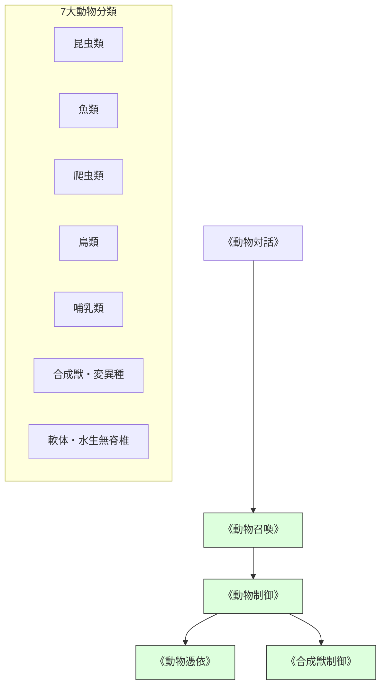

# 動物・魔獣制御系呪文 (Animal & Beast Spells)

本ドキュメントは、ガープス第4版『魔法大全』第3章「動物系呪文」および関連データ（`magic_page_174`〜`180`）を基に、昆虫、魚類、爬虫類、鳥類、哺乳類、合成獣の制御力学、および2026年現代における魔獣調教・生態制御プロトコルを体系化した公式魔術アーカイブです。

---

## 1. 動物・魔獣生態制御の原則

動物系呪文は、対象の神経系・本能・生体電位に直接干渉する生体媒介魔術です。
- **知性制限**: 知力（IQ）5以下の通常生物および低知能魔獣に最も強く作用する。
- **高知能竜種への無効性**: 人間以上の知能を持つ高知能竜種や神性存在に対しては、動物系制御呪文は一切通用しない（即座に意志力抵抗で無効化される）。

### 1.1 前提条件ツリー (Prerequisite Tree)

---

## 2. 動物・魔獣系主要呪文データ一覧

| 呪文名（日 / 英） | 呪文クラス | 基本消費 / 維持 | 詠唱時間 | 前提条件 | 効果概要・力学 |
| :--- | :---: | :---: | :---: | :--- | :--- |
| **《動物感知》** Seek Animal | 情報 | 2 / 不可 | 1秒 | なし | 半径数km以内の特定分類の生物・魔獣を探知。 |
| **《動物親和》** Beast Soother | 通常 | 2 / 1 | 1秒 | 《動物感知》 | 興奮・凶暴化した魔獣を鎮静化させ、敵対行動を停止。 |
| **《動物対話》** Beast Speech | 通常 | 4 / 2 | 2秒 | 《動物親和》 | 対象生物の知能に応じた原始的コミュニケーションを行う。 |
| **《動物召喚》** Summon Animal | 通常 | 3〜10 / 1 | 3秒 | 《動物対話》 | 付近に生息する野生動物・低位魔獣を呼び寄せる。 |
| **《動物制御》** Beast Control | 通常 | 3 / 1 | 2秒 | 《動物召喚》 | 生物の運動中枢を直接支配し、命令を実行させる（意志抵抗）。 |
| **《動物憑依》** Beast Possession | 通常 | 6 / 2 | 3秒 | 《動物制御》 | 術者の意識を魔獣の肉体に完全同期・憑依させて遠隔操縦。 |
| **《合成獣制御》** Hybrid Control | 通常 | 5 / 2 | 2秒 | 《動物制御》 | 複数種の特徴を併せ持つキメラ・急速変異種の運動を支配。 |

---

## 3. 現代魔獣ハンティング・養殖における適用

### 3.1 剛毛巌猪（Crag Boar）等の魔獣捕獲プロトコル
八王子・大宮・柏の解体前線基地に所属するハンターPMCは、《動物親和》《動物制御》を活用して、暴走する剛毛巌猪を安全に鎮静・誘導し、貴重なシリカ結晶骨格を傷つけずに捕獲・屠殺する技術を標準運用しています。

### 3.2 養殖・家畜化（Class-A安全種）
テイコク製薬や豊洲中央流通HDが管理する魔獣牧場では、急速変異した安全種（Class-A）の繁殖・肥育管理に《動物感知》《動物親和》のパッシブ魔導端末（常動型呪具）が常時稼働しています。
