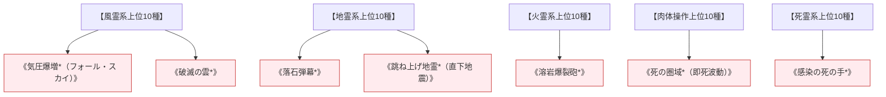

# 砲兵・致死系呪文 (Artillery & Death Spells)

本ドキュメントは、ガープス第4版サプリメント『GURPS Magic: Artillery Spells』および『GURPS Magic: Death Spells』の公式データを基に、広域面制圧・対大型魔獣破砕砲撃・致死毒壊死呪術、および2026年現代における自衛隊特科・対天災級魔獣迎撃戦を体系化した公式魔術アーカイブです。

---

## 1. 砲兵・致死魔術の力学

砲兵系呪文（Artillery Spells）および致死系呪文（Death Spells）は、マナの出力密度を極限まで圧縮し、単独または小隊規模で大軍・超大型魔獣・防護結界を面制圧・瞬殺するために開発された戦略級高位魔術です。通常呪文に比べ前提条件（素質3〜5、各系統上位10種以上）が極めて重く、行使には膨大なマナ消費と術者の精神的負担を伴います。

### 1.1 前提条件ツリー (Prerequisite Tree)

---

## 2. 砲兵・致死系主要呪文データ一覧

| 呪文名（日 / 英） | クラス | 基本消費 / 維持 | 詠唱時間 | 前提条件 | 効果概要・力学 |
| :--- | :---: | :---: | :---: | :--- | :--- |
| **《気圧爆増*》** Falling Sky | 範囲 | 2〜10 (面積毎) | 1秒/2点 | 素質4, 風霊系8種 | 指定範囲の上空気圧を瞬時に数千ヘクトパスカル上昇させ、押し潰し圧殺。 |
| **《破滅の雲*》** Cloud of Doom | 範囲/抵 | 5 (面積毎) | 1秒 | 素質4, 風霊・毒系10種 | 肺胞と粘膜を一瞬で溶かす濃硫酸状の有毒重ガス雲を散布。 |
| **《落石弾幕*》** Boulder Barrage | 範囲 | 2〜6 (面積毎) | 1秒/2点 | 素質4, 地霊系10種 | 巨大な岩石の雹を上空から雨あられと降らせ、装甲車両をも粉砕。 |
| **《跳ね上げ地霊*》** Seismic Shock | 範囲 | 8 (面積毎) | 1秒 | 素質4, 《地震》等10種 | 直下型S波を集中発生させ、敵陣の地盤を垂直に数十メートル跳ね上げる。 |
| **《死の圏域*》** Death Field | 範囲/抵 | 2〜6 (面積毎) | 1秒/2点 | 素質4, 《死の手》等10種 | 範囲内のすべての生命体の中枢神経と心筋を直接停止させる死神の波。 |
| **《感染の死の手*》** Plague Touch | 白兵/抵 | 3の倍数 | 2秒 | 素質4, 《疫病》, 《死の手》 | 触れた目標を即死させると同時に、その遺体から周囲へ即効性壊死毒を飛散。 |

---

## 3. 2026年軍事バランス・対大型魔獣戦における運用

### 3.1 陸上自衛隊野戦特科部隊との火力統合（ハイブリッド砲兵）
憲章1.3条に基づき、155mm榴弾砲や多連装ロケットシステム（MLRS）の物理制圧射撃に対し、観測班に随伴する高等術士が《気圧爆増》《跳ね上げ地霊》を同時弾着（TOT）させることで、魔術障壁を物理エネルギーで突破・崩壊させた直後に内部の生体組織を面制圧する戦法が確立されています。

### 3.2 不可侵天災竜種（ドラゴン）に対する軍縮条約指定（CR5 / 禁止兵器）
《死の圏域》や《感染の死の手》は、生態系全体を壊滅させる生物兵器と同等とみなされ、ジュネーヴ軍縮会議および国際魔導協定において**CR5（国家間戦争時であっても使用禁止の禁忌兵器）**に指定されています。
