# 肉体操作系呪文 (Body Control Spells)

本ドキュメントは、ガープス第4版『魔法大全』第21章（pp.127-135）および公式拡張サプリメント（『Magic: Artillery Spells』『Magic: Death Spells』『Magic: The Least of Spells』『Magic: Plant Spells』等）に準拠した、**全78種**の肉体操作系呪文公式アーカイブです。マナ力学、生体媒介作用、ならびに2026年現代における結界都市防衛・軍事兵器工学・法規制（CR）の運用データを過不足なく完全網羅しています。

---

## 1. 肉体操作系呪文の力学体系

肉体操作系呪文は、マナの指向性周波数を介して対象の物理・生体・霊的パラメータを励起・変調・制御する魔術体系です。
- **生体媒介原則**: マナは術士の生体・神経系・霊体を介して作用し、直接の物質変換や物理エネルギー励起を行います。
- **現代技術インフラとの並行性**: 電子回路や通信網を直接破壊するのではなく、物理的現象（熱、圧力、電磁、物質変形等）を介して現代兵器や都市防護壁と相互作用します。

### 1.1 肉体操作系呪文 前提条件ツリー (Prerequisite Tree)

```mermaid
graph TD
    %% クラススタイル定義（高コントラスト・ダークモード規格）
    classDef spell fill:#0f172a,stroke:#38bdf8,stroke-width:1.5px,color:#ffffff;
    classDef root fill:#0369a1,stroke:#38bdf8,stroke-width:2px,color:#ffffff,font-weight:bold;
    classDef ext fill:#1e293b,stroke:#94a3b8,stroke-width:1px,color:#cbd5e1,stroke-dasharray: 5 5;
    classDef special fill:#4c1d95,stroke:#c084fc,stroke-width:1.5px,color:#ffffff;

    %% 系統内呪文ノード定義
    subgraph Sub_3F144090 ["62種"]
        Sp_1_4F76["《登攀強化》<br>(（旧名：登攀）)"]:::root
        Itch["《痒み》<br>(Itch)"]:::root
        Touch["《接触》<br>(Touch)"]:::root
        Perfume["《匂い袋》<br>(Perfume)"]:::spell
        Spasm["《ひきつり》<br>(Spasm)"]:::spell
        StopSpasm["《発作止め》<br>(Stop Spasm)"]:::spell
        Tickle["《くすぐり》<br>(Tickle)"]:::spell
        Sp_8_70EC["《苦痛》<br>(（旧名：痛み）)"]:::spell
        Clumsiness["《不器用》<br>(Clumsiness)"]:::spell
        Hinder["《のろま》<br>(Hinder)"]:::spell
        RootedFeet["《足止め》<br>(Rooted Feet)"]:::spell
        Tanglefoot["《足もつれ》<br>(Tanglefoot)"]:::spell
        Roundabout["《向き変え》<br>(Roundabout)"]:::spell
        Debility["《疲れ》<br>(Debility)"]:::root
        Frailty["《虚弱》<br>(Frailty)"]:::spell
        Might["《怪力》<br>(Might)"]:::spell
        Grace["《すばやさ》<br>(Grace)"]:::spell
        Vigor["《活力》<br>(Vigor)"]:::spell
        Sp_19_1127["《能力値増幅》<br>(（旧名：(能力値)増幅　体力増幅　敏捷力増幅　生命力増幅　知力増幅）)"]:::spell
        Sp_20_2077["《朦朧化》<br>(（旧名：朦朧）)"]:::spell
        Nauseate["《むかつき》<br>(Nauseate)"]:::spell
        Sp_22_4525["《強制嘔吐》<br>(（旧名：嘔吐）)"]:::spell
        Fumble["《大失敗》<br>(Fumble)"]:::spell
        StrikeDumb["《口封じ》<br>(Strike Dumb)"]:::spell
        StrikeBlind["《目くらまし》<br>(Strike Blind)"]:::spell
        StrikeDeaf["《耳封じ》<br>(Strike Deaf)"]:::spell
        Hunger["《空腹》<br>(Hunger)"]:::special
        Sp_28_7DCE["《渇え》<br>(（旧名：渇き）)"]:::special
        ResistPain["《痛み止め》<br>(Resist Pain)"]:::special
        HoldBreath["《息止め》<br>(Hold Breath)"]:::special
        Sp_31_F000["《両利き化》<br>(（旧名：両手利き）)"]:::spell
        Balance["《平衡感覚》<br>(Balance)"]:::spell
        Reflexes["《即応》<br>(Reflexes)"]:::spell
        Sp_34_5906["《進捗》<br>(（旧名：リズム）)"]:::spell
        HairGrowth["《養毛》<br>(Hair Growth)"]:::spell
        Haircut["《散髪》<br>(Haircut)"]:::spell
        Sensitize["《痛がり》<br>(Sensitize)"]:::special
        Agonize["《触感過多》<br>(Agonize)"]:::special
        WeakenBlood["《血液弱体化》<br>(Weaken Blood)"]:::spell
        StrikeNumb["《無痛》<br>(Strike Numb)"]:::spell
        Sp_41_6AFF["《窒息化》<br>(（旧名：窒息）)"]:::special
        ControlLimb["《四肢制御》<br>(Control Limb)"]:::special
        Sp_43_6D7A["《四肢痺れ》<br>(（旧名：腕痺れ）)"]:::special
        Sp_44_4D08["《全身麻痺》<br>(（旧名：麻痺）)"]:::spell
        Sp_45_3900["《四肢萎え》<br>(（旧名：腕萎え）)"]:::special
        Sp_46_2511["《不妊化》<br>(（旧名：不妊）)"]:::special
        Sp_47_16B8["《嘔吐感》<br>(（旧名：吐き気）)"]:::spell
        Deathtouch["《死の手》<br>(Deathtouch)"]:::spell
        AlterVoice["《声変え》<br>(Alter Voice)"]:::spell
        AlterVisage["《顔変え》<br>(Alter Visage)"]:::spell
        AlterBody["《体変え》<br>(Alter Body)"]:::spell
        Sp_52_2691["《四肢伸長》<br>(（旧名：腕伸ばし）)"]:::special
        Decapitation["《首切り*》<br>(Decapitation)"]:::special
        Sp_54_6A43["《肉体縮小*》<br>(（旧名：縮小）)"]:::special
        ShrinkOther["《他者縮小*》<br>(Shrink Other)"]:::special
        Sp_56_4530["《肉体拡大*》<br>(（旧名：拡大）)"]:::special
        EnlargeOther["《他者拡大*》<br>(Enlarge Other)"]:::special
        Corpulence["《肥大化*》<br>(Corpulence)"]:::special
        Gauntness["《痩身*》<br>(Gauntness)"]:::special
        Sp_60_3133["《異種体化》<br>(（旧名：変化）)"]:::spell
        Sp_61_42F2["《他者異種体化》<br>(（旧名：他者変化）)"]:::spell
        Transmogrification["《物体変身》<br>(Transmogrification)"]:::special
    end

    subgraph Sub_E032978 ["MAS / MDS 拡張 2種"]
        DeathField["《死の圏域*》<br>(Death Field)"]:::special
        PlagueTouch["《感染の死の手*》<br>(Plague Touch)"]:::special
        Death["《心臓停止*》<br>(Death)"]:::special
        Doomtouch["《破滅の手*》<br>(Doomtouch)"]:::special
    end

    subgraph Sub_260CCBA7 ["MAS / MDS 拡張 1種"]
        AlcoholTolerance["《酒耐性》<br>(Alcohol Tolerance)"]:::root
    end

    %% 前提条件依存関係エッジ
    Ext_1 --> Perfume
    Itch --> Spasm
    Spasm --> StopSpasm
    Ext_2 --> StopSpasm
    Spasm --> Tickle
    Spasm --> Sp_8_70EC
    Spasm --> Clumsiness
    Ext_3 --> Hinder
    Clumsiness --> Hinder
    Hinder --> RootedFeet
    Clumsiness --> Tanglefoot
    Tanglefoot --> Roundabout
    Ext_4 --> Frailty
    Ext_4 --> Might
    Clumsiness --> Grace
    Ext_2 --> Vigor
    Frailty --> Vigor
    Ext_5 --> Sp_19_1127
    Might --> Sp_19_1127
    Ext_6 --> Sp_19_1127
    Grace --> Sp_19_1127
    Ext_7 --> Sp_19_1127
    Vigor --> Sp_19_1127
    Ext_8 --> Sp_19_1127
    Ext_9 --> Sp_19_1127
    Sp_8_70EC --> Sp_20_2077
    Perfume --> Nauseate
    Nauseate --> Sp_22_4525
    Spasm --> Sp_22_4525
    Clumsiness --> Fumble
    Spasm --> StrikeDumb
    Spasm --> StrikeBlind
    Spasm --> StrikeDeaf
    Debility --> Hunger
    Ext_10 --> Hunger
    Debility --> Sp_28_7DCE
    Ext_11 --> Sp_28_7DCE
    Sp_8_70EC --> ResistPain
    Vigor --> HoldBreath
    Grace --> Sp_31_F000
    Grace --> Balance
    Grace --> Reflexes
    Ext_3 --> Reflexes
    Ext_3 --> Sp_34_5906
    Grace --> Sp_34_5906
    Req_12 --> HairGrowth
    Ext_13 --> Haircut
    Sp_20_2077 --> Sensitize
    Sensitize --> Agonize
    Sp_47_16B8 --> WeakenBlood
    Ext_14 --> WeakenBlood
    ResistPain --> StrikeNumb
    Spasm --> Sp_41_6AFF
    Spasm --> ControlLimb
    Clumsiness --> Sp_43_6D7A
    Sp_43_6D7A --> Sp_44_4D08
    Sp_43_6D7A --> Sp_45_3900
    Ext_14 --> Sp_46_2511
    Ext_10 --> Sp_46_2511
    Ext_15 --> Sp_47_16B8
    Ext_16 --> Sp_47_16B8
    Sp_45_3900 --> Deathtouch
    Req_17 --> AlterVoice
    Ext_18 --> AlterVisage
    Ext_19 --> AlterVisage
    AlterVisage --> AlterBody
    Ext_18 --> Sp_52_2691
    AlterBody --> Decapitation
    AlterBody --> Sp_54_6A43
    Ext_20 --> ShrinkOther
    AlterBody --> Sp_56_4530
    Ext_21 --> EnlargeOther
    Ext_22 --> Corpulence
    Ext_23 --> Corpulence
    AlterBody --> Corpulence
    Ext_24 --> Gauntness
    Ext_11 --> Gauntness
    Hunger --> Gauntness
    Ext_18 --> Sp_60_3133
    AlterBody --> Sp_60_3133
    Ext_25 --> Sp_61_42F2
    Sp_60_3133 --> Sp_61_42F2
    Sp_61_42F2 --> Transmogrification
    Ext_26 --> Transmogrification
    Ext_27 --> Transmogrification
    Deathtouch --> DeathField
    Deathtouch --> PlagueTouch
    Ext_16 --> PlagueTouch
    Ext_28 --> PlagueTouch
    Sp_41_6AFF --> Death
    Deathtouch --> Death
    Deathtouch --> Doomtouch
    WeakenBlood --> Doomtouch

    %% 外部系統・特殊前提ノード
    Ext_1["【他系統: 《芳香》】"]:::ext
    Ext_2["【他系統: 《生気賦与》】"]:::ext
    Ext_3["【他系統: 《韋駄天》】"]:::ext
    Ext_4["【他系統: 《活力賦与》】"]:::ext
    Ext_5["【他系統: 《体力増幅》】"]:::ext
    Ext_6["【他系統: 《敏捷力増幅》】"]:::ext
    Ext_7["【他系統: 《生命力増幅》】"]:::ext
    Ext_8["【他系統: 《知力増幅》】"]:::ext
    Ext_9["【他系統: 《知恵》】"]:::ext
    Ext_10["【他系統: 《腐敗》】"]:::ext
    Ext_11["【他系統: 《水破壊》】"]:::ext
    Req_12["【前提: 肉体操作系5種】"]:::ext
    Ext_13["【他系統: 《弱体化》】"]:::ext
    Ext_14["【他系統: 《生気奪取》】"]:::ext
    Ext_15["【他系統: 《酩酊》】"]:::ext
    Ext_16["【他系統: 《疫病》】"]:::ext
    Req_17["【前提: 肉体操作系4種、音声系4種】"]:::ext
    Ext_18["【他系統: 《動物変身》】"]:::ext
    Ext_19["【他系統: 《完全幻覚》】"]:::ext
    Ext_20["【他系統: 《肉体縮小》】"]:::ext
    Ext_21["【他系統: 《拡大》】"]:::ext
    Ext_22["【他系統: 《土作成》】"]:::ext
    Ext_23["【他系統: 《水作成》】"]:::ext
    Ext_24["【他系統: 《土を空気》】"]:::ext
    Ext_25["【他系統: 《他者変身》】"]:::ext
    Ext_26["【他系統: 《物体変形》】"]:::ext
    Ext_27["【他系統: 《肉を石》】"]:::ext
    Ext_28["【他系統: 《敵感知》】"]:::ext
```

---

## 2. ガープス第4版『魔法大全』基本肉体操作系呪文（62種）

| 呪文名（日 / 英） | クラス | 持続時間 | 基本消費 / 維持 | 詠唱時間 | 前提条件 | 効果概要・力学 |
| :--- | :---: | :---: | :---: | :---: | :--- | :--- |
| **《登攀強化》** （旧名：登攀） Climbing | 通常 | 1分 | 1〜3/同 | 1秒 | - | 。 呪文 握力が強く確実に手がかりをつかめるようになり、〈 登攀 〉 技能 を引きあげます。 |
| **《痒み》** Itch | 通常/抵-生命力 | かくまで# | 2 | 1秒 | - | 年06月02日(火) 20:30:31 履歴 |
| **《接触》** Touch | 通常 | 一瞬 | 1 | 1秒 | - | 目標 は身体の一か所（ 術者 が選びます）を軽く触られたように感じます。 鎧 越しでも触られたことはすぐに分かりますが、 目標 の注意を引く以外の効果はありません。 痛み や不快感をもたらすことはありませんが、 集中 は乱されることがあります。 |
| **《匂い袋》** Perfume | 通常/抵-生命力 | 10分 | 2/1 | 1秒 | 《芳香》 | _ 生命力 、 目標 は、 術者 が選んだ匂いを非常に強く発するようになります。 目標 は匂いに気づきますが、その本来の性質に関係なく、その匂いが特にひどいものであるとは感じません（当然、仲間はひどい匂いと感じるかもしれません）。 |
| **《ひきつり》** Spasm | 通常/抵-生命力 | 一瞬 | 2 | 1秒 | 《痒み》 | _ 生命力 、 目標 の “ 任意の ” 筋肉に向けて発します。手に対してかけると、持っているもの（ふつうは 武器 ）を落としてしまいます。動作を必要とする長い 呪文 を唱えている最中なら、 目標 は 敏捷力 判定をおこない、失敗するとはじめからやり直さねばなりません。優れた 魔術師 であれば他にもさまざまな使いみちを考えつくことができるで |
| **《発作止め》** Stop Spasm | 通常 | 一瞬 | 1 | 1秒 | 《ひきつり》ないし《生気賦与》 | 目標 に発生しているすべての 発作 を収めます。これは 痙攣発作 や 吐き気 などに作用します。 |
| **《くすぐり》** Tickle | 通常/抵-意志力 | 1分 | 5/5 | 1秒 | 《ひきつり》 | 意志力抵抗 危険 |
| **《苦痛》** （旧名：痛み） Pain | 通常/抵-生命力 | 1秒 | 2 | 2秒 | 《ひきつり》 | 詳細参照 |
| **《不器用》** Clumsiness | 通常/抵-生命力 | 1分 | 1〜5/半 | 1秒 | 《ひきつり》 | _ 生命力 、 目標 の 敏捷力 を エネルギー 1点につき1減らします。 敏捷力 に関係する 技能 もすべてレベルが下がります。 |
| **《のろま》** Hinder | 通常 | 1分 | 1〜4/同 | 1秒 | 《韋駄天》ないし《不器用》 | （解説は） _ 生命力 、 エネルギー 1点につき、 目標 の 移動力 （と「 よけ 」）を1点減らします。 |
| **《足止め》** Rooted Feet | 通常/抵-体力 | 1分# | 3 | 1秒 | 《のろま》 | _ 体力 、 目標 はその場にくっついてしまいます！ 目標 は以降毎 ターン もとの 呪文 の 技能 判定に対して 体力 -5で 抵抗判定 を行ない、成功すれば自由になれます。足止めされているあいだは、 射撃武器 以外の 武器 技能 に-2されます。また「 よけ 」の値は半減します（端数切り捨て）。 |
| **《足もつれ》** Tanglefoot | 通常/抵-敏捷力 | 一瞬 | 2 | 1秒 | 《不器用》 | _ 敏捷力 、 目標 は足をもつらせて転んでしまいます。 |
| **《向き変え》** Roundabout | 通常/抵-生命力 | 一瞬 | 3 | 1秒 | 《足もつれ》 | _ 生命力 、 目標 の向きを好きなように変えることができます。テレポートするのではなく、身体が回転するだけです。 目標 は次の ターン 、どんな行動をとるにも〈 身体感覚 〉 技能 あるいは 敏捷力 -6の判定に成功しなければいけません。前の ターン に2メートル以上移動していた場合、 知力 判定に失敗すると新しい方向にそのまま歩いていっ |
| **《疲れ》** Debility | 通常/抵-生命力 | 1分 | 1/体力-1毎/半 | 1秒 | - | _ 生命力 、 目標 の 体力 を一時的に減らします。これは 基本致傷力 にも影響しますが、 ヒットポイント は影響を受けません。 荷重 にも関係しますが、ゲームを円滑に進行させたいと思う GM は細かい点を無視して構いません。 |
| **《虚弱》** Frailty | 通常/抵-生命力 | 1分 | 2/生命力-1毎/同# | 1秒 | 《活力賦与》 | _ 生命力 、 目標 の 生命力 を一時的に低下させます。 生命力 の関連する状況（ 基本移動力 、 生命力 を基準とする 技能 、 毒 や 呪文 への抵抗、気絶、死亡など）にはすべて影響しますが、 疲労点 に関連するものは除きます。この 呪文 では、 疲労点 は影響を受けません。この 呪文 の |
| **《怪力》** Might | 通常 | 1分 | 2/体力+1毎/同 | 1秒 | 《活力賦与》 | 目標 の 体力 を一時的に伸ばします。 基本致傷力 、 荷重 、 ヒットポイント に影響しますが、 負傷 を癒すわけではありません。 呪文 の効果が切れた時点で 負傷 が HP 以上のマイナスに達していたら、 生命力 判定を行なわねばなりません。失敗すると死亡してしまいます。 技能レベル が高くなっても、この 呪文 の |
| **《すばやさ》** Grace | 通常 | 1分 | 4/敏捷力+1毎/同 | 1秒 | 《不器用》 | 目標 の 敏捷力 を一時的に伸ばします。 基本移動力 や 敏捷力 に関係する 技能 もすべて上昇します。 術者 が自分にかけて、 などの命中率を高めることもできます。 |
| **《活力》** Vigor | 通常 | 1分 | 2/生命力+1毎/同# | 1秒 | 《生気賦与》ないし《虚弱》 | 目標 の 生命力 を一時的に伸ばします。 基本移動力 、 疲労点 、 負傷 や 病気 への抵抗力に影響します。 術者 は自分の 生命力 を伸ばすこともできます。この 呪文 の効果が切れたときに 目標 の 疲労点 がマイナスになっていた場合、-1につきただちに1点のダメージを受け、気絶してしまう危険があります。 技能レベル が高くてもこの 呪 |
| **《能力値増幅》** （旧名：(能力値)増幅　体力増幅　敏捷力増幅　生命力増幅　知力増幅） Boost (Attribute)　Boost Strength　Boost Dexterity　Boost Health　Boost Intelligence | 通常 ないし防御 | 一瞬 | 1〜5 | なし | 《体力増幅》は《怪力》《敏捷力増幅》は《すばやさ》《生命力増幅》は《活力》《知力増幅》は《知恵》 | （Boost (Attribute)） のみ これだけ 肉体操 |
| **《朦朧化》** （旧名：朦朧） Stun | 通常/抵-生命力 | 一瞬 | 2 | 1秒 | 《苦痛》 | 生命力抵抗 危険 |
| **《むかつき》** Nauseate | 通常/抵-生命力 | 10秒 | 2/同 | 1秒 | 《匂い袋》含む肉体操作系2種 | _ 生命力 、 目標 を「 吐き気 」（『 ベーシックセット 2巻』406ページ）の状態にします。 |
| **《強制嘔吐》** （旧名：嘔吐） Retch | 通常/抵-生命力 | 一瞬 | 3 | 4秒 | 《むかつき》、《ひきつり》 | 呪文 食事関連 危険 危険 |
| **《大失敗》** Fumble | 防御/抵-敏捷力 | 一瞬 | 3 | なし | 《不器用》 | _ 敏捷力 、 目標 が行なおうとしている行動は自動的に ファンブル します。 の 距離修正 値が適用されます。その行動が 攻撃 か 受け であれば、 攻撃/受けファンブル表 で判定します。 よけ であれば 転倒 し、 止め なら 盾 が 非準備状態 になります。その他の行動（ 移動 ・ 武器 の 準備 など）であれば、 GM が適 |
| **《口封じ》** Strike Dumb | 通常/抵-生命力 | 10秒 | 3/1 | 1秒 | 《ひきつり》 | 知覚関連 呪文 知覚関連 危険 |
| **《目くらまし》** Strike Blind | 通常/抵-生命力 | 10秒 | 4/2 | 1秒 | 光・闇系2種、《ひきつり》 | 知覚関連 呪文 知覚関連 危険 |
| **《耳封じ》** Strike Deaf | 通常/抵-生命力 | 10秒 | 3/1 | 1秒 | 音声系2種、《ひきつり》 | _ 生命力 、 目標 の耳を一時的に聞こえなくします。 |
| **《空腹》** Hunger | 通常/抵-生命力 | 一瞬 | 2 | 5秒 | 素質1、《疲れ》、《腐敗》 | 年05月31日(日) 23:59:53 履歴 |
| **《渇え》** （旧名：渇き） Thirst | 通常/抵-生命力 | 一瞬 | 5 | 10秒 | 素質1、《疲れ》、《水破壊》 | 詳細参照 |
| **《痛み止め》** Resist Pain | 通常 | 1分 | 4/2 | 1秒 | 素質2、《苦痛》 | 目標 は一時的に 痛み を感じなくなります。など、苦痛をもたらす 呪文 を無視することができます。 戦闘 で気絶することがなく、 負傷 による 敏捷力 の減少や、 HP が3分の1未満になったときの 移動力 の減少も受けません。しかし、 負傷 に対する防護が増すわけではありません――痛みを感じなくなるだけです。 エラッタ |
| **《息止め》** Hold Breath | 通常 | 1分 | 4/2 | 1秒 | 素質1、《活力》 | 術者 は「 呼吸不要 」（『 ベーシックセット 1巻』52ページ）の 特徴 を得たのと同じように、一時的に空気を必要としなくなります。水中でも、 毒 ガスで充満した部屋でも問題なく過ごすことができます。この 呪文 は実際に空気を発生させるのではなく、 術者 が安全な場所に移動する（あるいはその場所を安全にする）まで 窒息 の影響を遅らせる |
| **《両利き化》** （旧名：両手利き） Ambidexterity | 通常 | 1分 | 3/2 | 1秒 | 《すばやさ》 | 呪文 目標 は、 |
| **《平衡感覚》** Balance | 通常 | 1分 | 5/3 | 1秒 | 《すばやさ》 | 目標 は、 |
| **《即応》** Reflexes | 通常 | 1分 | 5/3 | 1秒 | 《すばやさ》、《韋駄天》 | 目標 は、 |
| **《進捗》** （旧名：リズム） Cadence | 通常 | 1時間 | 5/3 | 10秒 | 《韋駄天》、《すばやさ》 | 。 呪文（しんちょく。 Cadence） 職人の動きを素早く確実に、また無駄な動作を省くことによって、品物作成の速度を倍にします。手作業での作成や改良を行なう 技能 はこの 呪文 で加速できますが、 魔法 による作成作業（ 巻物 作成や 魔化 など）には使えません。 |
| **《養毛》** Hair Growth | 通常/抵-生命力 | 5秒 | 1/1 | 1秒 | 肉体操作系5種 | _ 生命力 、 目標 の髪と爪を、通常の百万倍の速度で成長させます（髪は毎秒5ミリ、爪は12秒で1センチ伸びます）。この状態を放っておくと、 視覚判定 （髪が目に入るため）、 移動 （あごひげを踏んでしまうため）、手先の能力（爪が邪魔なため）などを妨害するでしょう。この 呪文 は髪が全くなくなってしまった人々にも効果があります |
| **《散髪》** Haircut | 通常/抵-生命力 | 一瞬 | 2 | 2秒 | 《弱体化》、肉体操作系2種 | _ 生命力 、 目標 の髪（あごひげ、口ひげ、毛皮......）を 術者 の思うとおりに整えます。結果の芸術的な評価は〈美容師〉（ 知力 /並の 職業技能 ）で判定します。羊の毛を刈ったり、鶏の羽根をむしったり、爪を整えたりするのにも使うことができます。この 呪文 では、かぎ爪や角を丸めることはできません（それらにマニキュアを施すことはできるか |
| **《痛がり》** Sensitize | 通常/抵-生命力 | 1分 | 3/2 | 1秒 | 素質1、《朦朧化》 | _ 生命力 、 目標 は「 痛みに弱い 」（『 ベーシックセット 1巻』121ページ） 特徴 を得て、 痛み に対して敏感になります。すでにこの 特徴 をもっている 目標 に対しては、何の効果もありません。 |
| **《触感過多》** Agonize | 通常/抵-生命力 | 1分 | 8/6 | 1秒 | 素質2、《痛がり》 | _ 生命力 、 目標 の触覚を鋭敏にし、どんな刺激も苦痛に感じるようになります。軽く触っただけで殴られたように、息を吹きかけただけで灼熱の炎に包まれたように、涼しげな風は吹雪のように感じます。衣服に触れる感覚さえ耐えられなくなります（ 目標 はまるで皮を剥がされ、こすられているかのように感じます）。 目標 は 苦悶 によっ |
| **《血液弱体化》** Weaken Blood | 通常/抵-生命力 | 1日 | 9/5 | 1秒 | 《嘔吐感》ないし《生気奪取》 | 年06月06日(土) 19:47:58 履歴 |
| **《無痛》** Strike Numb | 通常/抵-生命力 | 10秒 | 3/1 | 1秒 | 《痛み止め》 | 特徴「無痛」 百鬼夜翔由来 |
| **《窒息化》** （旧名：窒息） Choke | 通常/抵-生命力 | 30秒 | 4 | 1秒 | 素質1、《ひきつり》含む肉体操作系5種 | 呪文 呼吸関連 危険 危険 |
| **《四肢制御》** Control Limb | 通常/抵-意志力 | 5秒 | 3/3# | 1秒 | 素質1、《ひきつり》含む肉体操作系5種 | _ 意志力 、 目標 の 四肢 （翼や触手を含みます）の1つを 術者 の制御下におきます！ 腕 は 武器 を振ることができます（ 技能 は 術者 のものを使います）。 脚 は キック したり、ひねることもできます。一度 呪文 を唱えたら、 術者 は 集中 して 四肢 を制御し続けなければなりません。 集中 が崩れると、 |
| **《四肢痺れ》** （旧名：腕痺れ） Paralyze Limb | 白兵/抵-生命力 | 1分 | 3 | 1秒 | 素質1、《不器用》含む肉体操作系5種 | 呪文 _ 生命力 、 術者 は 目標 の 四肢 に触れねばなりません（他の場所への命中は効果を発揮しません）。 鎧 は効果を発揮しません。接触した瞬間に 抵抗判定 を行ないます。効果を発揮すると相手の 四肢 は 麻痺 してしまいます。1分間「使えなくなった」 |
| **《全身麻痺》** （旧名：麻痺） Total Paralysis | 白兵/抵-生命力 | 1分 | 5 | 1秒 | 《四肢痺れ》 | 。 呪文 _ 生命力 、 術者 は 目標 の 頭部 に触れなければなりません（ 命中判定 に-5の修正をうけます）。 目標 が抵抗に失敗すると、全身が 麻痺 し、1分間まったく身動きできません（ふつうの 戦闘 であれば、終了するまで効果は持続するでしょう |
| **《四肢萎え》** （旧名：腕萎え） Wither Limb | 白兵/抵-生命力 | 永久 | 5 | 1秒 | 素質2、《四肢痺れ》 | 詳細参照 |
| **《不妊化》** （旧名：不妊） Strike Barren | 通常/抵-生命力 | 永久 | 5 | 30秒 | 素質1、《生気奪取》、《腐敗》 | 詳細参照 |
| **《嘔吐感》** （旧名：吐き気） Sickness | 通常/抵-生命力 | 1分 | 3/3 | 4秒 | 《酩酊》ないし《疫病》 | で 。と似ているが、こちらの方が「心身不調」や「Sickness」の意味合いが強く、より効果が持続し、の対象になる。 呪文 _ 生命力 、 目標 は気持 |
| **《死の手》** Deathtouch | 白兵 | 一瞬 | 1〜3 | 1秒 | 《四肢萎え》 | この 呪文 の効果を及ぼすには、 術者 が 目標 に触れねばなりません。触れた場所は関係ありません。この 呪文 に消費した エネルギー 1点につき1D点のダメージを与えます。 鎧 は効果がありません。この 呪文 は アンデッド にも効果があります。 |
| **《声変え》** Alter Voice | 通常/抵-生命力 | 1時間 | 2/2 | 1分 | 肉体操作系4種、音声系4種 | _ 生命力 、 目標 の声を 術者 の望んだように変更します。実在する誰かの声を真似ようと思ったら、その「モデル」になる声が必要です。なじみのある声を記憶で再現する場合、-2の修正を受けます。数回しか聞いたことのない声だったり、ずいぶん昔に聞いた声を再現する場合は-3以上の不利な修正をうけます。「 記憶 |
| **《顔変え》** Alter Visage | 通常/抵-生命力 | 1時間 | 4/3 | 1分 | 《動物変身》ないし《完全幻覚》、肉体操作系8種 | _ 生命力 、 目標 の 顔 を 術者 の思いどおりに変化させます。新しい器官を加えても（たとえば、 目 の追加）、実際には何の働きも持ちません。誰かの 顔 そっくりにするときは、実物（またはよくできた絵）がいないと、-1の修正を受けます。その顔になじみが薄いと、修正は-2以上になります。 この 呪文 で |
| **《体変え》** Alter Body | 通常/抵-生命力 | 1時間 | 8/6 | 2分 | 《顔変え》 | _ 生命力 、 と似ていますが、身体全体（肌、髪、手足など）を変化させます。体形は変わらず、人間型はあくまで人間型です。手足や翼を増やすことはできません。単純なつけ加えなら可能です（つかむには適さない尻尾、角、蹄など）が、 目標 は不慣れなため、なじむまで 敏捷力 にペナルティが課せられます |
| **《四肢伸長》** （旧名：腕伸ばし） Lengthen Limb | 通常 | 1分 | 2/2 | 5秒 | 素質3、《動物変身》 | 呪文 術者 の 腕 （普通は 腕 です――ただし 脚 や触手などにも有効です）の長さを伸ばし、非常に長い蛇のように変えます。 腕 は1秒間に1メートルの割合で伸びていきます。上限はありません。 腕 は完全な触覚を持っています。 腕 の先が一度視界から |
| **《首切り*》** Decapitation* | 通常/抵-生命力+2 | 不定 | 4 | 2秒 | 素質2、《体変え》 | _ 生命力 +2、 目標 の 頭部 は 胴体 と離れてしまいます！ この 呪文 を唱えると、 目標 の 頭部 （複数ある場合はそのうちの1つ）は、生きたままの状態で身体から離れてしまいます。 目標 はこの 呪文 でダメージを受けることはありません。しかししっかり支えるか拾うかしないと、 頭部 は 落下 によるダメージを受け |
| **《肉体縮小*》** （旧名：縮小） Shrink* | 通常 | 1時間 | 2/-1SM毎/同 | 5秒 | 素質2、《体変え》 | 。 呪文（至難） （至難） 術者 の身体を小さくし、 サイズ修正 値を減少させます。 サイズ修正 値が1小さくなるごとに、 術者 の 体力 、 HP 、 移動力 は3分の2になります。 サイズ修正 値が2小さくなるごとに、 防護点 が1点減少します。 術者 が望めば |
| **《他者縮小*》** Shrink Other* | 通常/抵-生命力 | 1時間 | 2/-1SM毎/同 | 10秒 | 素質3、《肉体縮小》 | （至難） （至難） _ 生命力 、 と同じ効果ですが、他者にかけることができます。 術者 が望むか、の 呪文 を使わない限り元に戻りません。 目標 が 縮小 を望まなかったり、 縮小 に気付いていなかった場合、精神的な作用があ |
| **《肉体拡大*》** （旧名：拡大） Enlarge* | 通常 | 1時間 | 2/+1SM毎/同 | 5秒 | 素質2、《体変え》 | 呪文 体格 体格 |
| **《他者拡大*》** Enlarge Other* | 通常/抵-生命力 | 1時間 | 2/+1SM毎/同 | 10秒 | 素質3、《拡大》 | （至難） （至難） _ 生命力 、 と同じ効果ですが、他者にかけることができます。 術者 が望むか、の 呪文 を使わない限り元に戻りません。志願兵にこの 呪文 を唱えれば、即席の攻城兵器と化します......が、敵の砲撃や 魔 |
| **《肥大化*》** Corpulence* | 通常/抵-生命力 | 10分 | 6/6 | 3秒 | 素質2、《土作成》、《水作成》、《体変え》含む肉体操作系4種 | 呪文 体格 体格 |
| **《痩身*》** Gauntness* | 通常/抵-生命力 | 10分 | 6/6 | 3秒 | 素質2、《土を空気》、《水破壊》、 《空腹》含む肉体操作系4種 | （至難） （至難） _ 生命力 、 目標 は一時的に痩せ、体重が1段階減少します（の 呪文 とちょうど逆に働きます）。 鎧 や服はぶかぶかになってしまい、動きを妨げます（ 敏捷力 -2）。「 やせっぽち 」をさらに下回ると、一段階ごとに “ その時点の&q |
| **《異種体化》** （旧名：変化） Transform Body | 特殊 | 1時間 | さまざま | 1分 | 《動物変身》3形態、《体変え》 | 呪文 要専門化技能 |
| **《他者異種体化》** （旧名：他者変化） Transform Other | 特殊/抵-意志力 | 1時間 | さまざま | 2分 | 《他者変身》、《異種体化》# | 呪文 要専門化技能 |
| **《物体変身》** Transmogrification | 通常/抵-意志力 | 1時間 | 20/20 | 2分 | 素質3、《他者異種体化》、《物体変形》、《肉を石》 | _ 意志力 、 目標 を同じ重さの 無生物 に変えます。 術者 がよく知っている物体であれば、どんな姿でもかまいません。この 呪文 に関しては、 知力 0の生き物――たとえば植物――は 無生物 とみなします。 目標 は |

---

## 3. 魔導兵器・砲兵戦術拡張呪文（MAS / MDS 拡張 2種）

| 呪文名（日 / 英） | クラス | 持続時間 | 基本消費 / 維持 | 詠唱時間 | 前提条件 | 効果概要・力学 |
| :--- | :---: | :---: | :---: | :---: | :--- | :--- |
| **《死の圏域*》** Death Field* | 範囲/抵-生命力 | 一瞬 | 2〜6 | 1秒/基本消費2点毎 | 素質4、《死の手》含む肉体操作系呪文10種 | （至難）（Death Field (VH)） p.11 （至難） ＿ 生命力 、 この 呪文 はに類似した効果ですが、抵抗可能な として効果を発揮します。範囲内にいる全ての生者または アンデッド は、抵抗に失敗した際に全身を 負傷 します（ 命中部位 は無関係で、 DR も無視され |
| **《感染の死の手*》** Plague Touch* | 白兵 | 不定# | 3の倍数 | 2秒 | 素質4、《死の手》、《疫病》、《敵感知》 | （至難）（Plague Touch (VH)） p.11 （至難） この狡猾なの亜種は、複数の対象に連続して効果を及ぼします。発動すると、 |

---

## 4. 魔導兵器・砲兵戦術拡張呪文（MAS / MDS 拡張 2種）

| 呪文名（日 / 英） | クラス | 持続時間 | 基本消費 / 維持 | 詠唱時間 | 前提条件 | 効果概要・力学 |
| :--- | :---: | :---: | :---: | :---: | :--- | :--- |
| **《心臓停止*》** Death * | 通常/抵-生命力 | 一瞬 | 12 | 3秒 | 素質3、《窒息化》、《死の手》 | （至難）（Death (VH)） pp.10-11 （至難） ＿ 生命力 この 呪文 （『 GURPS Magical Styles: Dungeon Magic 』より）は、 病気 や 負傷 を介さずに対象を完全に殺そうとするものです。被害者が抵抗に失敗すると、『 ベーシックセット 』p.407に記述さ |
| **《破滅の手*》** Doomtouch * | 白兵 | 一瞬 | 5+1/1d毎 | 3秒 | 素質3、《死の手》、《血液弱体化》 | （至難）（Doomtouch (VH)） p.11 （至難） この 呪文 を発動するには、 術者 は対象に触れなければなりません。触れた場所は重要ではありません。対象が 防御 に失敗した場合、 呪文 の 仮威力 (1d |

---

## 5. 魔導兵器・砲兵戦術拡張呪文（MAS / MDS 拡張 11種）

| 呪文名（日 / 英） | クラス | 持続時間 | 基本消費 / 維持 | 詠唱時間 | 前提条件 | 効果概要・力学 |
| :--- | :---: | :---: | :---: | :---: | :--- | :--- |
| **《息止め延長》（並）** （Diver’s Blessing (A)） | 通常 | 不定# | 2 | 1秒 | -（簡単呪文なので） | （並）（Diver’s Blessing (A)） p.6 （並） 対象の 息を止める 時間を2倍にします (「 呼吸中断 /1L」と同様)。対象は 呪文 を唱えた直後に自分の ターン で 息を止める 必要があります。そうしないと 呪文 はすぐに終了します。皮膚に吸収されたガスや、 締め による 叩き |
| **《うずき》（並）** （Ache (A)） | 通常/抵-生命力 | 1分 | 1・同 | 1秒 | -（簡単呪文なので） | （並）（Ache (A)） p.7 （並） _ 生命力 対象は軽度の不快感を覚えます。ペナルティは発生せず、無力化も発生しません。少しだけ煩わしいだけです。誰かにアスピリンを飲ませたり、 痛み に関する 影響判定 に+1ボーナスを付与したりします (「頭痛があるなら飲まないほうがいいかもよ？」)。「 痛みに強い |
| **《げっぷ》（並）** （Belch (A)） | 通常/抵-生命力 | 一瞬 | 1 | 1秒 | -（簡単呪文なので） | （並）（Belch (A)） p.7 （並） _ 生命力 対象は1回大きなげっぷをします。いたずらのつもりですが、理想的なタイミングで発動すれば、被害者に気付くための 聴覚 判定+1修正、または被害者に対する 反応 -1修正の価値があるかもしれません。詳細は GM に委ねられており、 GM は絶対タイミングまた |
| **《無個性顔》（並）** （Blend In (A)） | 通常/抵-生命力 | 1時間 | 2・1 | 1秒 | -（簡単呪文なので） | （並）（Blend In (A)） p.7 （並） _ 生命力 幻覚・対象の顔は特徴を失い、群衆の中での〈 尾行 〉に+1修正が付与され、他の人が一列に並んでいるときや写真で認識するとき、または会ったことを思い出す際の判定に-1修正が付与されます。「 目立つ外見 」、「 変な容姿 」、または |
| **《柔軟化》（並）** （Flexibility (A)） | 通常 | 1分 | 1・同 | 1秒 | -（簡単呪文なので） | （並）（Flexibility (A)） p.7 （並） 対象が少し柔軟になります。 有利な特徴 「 柔軟 」がボーナスをもたらすすべての判定――〈 登攀 〉、〈 脱出 〉、自由になるための解放など――に+1ボーナスを与えます。魔法学校の 電話ボックス詰め込み競争者 に高く評価されています！ |
| **《目立つ顔》（並）** （Stand Out (A)） | 通常/抵-生命力 | 1時間 | 2・1 | 1秒 | -（簡単呪文なので） | （並）（Stand Out (A)） p.7 （並） _ 生命力 幻覚・と同様ですが、対象の顔の特徴を鮮明にします。修正が逆になります： 人混みでの〈 尾行 〉に -1修正、人混みから対象者の認識または思い出す判定に +1修正。対象の外見に関係なく機能します。 |
| **《噴出塞ぎ》（並）** （Stifle (A)） | 防御/抵-対象呪文 | 一瞬 | 1 | 1秒 | -（簡単呪文なので） | （並）（Stifle (A)） p.7 （並） _対象の 呪文 攻撃 を阻止するのではなく、 術者 を当惑させたり、現在地を明かしたりする可能性のあるげっぷ、咳、おなら、くしゃみなどを止めます。、、およびそのような結果を引き起こすことを意図した他の 呪文 に抵抗します。成功 ( |
| **《味音痴》（並）** （Eat Crow (A)） | 通常 | 1分 | 1・同 | 1秒 | -（簡単呪文なので） | （並）（Eat Crow (A)） p.9 （並） 同意した対象の味覚を鈍らせ、味覚によって引き起こされる 吐き気 や 嘔吐 を防ぎます。 がアクティブな間に消費されたものには後味が残りません。中毒、腐った食べ物による気分の悪さ、食べ物による 窒息 、または味覚に起因しない 吐き気 や 嘔吐 を |
| **《症状軽減/種別》（並）** （Analgesic (A)） | 通常 | 1分 | 1・同 | 1秒 | -（簡単呪文なので） | （並）（Analgesic (A)） p.10 （並） この呪文はペナルティを与える症状ごとに専門化が必要です（それぞれ異なる呪文と扱われます）。 例えば、だと、対象は持続的な 痛み に対して |
| **《避妊》（並）** （Birth Control (A)） | 通常 | 1時間 | 2・同 | 7秒 | -（簡単呪文なので） | （並）（Birth Control (A)） p.10 （並） 意志のある対象は、同じ種族または非常に類似した種族と戯れるときに、完璧な避妊の恩恵を得ます。ただし、豊穣の薬、インキュバスまたはサキュバスの呪い、「 運命 」（有利でも不利でも！）、または同様のものを克服するには、この 呪文 は弱すぎます。 |
| **《投げ声》（並）** （Throw Voice (A)） | 通常 | 1分 | 2・1 | 2秒 | -（簡単呪文なので） | （並）（Throw Voice (A)） p.15 （並） 対象は 腹話術 でできると見なされることを実行できます 。つまり、離れた場所から声を出すことです（ただし、 技能 や道具活用能力は付与されません）。これには〈 腹話術 〉判定が必要で、距離1メートルにつき-1修正です。この 技能 を持たない対象は 知 |

---

## 6. 魔導兵器・砲兵戦術拡張呪文（MAS / MDS 拡張 1種）

| 呪文名（日 / 英） | クラス | 持続時間 | 基本消費 / 維持 | 詠唱時間 | 前提条件 | 効果概要・力学 |
| :--- | :---: | :---: | :---: | :---: | :--- | :--- |
| **《酒耐性》** Alcohol Tolerance | 通常 | 1時間 | 1・1 | 1秒 | - | .4 目標 は 呪文 の |

---

## 7. 2026年現代戦術・都市防衛・法規制（CR）における運用

### 7.1 警察・自衛隊・PMCにおける実戦配備
結界都市（セーフゾーン）警備および壁外アウトランドへの遠征作戦において、肉体操作系呪文は索敵・突入支援・防壁維持・目標無力化の標準プロトコルとして統合運用されています。特に部隊随伴術士による即時展開は、通常兵器との複合火力（コンバインド・アームズ）として極めて高い戦闘効率を発揮します。

### 7.2 メガコーポ支配と特許利権
ヤマト重工、テイコク製薬、サエデル・シュティフトゥング、アレス等のメガコーポは、肉体操作系呪文の工業・医療・防衛利用に関する独占特許を保有しており、民間術士に対するライセンス管理や魔導触媒・霊薬の市場流通を掌握しています。

### 7.3 国際魔導協定（IMA）および法規制（CR）
破壊力・精神汚染・非人道性の高い高位呪文は、国家公安委員会および国際魔導協定により**規制等級CR3〜CR4（要特別国家許可・戦時国際法規制）**に指定されており、無認可での行使・研究は厳罰に処されます。