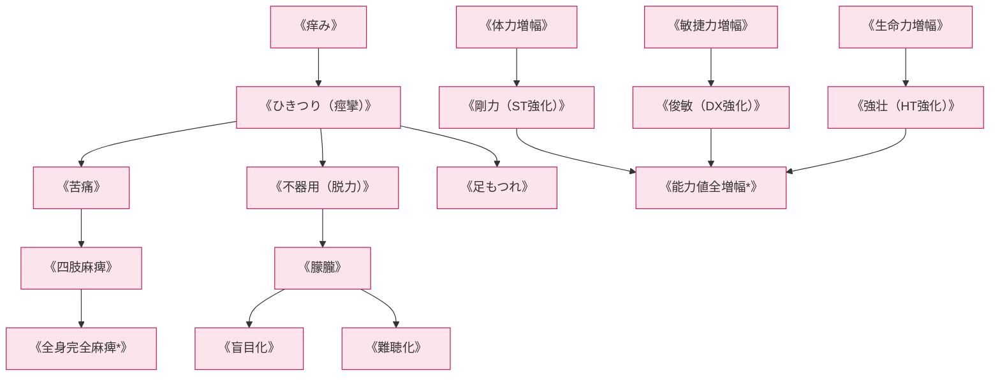

# 肉体操作系呪文 (Body Control Spells)

本ドキュメントは、ガープス第4版『魔法大全』第21章（pp.147-154）および関連拡張サプリメントの公式データを基に、筋骨格系・神経系・生体電位の直接変調、感覚麻痺、身体能力ブースト、および2026年現代におけるPMC強化兵士・新人類（メタヒューマン）適性を体系化した公式魔術アーカイブです。

---

## 1. 肉体操作系魔術の力学

肉体操作系呪文は、マナの「生体組織・神経系への直接作用原則」を最も直接的に体現する魔術体系です。筋肉の収縮率、神経伝達速度、ホルモン分泌、痛覚閾値をマナで直接書き換え、超人的な運動能力の賦与や、敵対者の運動神経・感覚器官の強制麻痺をもたらします。

### 1.1 前提条件ツリー (Prerequisite Tree)

---

## 2. 肉体操作系主要呪文データ一覧

| 呪文名（日 / 英） | クラス | 基本消費 / 維持 | 詠唱時間 | 前提条件 | 効果概要・力学 |
| :--- | :---: | :---: | :---: | :--- | :--- |
| **《ひきつり》** Spasm | 通常/抵 | 2 / 不可 | 1秒 | 《痒み》 | 敵の筋肉を不随意収縮させ、武器や携行品を強制落下。 |
| **《苦痛》** Pain | 通常/抵 | 2 / 不可 | 2秒 | 《ひきつり》 | 痛覚神経に強烈な過電流を流し、大ダメージを受けたのと同等のペナルティ。 |
| **《不器用》** Clumsiness | 通常/抵 | 1〜5 / 半 | 1秒 | 《ひきつり》 | 目標の敏捷力（DX）を一時的に-1〜-5低下させ、銃撃・格闘精度を破壊。 |
| **《足もつれ》** Tanglefoot | 通常/抵 | 2 / 不可 | 1秒 | 《不器用》 | 脚の協調運動を乱し、走行中の敵を即座に転倒させる。 |
| **《四肢麻痺》** Paralyze Limb | 通常/抵 | 3 / 1 | 1秒 | 《苦痛》, 《麻痺》 | 接触した敵の腕や脚の運動神経を遮断し、完全不能化。 |
| **《全身完全麻痺*》** Total Paralysis | 通常/抵 | 5 / 3 | 3秒 | 《四肢麻痺》, 素質2 | 標的の全身随意筋を完全硬直・停止させ、生きた彫像と化す。 |
| **《剛力》** Might | 通常 | 2 (ST+1毎) / 半 | 1秒 | 《体力増幅》 | 術者または味方の筋力を劇的に引き上げ、重火器携行・白兵打撃力を倍加。 |
| **《俊敏》** Grace | 通常 | 2 (DX+1毎) / 半 | 1秒 | 《敏捷力増幅》 | 神経伝達速度を加速し、回避力・射撃命中率を急上昇。 |
| **《強壮》** Vigor | 通常 | 2 (HT+1毎) / 半 | 1秒 | 《生命力増幅》 | 生体免疫力と出血耐久性を極限まで高め、致死傷耐性を獲得。 |
| **《肉体硬化》** Iron Arm / Body of Iron | 通常 | 6 / 3 | 2秒 | 《剛力》, 素質2 | 皮膚と筋肉を高密度繊維化し、防護点（DR+4〜DR+10）を直接獲得。 |

---

## 3. 2026年現代戦術・PMC強化兵士（バイオエンハンス）

### 3.1 壁外PMC（民間軍事会社）の近接強襲部隊運用
奥多摩や富士裾野などのアウトランド前線において、重装甲魔獣（猪型・熊型変異種）の突進を阻止する前衛兵士は、《剛力》《強壮》《肉体硬化》を事前詠唱した状態で12.7mm対物ライフルや超高張力ブレードを振るい、銃撃と白兵のハイブリッド戦法を展開します。

### 3.2 警察の非致死性制圧（ノン・リーサル）
結界都市内部でのテロリストや暴徒制圧において、警察特殊部隊は小銃射撃を控え、《ひきつり》《足もつれ》《四肢麻痺》のパルス投射型呪具を使用して、犯人を無傷で即時拘束・無力化します。
