# 情報伝達系呪文 (Communication and Empathy Spells)

本ドキュメントは、ガープス第4版『魔法大全』第9章（pp.56-60）および公式拡張サプリメント（『Magic: Artillery Spells』『Magic: Death Spells』『Magic: The Least of Spells』『Magic: Plant Spells』等）に準拠した、**全42種**の情報伝達系呪文公式アーカイブです。マナ力学、生体媒介作用、ならびに2026年現代における結界都市防衛・軍事兵器工学・法規制（CR）の運用データを過不足なく完全網羅しています。

---

## 1. 情報伝達系呪文の力学体系

情報伝達系呪文は、マナの指向性周波数を介して対象の物理・生体・霊的パラメータを励起・変調・制御する魔術体系です。
- **生体媒介原則**: マナは術士の生体・神経系・霊体を介して作用し、直接の物質変換や物理エネルギー励起を行います。
- **現代技術インフラとの並行性**: 電子回路や通信網を直接破壊するのではなく、物理的現象（熱、圧力、電磁、物質変形等）を介して現代兵器や都市防護壁と相互作用します。

### 1.1 情報伝達系呪文 前提条件ツリー (Prerequisite Tree)

```mermaid
graph TD
    %% クラススタイル定義（高コントラスト・ダークモード規格）
    classDef spell fill:#0f172a,stroke:#38bdf8,stroke-width:1.5px,color:#ffffff;
    classDef root fill:#0369a1,stroke:#38bdf8,stroke-width:2px,color:#ffffff,font-weight:bold;
    classDef ext fill:#1e293b,stroke:#94a3b8,stroke-width:1px,color:#cbd5e1,stroke-dasharray: 5 5;
    classDef special fill:#4c1d95,stroke:#c084fc,stroke-width:1.5px,color:#ffffff;

    %% 系統内呪文ノード定義
    subgraph Sub_337FE448 ["35種"]
        SenseFoes["《敵感知》<br>(Sense Foes)"]:::root
        SenseLife["《生命感知》<br>(Sense Life)"]:::root
        SenseEmotion["《感情感知》<br>(Sense Emotion)"]:::spell
        HideEmotion["《欲求隠し》<br>(Hide Emotion)"]:::spell
        Persuasion["《説得》<br>(Persuasion)"]:::spell
        Vexation["《不機嫌》<br>(Vexation)"]:::spell
        Sp_7_5D05["《嘘看破》<br>(（旧名：嘘発見）)"]:::spell
        DreamViewing["《夢のぞき》<br>(Dream Viewing)"]:::spell
        DreamSending["《夢送り》<br>(Dream Sending)"]:::spell
        Sp_10_B29E["《夢投影》<br>(（旧名：夢投射）)"]:::spell
        HideThoughts["《感情隠し》<br>(Hide Thoughts)"]:::spell
        LendLanguage["《言語賦与》<br>(Lend Language)"]:::spell
        Sp_13_4597["《言語借用》<br>(（旧名：言語取得）)"]:::spell
        Sp_14_463C["《会話理解*》<br>(（旧名：言語理解）)"]:::spell
        GiftofLetters["《文字理解*》<br>(Gift of Letters)"]:::spell
        Sp_16_4692["《思考察知》<br>(（旧名：読心）)"]:::spell
        MindSearch["《精神探査*》<br>(Mind-Search)"]:::spell
        MindSending["《思考転送》<br>(Mind-Sending)"]:::spell
        Telepathy["《精神感応*》<br>(Telepathy)"]:::spell
        Retrogression["《再現》<br>(Retrogression)"]:::spell
        LendSkill["《技能賦与》<br>(Lend Skill)"]:::spell
        Sp_22_6B5B["《技能借用》<br>(（旧名：技能取得）)"]:::spell
        CompelTruth["《自白》<br>(Compel Truth)"]:::special
        CompelLie["《虚言》<br>(Compel Lie)"]:::spell
        Sp_25_37C2["《関心外》<br>(（旧名：無関心）)"]:::spell
        Presence["《注目》<br>(Presence)"]:::spell
        Sp_27_7025["《映像通信*》<br>(（旧名：精神通信）)"]:::spell
        Message["《伝言》<br>(Message)"]:::spell
        MachineSpeechTL["《機械会話/TL》<br>(Machine Speech/TL)"]:::spell
        Sp_30_7E36["《他者潜望》<br>(（旧名：他者知覚）)"]:::spell
        ControlPerson["《肉体支配》<br>(Control Person)"]:::spell
        Sp_32_68A6["《憑依術*》<br>(（旧名：憑依)"]:::special
        Sp_33_2564["《掌握除去》<br>(（旧名：解呪）)"]:::spell
        PermanentPossession["《完全憑依*》<br>(Permanent Possession)"]:::special
        ExchangeBodies["《肉体交換*》<br>(Exchange Bodies)"]:::spell
    end

    subgraph Sub_260CCBA7 ["MAS / MDS 拡張 1種"]
        PsychicScream["《毒念波まとい*》<br>(Psychic Scream)"]:::special
    end

    subgraph Sub_E032978 ["MAS / MDS 拡張 2種"]
        AccursedTriangle["《三角移魂殺*》<br>(Accursed Triangle)"]:::special
        TelepathicOverload["《過負荷送念*》<br>(Telepathic Overload)"]:::special
    end

    %% 前提条件依存関係エッジ
    SenseFoes --> SenseEmotion
    SenseEmotion --> HideEmotion
    SenseEmotion --> Persuasion
    SenseEmotion --> Vexation
    SenseEmotion --> Sp_7_5D05
    Sp_7_5D05 --> DreamViewing
    Ext_1 --> DreamViewing
    DreamViewing --> DreamSending
    Ext_1 --> DreamSending
    DreamSending --> Sp_10_B29E
    Sp_7_5D05 --> HideThoughts
    HideEmotion --> HideThoughts
    Ext_2 --> LendLanguage
    LendLanguage --> Sp_13_4597
    Sp_13_4597 --> Sp_14_463C
    Sp_13_4597 --> GiftofLetters
    Sp_7_5D05 --> Sp_16_4692
    Sp_13_4597 --> Sp_16_4692
    Sp_16_4692 --> MindSearch
    Sp_16_4692 --> MindSending
    MindSending --> Telepathy
    Ext_3 --> Retrogression
    MindSending --> Retrogression
    MindSending --> LendSkill
    LendSkill --> Sp_22_6B5B
    Sp_7_5D05 --> CompelTruth
    Ext_4 --> CompelLie
    Persuasion --> Sp_25_37C2
    Ext_5 --> Sp_25_37C2
    Persuasion --> Presence
    Ext_6 --> Presence
    Ext_7 --> Sp_27_7025
    Ext_8 --> Sp_27_7025
    Ext_9 --> Sp_27_7025
    Ext_10 --> Sp_27_7025
    Ext_11 --> Message
    Ext_12 --> Message
    Ext_13 --> MachineSpeechTL
    Sp_16_4692 --> Sp_30_7E36
    Sp_30_7E36 --> ControlPerson
    Ext_14 --> ControlPerson
    ControlPerson --> Sp_32_68A6
    Ext_15 --> Sp_32_68A6
    Sp_30_7E36 --> Sp_33_2564
    Ext_16 --> Sp_33_2564
    Ext_16 --> PermanentPossession
    Ext_17 --> ExchangeBodies
    Ext_18 --> ExchangeBodies
    MindSending --> PsychicScream
    Ext_19 --> AccursedTriangle
    Ext_14 --> TelepathicOverload

    %% 外部系統・特殊前提ノード
    Ext_1["【他系統: 《誘眠》】"]:::ext
    Ext_2["【他系統: 《獣語》】"]:::ext
    Ext_3["【他系統: 《精神探査》】"]:::ext
    Ext_4["【他系統: 《感情操作》】"]:::ext
    Ext_5["【他系統: 《人払い》】"]:::ext
    Ext_6["【他系統: 《人寄せ》】"]:::ext
    Ext_7["【他系統: 《魔法の目》】"]:::ext
    Ext_8["【他系統: 《遠耳》】"]:::ext
    Ext_9["【他系統: 《発声》】"]:::ext
    Ext_10["【他系統: 《単純幻覚》】"]:::ext
    Ext_11["【他系統: 《拡声》】"]:::ext
    Ext_12["【他系統: 《方向探知》】"]:::ext
    Ext_13["【他系統: 《機械寄せ》】"]:::ext
    Ext_14["【他系統: 《精神感応》】"]:::ext
    Ext_15["【他系統: 《動物憑依》】"]:::ext
    Ext_16["【他系統: 《憑依術》】"]:::ext
    Ext_17["【他系統: 《完全憑依》】"]:::ext
    Ext_18["【他系統: 《魂の壺》】"]:::ext
    Ext_19["【他系統: 《肉体交換》】"]:::ext
```

---

## 2. ガープス第4版『魔法大全』基本情報伝達系呪文（35種）

| 呪文名（日 / 英） | クラス | 持続時間 | 基本消費 / 維持 | 詠唱時間 | 前提条件 | 効果概要・力学 |
| :--- | :---: | :---: | :---: | :---: | :--- | :--- |
| **《敵感知》** Sense Foes | 情報/範囲 | 一瞬 | 2# | 1秒 | - | 敵対的な意図があるかどうか、その程度はどれくらいかがわかります。1体のキャラクターにかけることもできますし、一定範囲にかけることもできます。範囲にかけた場合、敵対的な意図があることはわかりますが、相手は特定できません。 |
| **《生命感知》** Sense Life | 情報/範囲 | 一瞬 | 1# | 1秒 | - | 効果範囲内に生物がいるかどうか、いたらどんな種類かが（ 成功度 がよければ）わかります。特定の生物を指定して感知することもできます。植物、エルフ、赤毛の女の子、 術者 が知っている人物などという具合に特定できます。 |
| **《感情感知》** Sense Emotion | 通常 | 一瞬 | 2 | 1秒 | 《敵感知》 | その瞬間の 目標 の感情を知ることができます。どんな生き物にもかけることはできますが、知的な生物に対してでなければあまり効果はないでしょう。 目標 の 忠誠度 を知るためにこの 呪文 を使うこともできます（『 ベーシックセット 2巻』492ページ）。 |
| **《欲求隠し》** Hide Emotion | 通常 | 1時間 | 2/2 | 1秒 | 《感情感知》 | _感情を読みとろうとする試み、 目標 の表情や振る舞いは非常に穏やかになります。（ GM の判断次第ではの 呪文 に抵抗します。その他、 目標 の感情を読みとろうとするすべての試み（「 共感 」や 超能力 、〈 仕草読み 〉 技能 ）に対して有効です。この 呪文 は外交官、廷臣、ギャンブラーなど |
| **《説得》** Persuasion | 通常/抵-意志力 | 1分 | 2×ボーナス# | 1秒 | 《感情感知》 | 技能〈説得〉 B219P マンガ技能。 |
| **《不機嫌》** Vexation | 通常/抵-意志力 | 1分 | 2×修正# | 1秒 | 《感情感知》 | _ 意志力 、 反応判定 の際にこの 呪文 を使うと、 目標 （ 知力 6以上の生物1体）の 反応 を悪くします。スパイは、外交交渉を失敗させるために、よくこの 呪文 を使います。 |
| **《嘘看破》** （旧名：嘘発見） Truthsayer | 情報/抵-意志力 | 一瞬 | 2 | 1秒 | 《感情感知》 | 詳細参照 |
| **《夢のぞき》** Dream Viewing | 通常/抵-意志力 | 1時間 | 2/1 | 10秒 | 《嘘看破》ないし《誘眠》 | _ 意志力 、 目標 の見ている夢を覗きます。なめらかな面ならば何にでも映すことができます（例えば水面、 鏡 、宝石の一面など）。 長距離の修正値 との修正を用います（それぞれ14、65ページ）。 術者 と 目標 が互いのことを知らない場合、さらに-2の修正をうけます。 |
| **《夢送り》** Dream Sending | 通常/抵-意志力 | 1時間 | 3 | 1分 | 《夢のぞき》ないし《誘眠》 | _ 意志力 、 術者 は、眠っている 目標 が見ている夢の中に特定のイメージを送ります。メッセージを受け取った側が正しく理解できたかどうかは、 知力 -5または〈 占い師 /夢占い〉（『 ベーシックセット 1巻』491ページ）の 技能 判定を行ないます。 成功度 は、どれだけ正しく理解できたかの指針になりま |
| **《夢投影》** （旧名：夢投射） Dream Projection | 通常 | 1分 | 3/3 | 1分 | 《夢送り》 | 。「投射」は「Projection」の対訳として間違ってはいないが、他性質との傾向を統一するために極力、飛び道具関連の方に回したい。 呪文 術者 は、 目標 の夢に自分のイメージを投影した存在を登場させることができます。 術者 の 呪 |
| **《感情隠し》** Hide Thoughts | 通常 | 10分 | 3/1 | 1秒 | 《嘘看破》ないし《欲求隠し》 | 心を読んだり精神を操作する試みに抵抗できます。 “ 攻撃 側の能力 ” はまずとの 即決勝負 に勝たなくては、 目標 に影響を及ぼせません。抵抗を受け、それを突破したあとに本来の抵抗手段で抵抗されます。この 呪文 はすでに精神操作されている者には効きません。 |
| **《言語賦与》** Lend Language | 通常 | 1分 | 3/1 | 3秒 | 情報伝達系3種ないし、 《獣語》 | 目標 （知的生物にかぎります）は 術者 の 理解レベル か「 なまりがある 」のどちらか低いレベルで、 言語 を覚えます。 術者 はその 言語 を知っていなければなりません。 |
| **《言語借用》** （旧名：言語取得） Borrow Language | 通常 | 1分 | 3/1 | 3秒 | 《言語賦与》 | 言語関連 呪文 言語関連 |
| **《会話理解*》** （旧名：言語理解） Gift of Tongues* | 通常 | 1分 | さまざま | 1秒 | 《言語借用》、「なまりがある」以上で話せる言語3種 | 言語関連 呪文 言語関連 |
| **《文字理解*》** Gift of Letters* | 通常 | 1分 | さまざま | 1秒 | 《言語借用》、「なまりがある」以上で読み書きできる言語3種 | （至難） （至難） 目標 （知的生物にかぎります）は、どんな 言語 でも読み書きできます。 |
| **《思考察知》** （旧名：読心） Mind-Reading | 通常/抵-意志力 | 1分 | 4/2 | 10秒 | 《嘘看破》ないし《言語借用》 | 言語関連 呪文 言語関連 |
| **《精神探査*》** Mind-Search* | 通常/抵-意志力 | 1分 | 6/3 | 1分 | 《思考察知》 | （至難） （至難） _ 意志力 、 目標 の心のなかにはいりこみ、深層心理や 目標 がその瞬間考えていないことまで知ることができます。 術者 は単純な質問（答えが10単語以内でおさまるもの）を1分間に1つ尋ね、 目標 が与えうるかぎりの答えを得ます。 目標 は侵入されたことがわ |
| **《思考転送》** Mind-Sending | 通常 | 1分 | 4/4 | 4秒 | 《思考察知》 | 目標 に一方的に意志を伝えます。伝わる速さは会話と同じですが、 術者 は簡単な映像を送ることもできます（このとき必要な時間は、 目標 が紙に映像を写すのにかかるのと同じです）。 距離修正 を考えるときは、14ページの「 長距離の修正値 」に従ってください。 術者 と 目標 がお互いを知っていなければ、さらに-4の修正がつきます。 |
| **《精神感応*》** Telepathy* | 通常 | 1分 | 4/4# | 4秒 | 《思考転送》 | （至難） （至難） 完全な双方向で意志の疎通をおこないます。とが組み合わさったものと考えてください。 目標 に受け入れる意志がないと、この 呪文 はかかりません。 術者 と 目標 は互いの考えていることを知り、いま経験していることまでわかります。意志の伝わる速 |
| **《再現》** Retrogression | 通常/抵-意志力 | 1秒 | 5 | 10秒 | 《精神探査》、《思考転送》 | _ 意志力 、 目標 がこれまでの人生（および前世！）で経験した出来事を再度体験させます。苦痛としても快楽としても用いることができます。 記憶が異なれば、その効果も異なります。恐ろしい記憶を思い出すと-3の修正で 恐怖判定 が必要になります。例えば「無惨な 死 」の経験はが可能なキャンペーンでは）-5の修正で 恐怖判定 を行ないます |
| **《技能賦与》** Lend Skill | 通常 | 1分 | 3/2 | 3秒 | 《思考転送》、知力11以上 | の出現により、の方がより適した邦訳という意見もある。 呪文 目標 は、ある 技能 を「 能力値 +4」レベルか「自分の 技能レベル +4」のどちらか高いほうで獲得します。ただし 目標 の 技能 が 術者 より高くなることはありません。 術者 は、与えようとしている |
| **《技能借用》** （旧名：技能取得） Borrow Skill | 通常 | 1分 | 4/3 | 3秒 | 《技能賦与》 | 年03月21日(木) 23:04:02 履歴 |
| **《自白》** Compel Truth | 情報/抵-意志力 | 5分 | 4/2 | 1秒 | 素質2、《嘘看破》 | 年06月06日(土) 20:03:32 履歴 |
| **《虚言》** Compel Lie | 通常/抵-意志力 | 5分 | 4/2 | 1秒 | 《感情操作》 | _ 意志力 、 目標 は真実を述べることができません。 目標 は自分が真実だと感じていることを喋ることはできず、強制的に嘘をつかされていることに気付くでしょう。ただし（この 呪文 の効果を受けていることに気付いていれば）黙り込むことはできます。とは対立する 呪文 です。同じ 目標 |
| **《関心外》** （旧名：無関心） Insignificance | 通常/抵-特殊 | 1時間 | 4/4 | 10秒 | 《説得》、《人払い》 | 知覚力抵抗 |
| **《注目》** Presence | 通常/抵-特殊 | 1時間 | 4/4 | 10秒 | 《説得》、《人寄せ》 | _特殊、 目標 が社会的な行動を取ると、周囲の人々の関心を集めます。 目標 を無視しようとする者は、この 呪文 に対して 意志力 で抵抗します――しかし 目標 自身はこの 呪文 に抵抗できません！ この 呪文 は、効果を受けた人々から「 良い 」 反応 が返ってくることを保証するわけではありません―― 反応判定 では、プラスの修正もマイナスの修 |
| **《映像通信*》** （旧名：精神通信） Communication* | 通常 | 1分 | 4/4 | 4秒 | 《魔法の目》、《遠耳》、《発声》、《単純幻覚》 | 。テレパシーではなく、画像を表示してのリモート会議的なもの。近くの者に情報が洩れる可能性あり。 呪文（至難） （至難） 術者 と 目標 は双方向で通信できるようになります。各参加者は他の参加者の映像を見て、「リアルタイム」の会話を可能にします。 長距離の修正値 （14ペー |
| **《伝言》** Message | 通常/抵-呪文 | さまざま | 1/15秒毎 | さまざま | 《拡声》、《方向探知》 | _音を遮る 呪文 、 術者 から 目標 に口頭の伝言を届けます。 長距離の修正値 を使ってください。 術者 が 目標 のことを知らないなら、-2の修正がかかります。 目標 がどこにいるかわからないなら、-5の修正がかかります（に成功すればこの修正を打ち消します）。これらのペナルティは累積します。に |
| **《機械会話/TL》** Machine Speech/TL | 通常 | 1分 | 5/3 | 1秒 | 《機械寄せ》 | .40 、 あらゆる種類の 機械 （ 知力 は問いません）、とその 機械 自身の“ 言語 ”を使って意思疎通ができます。音声によらない 言語 の場合、 術者 は 機械 のインターフェイス・ポート（接続端子）かアンテナに物理的に接触しつづけねばなりません。交換さ |
| **《他者潜望》** （旧名：他者知覚） Soul Rider | 通常/抵-意志力 | 1分 | 5/2 | 3秒 | 《思考察知》 | 呪文 _ 意志力 、 術者 が 集中 すると、 目標 の 目 や耳などを通してものを感じることができます（ 術者 自身の感覚も普段と同じように働きます。肉体も普通に行動できます）。 目標 の体を操ったり、心理をさぐることはできません。 目標 は知的な生 |
| **《肉体支配》** Control Person | 通常/抵-意志力 | 1分 | 6/3 | 10秒 | 《他者潜望》ないし《精神感応》 | _ 意志力 、 目標 のすべての感覚を自由に使い、行動を操ることができます（記憶、 技能 、 呪文 などは使えません）。 目標 は記憶と理性を 維持 しており、なにが起こっているか意識しています――ただし術をかけているのが何者かはわかりません。 術者 が1度に “ 操れる ” 肉体は1つだけです。 術者 が |
| **《憑依術*》** （旧名：憑依*） Possession* | 通常/抵-意志力 | 1分 | 10/4 | 1分 | 素質1、《肉体支配》ないし《動物憑依》 | 旧名は 「 憑依 」。 |
| **《掌握除去》** （旧名：解呪） Dispel Possession | 通常/抵-呪文 | 一瞬 | 10 | 10秒 | 《他者潜望》ないし《憑依術》# | 。「Possession」は「 憑依 」と和訳され、としたいところだが、「Possession」には「支配・所有・掌握」という意味もある。 も解除することから、という呪文名に修正した。 呪文 _ 目標 の 呪文 、 浄 |
| **《完全憑依*》** Permanent Possession* | 通常/抵-意志力 | 不定 | 30 | 5分 | 素質3、《憑依術》 | （至難） （至難） _ 意志力 、 とほぼ同じです――ただし、 術者 が自分で憑依をやめるか、かで追い払われるまで、 目標 の肉体にとどまることができます。 呪文 が効果を発揮して |
| **《肉体交換*》** Exchange Bodies* | 通常/抵-意志力 | 永久 | 120 | 1時間 | 《完全憑依》、《魂の壺》 | 詳細参照 |

---

## 3. 魔導兵器・砲兵戦術拡張呪文（MAS / MDS 拡張 1種）

| 呪文名（日 / 英） | クラス | 持続時間 | 基本消費 / 維持 | 詠唱時間 | 前提条件 | 効果概要・力学 |
| :--- | :---: | :---: | :---: | :---: | :--- | :--- |
| **《毒念波まとい*》** Psychic Scream* | 通常 | 10秒 | 3/半径1ｍ毎・同 | 1秒/半径1ｍ毎 | 素質4、《思考転送》含む情報伝達系呪文10種 | （至難）（Psychic Scream (VH)） p.12 （至難） 術者 （対象でもある必要がある）は、不可視の超能力パルスを発射し、近くにいる精神持つ存在にダメージを与えます。 エネルギー 消費に応じて範囲を脅かしますが、これは ではありません。効果は 術者 自身に作用し、 術 |

---

## 4. 魔導兵器・砲兵戦術拡張呪文（MAS / MDS 拡張 2種）

| 呪文名（日 / 英） | クラス | 持続時間 | 基本消費 / 維持 | 詠唱時間 | 前提条件 | 効果概要・力学 |
| :--- | :---: | :---: | :---: | :---: | :--- | :--- |
| **《三角移魂殺*》** Accursed Triangle * | 通常/抵-意志力 | 一瞬 | 13 | 10秒 | 素質3、《肉体交換》 | ）の殺人的応用ですが、の対象にはなりません。 （至難）（Accursed Triangle (VH)） p.11 （至難） 抵抗判定 ＿ 意志力 この呪いは、 “ 魂 ” を持つものなら、すべてが影響の対象です( GM の決定)。 術者 は対象と肉体を入れ替え、 術者 の |
| **《過負荷送念*》** Telepathic Overload * | 通常/抵-生命力か意志力 | 一瞬 | 7+2/1d毎 | 4秒 | 素質3、および《精神感応》を含む情報伝達系呪文10種 | （至難）（Telepathic Overload (VH)） p.11 （至難） 抵抗判定 ＿ 生命力 または 意志力 この 呪文 は最も原始的な脳でさえも対象とし、直接的かつ致命的な過負 |

---

## 5. 魔導兵器・砲兵戦術拡張呪文（MAS / MDS 拡張 4種）

| 呪文名（日 / 英） | クラス | 持続時間 | 基本消費 / 維持 | 詠唱時間 | 前提条件 | 効果概要・力学 |
| :--- | :---: | :---: | :---: | :---: | :--- | :--- |
| **《緊急開示》（並）** （Ack (A)） | 防御 | 一瞬 | 1 | なし | -（簡単呪文なので） | （並）（Ack (A)） p.7 （並） この は 攻撃 をブロックしません。しかし、 魔法 のメッセージに応答して、即時に身元の証明を送信します。チャネルは一方向（、、またはなど）または双方向（やなど）です。他の術者に、メッセージが受 |
| **《感情偽装》（並）** （Drama (A)） | 通常 | 1分 | 2・同 | 1秒 | -（簡単呪文なので） | （並）（Drama (A)） p.7 （並） 術者は怒り、絶望、恐怖、憎しみ、喜び、愛など、1 つの強い感情を偽装します。〈 演技 〉 技能 と同様ですが、嘘、模倣、なりすましには役に立ちません。一方、〈 仕草読み 〉や〈 嘘発見 〉などの 技能 はを貫通できません。を |
| **《身ぶり補強》（並）** （Sorcerous Signal (A)） | 通常 | 不定# | 1 | 3秒 | -（簡単呪文なので） | （並）（Sorcerous Signal (A)） p.8 （並） 対象は、〈 身ぶり 〉の使用1回につき、「 文化適応 」の欠如による-3修正を無視します。〈 身ぶり 〉が成功した場合、〈 身ぶり 〉を認識できる 知力 6以上の存在は誰でもその意味を理解します。なお、この 呪文 で〈 身ぶり 〉 技能 が付与される |
| **《水中会話術》（並）** （Mer-Speech (A)） | 通常 | 1分 | 2・1 | 2秒 | -（簡単呪文なので） | （並）（Mer-Speech (A)） p.17 （並） 対象は一時的に 有利な特徴 「 水中会話 」を得ます。 |

---

## 6. 2026年現代戦術・都市防衛・法規制（CR）における運用

### 6.1 警察・自衛隊・PMCにおける実戦配備
結界都市（セーフゾーン）警備および壁外アウトランドへの遠征作戦において、情報伝達系呪文は索敵・突入支援・防壁維持・目標無力化の標準プロトコルとして統合運用されています。特に部隊随伴術士による即時展開は、通常兵器との複合火力（コンバインド・アームズ）として極めて高い戦闘効率を発揮します。

### 6.2 メガコーポ支配と特許利権
ヤマト重工、テイコク製薬、サエデル・シュティフトゥング、アレス等のメガコーポは、情報伝達系呪文の工業・医療・防衛利用に関する独占特許を保有しており、民間術士に対するライセンス管理や魔導触媒・霊薬の市場流通を掌握しています。

### 6.3 国際魔導協定（IMA）および法規制（CR）
破壊力・精神汚染・非人道性の高い高位呪文は、国家公安委員会および国際魔導協定により**規制等級CR3〜CR4（要特別国家許可・戦時国際法規制）**に指定されており、無認可での行使・研究は厳罰に処されます。