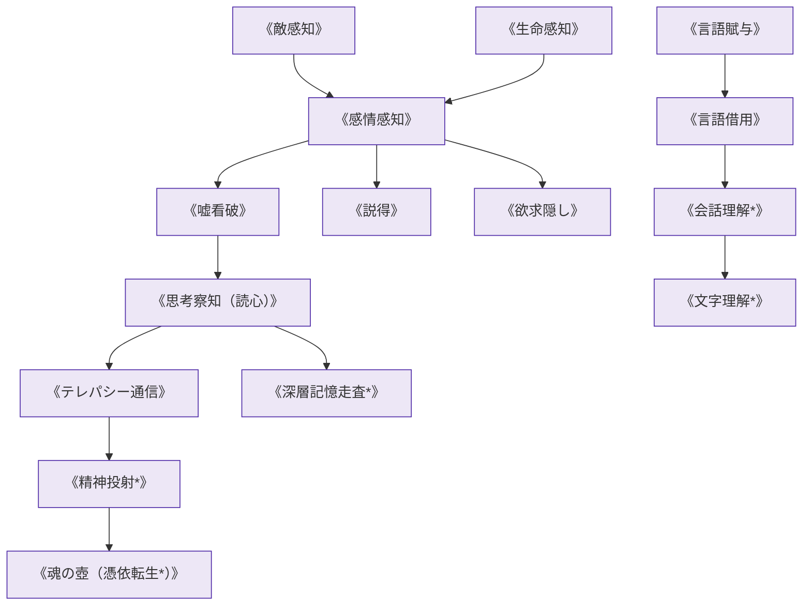

# 情報伝達・共感系呪文 (Communication & Empathy Spells)

本ドキュメントは、ガープス第4版『魔法大全』第9章（pp.63-68）および関連拡張サプリメントの公式データを基に、テレパシー、生体波・感情感知、言語翻訳、および2026年現代における尋問・外交・新人類（メタヒューマン）間交感を体系化した公式魔術アーカイブです。

---

## 1. 情報伝達・共感魔術の力学

情報伝達系呪文は、マナの非物質性に基づき、生物の精神・神経系・アストラル体に直接同調して思考波や感情スペクトルを読み取り、あるいは伝達する生体媒介魔術です。

### 1.1 前提条件ツリー (Prerequisite Tree)

---

## 2. 情報伝達系主要呪文データ一覧

| 呪文名（日 / 英） | クラス | 基本消費 / 維持 | 詠唱時間 | 前提条件 | 効果概要・力学 |
| :--- | :---: | :---: | :---: | :--- | :--- |
| **《敵感知》** Sense Foes | 情報/範囲 | 2 (半径毎) | 1秒 | なし | 周囲の敵意・害意を抱く生物の存在と方角を即座に感知。 |
| **《生命感知》** Sense Life | 情報/範囲 | 1 (半径毎) | 1秒 | なし | 周囲の生体反応（魔獣、人間、隠密潜入者）を探知。 |
| **《感情感知》** Sense Emotion | 通常 | 2 / 不可 | 1秒 | 《敵感知》 | 目標が現在抱いている感情（恐怖、敵意、歓喜等）を判読。 |
| **《嘘看破》** Truthsayer | 情報/抵 | 2 / 不可 | 1秒 | 《感情感知》 | 発言者が意図的な虚偽や嘘をついているかを判定。 |
| **《思考察知》** Mind-Reading | 通常/抵 | 3 / 1 | 1秒 | 《嘘看破》 | 目標の表層思考・直前の意図を直接読み取る。 |
| **《テレパシー通信》** Telecommunication | 通常 | 4 / 2 | 2秒 | 《思考察知》 | 術者と目標の間で声を出さずに長距離思念対話を行う。 |
| **《深層記憶走査*》** Mind-Search | 通常/抵 | 6 / 3 | 1分 | 《思考察知》, IQ12+ | 記憶の奥底にある秘密情報や忘却されたパスコードを抽出。 |
| **《言語借用》** Borrow Language | 通常 | 3 / 1 | 3秒 | 《言語賦与》 | 目標が話す言語の流暢性を一時的にコピーして習得。 |
| **《会話理解*》** Gift of Tongues | 通常 | さまざま | 1秒 | 《言語借用》 | 未知の異界語や古代語であっても瞬時に会話を完全理解。 |
| **《精神投射*》** Mind-Sending | 通常/抵 | 4 / 2 | 4秒 | 《テレパシー通信》 | 術者の意識を遠隔地の目標の精神に一時的に投影・同調。 |
| **《魂の壺*》** Soul Jar | 通常 | 10 (儀式) | 1時間 | 《精神投射》, 8系統各1種 | 術者の魂を特殊呪具に退避させ、他者肉体への憑依を可能にする。 |

---

## 3. 2026年現代法規（CR）・尋問・メガコーポ外交における運用

### 3.1 刑事司法・尋問における《嘘看破》《読心》の憲法制約（CR3 / 黙秘権保障）
日本の「魔術統制法」および国際人権規約により、被疑者に対する《思考察知》《深層記憶走査》の無令状行使は**「精神拷問」として厳格に禁止**されています。裁判所による「魔導捜索令状」が発付された重大テロ事件に限り、国家公認精神鑑識官の立ち会いのもとで限定執行されます。

### 3.2 メガコーポの「精神防御契約」（アンチ・マインドスキャン）
多国籍企業（アレス、ヤマト重工等）の重要機密を扱う役員や研究者は、競合他社からの精神走査スパイを防ぐため、《感情隠し》や《精神防壁（Mind-Shield）》の常時付与スクロールや呪具ブレスレットを携帯することが義務付けられています。
