# 地霊系呪文 (Earth Spells)

本ドキュメントは、ガープス第4版『魔法大全』第17章（pp.104-109）および公式拡張サプリメント（『Magic: Artillery Spells』『Magic: Death Spells』『Magic: The Least of Spells』『Magic: Plant Spells』等）に準拠した、**全40種**の地霊系呪文公式アーカイブです。マナ力学、生体媒介作用、ならびに2026年現代における結界都市防衛・軍事兵器工学・法規制（CR）の運用データを過不足なく完全網羅しています。

---

## 1. 地霊系呪文の力学体系

地霊系呪文は、マナの指向性周波数を介して対象の物理・生体・霊的パラメータを励起・変調・制御する魔術体系です。
- **生体媒介原則**: マナは術士の生体・神経系・霊体を介して作用し、直接の物質変換や物理エネルギー励起を行います。
- **現代技術インフラとの並行性**: 電子回路や通信網を直接破壊するのではなく、物理的現象（熱、圧力、電磁、物質変形等）を介して現代兵器や都市防護壁と相互作用します。

### 1.1 地霊系呪文 前提条件ツリー (Prerequisite Tree)

```mermaid
graph TD
    %% クラススタイル定義（高コントラスト・ダークモード規格）
    classDef spell fill:#0f172a,stroke:#38bdf8,stroke-width:1.5px,color:#ffffff;
    classDef root fill:#0369a1,stroke:#38bdf8,stroke-width:2px,color:#ffffff,font-weight:bold;
    classDef ext fill:#1e293b,stroke:#94a3b8,stroke-width:1px,color:#cbd5e1,stroke-dasharray: 5 5;
    classDef special fill:#4c1d95,stroke:#c084fc,stroke-width:1.5px,color:#ffffff;

    %% 系統内呪文ノード定義
    subgraph Sub_571DEE24 ["31種"]
        SeekEarth["《鉱物探知》<br>(Seek Earth)"]:::root
        ShapeEarth["《土変化》<br>(Shape Earth)"]:::spell
        SeekPass["《道探知》<br>(Seek Pass)"]:::spell
        EarthVision["《地中視覚》<br>(Earth Vision)"]:::spell
        EarthtoStone["《土を石》<br>(Earth to Stone)"]:::special
        CreateEarth["《土作成》<br>(Create Earth)"]:::spell
        EarthtoAir["《土を空気》<br>(Earth to Air)"]:::spell
        FleshtoStone["《肉を石》<br>(Flesh to Stone)"]:::spell
        StonetoEarth["《石を土》<br>(Stone to Earth)"]:::spell
        PredictEarthMovement["《地滑り予知》<br>(Predict Earth Movement)"]:::spell
        SandJet["《砂噴射》<br>(Sand Jet)"]:::spell
        MudJet["《泥噴射》<br>(Mud Jet)"]:::spell
        StoneMissile["《石弾》<br>(Stone Missile)"]:::spell
        WalkThroughEarth["《地中歩行》<br>(Walk Through Earth)"]:::spell
        EarthtoWater["《土を水》<br>(Earth to Water)"]:::special
        PartialPetrifaction["《部位石化*》<br>(Partial Petrifaction)"]:::special
        RainofStones["《石の雨》<br>(Rain of Stones)"]:::special
        Entombment["《埋葬》<br>(Entombment)"]:::special
        Sp_19_579B["《真なる土》<br>(（旧名：聖土）)"]:::spell
        StonetoFlesh["《石を肉》<br>(Stone to Flesh)"]:::special
        BodyofStone["《肉体石化*》<br>(Body of Stone)"]:::spell
        Steelwraith["《金属透過》<br>(Steelwraith)"]:::special
        PurifyEarth["《土浄化》<br>(Purify Earth)"]:::spell
        Sandstorm["《砂嵐》<br>(Sandstorm)"]:::spell
        Earthquake["《地震》<br>(Earthquake)"]:::special
        Volcano["《火山》<br>(Volcano)"]:::spell
        AlterTerrain["《地形変化*》<br>(Alter Terrain)"]:::special
        MoveTerrain["《地形移動*》<br>(Move Terrain)"]:::spell
        SummonEarthElemental["《地霊召喚精霊召喚/地霊》<br>(Summon Earth Elemental)"]:::special
        ControlEarthElemental["《地霊支配精霊支配/地霊》<br>(Control Earth Elemental)"]:::spell
        CreateEarthElemental["《地霊作成精霊作成/地霊》<br>(Create Earth Elemental)"]:::special
    end

    subgraph Sub_6B5BB4DD ["MAS / MDS 拡張 3種"]
        BoulderBarrage["《落石弾幕*》<br>(Boulder Barrage)"]:::special
        SandBlast["《円錐噴砂*》<br>(Sand Blast)"]:::special
        SeismicShock["《跳ね上げ地霊*》<br>(Seismic Shock)"]:::special
    end

    subgraph Sub_E032978 ["MAS / MDS 拡張 2種"]
        DusttoDust["《塵は塵に*》<br>(Dust to Dust)"]:::special
        HeartofStone["《心臓石化*》<br>(Heart of Stone)"]:::special
    end

    %% 前提条件依存関係エッジ
    SeekEarth --> ShapeEarth
    SeekEarth --> SeekPass
    ShapeEarth --> EarthVision
    ShapeEarth --> EarthtoStone
    EarthtoStone --> CreateEarth
    Ext_1 --> EarthtoAir
    ShapeEarth --> EarthtoAir
    EarthtoStone --> FleshtoStone
    EarthtoStone --> StonetoEarth
    Req_2 --> PredictEarthMovement
    CreateEarth --> SandJet
    SandJet --> MudJet
    Ext_3 --> MudJet
    CreateEarth --> StoneMissile
    Req_2 --> WalkThroughEarth
    Ext_3 --> EarthtoWater
    ShapeEarth --> EarthtoWater
    FleshtoStone --> PartialPetrifaction
    CreateEarth --> RainofStones
    Req_4 --> Entombment
    Req_5 --> Sp_19_579B
    StonetoEarth --> StonetoFlesh
    FleshtoStone --> StonetoFlesh
    StonetoFlesh --> BodyofStone
    WalkThroughEarth --> Steelwraith
    CreateEarth --> PurifyEarth
    Ext_6 --> PurifyEarth
    Ext_7 --> Sandstorm
    CreateEarth --> Sandstorm
    EarthVision --> Earthquake
    Earthquake --> Volcano
    Req_8 --> AlterTerrain
    Ext_9 --> MoveTerrain
    Ext_10 --> MoveTerrain
    Ext_11 --> SummonEarthElemental
    Ext_12 --> ControlEarthElemental
    Ext_13 --> CreateEarthElemental
    RainofStones --> BoulderBarrage
    StoneMissile --> BoulderBarrage
    SandJet --> SandBlast
    Sandstorm --> SandBlast
    Earthquake --> SeismicShock
    EarthtoAir --> DusttoDust
    FleshtoStone --> DusttoDust
    Ext_14 --> HeartofStone

    %% 外部系統・特殊前提ノード
    Ext_1["【他系統: 《空気作成》】"]:::ext
    Req_2["【前提: 地霊系4種】"]:::ext
    Ext_3["【他系統: 《水作成》】"]:::ext
    Req_4["【前提: 素質2、地霊系5種】"]:::ext
    Req_5["【前提: 地霊系6種】"]:::ext
    Ext_6["【他系統: 《植物繁茂》】"]:::ext
    Ext_7["【他系統: 《風嵐》】"]:::ext
    Req_8["【前提: 素質3、四大精霊系呪文それぞれから形状変化系呪文1...】"]:::ext
    Ext_9["【他系統: 《地形変化》】"]:::ext
    Ext_10["【他系統: 《物体消失》】"]:::ext
    Ext_11["【他系統: 《精霊召喚》】"]:::ext
    Ext_12["【他系統: 《地霊召喚》】"]:::ext
    Ext_13["【他系統: 《地霊支配》】"]:::ext
    Ext_14["【他系統: 《部位石化》】"]:::ext
```

---

## 2. ガープス第4版『魔法大全』基本地霊系呪文（31種）

| 呪文名（日 / 英） | クラス | 持続時間 | 基本消費 / 維持 | 詠唱時間 | 前提条件 | 効果概要・力学 |
| :--- | :---: | :---: | :---: | :---: | :--- | :--- |
| **《鉱物探知》** Seek Earth | 情報 | 一瞬 | 3 | 10秒 | - | もっとも近くにある土、金属、石の方向とおよその距離がわかります。探知できる土や金属は一種類で、かなりの量がなければなりません。 長距離の修正値 （14ページ）を用います。 術者 はすでに知っている土や金属をあらかじめ省いたうえで 呪文 をかけることができます。 |
| **《土変化》** Shape Earth | 通常 | 1分 | 1/1立方m毎/半 | 1秒 | 《鉱物探知》 | 土を動かし、好きな形にします。安定な形（たとえば丘状）にすれば、そのまま残ります。不安定な形（たとえば柱や壁）なら、 呪文 が続くかぎりはそのままですが―― 集中 は必要ありません―― 呪文 が消えると崩れてしまいます。安定な形を作るには、〈 建築 〉 技能 の判定が必要になるかもしれません。 この 呪文 では、毎 ターン 移動力 2の速さで |
| **《道探知》** Seek Pass | 情報 | 一瞬 | 3 | 10秒 | 《鉱物探知》 | 最も近い山道の方向と、およその距離がわかります。 長距離の修正値 （14ページ）を使ってください。 |
| **《地中視覚》** Earth Vision | 通常 | 30秒 | 2/10ｍ毎# | 1秒 | 《土変化》 | 土を見通し、洞窟、鉱脈、埋められた宝物、埋葬された死体などを見つけることができます。見通せるのは、土や加工されていない石（厚さ50メートルまで）だけです。金属、加工された石、レンガなどは見通せません。つまり、城壁を見通すことはできません。 |
| **《土を石》** Earth to Stone | 通常 | 永久 | 3/1立方m毎# | 1秒 | 素質1、《土変化》 | 土や粘土でできた物を固い石（宝石ではありません）に、あるいは 石 でできた物を 青銅 や 鉄 といった単純な金属に変えます。2倍の エネルギー を消費すれば、土や粘土でできた物を金属に変えます。 GM はプレイヤーが大量のお金や資源を産みださないよう配慮するべきでしょう。一般的な対処は、そのような経済的・軍事的に有用な金属は生み出せないようにする |
| **《土作成》** Create Earth | 通常 | 永久 | 2/1立方m毎 | 1秒 | 《土を石》 | 土のなかった場所に、どっしりとした土を作りだします。土は、地面に触れるように作らねばなりません――空中に浮かべたり、海を漂わせたりすることはできません！ |
| **《土を空気》** Earth to Air | 通常 | 永久 | 1/1立方m毎# | 2秒 | 《空気作成》、《土変化》 | 土や石を空気に変えます。地底に閉じこめられたときには、役に立つでしょう。 術者 が エネルギー を多く費やすほど、空気に変わる土の量が増えます。しかし、最大量は最少量の4倍以下に制限されます。 |
| **《肉を石》** Flesh to Stone | 通常/抵-生命力 | 一瞬 | 10# | 2秒 | 《土を石》 | _ 生命力 、 生き物を（持ち物もいっしょに！）石に変えます。 目標 全体に効果を及ぼします。 |
| **《石を土》** Stone to Earth | 通常 | 永久 | 6/1立方m毎 | 1秒 | 《土を石》か地霊系4種 | 石でできた物（宝石も含みます）を土に変えます。品物の一部でなく、全体にかけねばなりません。金属を石に変えたり、 エネルギー を2倍消費することで金属を土に変えることもできます。 |
| **《地滑り予知》** Predict Earth Movement | 情報 | 一瞬 | 2/1日毎# | さまざま | 地霊系4種 | 特定の場所で特定の時期に起こる可能性のある地滑り、地震、火山活動を正確に予知します。差し迫った災害の性質、場所、大きさについておおよその情報を得られます。 魔法 によって引き起こされる地震や噴火は予知できません。 |
| **《砂噴射》** Sand Jet | 通常 | 1秒 | 1〜3/同 | 1秒 | 《土作成》 | 詳細参照 |
| **《泥噴射》** Mud Jet | 通常 | 1秒 | 1〜3 | 1秒 | 《砂噴射》、《水作成》 | 年03月29日(金) 20:37:06 履歴 |
| **《石弾》** Stone Missile | 射撃 | 一瞬 | 1〜素質 | 1〜3秒 | 《土作成》 | 石弾を作り、手から飛ばします。石弾は、 半致傷距離 40、 最大射程 80、 正確さ +2です。 |
| **《地中歩行》** Walk Through Earth | 通常 | 10秒 | 3/3# | 1秒 | 地霊系4種 | 年03月29日(金) 20:38:38 履歴 |
| **《土を水》** Earth to Water | 通常 | 永久 | 1/1立方m毎# | 1秒 | 素質1、《水作成》、《土変化》 | 土を泥（あるいは水）に変えます。敵や追跡者の身動きを取れなくする、虫さされを治療するための泥を作る、泥人形や囮をつくるために土を柔らかくする......など、さまざまな使い道があります。 |
| **《部位石化*》** Partial Petrifaction* | 通常/抵-生命力 | 永久 | 12 | 3秒 | 素質2、《肉を石》 | （至難） （至難） _ 生命力 、 生きている 目標 の一部分だけを石に変えます。動けないようにして話をさせたり、拷問したりするのが普通です。 術者 は 目標 に触れねばなりません。身体のどの 部位 を石化させるかは 術者 が選択します |
| **《石の雨》** Rain of Stones | 範囲 | 1分 | 1/同# | 1秒 | 素質2、《土作成》 | 効果範囲に空から石の雨を降らせ、範囲内にいるものに毎 ターン 1D-1の 叩き ダメージを与えます。範囲内にいるキャラクターや生き物は、その本人の ターン にダメージを受けます。効果範囲にいたのが1 ターン 未満なら、ダメージは半分になります（端数切り捨て）。 この 呪文 は屋外でなければ使えません。 鎧 は通常通りダメージを減少させます。 防 |
| **《埋葬》** Entombment | 通常/抵-生命力 | 永久 | 10# | 3秒 | 素質2、地霊系5種 | 年03月29日(金) 20:40:21 履歴 |
| **《真なる土》** （旧名：聖土） Essential Earth | 通常 | 永久 | 8 | 30秒 | 地霊系6種 | 年03月29日(金) 20:40:56 履歴 |
| **《石を肉》** Stone to Flesh | 通常 | 一瞬 | 10 | 5秒 | 素質2、《石を土》、《肉を石》 | の効果を逆転させ、石にされた犠牲者を元に戻すことができます（ 朦朧 状態で戻ります）。この 呪文 で、元々生命のない彫像を動かすことはできません。 |
| **《肉体石化*》** Body of Stone* | 通常/抵-生命力 | 1分 | 10/5 | 5秒 | 《石を肉》 | （至難） （至難） _ 生命力 、 目標 は生きながらにして石の彫像と化し、一時的に「 石の体 」の 共通性質 を得ます。衣服も石に変わりますが、持っている 装備 は変化しません。 |
| **《金属透過》** Steelwraith | 通常/抵-生命力 | 1分 | 7/4 | 2秒 | 素質2、《地中歩行》 | _ 生命力 、 目標 は金属を触ってもすり抜けるようになります。剣は身体を通り抜け、金属の鍵を持つことも、 金属鎧 を着ることもできなくなります。金属製の棒や床もすり抜けてしまいます......。 |
| **《土浄化》** Purify Earth | 範囲 | 永久 | 2# | 30秒 | 《土作成》、《植物繁茂》 | 浄化・土から不純物、 毒 、有害な物質を取り除き、植物の成長に適した土に変えます。土に欠けている成分をこの 呪文 で補うこともできます。土中にある小さな異物（コイン、釘）は破壊され、中型の異物（剣、砲弾、宝箱、胸像）は地面に “ 浮き上がって ” きます。大きな物体（棺、壁、大きな影像）があると、この 呪文 は失 |
| **《砂嵐》** Sandstorm | 範囲 | 1分# | 3/半 | 一瞬# | 《風嵐》、《土作成》 | この 呪文 は っぽいが、 ではない。 |
| **《地震》** Earthquake | 範囲 | 1分 | 2/同 | 30秒 | 素質2、《地中視覚》含む地霊系6種 | 効果範囲に揺れを起こします。 術者 は、自分を含む範囲にはまずかけないでしょう。 術者 と効果範囲の端までの距離を20で割ってから、 技能 修正を求めます。 この 呪文 を効果的に使うには、かなり広い範囲にかけねばならないでしょう。建物の一角を揺らすだけでは、住人を転ばせることはできても、建物を破壊することはできません。 |
| **《火山》** Volcano | 通常 | 1日 | 15/10 | 1時間# | 《地震》、火霊系6種 | 地面の指定した場所から、蒸気と溶岩を噴きださせます。即座に効果はありませんが、危険をはらんだ 呪文 です！ 火山ははじめは小さく――石や蒸気を吐き出す小さな穴があるだけです――1日ごとに直径が2メートルずつ広がっていきます。この 呪文 で、休火山の活動を再開させることもできます。 呪文 の効果が切れると、火山は成長をやめ、ほどなく活動も停止します（休火山の場合は |
| **《地形変化*》** Alter Terrain* | 範囲 | 2d日 | 1# | 10秒 | 素質3、四大精霊系呪文それぞれから形状変化系呪文1種計4種 | （至難） （至難） 広大な範囲の地形を完全に変更することができます。もし非常に大きな範囲にこの 呪文 を唱えることができれば、都市を湖に変えたり、小島を山地に変更することができます。 効果範囲の地面（海底、湖底、川底を含めて）は、 術者 が選んだように盛りあげ、窪ませ、形を変え、あるい |
| **《地形移動*》** Move Terrain* | 範囲/抵-特殊 | 1時間 | 10/8 | 1分 | 《地形変化》、《物体消失》 | （至難） （至難） _特殊、 目標 は範囲内にある地形全体を、その上にある建物、 動物 、植物、人々をすべて含めて、遠く離れた場所へ移動させることができます。この 呪文 が唱えられたら、対象となった地形は“消滅”して、何もない地面（湖や海なら開けた水地）になります。 |
| **《地霊召喚精霊召喚/地霊》** Summon Earth Elemental | 特殊 | 1時間 | 4# | 30秒 | 素質1、地霊系8種あるいは「地霊系4種と他の《精霊召喚》1種」 | 年03月29日(金) 20:48:02 履歴 |
| **《地霊支配精霊支配/地霊》** Control Earth Elemental | 特殊 | 1分 | 特殊 | 2秒 | 《地霊召喚》 | 詳細参照 |
| **《地霊作成精霊作成/地霊》** Create Earth Elemental | 特殊 | 永久 | 特殊 | 特殊 | 素質2、《地霊支配》 | 詳細参照 |

---

## 3. 魔導兵器・砲兵戦術拡張呪文（MAS / MDS 拡張 3種）

| 呪文名（日 / 英） | クラス | 持続時間 | 基本消費 / 維持 | 詠唱時間 | 前提条件 | 効果概要・力学 |
| :--- | :---: | :---: | :---: | :---: | :--- | :--- |
| **《落石弾幕*》** Boulder Barrage* | 範囲 | 一瞬 | 2〜6 | 1秒/基本消費2点毎 | 素質4、《石の雨》と《石弾》含む地霊系呪文10種 | （至難）（Boulder Barrage (VH)） p.12 （至難） 大量のを範囲上に召喚し、高密度の雨のように降らせます。対象全員（物質破壊が重要な場合は物体も）は、実質 技能レベル 12で1回攻撃を受けます。この攻撃は 目標 の サイズ修正 値のみで調整されます。成功は1発の命中に |
| **《円錐噴砂*》** Sand Blast* | 通常 | 一瞬 | 2〜6×終端幅1ｍ毎 | 1秒/威力1d毎 | 素質4、《砂噴射》、《砂嵐》 | （至難）（Sand Blast (VH)） p.12 （至難） 術者 の片手から射程10ｍの 円錐状 の高速砂粒を発射し、 広範囲の負傷 を与えます。最大範囲は 呪文 に投入された |
| **《跳ね上げ地霊*》** Seismic Shock* | 範囲 | 一瞬 | 8 | 1秒 | 素質4、《地震》含む地霊系呪文10種 | magic_artillery_spells 姿勢関連 |

---

## 4. 魔導兵器・砲兵戦術拡張呪文（MAS / MDS 拡張 2種）

| 呪文名（日 / 英） | クラス | 持続時間 | 基本消費 / 維持 | 詠唱時間 | 前提条件 | 効果概要・力学 |
| :--- | :---: | :---: | :---: | :---: | :--- | :--- |
| **《塵は塵に*》** Dust to Dust * | 通常/抵-生命力 | 一瞬 | 13 | 4秒 | 素質3、《土を空気》、《肉を石》 | とかの方が良かったかもしれません。 （至難）（Dust to Dust (VH)） p.11 （至難） _ 生命力 生きている対象とその 装備 すべてを、元の形態に再構成される見込みのない微細な塵に変えます。これは機能的には、とを連続して発動 |
| **《心臓石化*》** Heart of Stone * | 通常/抵-生命力 | 一瞬 | 13 | 3秒 | 素質3、および《部位石化》 | の対象になるため、同様、 と見なします。 （至難）（Heart of Stone (VH)） pp.11-12 （至難） _ 生命力 この恐ろしいの変種は、対象の心臓を胸の中の岩の塊に変えます。被害者が抵抗に失敗すると、 |

---

## 5. 魔導兵器・砲兵戦術拡張呪文（MAS / MDS 拡張 4種）

| 呪文名（日 / 英） | クラス | 持続時間 | 基本消費 / 維持 | 詠唱時間 | 前提条件 | 効果概要・力学 |
| :--- | :---: | :---: | :---: | :---: | :--- | :--- |
| **《土掘る手》（並）** （Badger Paws (A)） | 通常 | 1時間 | 2・同 | 2秒 | -（簡単呪文なので） | 年09月02日(月) 20:26:12 履歴 |
| **《石像の肌》（並）** （Gargoyle Skin (A)） | 通常/抵-生命力 | 1分 | 2・1 | 2秒 | -（簡単呪文なので） | （並）（Gargoyle Skin (A)） p.8 （並） _ 生命力 幻覚・対象の皮膚が 石 のような外観 (硬さではありません!) になります。完全に静止し、完全に裸の場合、岩の横にいる間は〈 偽装 〉と〈 忍び 〉に+2ボーナスが付与されます。また、石像、ガーゴイル、 ストーン・ゴーレム |
| **《小石弾》（並）** （Pebble (A)） | 射撃 | 一瞬 | 1 | 1秒 | -（簡単呪文なので） | （並）（Pebble (A)） p.8 （並） 片手から小さな 石 を発射します。これは 正確さ 1、 半致傷距離 なし、 最大射程 40 で、壊れやすいターゲットに対してもダメージを与えません。小石を拾って投げるのとほぼ同じくらい便利です。命中するには〈 特殊攻撃 /射出物〉を使用し、その 技能 を練習するために、または見習い |
| **《軍手いらず》（並）** （Spotless Hands (A)） | 通常 | 1分 | 1・同 | 2秒 | -（簡単呪文なので） | （並）（Spotless Hands (A)） p.8 （並） この 呪文 は 手 を洗うのではなく、 手 から土をはじく 呪文 です。対象者は種を植えたり、粘土を加工したり、素手または で穴を掘る時も手が汚れません。 “土” 以外ははじきません。通常の DR 0の作業用手袋よりも優れた保護 |

---

## 6. 2026年現代戦術・都市防衛・法規制（CR）における運用

### 6.1 警察・自衛隊・PMCにおける実戦配備
結界都市（セーフゾーン）警備および壁外アウトランドへの遠征作戦において、地霊系呪文は索敵・突入支援・防壁維持・目標無力化の標準プロトコルとして統合運用されています。特に部隊随伴術士による即時展開は、通常兵器との複合火力（コンバインド・アームズ）として極めて高い戦闘効率を発揮します。

### 6.2 メガコーポ支配と特許利権
ヤマト重工、テイコク製薬、サエデル・シュティフトゥング、アレス等のメガコーポは、地霊系呪文の工業・医療・防衛利用に関する独占特許を保有しており、民間術士に対するライセンス管理や魔導触媒・霊薬の市場流通を掌握しています。

### 6.3 国際魔導協定（IMA）および法規制（CR）
破壊力・精神汚染・非人道性の高い高位呪文は、国家公安委員会および国際魔導協定により**規制等級CR3〜CR4（要特別国家許可・戦時国際法規制）**に指定されており、無認可での行使・研究は厳罰に処されます。