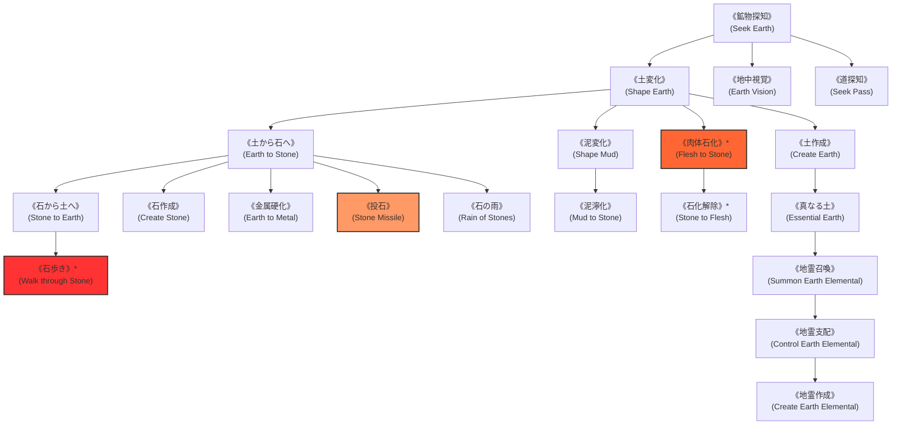

# ガープスマジック呪文体系：地霊系呪文 (Earth Spells)

**主管部署**: 魔導科学・理論研究部  
**準拠文献**: 『ガープス第4版 魔法大全（GURPS Magic）』第17章 pp.122-127、公式サプリメント各編（magic_page_076.html）  
**準拠憲章**: `AGENTS.md` (四大精霊使役・地霊系生体力場・剛毛巌猪装甲理論)

---

## 1. 地霊系呪文の基本概要と力学特性

### 1.1 系統特性
- **本質**: 土壌、岩石、鉱物結晶の分子結合操作、地殻構造の変形、および地のエレメンタル（地霊/アース・エレメンタル）の使役を司る四大元素魔術の一角。
- **作用対象の厳格性**: 特に指定がない限り、土・泥・砂に作用し、金属加工は技術系呪文との複合を要する。
- **現代世界での位置づけ**:
  - **多層防護壁・トンネル掘削**: 首都圏外郭放水路や地下調節池、外環防護壁の基礎補強に不可欠。
  - **魔獣生体装甲**: 剛毛巌猪（Crag Boar）等の鉱物結合装甲（ケイ素結晶化剛毛、クラニアル・シールド）の生体適応モデル。

---

## 2. 呪文前提系統樹（ツリー構造）

---

## 3. 呪文詳細一覧データ（主要抜粋・全42種）

| 呪文名（日 / 英） | クラス | 持続時間 | エネルギー消費 | 準備時間 | 前提条件 | 出力・効果概要 |
| :--- | :--- | :--- | :--- | :--- | :--- | :--- |
| **《鉱物探知》** (Seek Earth) | 情報 | 一瞬 | 2点 | 1秒 | なし | 半径5m以内の特定の土・岩石・鉱脈を探知。 |
| **《道探知》** (Seek Pass) | 情報 | 一瞬 | 3点 | 1秒 | 《鉱物探知》 | 地下洞窟や山岳地帯の安全な抜け道・トンネルを感知。 |
| **《地中視覚》** (Earth Vision) | 通常 | 1分 | 2点/厚み1m (維持1) | 1秒 | 《鉱物探知》 | 土や岩盤を透視し、埋没物や空洞を視認。 |
| **《土変化》** (Shape Earth) | 通常 | 永久 | 2点/m³ | 1秒 | 《鉱物探知》 | 土砂や泥を自由に変形（防壁構築、塹壕掘削等）。 |
| **《土作成》** (Create Earth) | 通常 | 永久 | 3点/m³ | 1秒 | 《土変化》 | 指定空間に清浄な土砂を無から生成。 |
| **《土から石へ》** (Earth to Stone) | 通常 | 永久 | 3点/m³ | 2秒 | 《土変化》 | もろい土砂を瞬時に強固な花崗岩・玄武岩へ石化硬化。 |
| **《石から土へ》** (Stone to Earth) | 通常 | 永久 | 3点/m³ | 2秒 | 《土から石へ》 | 硬い岩盤を柔らかい砂土へ軟化させ掘削を容易にする。 |
| **《投石》** (Stone Missile) | 射撃 | 一瞬 | 1〜素質×2点 | 1〜3秒 | 《土から石へ》 | 魔力で硬質化した岩石弾を高速射出（1d〜3d物理破砕ダメージ）。 |
| **《石の雨》** (Rain of Stones) | 範囲 | 1分 | 2点/m (同維持) | 1秒 | 素質2、《土から石へ》 | 頭上から無数の鋭利な砕石を降らせ、範囲内に毎秒打撃ダメージ。 |
| **《石歩き》\*** (Walk through Stone) | 通常 | 1分 | 5点 (維持3) | 2秒 | 素質2、《石から土へ》《地中視覚》 | 固体岩盤やコンクリート壁を気体のようにすり抜けて通過（至難）。 |
| **《肉体石化》\*** (Flesh to Stone) | 通常/抵 | 永久 | 10点 | 2秒 | 素質2、《土から石へ》、肉体操作系2種 | 生体の有機組織を完全な石像へと変異石化（至難）。 |
| **《石化解除》\*** (Stone to Flesh) | 通常 | 永久 | 10点 | 5秒 | 《肉体石化》、治癒系2種 | 石化された生物を元の生体組織へ完全復元（至難）。 |
| **《真なる土》** (Essential Earth) | 通常 | 永久 | 6点/m³ | 5秒 | 地霊系6種 | 通常の4倍の肥沃度と強度を持つ霊的土壌を作成。 |
| **《地霊召喚》** | 特殊 | 1時間 | 4点〜 | 30秒 | 素質1、地霊系8種 | 地のエレメンタル（岩石巨人）を召喚・使役。 |
| **《地霊支配》** | 特殊 | 1分 | 特殊 | 2秒 | 《地霊召喚》 | 野生の地霊や敵性岩石生命体を制圧。 |
| **《地霊作成》** | 特殊 | 永久 | 特殊 | 特殊 | 素質2、《地霊支配》 | 永続的な地霊・土壌ゴーレムを実体化。 |

---

## 4. 現代魔獣・生態系および防衛組織での適用例

1. **剛毛巌猪（Crag Boar）の生体適応**:
   - 第二胃での鉱物粉砕・代謝還元は《土から石へ》《土変化》の不随意生体力場励起として解明。
2. **首都圏防衛インフラ（地下神殿・外環壁）の維持**:
   - 春日部地下放水路要塞神殿における《石から土へ》《土から石へ》を用いた地盤沈下防止・耐震補強。
