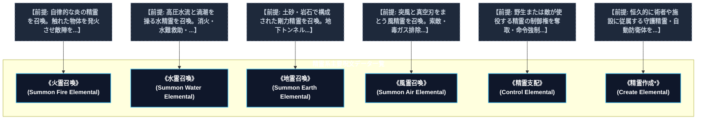

# 精霊系呪文 (Elemental Spirit Spells)

本ドキュメントは、ガープス第4版『魔法大全』第23章（p.164）および関連拡張サプリメントの公式データを基に、四大源素（地水火風）の霊的実体化、精霊召喚、使役支配、および2026年現代における専門魔法部隊の非物理霊体対処を体系化した公式魔術アーカイブです。

---

## 1. 精霊系魔術の力学

精霊系呪文（Elemental Spirit Spells）は、四大源素（火霊・水霊・地霊・風霊）の純粋なマナ結晶体である「精霊（エレメンタル）」を異界次元・自然界から召喚し、使役・同調する召喚魔術体系です。精霊は物理的実体と霊的エネルギーの中間体として存在し、通常の小火器弾を無効化する特性を持ちます。

### 1.1 前提条件ツリー (Prerequisite Tree)

---

## 2. 精霊系主要呪文データ一覧

| 呪文名（日 / 英） | クラス | 基本消費 / 維持 | 詠唱時間 | 前提条件 | 効果概要・力学 |
| :--- | :---: | :---: | :---: | :--- | :--- |
| **《火霊召喚》** Summon Fire Elemental | 特殊 | 4 (小型)〜20 (大型) | 30秒 | 素質1, 火霊系8種 | 自律的な炎の精霊を召喚。触れた物体を発火させ敵陣を炎上。 | 詳細参照 | **《水霊召喚》** Summon Water Elemental | 特殊 | 4 (小型)〜20 (大型) | 30秒 | 素質1, 水霊系8種 | 高圧水流と渦潮を操る水精霊を召喚。消火・水難救助・溺死攻撃。 | 詳細参照 | **《地霊召喚》** Summon Earth Elemental | 特殊 | 4 (小型)〜20 (大型) | 30秒 | 素質1, 地霊系8種 | 土砂・岩石で構成された剛力精霊を召喚。地下トンネル掘削・障壁突破。 | 詳細参照 | **《風霊召喚》** Summon Air Elemental | 特殊 | 4 (小型)〜20 (大型) | 30秒 | 素質1, 風霊系8種 | 突風と真空刃をまとう風精霊を召喚。索敵・毒ガス排除・航空支援。 | 詳細参照 | **《精霊支配》** Control Elemental | 特殊/抵 | 2 / 1 | 2秒 | 各種《精霊召喚》 | 野生または敵が使役する精霊の制御権を奪取・命令強制。 | 詳細参照 | **《精霊作成*》** Create Elemental | 特殊 | 100+ (儀式) | 1時間 | 素質2, 各種《精霊支配》 | 恒久的に術者や施設に従属する守護精霊・自動防衛体を創出。 | 詳細参照 
---

## 3. 2026年現代戦術・専門魔法部隊の霊体使役

### 3.1 通常兵器無効の非物理存在（霊体・ゴースト）に対する精霊使役
憲章1.3条で規定される通り、物理的実体を持たないアビス特異点由来のゴーストや怨霊に対しては、自衛隊や警察の通常弾頭が完全無効化されます。警視庁特殊霊査班および陸上自衛隊第101魔法防護隊は、《精霊召喚》によって使役したサラマンダーやシルフを突入させ、霊的エネルギー対消滅による除霊・無力化を遂行します。

### 3.2 災害救助・インフラ修復における精霊工学
東京湾アビス・ベイや地下河川の氾濫時において、《水霊召喚》《地霊召喚》は重機が侵入できない地下空洞や水没トンネルでの即時土砂堰き止め・排水作業に投入され、極めて高い人命救助実績を挙げています。
