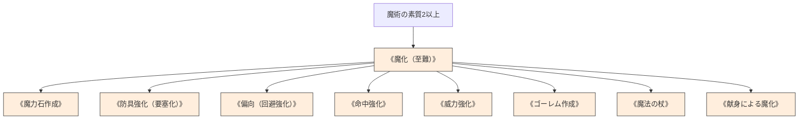

# 魔化系呪文 (Enchantment Spells)

本ドキュメントは、ガープス第4版『魔法大全』第2章および魔化系呪文データ（`magic_page_181`〜`185`）を基に、《魔化》《魔力石作成》《防具強化》《ゴーレム作成》などの術式データと、2026年現代メガコーポ・軍事における呪具製造プロセスを体系化した公式魔術アーカイブです。

---

## 1. 魔化系呪文の特性と構造

魔化系呪文は、物品や人工構造体に特定の魔術効果を永久付与するための専用呪文群です。
- **至難技能（Hard / Very Hard）**: 習得難易度が極めて高く、通常の呪文よりも多くの前提条件と魔術素質を要求する。
- **エネルギー莫大**: 消費エネルギーが数十〜数千点に達するため、単独詠唱ではなく「ゆっくり確実な魔化」または「儀礼魔法」によって行使される。

### 1.1 前提条件ツリー (Prerequisite Tree)

---

## 2. 魔化系主要呪文データ一覧

| 呪文名（日 / 英） | 呪文クラス | 必要エネルギー | 製作所要 | 前提条件 | 効果概要・力学 |
| :--- | :---: | :---: | :---: | :--- | :--- |
| **《魔化》** Enchant | 特殊（至難） | 品物依存 | 1日1点 / 儀礼 | 素質2、10系統以上の呪文 | あらゆる魔化プロセスの基礎となる至難術式。 |
| **《魔力石作成》** Powerstone | 特殊 | 容量依存（$P \times 20$） | 儀礼 / 日 | 《魔化》 | 宝石等にマナを蓄積・充填する能力を付与する。 |
| **《防具強化》** Fortify | 特殊 | 50 / 200 / 800 | 儀礼 / 日 | 《魔化》《鎧》 | 防具の防護点（DR）を恒久的に +1 / +2 / +3 強化。 |
| **《偏向》** Deflect | 特殊 | 100 / 500 / 2000 | 儀礼 / 日 | 《魔化》《盾》 | 防具・盾の受動防御/能動防御判定（DB）を +1〜+3 向上。 |
| **《命中強化》** Accuracy | 特殊 | 250 / 1000 / 4000 | 儀礼 / 日 | 《魔化》 | 武器の命中判定（武器スキル）に +1〜+3 のボーナス。 |
| **《威力強化》** Puissance | 特殊 | 250 / 1000 / 4000 | 儀礼 / 日 | 《魔化》 | 武器の攻撃ダメージに +1〜+3 のボーナス。 |
| **《魔法の杖》** Staff | 特殊 | 30 | 1日30点 / 儀礼 | 《魔化》 | 杖・錫杖に術士の霊的オーラを同調させ接触射程を延伸。 |
| **《ゴーレム作成》** Golem | 特殊 | 250〜1000 | 大規模儀礼 | 《魔化》《粘土/石/鉄作成》 | 粘土・石・鉄・プラスチックの自律防衛人形を製造。 |
| **《献身による魔化》** Enchantment Through Devotion | 特殊 | 信仰値変換 | 長期祈祷 | 僧侶魔法素質 | 信仰・祈りによって金銭・FPを消費せずに神聖呪具を鍛造。 |

---

## 3. 現代軍事・メガコーポ防衛における適用

### 3.1 耐弾装甲と《防具強化》のハイブリッド
ヤマト重工の軍用PMC特殊防弾ベストや自衛隊魔法部隊のタクティカルプレートには、現代のセラミック・アラミド繊維素材に《防具強化（DR+1〜+2）》が恒久刻印されており、大口径ライフル弾や魔獣の爪牙に対する極めて高い生残性を実現しています。

### 3.2 自律型魔導防衛兵器（メガコーポ・ゴーレム）
有明・夢の島の重要データセンターやメガコーポ本社ビルでは、侵入者迎撃・毒ガス環境制圧用として《プラスチック・ゴーレム》《アイアン・ゴーレム》が実戦配備されています。
