# 火霊系呪文 (Fire Spells)

本ドキュメントは、ガープス第4版『魔法大全』第5章（pp.34-38）および公式拡張サプリメント（『Magic: Artillery Spells』『Magic: Death Spells』『Magic: The Least of Spells』等）に準拠した、**全46種**の火霊系公式呪文アーカイブです。熱エネルギー励起、燃焼反応制御、火球・投射火焔、熱力学的防護、火のエレメンタル使役、ならびに2026年現代における結界都市防衛・軍事兵器工学・法規制（CR）の運用データを過不足なく完全網羅しています。

---

## 1. 火霊系魔術の力学体系

火霊系呪文は、四大元素（地・水・火・風）の一角を担い、マナの熱励起を介して媒質の温度・燃焼反応速度・熱放射ベクトルを直接制御する魔術体系です。
- **熱力学的出力限界**: ガープスマジック基準において、人間の術士単独での火力は《火球》（1〜3d）や《爆裂火球》の小火器〜手榴弾クラス（1d〜3dの熱・爆風破片相当）が上限であり、戦略級の大火災を単独詠唱で即時現出させることは不可能です。
- **物理・化学燃焼との並行性**: 呪文によって生じた炎は、物理化学的燃焼と同じ熱エネルギー・光・煙・酸素消費を伴います。したがって消火器（粉末/炭酸ガス）やスプリンクラー、酸素遮断によって通常の火災と同様に消火・抑制が可能です（ただし《真なる火》等を除く）。

### 1.1 火霊系呪文 前提条件ツリー (Prerequisite Tree)

```mermaid
graph TD
    %% クラススタイル定義（高コントラスト・ダークモード規格）
    classDef spell fill:#0f172a,stroke:#38bdf8,stroke-width:1.5px,color:#ffffff;
    classDef root fill:#0369a1,stroke:#38bdf8,stroke-width:2px,color:#ffffff,font-weight:bold;
    classDef ext fill:#1e293b,stroke:#94a3b8,stroke-width:1px,color:#cbd5e1,stroke-dasharray: 5 5;
    classDef special fill:#4c1d95,stroke:#c084fc,stroke-width:1.5px,color:#ffffff;

    %% 系統内呪文ノード定義
    subgraph Sub_3F144BF5 ["32種"]
        IgniteFire["《発火》<br>(Ignite Fire)"]:::root
        SeekFire["《炎探知》<br>(Seek Fire)"]:::root
        CreateFire["《炎作成》<br>(Create Fire)"]:::spell
        ExtinguishFire["《消火》<br>(Extinguish Fire)"]:::spell
        ShapeFire["《炎変化》<br>(Shape Fire)"]:::spell
        PhantomFlame["《幻炎》<br>(Phantom Flame)"]:::spell
        Fireproof["《防火》<br>(Fireproof)"]:::spell
        SlowFire["《遅燃》<br>(Slow Fire)"]:::spell
        FastFire["《速燃》<br>(Fast Fire)"]:::spell
        DeflectEnergy["《エネルギー屈折》<br>(Deflect Energy)"]:::special
        FlameJet["《火炎噴射》<br>(Flame Jet)"]:::spell
        Sp_12_3B50["《濃煙》<br>(（旧名：煙）)"]:::spell
        Heat["《加熱》<br>(Heat)"]:::spell
        Cold["《冷却》<br>(Cold)"]:::spell
        RainofFire["《火の雨》<br>(Rain of Fire)"]:::special
        ResistFire["《防熱》<br>(Resist Fire)"]:::spell
        ResistCold["《防寒》<br>(Resist Cold)"]:::spell
        Warmth["《暖房》<br>(Warmth)"]:::spell
        Fireball["《火球》<br>(Fireball)"]:::special
        ExplosiveFireball["《爆裂火球》<br>(Explosive Fireball)"]:::spell
        Sp_21_316F["《真なる火》<br>(（旧名：聖火）)"]:::spell
        FlamingWeapon["《火炎武器》<br>(Flaming Weapon)"]:::special
        Sp_23_1CC7["《炎の弓》<br>(（旧名：火矢）)"]:::spell
        FlamingArmor["《炎の鎧》<br>(Flaming Armor)"]:::special
        FireCloud["《炎の雲》<br>(Fire Cloud)"]:::spell
        BreatheFire["《火吹き*》<br>(Breathe Fire)"]:::special
        BurningTouch["《炎の手》<br>(Burning Touch)"]:::special
        BodyofFlames["《肉体炎化*》<br>(Body of Flames)"]:::spell
        BurningDeath["《炎の死神*》<br>(Burning Death)"]:::special
        Sp_30_56BD["《火霊召喚》<br>(（精霊召喚/火霊）)"]:::special
        Sp_31_71F1["《火霊支配》<br>(（精霊支配/火霊）)"]:::spell
        Sp_32_1620["《火霊作成》<br>(（精霊作成/火霊）)"]:::special
    end

    subgraph Sub_5E97106D ["3種"]
        SummonElemental["《精霊召喚》<br>(Summon Elemental)"]:::special
        ControlElemental["《精霊支配》<br>(Control Elemental)"]:::spell
        CreateElemental["《精霊作成》<br>(Create Elemental)"]:::special
    end

    subgraph Sub_1F421D8F ["MAS / MDS 拡張 7種"]
        FireSwarm["《円錐炎弾幕*》<br>(Fire Swarm)"]:::special
        ImprovedExplosiveFireball["《強化爆裂火球*》<br>(Improved Explosive Fireball)"]:::special
        ToweringInferno["《塔なす炎*》<br>(Towering Inferno)"]:::special
        SelfDestruct["《自爆》<br>(Self-Destruct)"]:::special
        Flammability["《可燃性促進*》<br>(Flammability)"]:::special
        Cremate["《火葬*》<br>(Cremate)"]:::special
        SnuffLifesFlame["《肉体焼失*》<br>(Snuff Life’s Flame)"]:::special
    end

    subgraph Sub_1C14272 ["Mtlos等 拡張 4種"]
        IgnitePoison["《毒炎上》<br>(Ignite Poison)"]:::special
    end

    %% 前提条件依存関係エッジ
    IgniteFire --> CreateFire
    SeekFire --> CreateFire
    IgniteFire --> ExtinguishFire
    IgniteFire --> ShapeFire
    ShapeFire --> PhantomFlame
    Ext_1 --> PhantomFlame
    ExtinguishFire --> Fireproof
    ExtinguishFire --> SlowFire
    SlowFire --> FastFire
    ShapeFire --> DeflectEnergy
    CreateFire --> FlameJet
    ShapeFire --> FlameJet
    ShapeFire --> Sp_12_3B50
    ExtinguishFire --> Sp_12_3B50
    CreateFire --> Heat
    ShapeFire --> Heat
    Heat --> Cold
    CreateFire --> RainofFire
    Req_2 --> ResistFire
    Heat --> ResistCold
    Heat --> Warmth
    CreateFire --> Fireball
    ShapeFire --> Fireball
    Fireball --> ExplosiveFireball
    Req_3 --> Sp_21_316F
    Heat --> FlamingWeapon
    FlamingWeapon --> Sp_23_1CC7
    ResistFire --> FlamingArmor
    FlameJet --> FlamingArmor
    Ext_4 --> FireCloud
    Fireball --> FireCloud
    FlameJet --> BreatheFire
    ResistFire --> BreatheFire
    Heat --> BurningTouch
    Ext_5 --> BodyofFlames
    Heat --> BurningDeath
    Ext_6 --> BurningDeath
    SummonElemental --> Sp_30_56BD
    Sp_30_56BD --> Sp_31_71F1
    Sp_31_71F1 --> Sp_32_1620
    Req_7 --> SummonElemental
    SummonElemental --> ControlElemental
    ControlElemental --> CreateElemental
    Fireball --> FireSwarm
    FlameJet --> FireSwarm
    ExplosiveFireball --> ImprovedExplosiveFireball
    FireCloud --> ToweringInferno
    RainofFire --> ToweringInferno
    Req_8 --> SelfDestruct
    Ext_9 --> Flammability
    Ext_10 --> Flammability
    BurningTouch --> Cremate
    Sp_21_316F --> Cremate
    FastFire --> Cremate
    Ext_11 --> SnuffLifesFlame
    CreateFire --> IgnitePoison
    Ext_12 --> IgnitePoison
    ShapeFire --> IgnitePoison

    %% 外部系統・特殊前提ノード
    Ext_1["【他系統: 《単純幻覚》】"]:::ext
    Req_2["【前提: 《防熱》】"]:::ext
    Req_3["【前提: 火霊系6種】"]:::ext
    Ext_4["【他系統: 《空気変化》】"]:::ext
    Ext_5["【他系統: 《火吹き》】"]:::ext
    Ext_6["【他系統: 《嘔吐感》】"]:::ext
    Req_7["【前提: 素質1、#】"]:::ext
    Req_8["【前提: 素質1、異なる10系統から各呪文1種#】"]:::ext
    Ext_9["【他系統: 《真なる燃料》】"]:::ext
    Ext_10["【他系統: 《燃料浄化》】"]:::ext
    Ext_11["【他系統: 《肉体炎化》】"]:::ext
    Ext_12["【他系統: 《毒探知》】"]:::ext
```

---

## 2. ガープス第4版『魔法大全』基本火霊系呪文（32種）

| 呪文名（日 / 英） | クラス | 持続時間 | 基本消費 / 維持 | 詠唱時間 | 前提条件 | 効果概要・力学 |
| :--- | :---: | :---: | :---: | :---: | :--- | :--- |
| **《発火》** Ignite Fire | 通常 | 1秒 | 1〜4/同 | 1秒 | - | 一点に 熱 を発生させ、燃えやすい物体に 火をつけ ます。紙や布に用いるのが最も効果的で、普通の火で燃えない物には効果がありません。特に、生き物に 火をつけ ることはできません！ いったん火がつけば、あとは普通に燃え続けます。 |
| **《炎探知》** Seek Fire | 情報 | 一瞬 | 1 | 1秒 | - | 最も近い位置にある、ある程度以上の 炎 や熱源の方向とおよその距離が分かります。 長距離の修正値 （14ページ）を用いてください。 術者 はすでにわかっている 炎 や熱源を、あらかじめ感知から省いて唱えることができます。 術者 は燃料を基にして（天然ガス、アルコール、 |
| **《炎作成》** Create Fire | 範囲 | 1分 | 2/半 | 1秒 | 《発火》ないし《炎探知》 | 燃料なしで、効果範囲を 炎 で覆います（空中にかけると、地面に向かって落下する 炎 の球体を作りだします）。これは現実の 炎 で、燃えやすい物に触れていればやがて 火をつき ます。この 呪文 は、岩や敵などの中にかけることはできません。 |
| **《消火》** Extinguish Fire | 通常 | 永久 | 3 | 1秒 | 《発火》 | 浄化・効果範囲内の火を消します。普通の人でも、 魔法 の火でも効果がありますが、溶けた鉄、溶岩、プラズマなどといった、非常に高温の物体には効きません。 |
| **《炎変化》** Shape Fire | 範囲 | 1分 | 2/半 | 1秒 | 《発火》 | 火炎の形を制御します。 炎 の形を変えるたびに1秒の 集中 が必要です。いったん形を変えれば、 呪文 の効果が切れるまで、 集中 しなくてもその形のままです。 炎 を 移動 させるには、連続した 集中 が必要です（ 炎 は 術者 の ターン に 移動力 5で動きます）。自然の |
| **《幻炎》** Phantom Flame | 範囲 | 1分 | 1/同 | 1秒 | 《炎変化》ないし《単純幻覚》 | 幻覚・効果範囲に非実体の 炎 を作り出します。近くにいる者は 熱 さを感じます（触れば痛みも感じます）。 炎 の中の品物は燃えているかのように見えます。しかし、この 炎 は広がることもなく、実際のダメージも与えません。痛みも最初の 衝撃 が過ぎれば、ただうずくだけになりま |
| **《防火》** Fireproof | 範囲 | 1日 | 3# | 5分 | 《消火》 | 効果範囲内に 火がつく のを防ぎます。マッチはつかず、火打ち石も火花を散らしません。効果範囲の外から投げこまれた火を消すことはできませんが、その人が他の物に燃えうつることはありません。火気厳禁の場所（火薬工場など）で重宝するでしょう。効果範囲内で 魔法 を使って火をおこそうとする場合、-5の修正を受 |
| **《遅燃》** Slow Fire | 通常 | 1分 | さまざま | 1秒 | 《消火》 | 炎 の温度を下げ、周囲の物（あるいは人）が燃える速度を遅くします。ダメージも比例して少なくなります。この 呪文 は、 火霊 や「 炎の体 」（『 ベーシックセット 1巻』253ページ）の 共通性質 を持つ存在に対しては、の 呪文 として働きます。はに抵抗します。 |
| **《速燃》** Fast Fire | 通常 | 1分 | さまざま | 1秒 | 《遅燃》 | 炎 の温度を上げ、周囲の物（あるいは人）が燃える速度を速くします。ダメージも比例して増えます。この 呪文 は、 火霊 や「 炎の体 」（『 ベーシックセット 1巻』253ページ）の 共通性質 を持つ存在に対しては、の 呪文 として働きます。 |
| **《エネルギー屈折》** Deflect Energy | 防御 | 一瞬 | 1 | 1秒 | 素質1、《炎変化》 | 目標 に命中しようとする エネルギー 攻撃 を1つそらします――これには ビーム兵器 による 攻撃 、の 呪文 を含みます。 戦闘 においては「 受け 」として扱います。 術者 自身が標的でない場合、 の 距離修正 がかかります。そらさ |
| **《火炎噴射》** Flame Jet | 通常 | 1秒 | 1〜3/同 | 1秒 | 《炎作成》、《炎変化》 | 拳から 炎 を噴き出します。 術者 は毎 ターン 、 敏捷力 -4か〈 特殊攻撃 ） 技能 を使って 命中判定 を行ない、当たればサイコロを振ってダメージを決めます。この 攻撃 に対して「 よけ 」「 止め 」はできますが、「 受け 」はできません。これは手持ち 武器 ――実体 |
| **《濃煙》** （旧名：煙） Smoke | 範囲 | 5分# | 1/半 | 1秒 | 《炎変化》、《消火》 | 呪文 知覚関連 毒 呪文 『 魔法大全 』のp.35参照。 濃い 煙 が立ちこめた空間を作ります。奥行き1メートルの 煙 でも視線を完全に遮ります。この 煙 は、 煙 が晴れるまでのあいだ 催涙ガス の効果があります（ 生命力 判定に失敗すると、 咳 きこみ涙を流すことしかでき |
| **《加熱》** Heat | 通常 | 1分 | さまざま | 1分 | 《炎作成》、《炎変化》 | 物体の温度を上げます。必ずしも火をともなうわけではありませんが、ほとんどの物体は充分に加熱されると燃え上がるでしょう。また、 熱 は通常通り周囲に放射されます（プレイの目安と考えてください――この 呪文 を物理学で考えようとしないように！ ）。 この 呪文 を使いこなすつもりなら、さまざまな物質の融点を頭に入 |
| **《冷却》** Cold | 通常 | 1分 | さまざま | 1分 | 《加熱》 | の反対です。充分に長く 維持 すれば、絶対零度まで物体の温度を下げることができます。 |
| **《火の雨》** Rain of Fire | 範囲 | 1分 | 1/同# | 1秒 | 素質2、《炎作成》 | 空から 炎 の粒を降らせ、効果範囲にあるものすべてに毎 ターン 1D-1点のダメージを与えます。を浴びた生き物は、自分の ターン にダメージを受けます。効果範囲に丸1 ターン いたわけでなければ、ダメージは半分になります（端数切り捨て）。 この 呪文 は屋外で |
| **《防熱》** Resist Fire | 通常 | 1分 | 2/1# | 1秒 | 《防熱》 | 関連 その他 霊薬『防熱』 霊薬 『 防熱薬 』の旧名。 呪文 防御 呪文 防御 温度関連 『 魔法大全 』のp.36参照。 特定耐性 |
| **《防寒》** Resist Cold | 通常 | 1分 | 2/1 | 1秒 | 《加熱》 | 目標 （人間、生き物、物体）とその持ち物は、寒さと凍傷の効果（ 冷気 ）を受けなくなります（ただし、落ちてきた氷や、 魔法 による氷の槍などは防げません）。 |
| **《暖房》** Warmth | 通常 | 1時間 | 2/1 | 10秒 | 《加熱》 | 防御・目標 は寒い場所でも快適な暖かさを得て、凍傷や体温低下の危険を回避することができます。これは 目標 の “ 体感温度 ” を快適な範囲（『 ベーシックセット 1巻』45ページ）まで、およそ18度分まで引き上げます。この 呪文 は、など 魔法 による冷気の 攻撃 は防げ |
| **《火球》** Fireball | 射撃 | 一瞬 | 1〜素質# | 1〜3秒 | 素質1、《炎作成》、《炎変化》 | 手から 火球 を投げつけます。 火球 は、 半致傷距離 25、 最大射程 50、 正確さ +1です。何かにぶつかると、ぱっと燃えあがって消えます。この 呪文 によって 可燃性 の 目標 には 火がつく 可能性があります。 |
| **《爆裂火球》** Explosive Fireball | 射撃 | 一瞬 | 2〜2×素質# | 1〜3秒 | 《火球》 | 目標 の周辺にいる者にまで効果がおよぶ 火球 を作りだします。 半致傷距離 25、 最大射程 50、 正確さ +1です。壁や床の一点に狙いをつけて、敵を 爆発 に巻きこむこともできます（ 命中判定 に+4）。直撃した 目標 と周囲1メートル以内の敵は全員が完全なダメージを受 |
| **《真なる火》** （旧名：聖火） Essential Flame | 範囲 | 1分 | 3/2# | 3秒 | 火霊系6種 | と訳すのは語弊があるため、今の名称に修正されています。この傾向は 全般が当てはまります。 呪文 呪文データ 『 魔法大全 』のp.36参照。 に似ていますが、 炎 の 魔法 的なエッセンスを作り |
| **《火炎武器》** Flaming Weapon | 通常 | 1分 | 4/1 | 2秒 | 素質2、《加熱》 | 武器 を 炎 で包みます。持ち主に害はなく、敵や 可燃性 の物体に対するダメージが+2されます（ 鎧 を貫き、その他のボーナスをすべて計算したあとで加えます）。これで金属の 武器 が傷むことはありませんが、木製の 武器 は 呪文 の効果が切れると灰と化してしまいます。 武器 |
| **《炎の弓》** （旧名：火矢） Flaming Missiles | 通常 | 1分 | 4/2# | 3秒 | 《火炎武器》 | で だった。。B第13章の 特殊な長射程武器のルール としての「 火矢 」はそのページを参照。 呪文 武器 長射程戦闘関連 長射程戦闘関連 『 魔法大全 』のp.37参照。 に似ていますが、 射撃 |
| **《炎の鎧》** Flaming Armor | 通常 | 1分 | 6/3 | 1秒 | 素質1、《防熱》、《火炎噴射》 | 目標 に苦痛を感じさせずに 炎 で包みこみます。 目標 および 目標 が持ち歩いている品物は基本レベルのの効果を受けます。この 炎 は周囲に対しては通常通りの光と 熱 をもたらします。 目標 が行なった 白兵攻撃 は、 炎 による追加ダメージを与えます。 この 目標 に 白兵 |
| **《炎の雲》** Fire Cloud | 範囲 | 10秒 | 1〜5/同 | 1〜5秒 | 《空気変化》、《火球》 | 炎 と 熱 煙 が渦巻く雲を作り出します。これは 視覚 を遮りませんが、範囲内にあるものすべてにダメージを与えます。雲の中にいる生き物は、自分の ターン にダメージを受けます。効果範囲に丸1 ターン いたわけでなければ、ダメージは半分になります（端数切り捨て）。 防具 は通常通り効果があります |
| **《火吹き*》** Breathe Fire* | 通常 | 1秒 | 1〜4 | 2秒 | 素質1、《火炎噴射》、《防熱》 | （至難） （至難） と同様ですが、 術者 の口から 炎 を吹きだします。は 維持 できず、 エネルギー 1点につき1D+1点のダメージを与えます。 術者 は、 敏捷力 -2か〈 特殊攻撃 〉 技能 で 命中判定 を行ないます。これは1回の行動と数え、 術者 は 目 |
| **《炎の手》** Burning Touch | 白兵 | 一瞬 | 1〜3 | 1秒 | 素質2、《加熱》含む火霊系6種 | 術者 の片手を 炎 で包みます。この 呪文 を唱えた後、その 手 で最初に触れた 目標 にダメージを与えます。ダメージは、この 呪文 に費やした エネルギー 1点につき1D点です。 鎧 は効果がありませんが、生まれついて持っている 防護点 は有効です。 |
| **《肉体炎化*》** Body of Flames* | 通常/抵-生命力 | 1分 | 12/4 | 5秒 | 《火吹き》 | （至難） （至難） _ 生命力 、 目標 は、この 呪文 の |
| **《炎の死神*》** Burning Death* | 通常/抵-生命力 | 1秒 | 3/2 | 3秒 | 素質2、《加熱》、《嘔吐感》 | （至難） （至難） _ 生命力 、 目標 を内部から燃やします。この 呪文 を発動させるには、 術者 が 目標 に 攻撃 を命中させねばなりません（どこに命中したかは関係ありません）。 目標 は毎 ターン 生命力 判定を行ないます。判定に失敗（ ファン |
| **《火霊召喚》** （精霊召喚/火霊） Summon Fire Elemental | 特殊 | 1時間 | 4# | 30秒 | 素質1、火霊系8種あるいは「火霊系4種と他の《精霊召喚》1種」 | ようするにです。詳細はを参照してください。 関連 |
| **《火霊支配》** （精霊支配/火霊） Control Fire Elemental | 特殊 | 1分 | 特殊 | 2秒 | 《火霊召喚》 | _ 体力 ・ 意志力 のどちらか高いほう、 ようするにです。詳細はを参照してください。 関連 |
| **《火霊作成》** （精霊作成/火霊） Create Fire Elemental | 特殊 | 永久 | 特殊 | 特殊 | 素質2、《火霊支配》 | ようするにです。詳細はを参照してください。 関連 |

---

## 3. 四大精霊共通召喚・使役呪文（3種）

| 呪文名（日 / 英） | クラス | 持続時間 | 基本消費 / 維持 | 詠唱時間 | 前提条件 | 効果概要・力学 |
| :--- | :---: | :---: | :---: | :---: | :--- | :--- |
| **《精霊召喚》** Summon Elemental | 特殊 | 1時間 | 4# | 30秒 | 素質1、# | （Summon ( ) Elemental） （は は は は ）、 召喚・ 《 |
| **《精霊支配》** Control Elemental | 特殊 | 1分 | 特殊 | 2秒 | 《精霊召喚》# | （Control ( ) Elemental） _ 体力 ・ 意志力 のどちらか高いほう、 水霊 |
| **《精霊作成》** Create Elemental | 特殊 | 永久 | 特殊 | 特殊 | 素質2、《精霊支配》# | （Create ( ) Elemental ） （は は は は ）、 《 |

---

## 4. 魔導兵器・砲兵戦術拡張呪文（MAS / MDS 拡張 7種）

『GURPS Magic: Artillery Spells（MAS）』および『GURPS Magic: Death Spells（MDS）』に収録された、熱・爆炎を戦略的弾幕・生体焼失へと昇華させた軍事拡張呪文です。

| 呪文名（日 / 英） | クラス | 持続時間 | 基本消費 / 維持 | 詠唱時間 | 前提条件 | 効果概要・力学 |
| :--- | :---: | :---: | :---: | :---: | :--- | :--- |
| **《円錐炎弾幕*》** Fire Swarm* | 通常 | 一瞬 | 2〜6×終端幅1ｍ毎 | 1秒/威力1d毎 | 素質4、《火球》と《火炎噴射》含む火霊系呪文10種 | （至難）（Fire Swarm (VH)） pp.14-15 （至難） 片手から 円錐状 の範囲に（ 爆発 しない）火球の群れを放ちます。火球は10ｍまで射出され、その後無害に消散します。円錐の最大 射程 範囲は 呪文 に投入された エネルギー に応じて増加しますが、これは ではありません |
| **《強化爆裂火球*》** Improved Explosive Fireball* | 射撃 | 一瞬 | 3〜3×素質 | 1〜3秒 | 素質4、《爆裂火球》を含む火霊系呪文10種 | （至難）（Improved Explosive Fireball (VH)） p.15 （至難） と同様ですが、 爆発 半径が広くなっています。中心から1ｍ以上離れた対象へのダメージは、距離の3倍ではなく、距離（1メートル）で割ります。 術者 の安全のため、 射程 も長くなっています。 正確さ |
| **《塔なす炎*》** Towering Inferno* | 範囲 | 一瞬 | 2〜10 | 1秒/基本消費2点毎 | 素質4、《炎の雲》と《火の雨》を含む火霊系呪文7種 | （至難）（Towering Inferno (VH)） p.15 （至難） 垂直の 炎 柱を出現させ、その内部のすべてを焼き焦がします。これは 炎 による「 広範囲の負傷 」です。これは 爆発 ではなく範囲効果であり、ダメージは範囲全体に均等に及びますが、端の外側にあるものは焦げることさえありません。特に高レベル帯では |
| **《自爆》** Self-Destruct | 範囲 | 一瞬 | 12 | 1秒 | 素質1、異なる10系統から各呪文1種# | p.23 術者 を即座に爆破します。 呪文 が成功した場合、 魔法使い の肉体は「 脆弱 / 爆発性 」と同様に即座に 爆発 しますが、これは物理的不安定さによるものではなく、 魔法 的過負荷によるものです。この 叩き 攻撃の 爆発 威力は、「6d×（ 知力 |
| **《可燃性促進*》** Flammability* | 範囲 | 1分# | 2・同 | 1秒 | 素質3、《真なる燃料》、《燃料浄化》 | （至難）（Flammability (VH)） p.26 （至難） 、 発動した瞬間、範囲内にある 可燃性 の物はすべて 可燃性 を高めます。「 物を燃やす 」の項で言うところの「 難燃性 」または「 不燃性 」の物を除くすべての物が影響を受け、「 超可燃性 」になります。これには、紙 |
| **《火葬*》** Cremate * | 白兵/抵-生命力 | 1秒 | 3+2/1d毎 | 3秒 | 素質3、《炎の手》、《真なる火》、《速燃》 | （至難）（Cremate (VH)） p.12 （至難） _ 生命力 の高速一撃必殺版のように、犠牲者を内側から瞬時に焼き尽くします。この 呪文 を発動させるには、 術者 が 目標 に 攻撃 を命中させねばな |
| **《肉体焼失*》** Snuff Life’s Flame * | 通常/抵-生命力 | 一瞬 | 14 | 5秒 | 素質3、《肉体炎化》 | の殺人的応用なので今の形に意訳しています。当サイトでは として扱いますが、の対象外のため ではありません。 （至難）（Snuff Life’s Flame (VH)） p.12 （至難） _ 生命力 対象とその衣服（最大3kg）を《 |

---

## 5. 日常・民間簡単呪文 ＆ 複合呪文（Mtlos等 拡張 4種）

『GURPS Magic: The Least of Spells（Mtlos）』に収録された低燃費の日常呪文および毒霊系連携呪文です。

| 呪文名（日 / 英） | クラス | 持続時間 | 基本消費 / 維持 | 詠唱時間 | 前提条件 | 効果概要・力学 |
| :--- | :---: | :---: | :---: | :---: | :--- | :--- |
| **《火花》（並）** （Ember (A)） | 射撃 | 一瞬 | 1 | 1秒 | -（簡単呪文なので） | （並）（Ember (A)） p.9 （並） 片手から熱い火花（スパーク）を発射します。これは、 正確さ 0、 半致傷距離 なし、 最大射程 10です。命中させるには、〈 特殊攻撃 /射出物〉を使用します。当たった目標には、 呪文 1点分の1秒間と同じように影響します。 超可燃性 または 高可燃性 （「 物を燃やす 」参 |
| **《鍋つかみ》（並）** （Oven Mitts (A)） | 通常 | 1分 | 1・同 | 1秒 | -（簡単呪文なので） | （並）（Oven Mitts (A)） p.9 （並） 防御・対象の 手 (だけ！) は、 熱 または 炎 による 焼き ダメージに対して DR 1を獲得します。その他の 肉体部位 や所持品は保護されません。 その他の 焼き ダメージ（例： 電光 ）や、 熱 ・ 炎 によれど「 焼き 」じゃないダメージには影 |
| **《少煙》（並）** （Puff (A)） | 通常 | 10秒 | 1・同 | 1秒 | -（簡単呪文なので） | （並）（Puff (A)） p.9 （並） 葉巻やパイプから出る煙に匹敵する、安定した細い煙の流れを作り出します。視界を遮ったり、人を 窒息 させたりすることはありませんが、静止した空気中で信号を送るには十分です（ 呪文 が持続している間、1秒あたり1メートルの速度で上昇します）、ハイテク煙探知機を作動させたり、「 炎恐怖症 」の人 |
| **《毒炎上》** Ignite Poison | 範囲/抵-生命力 | 10秒 | 1〜5 | 1〜5秒 | 素質1、《炎作成》、《毒探知》、《炎変化》 | p.6 _ 生命力 、 範囲内のすべての 毒 が炎上します。有毒な雲は、その中にいるすべてのものに 焼き ダメージを与えます。雲内の生物は、自分のターンにダメージを受けます。影響を受けた範囲で過ごした時間が1秒未満の場合、ダメージは半減します (端数切り捨て)。装甲は通常どお |

---

## 6. 2026年現代戦術・都市防衛・メガコーポ兵器における運用

### 6.1 自衛隊・法執行機関の熱戦術バランス
都市部での対魔獣・テロ制圧において、《火球》《火炎噴射》は手榴弾や火炎放射器と同等に強力ですが、閉所での酸欠や二次火災リスクが極めて高いため、警察（SAT）では《消火》《防熱》《濃煙》による突入支援が主用されます。自衛隊普通科の術士班では、《強化爆裂火球*》《火炎武器》が重装甲魔獣（オクタマイワシシ等）に対する装甲脆弱化（熱衝撃脆性）戦術として標準配備されています。

### 6.2 メガコーポによる熱エネルギー制御特許と工業利用
ヤマト重工の製鉄・超合金精錬ラインでは、《加熱》《真なる火》を用いた超高純度熱源プラントが稼働しており、化石燃料や外部電力に依存しないグリーン魔導熱源として独占特許化されています。また、テイコク製薬の極低温バイオ保管庫では《冷却》呪文による絶対零度近傍の温度維持が行われています。

### 6.3 戦略熱破壊術式（MAS/MDS）の国際法規制（CR4）
《塔なす炎*》《自爆》《肉体焼失*》は、広範囲無差別焼夷弾（ナパーム・白燐弾）と同等の非人道的大破壊をもたらすため、国際魔導協定（IMA）および防衛省訓令により**規制等級CR4（要特別軍事許可・非人道兵器条約規制）**に指定されています。