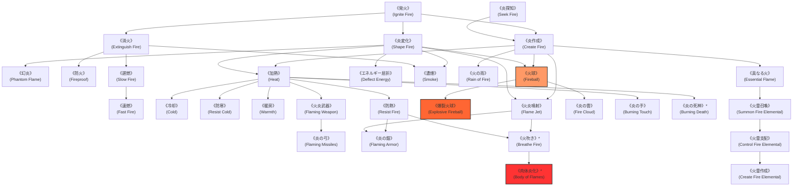

# ガープスマジック呪文体系：火霊系呪文 (Fire Spells)

**主管部署**: 魔導科学・理論研究部  
**準拠文献**: 『ガープス第4版 魔法大全（GURPS Magic）』pp.34-38、各種公式サプリメント  
**準拠憲章**: `AGENTS.md` (ガープスマジック基準魔術出力・四大精霊使役)

---

## 1. 火霊系呪文の基本概要と力学特性

### 1.1 系統特性
- **本質**: 熱エネルギーの励起、燃焼反応の霊的制御、および火のエレメンタル（火霊）との同調・使役を司る四大元素魔術の一角。
- **物理規模**: 呪文によって作成・制御される標準的な炎の高さ・厚みは**約1.8メートル**を基準とする。
- **現代世界での位置づけ**:
  - 理論魔導学派（メイジ）における基礎戦闘・熱制御術式としてメガコーポや自衛隊魔法部隊で最も標準化が進んでいる。
  - 攻撃呪文の瞬間火力（火球：1〜3d）は拳銃〜手榴弾クラスに相当し、現代火器（5.56mm/7.62mm小銃等）と同等の交戦レンジ・威力バランスを形成する。

---

## 2. 呪文前提系統樹（ツリー構造）

---

## 3. 呪文詳細一覧データ

### 3.1 『魔法大全』基本呪文（32種）

| 呪文名（日 / 英） | クラス | 系統 | 持続時間 | エネルギー消費 | 準備時間 | 前提条件 | 出力・効果概要 |
| :--- | :--- | :--- | :--- | :--- | :--- | :--- | :--- |
| **《発火》** (Ignite Fire) | 通常 | 火霊01 | 1秒 | 1〜4点 (同維持) | 1秒 | なし | 小さな火種・可燃物を発火させる。1点でマッチ、2点でライター、3点で松明、4点で小型バーナー相当。 |
| **《炎探知》** (Seek Fire) | 情報 | 火霊02 | 一瞬 | 1点 | 1秒 | なし | 半径5m以内の炎や熱源を探知（距離修正適用）。 |
| **《炎作成》** (Create Fire) | 範囲 | 火霊03 | 1分 | 2点/m (維持1) | 1秒 | 《発火》または《炎探知》 | 指定範囲の空間に自然な炎（高さ1.8m）を作り出す。接触時1d-1の熱ダメージ。 |
| **《消火》** (Extinguish Fire) | 通常 | 火霊04 | 永久 | 3点 | 1秒 | 《発火》 | 半径1m以内の炎を瞬時に完全消火する。 |
| **《炎変化》** (Shape Fire) | 範囲 | 火霊05 | 1分 | 2点/m (維持1) | 1秒 | 《発火》 | 既存の炎を自由な形（壁、ドーム等）に変形・移動（秒速5m）させる。 |
| **《幻炎》** (Phantom Flame) | 範囲 | 火霊06 幻覚02 | 1分 | 1点/m (同維持) | 1秒 | 《炎変化》または《単純幻覚》 | 熱や実体のない光と音だけの見せかけの炎を生み出す。 |
| **《防火》** (Fireproof) | 範囲 | 火霊07 | 1日 | 3点/m | 5分 | 《消火》 | 対象範囲内の物体に不燃性を付与し、通常の炎による引火を防ぐ。 |
| **《遅燃》** (Slow Fire) | 通常 | 火霊08 | 1分 | 物体サイズ | 1秒 | 《消火》 | 物体の燃焼速度を1/2〜1/10に遅延させ、燃料消費を抑える。 |
| **《速燃》** (Fast Fire) | 通常 | 火霊09 | 1分 | 物体サイズ | 1秒 | 《遅燃》 | 物体の燃焼速度を2〜10倍に加速し、高熱と短時間燃焼を発生。 |
| **《エネルギー屈折》** (Deflect Energy) | 防御 | 火霊10 | 一瞬 | 1点 | 1秒 | 素質1、《炎変化》 | 熱線・レーザー・火炎弾などのエネルギー攻撃を偏向して無効化。 |
| **《火炎噴射》** (Flame Jet) | 通常 | 火霊11 | 1秒 | 1〜3点 (同維持) | 1秒 | 《炎作成》、《炎変化》 | 手先から1〜3mの火炎放射を放つ（消費1点につき1dダメージ）。 |
| **《濃煙》** (Smoke) | 範囲 | 火霊12 | 5分 | 1点/m (維持0.5) | 1秒 | 《炎変化》、《消火》 | 視界を完全に遮断する濃密な黒煙を充満させる（窒息判定）。 |
| **《加熱》** (Heat) | 通常 | 火霊13 | 1分 | 温度上昇度 | 1分 | 《炎作成》、《炎変化》 | 物体の温度を上昇させる（金属の赤熱、水の沸騰等）。 |
| **《冷却》** (Cold) | 通常 | 火霊14 | 1分 | 温度下降度 | 1分 | 《加熱》 | 物体の熱を奪い、凍結・冷却させる。 |
| **《火の雨》** (Rain of Fire) | 範囲 | 火霊15 | 1分 | 1点/m (同維持) | 1秒 | 素質2、《炎作成》 | 頭上から火の粉と炎の雨を降らせ、範囲内の生物に毎秒1点ダメージ。 |
| **《防熱》** (Resist Fire) | 通常 | 火霊16 | 1分 | 2点 (維持1) | 1秒 | 《加熱》 | 熱・炎に対する耐性を付与（DR+2〜完全耐熱）。 |
| **《防寒》** (Resist Cold) | 通常 | 火霊17 | 1分 | 2点 (維持1) | 1秒 | 《加熱》 | 極寒環境や冷気攻撃に対する完全な保護。 |
| **《暖房》** (Warmth) | 通常 | 火霊18 防御28 | 1時間 | 2点 (維持1) | 10秒 | 《加熱》 | 対象の周囲に快適な保温フィールドを展開。 |
| **《火球》** (Fireball) | 射撃 | 火霊19 | 一瞬 | 1〜素質点 | 1〜3秒 | 素質1、《炎作成》、《炎変化》 | 手のひらに火球を生成・投擲（1d〜3dの熱ダメージ、直撃判定）。 |
| **《爆裂火球》** (Explosive Fireball) | 射撃 | 火霊20 | 一瞬 | 2〜2×素質点 | 1〜3秒 | 《火球》 | 着弾地点で爆発し、中心1d〜3d、周囲に破片・爆風ダメージ。 |
| **《真なる火》** (Essential Flame) | 範囲 | 火霊21 | 1分 | 3点/m (維持2) | 3秒 | 火霊系6種 | 水でも消えない神聖・純粋な炎を作成（通常の2倍の熱ダメージ）。 |
| **《火炎武器》** (Flaming Weapon) | 通常 | 火霊22 | 1分 | 4点 (維持1) | 2秒 | 素質2、《加熱》 | 近接武器に炎をまとわせ、+2の火炎追加ダメージを付与。 |
| **《炎の弓》** (Flaming Missiles) | 通常 | 火霊23 | 1分 | 4点 (維持2) | 3秒 | 《火炎武器》 | 矢や投射弾に炎を付与し、着弾時に発火と追加ダメージ。 |
| **《炎の鎧》** (Flaming Armor) | 通常 | 火霊24 | 1分 | 6点 (維持3) | 1秒 | 素質1、《防熱》、《火炎噴射》 | 全身に炎の障壁を纏い、接触者に1d-1ダメージ＋防護力向上。 |
| **《炎の雲》** (Fire Cloud) | 範囲 | 火霊25 | 10秒 | 1〜5点 (同維持) | 1〜5秒 | 《空気変化》、《火球》 | 滞留する燃焼ガス雲を発生させ、突入者に毎秒熱ダメージ。 |
| **《火吹き》\*** | 通常 | 火霊26 | 1秒 | 1〜4点 | 2秒 | 素質1、《火炎噴射》、《防熱》 | 口から円錐状の猛烈な火炎ブレスを噴射（至難呪文）。 |
| **《炎の手》** (Burning Touch) | 白兵 | 火霊27 | 一瞬 | 1〜3点 | 1秒 | 素質2、火霊系6種 | 掌の接触により1d〜3dの直接火炎ダメージを与える。 |
| **《肉体炎化》\*** | 通常/抵 | 火霊28 | 1分 | 12点 (維持4) | 5秒 | 《火吹き》 | 術者自身の肉体を完全な炎の生体へと変異させる（至難呪文）。 |
| **《炎の死神》\*** | 通常/抵 | 火霊29 死霊33 | 1秒 | 3点 (維持2) | 3秒 | 素質2、《加熱》、《嘔吐感》 | 対象の体内の熱量を暴走させ、内臓から発火・焼損させる（至難呪文）。 |
| **《火霊召喚》** | 特殊 | 精霊01 火霊30 | 1時間 | 4点〜 | 30秒 | 素質1、火霊系8種 | 火のエレメンタルを異界・アストラル界から召喚・使役。 |
| **《火霊支配》** | 特殊 | 精霊02 火霊31 | 1分 | 特殊 | 2秒 | 《火霊召喚》 | 野生または敵対する火霊の意志を制圧・隷属させる。 |
| **《火霊作成》** | 特殊 | 精霊03 火霊32 | 永久 | 特殊 | 特殊 | 素質2、《火霊支配》 | 永続的な火のエレメンタルを創造・実体化する高位儀式。 |

---

### 3.2 公式サプリメント追加呪文（11種）

| 呪文名（日 / 英） | 収録書 | クラス | 消費 | 準備 | 前提条件 | 効果概要 |
| :--- | :--- | :--- | :--- | :--- | :--- | :--- |
| **《円錐炎弾幕》\*** (Fire Swarm) | MAS (Artillery) | 通常 | 2〜6×幅m | 1秒/1d | 素質4、火霊系10種 | 扇状の広角エリアに無数の高熱火炎弾を一斉放射する野戦制圧術式。 |
| **《強化爆裂火球》\*** (Improved Explosive Fireball) | MAS (Artillery) | 射撃 | 3〜3×素質 | 1〜3秒 | 素質4、火霊系10種 | より強大な爆轟圧力と広範囲破砕力を持つ重砲撃級火球。 |
| **《塔なす炎》\*** (Towering Inferno) | MAS (Artillery) | 範囲 | 2〜10点 | 1秒/2点 | 素質4、火霊系7種 | 天空へと届く巨大な火柱を直立させ、超高熱と上昇気流で周囲を焼き尽くす。 |
| **《自爆》** (Self-Destruct) | MAS (Artillery) | 範囲 | 12点 | 1秒 | 素質1、10系統各1種 | 術者の生命エネルギーを臨界爆発させ、広範囲を壊滅させる自爆呪文。 |
| **《可燃性促進》\*** (Flammability) | MAS (Artillery) | 範囲 | 2点/m | 1秒 | 素質3、《真なる燃料》等 | 本来燃えない金属・コンクリート等の発火点を極限まで低下させる。 |
| **《火葬》\*** (Cremate) | MDS (Death) | 白兵/抵 | 3+2/1d | 3秒 | 素質3、《炎の手》《速燃》等 | 触れた有機体を瞬時に白骨・灰燼へと還元する致死術式。 |
| **《肉体焼失》\*** (Snuff Life’s Flame) | MDS (Death) | 通常/抵 | 14点 | 5秒 | 素質3、《肉体炎化》 | 標的の生体エネルギーそのものを燃焼させ、痕跡なく消滅させる禁忌呪文。 |
| **《火花》** (Ember) | MtloS (Least) | 射撃 | 1点 | 1秒 | なし（簡単呪文） | 指先から小さな火花を飛ばす日常用・着火用トリック。 |
| **《鍋つかみ》** (Oven Mitts) | MtloS (Least) | 通常 | 1点 | 1秒 | なし（簡単呪文） | 両手に微小な耐熱膜を張り、熱い調理器具を安全に持つ。 |
| **《少煙》** (Puff) | MtloS (Least) | 通常 | 1点 | 1秒 | なし（簡単呪文） | 視界を遮らない程度のわずかな煙を一吹き発生させる。 |
| **《毒炎上》** (Ignite Poison) | P4/1 (Poison) | 範囲/抵 | 1〜5点 | 1〜5秒 | 素質1、《毒探知》《炎作成》 | 標的の血中や体内の毒素に点火し、体内から激しい熱損傷を与える。 |
| **《バロールの魔眼炎》\*** (Balor’s Eye Fire) | P3/76 (Dungeon) | 射撃 | 特殊 | 特殊 | 火霊系奥義 | 視線のみで対象を凝視・発火させる古代神話級の至難奥義呪文。 |

---

## 4. 現代魔獣・生態系および防衛組織での適用例

1. **魔獣の発火・熱線器官のベース**:
   - サラマンダー種やブレス保有種の生体火炎放射は《火炎噴射》《火吹き》の生体器官同調モデルとして解釈。
   - 体表に耐熱性・放熱甲殻を持つ魔獣は《防熱》《炎の鎧》の生体アストラル変異に該当。
2. **PMC・自衛隊魔法部隊（術士）の運用**:
   - 室内クリアリングや陣地防衛における《濃煙》《炎変化》による視界制御・侵入阻止。
   - 突入部隊への《防熱》《防火》付与および《火球》《爆裂火球》による軽装甲目標の無力化。
