# 食料系呪文 (Food Spells)

本ドキュメントは、ガープス第4版『魔法大全』第11章（pp.65-68）および公式拡張サプリメント（『Magic: Artillery Spells』『Magic: Death Spells』『Magic: The Least of Spells』『Magic: Plant Spells』等）に準拠した、**全31種**の食料系呪文公式アーカイブです。マナ力学、生体媒介作用、ならびに2026年現代における結界都市防衛・軍事兵器工学・法規制（CR）の運用データを過不足なく完全網羅しています。

---

## 1. 食料系呪文の力学体系

食料系呪文は、マナの指向性周波数を介して対象の物理・生体・霊的パラメータを励起・変調・制御する魔術体系です。
- **生体媒介原則**: マナは術士の生体・神経系・霊体を介して作用し、直接の物質変換や物理エネルギー励起を行います。
- **現代技術インフラとの並行性**: 電子回路や通信網を直接破壊するのではなく、物理的現象（熱、圧力、電磁、物質変形等）を介して現代兵器や都市防護壁と相互作用します。

### 1.1 食料系呪文 前提条件ツリー (Prerequisite Tree)

```mermaid
graph TD
    %% クラススタイル定義（高コントラスト・ダークモード規格）
    classDef spell fill:#0f172a,stroke:#38bdf8,stroke-width:1.5px,color:#ffffff;
    classDef root fill:#0369a1,stroke:#38bdf8,stroke-width:2px,color:#ffffff,font-weight:bold;
    classDef ext fill:#1e293b,stroke:#94a3b8,stroke-width:1px,color:#cbd5e1,stroke-dasharray: 5 5;
    classDef special fill:#4c1d95,stroke:#c084fc,stroke-width:1.5px,color:#ffffff;

    %% 系統内呪文ノード定義
    subgraph Sub_6F279072 ["24種"]
        SeekFood["《食料探知》<br>(Seek Food)"]:::root
        TestFood["《毒見》<br>(Test Food)"]:::root
        Decay["《腐敗》<br>(Decay)"]:::spell
        Season["《味付け》<br>(Season)"]:::spell
        FarTasting["《遠隔毒見》<br>(Far-Tasting)"]:::special
        Mature["《発酵》<br>(Mature)"]:::spell
        PurifyFood["《食料浄化》<br>(Purify Food)"]:::spell
        Sp_8_4744["《料理》<br>(（旧名：調理）)"]:::spell
        PrepareGame["《解体》<br>(Prepare Game)"]:::spell
        KnowRecipe["《調合看破》<br>(Know Recipe)"]:::spell
        PoisonFood["《毒化》<br>(Poison Food)"]:::spell
        Hunger["《空腹》<br>(Hunger)"]:::special
        Sp_13_7DCE["《渇え》<br>(（旧名：渇き）)"]:::special
        FoulWater["《汚水》<br>(Foul Water)"]:::spell
        PreserveFood["《保存食》<br>(Preserve Food)"]:::spell
        CreateFood["《食料作成》<br>(Create Food)"]:::spell
        Sp_17_3EEA["《真なる食物*》<br>(（旧名：聖食）)"]:::spell
        WizardNose["《魔法の鼻》<br>(Wizard Nose)"]:::spell
        WizardMouth["《魔法の口》<br>(Wizard Mouth)"]:::spell
        WatertoWine["《水を酒》<br>(Water to Wine)"]:::spell
        Distill["《蒸留》<br>(Distill)"]:::spell
        FoolsBanquet["《ごちそう》<br>(Fool’s Banquet)"]:::special
        MonksBanquet["《断食》<br>(Monk’s Banquet)"]:::spell
        Sp_24_22C1["《残香再現》<br>(（旧名：過去嗅覚）)"]:::special
    end

    subgraph Sub_E032978 ["MAS / MDS 拡張 2種"]
        Butcher["《屠畜*》<br>(Butcher)"]:::special
        DeathsBanquet["《死毒の宴*》<br>(Death’s Banquet)"]:::special
    end

    subgraph Sub_260CCBA7 ["MAS / MDS 拡張 1種"]
        AlcoholTolerance["《酒耐性》<br>(Alcohol Tolerance)"]:::root
    end

    %% 前提条件依存関係エッジ
    TestFood --> Decay
    TestFood --> Season
    SeekFood --> FarTasting
    Ext_1 --> FarTasting
    Decay --> Mature
    Season --> Mature
    Decay --> PurifyFood
    TestFood --> Sp_8_4744
    Ext_2 --> Sp_8_4744
    PurifyFood --> PrepareGame
    FarTasting --> KnowRecipe
    Season --> KnowRecipe
    PurifyFood --> PoisonFood
    Decay --> PoisonFood
    Ext_3 --> Hunger
    Decay --> Hunger
    Ext_3 --> Sp_13_7DCE
    Ext_4 --> Sp_13_7DCE
    Ext_5 --> FoulWater
    Decay --> FoulWater
    Decay --> PreserveFood
    Sp_8_4744 --> CreateFood
    SeekFood --> CreateFood
    CreateFood --> Sp_17_3EEA
    Ext_6 --> WizardNose
    FarTasting --> WizardNose
    Ext_6 --> WizardMouth
    FarTasting --> WizardMouth
    Ext_7 --> WizardMouth
    Ext_5 --> WatertoWine
    Mature --> WatertoWine
    Mature --> Distill
    Ext_4 --> Distill
    Sp_8_4744 --> FoolsBanquet
    Ext_8 --> FoolsBanquet
    FoolsBanquet --> MonksBanquet
    Ext_9 --> MonksBanquet
    Ext_10 --> Sp_24_22C1
    Ext_11 --> Sp_24_22C1
    PrepareGame --> Butcher
    Ext_12 --> DeathsBanquet
    PoisonFood --> DeathsBanquet

    %% 外部系統・特殊前提ノード
    Ext_1["【他系統: 《空気探知》】"]:::ext
    Ext_2["【他系統: 《炎作成》】"]:::ext
    Ext_3["【他系統: 《疲れ》】"]:::ext
    Ext_4["【他系統: 《水破壊》】"]:::ext
    Ext_5["【他系統: 《水浄化》】"]:::ext
    Ext_6["【他系統: 《念動》】"]:::ext
    Ext_7["【他系統: 《拡声》】"]:::ext
    Ext_8["【他系統: 《間抜け》】"]:::ext
    Ext_9["【他系統: 《痛み止め》】"]:::ext
    Ext_10["【他系統: 《来歴》】"]:::ext
    Ext_11["【他系統: 《芳香》】"]:::ext
    Ext_12["【他系統: 《真なる食物》】"]:::ext
```

---

## 2. ガープス第4版『魔法大全』基本食料系呪文（24種）

| 呪文名（日 / 英） | クラス | 持続時間 | 基本消費 / 維持 | 詠唱時間 | 前提条件 | 効果概要・力学 |
| :--- | :---: | :---: | :---: | :---: | :--- | :--- |
| **《食料探知》** Seek Food | 情報 | 一瞬 | 2 | 1秒 | - | 最も近くで食料を供給できる場所の方向、そこまでの距離、どんなものがあるのかを感知します。 長距離の修正値 を使ってください（14ページ）。見つかる食料は栄養はありますが、おいしいとは限りません――たとえば食用虫など。 術者 はすでにわかっている食料（美味な虫など）を、あらかじめ感知から省いて唱えることができます。 |
| **《毒見》** Test Food | 情報 | 一瞬 | 1〜3# | 1秒 | - | その物質が食べられるかどうかを判断します。味や栄養についてはわかりません。 毒 があるか、危険なほど腐っていないか、異物が含まれていないか（例えば果物の中の刃）を感知します。食料に 魔法 がかかっているかどうかはわかりません。 |
| **《腐敗》** Decay | 通常 | 永久 | 1/1食毎 | 1秒 | 《毒見》 | 食料を即座に腐らせ、食べられなくしてしまいます（1分以内にやを唱えれば、食べ物は無事です）。 |
| **《味付け》** Season | 通常 | 永久 | 2/1食毎 | 10秒 | 《毒見》 | _特殊、 容器1個分の食物を、 術者 の好みに味付けします。おいしいかどうかは 術者 の〈 調理 〉 技能 で判定します――この 呪文 は 術者 が望む風味を付け加えるだけです。 |
| **《遠隔毒見》** Far-Tasting | 通常 | 1分 | 3/1 | 3秒 | 素質1、《食料探知》ないし《空気探知》、「嗅覚・味覚消失」ではない | 目標 は視界内（どれほど遠くても構いません）にある物の味と匂いを感じ取ることができます。あるいは、厚さの合計が2メートル未満の固体を通して味や匂いを感じ取ります。 目標 は 味覚/嗅覚判定 には自動的に成功します。しかし、通常では味や臭いを感じとれない物質（たとえば一酸化炭素のような無味無臭の気体）は感知できません。 毒 の効果は臭いでは |
| **《発酵》** Mature | 通常 | 永久 | 1/1食毎 | 10秒 | 《腐敗》ないし《味付け》 | 発酵や熟成が必要な食べ物の熟成過程を早めます。ビールやワインに対して最も頻繁に利用されますが、チーズやヨーグルト、パン生地、肉の熟成を早めるのにも使えます。 この 呪文 は、通常なら何日あるいは何週間もかかる熟成過程（ビール、ワイン、熟成したチーズ、ピクルス、干し肉）を1時間で終わらせます。何時間かで済む熟成（パン生地、ヨーグルト、新鮮なチーズ）な |
| **《食料浄化》** Purify Food | 通常 | 永久 | 1/0.5kg毎 | 1秒 | 《腐敗》 | 浄化・食べ物から異物や 毒 、腐敗を取り除き、食べられる状態にします。本来食べられる物にしか効果がありません――食べ物全体が有害なら有害な部分全体が除去され、あとに何も残りません。 |
| **《料理》** （旧名：調理） Cook | 通常 | 一瞬 | 1/1食毎 | 5秒 | 《毒見》、《炎作成》 | 最低魔化e100以下 食事関連 魔法 |
| **《解体》** Prepare Game | 通常 | 永久 | 2 | 10秒 | 《食料浄化》 | 殺した 動物 をさばきます。例えば鹿にかければ、毛皮、必要のない 部位 、内臓が取り除かれます。魚にかけると、鱗と内臓が取り除かれます。この 呪文 で何かが壊されることはありません。 動物 のあらゆる 部位 が最も調理しやすいように切り分けられ、汚れが落とされるだけです。 |
| **《調合看破》** Know Recipe | 情報/抵-特殊 | 1日 # | 3 | 15秒 | 《遠隔毒見》、《味付け》 | _特殊、 食べ物1点に唱えると、その材料と調理方法のすべてが 術者 の心の中に浮かびます。 この 呪文 は、 錬金術 で作られたものにも使えます。しかし、そうした 霊薬 （エリクサ）は作成した 錬金術 師の 技能レベル で 呪文 に抵抗します。 GM の裁量によって、薬物類にこの 呪文 が使えるようにしても構いません。これは |
| **《毒化》** Poison Food | 通常 | 永久 | 3/1食毎 | 1秒 | 《食料浄化》、《腐敗》 | 食料に 毒 を混ぜこみます。この 毒 ははっきりとわかりませんが、を使えば感知できます。 毒 化された食料を食べた者は 生命力 判定を行なわねばなりません。成功すれば、気分が悪くなって HP を2点失います。失敗すると激しい胃痙攣を起こし、即座に HP を1D+1点失います。失った HP を回復するまで、すべての 技能 |
| **《空腹》** Hunger | 通常/抵-生命力 | 一瞬 | 2 | 5秒 | 素質1、《疲れ》、《腐敗》 | 年05月31日(日) 23:59:53 履歴 |
| **《渇え》** （旧名：渇き） Thirst | 通常/抵-生命力 | 一瞬 | 5 | 10秒 | 素質1、《疲れ》、《水破壊》 | 詳細参照 |
| **《汚水》** Foul Water | 範囲 | 永久 | 3 | 1秒 | 《水浄化》、《腐敗》 | 水を飲めなくします。汚水は色も臭いも異様なのですぐにわかりますが、汚染されたビールやワインはもっと見わけにくいでしょう。うっかり汚水を飲んでしまったら、 生命力 判定を行なわねばなりません。成功すれば、気分が悪くなり、 HP を2点失うだけで済みます。失敗すると、激しい腹痛に襲われ、 HP を1D+1点失います |
| **《保存食》** Preserve Food | 通常 | 1週 | 特殊 | 1秒 | 《腐敗》 | 有機物質が腐ったり乾燥したりするのを防ぎます。旅行者には非常に役立つでしょう！ |
| **《食料作成》** Create Food | 通常 | 永久 | さまざま | 30秒 | 《料理》、《食料探知》 | 食用に適した食べ物を作りだします。すでに存在する物質を食べ物に変えるなら、より簡単に使えます。元の物質が食べ物に近いほど、おいしい食べ物になります。 |
| **《真なる食物*》** （旧名：聖食） Essential Food* | 通常 | 永久 | 3/1食毎# | 30秒 | 《食料作成》含む食料系6種 | 食事関連 魔法 |
| **《魔法の鼻》** Wizard Nose | 通常 | 1分 | 3/2 | 2秒 | 《念動》、《遠隔毒見》 | 術者 によく似た5〜8センチほどの鼻を作り出します。 術者 はその鼻を通じて匂いをかぐことができます。鼻は 移動力 10で 術者 の ターン に 移動 しますが、ものにぶつかりそうであれば 移動 しないかもしれません（と組み合わせない限り）。 移動 させるには 集中 が必要ですが、匂いをかぐだけなら 集中 |
| **《魔法の口》** Wizard Mouth | 通常 | 1分 | 4/2 | 2秒 | 《念動》、《遠隔毒見》、《拡声》 | 術者 によく似た10センチほどの口と唇を作り出します。 術者 はその口を通じて喋ったり味わうことができます。口は 移動力 10で 術者 の ターン に 移動 しますが、ものにぶつかりそうであれば 移動 しないかもしれませんと組み合わせない限り）。 移動 させるには 集中 が必要ですが、喋 |
| **《水を酒》** Water to Wine | 通常 | 永久 | 4/4リットル毎# | 10秒 | 《水浄化》、《発酵》 | 水などの飲める液体を、あまり強くないアルコール飲料に変えます。出来た飲み物の性質は、元の物質によります。水や葡萄水ならワインに、果物ジュースならアルコール入りの清涼飲料水になります。味は 術者 の判定の出目と元の液体の品質によります。 |
| **《蒸留》** Distill | 通常 | 永久 | 1/1リットル毎 | 10秒 | 《発酵》、《水破壊》 | 液体から水分を取り除いて濃縮します。この 呪文 は、たいていは強い酒を作るために用いられますが、 錬金術 にも使われます。この 呪文 を使うごとに液体の体積は半分になり、濃度が倍になります。一度唱えると普通のワインが酒精強化ワイン程度の強さに、2回唱えるとブランデーに、3回でほぼ純粋なアルコールになります。この 呪文 を生きた 目標 に対して |
| **《ごちそう》** Fool’s Banquet | 通常 | 1日 | 2/1食毎 | 1秒 | 素質1、《料理》、《間抜け》 | 目標 となった品を、人を引きつける美味しそうな食べ物に見せます。品物の本質は変わりませんが、それを食べた者は美味しいと感じます――栄養はなくても、とにかく美味しいのです。この 呪文 は、食べることができる物にしかかけられません。泥にはかかっても、石にはかかりません。この 呪文 は、で出来たあまり美味しくない食べ物の味を補うのによく用いられます |
| **《断食》** Monk’s Banquet | 通常 | 24時間 | 6 | 1秒 | 《ごちそう》、《痛み止め》 | ほぼ1日、いっさい飲食しなくても大丈夫になります。 |
| **《残香再現》** （旧名：過去嗅覚） Scents of the Past | 通常 | 1分 | 1/1# | 10秒 | 素質2、《来歴》、《芳香》 | 。 呪文 壁などの物体に対して唱えます。この 呪文 は 目標 が過去に “ かいだ ” （過去に触れた・染み付いた）匂いを再現します。 術者 は唱えるさいに再生を開始する時間を指定します。 時間修正表 を用います（135ページ）。1つの 目標 |

---

## 3. 魔導兵器・砲兵戦術拡張呪文（MAS / MDS 拡張 2種）

| 呪文名（日 / 英） | クラス | 持続時間 | 基本消費 / 維持 | 詠唱時間 | 前提条件 | 効果概要・力学 |
| :--- | :---: | :---: | :---: | :---: | :--- | :--- |
| **《屠畜*》** Butcher * | 通常/抵-特殊 | 一瞬 | 3# | 10秒 | 素質3、《解体》 | （至難）（Butcher (VH)） pp.12-13 （至難） ＿特殊、 この 呪文 は 動物 を慈悲深く屠殺し、死体を便利なパッケージに分けます ( 呪文 と同様)。多くの台所道具にも言えるように、その乱用は危険です。 知力 5以下の対象は 生命力 で抵抗します。失敗すると痛みもなく 死 にます。死体 |
| **《死毒の宴*》** Death’s Banquet * | 通常/抵-特殊 | 不定 | 3+2/食事1回分 | 1秒 | 素質3、《真なる食物》、《毒化》 | （至難）（Death’s Banquet (VH)） p.13 （至難） ＿特殊、 食べ物に致命的な 毒 を注入します。これは無期限に残る物理的な 毒 素であり、他の 毒 と同様に検出 |

---

## 4. 魔導兵器・砲兵戦術拡張呪文（MAS / MDS 拡張 4種）

| 呪文名（日 / 英） | クラス | 持続時間 | 基本消費 / 維持 | 詠唱時間 | 前提条件 | 効果概要・力学 |
| :--- | :---: | :---: | :---: | :---: | :--- | :--- |
| **《味音痴》（並）** （Eat Crow (A)） | 通常 | 1分 | 1・同 | 1秒 | -（簡単呪文なので） | （並）（Eat Crow (A)） p.9 （並） 同意した対象の味覚を鈍らせ、味覚によって引き起こされる 吐き気 や 嘔吐 を防ぎます。 がアクティブな間に消費されたものには後味が残りません。中毒、腐った食べ物による気分の悪さ、食べ物による 窒息 、または味覚に起因しない 吐き気 や 嘔吐 を |
| **《材料探し》（並）** （Find Ingredient (A)） | 情報 | 一瞬 | 1 | 1秒 | -（簡単呪文なので） | （並）（Find Ingredient (A)） p.9 （並） キッチン、パントリーなど、食品の準備や保管に使う場所で 呪文 を唱える必要があります。適切な 魔法 の “雰囲気” を得るには、少なくとも1年間は毎日この方法で場所を使用する必要があります。 呪文 を唱える前に、 術者 は材料を1つ指定できます。材料がある場合 |
| **《布巾いらず》（並）** （Glutton’s Cheat (A)） | 通常 | 1分 | 1・同 | 2秒 | -（簡単呪文なので） | （並）（Glutton’s Cheat (A)） p.9 並） 自発的な対象はだらしなく食べても、 顔 、 手 、衣服を汚すことはありません。食べられるものを口の方に逸らします。異物を体から遠ざけるわけではないため、 攻撃 に対しては役に立ちません。よだれかけ、ナプキン、マナーと同じくらい役に立ちます。 |
| **《刈手》（並）** （Ritual of Reaping (A)） | 通常 | 1時間 | 2・同 | 10秒 | -（簡単呪文なので） | （並）（Ritual of Reaping (A)） p.15 （並） 対象者は、茎を指の間に通したり、根を楽々と引っ張ったり、木を揺すったりして、素手で簡単に食用 植物 を収穫できます。作物を傷つけたり、食べられない部分を集めたりするはめになることはありません。 GM がゲーム効果を決定します。収集にかかる時間を2 |

---

## 5. 魔導兵器・砲兵戦術拡張呪文（MAS / MDS 拡張 1種）

| 呪文名（日 / 英） | クラス | 持続時間 | 基本消費 / 維持 | 詠唱時間 | 前提条件 | 効果概要・力学 |
| :--- | :---: | :---: | :---: | :---: | :--- | :--- |
| **《酒耐性》** Alcohol Tolerance | 通常 | 1時間 | 1・1 | 1秒 | - | .4 目標 は 呪文 の |

---

## 6. 2026年現代戦術・都市防衛・法規制（CR）における運用

### 6.1 警察・自衛隊・PMCにおける実戦配備
結界都市（セーフゾーン）警備および壁外アウトランドへの遠征作戦において、食料系呪文は索敵・突入支援・防壁維持・目標無力化の標準プロトコルとして統合運用されています。特に部隊随伴術士による即時展開は、通常兵器との複合火力（コンバインド・アームズ）として極めて高い戦闘効率を発揮します。

### 6.2 メガコーポ支配と特許利権
ヤマト重工、テイコク製薬、サエデル・シュティフトゥング、アレス等のメガコーポは、食料系呪文の工業・医療・防衛利用に関する独占特許を保有しており、民間術士に対するライセンス管理や魔導触媒・霊薬の市場流通を掌握しています。

### 6.3 国際魔導協定（IMA）および法規制（CR）
破壊力・精神汚染・非人道性の高い高位呪文は、国家公安委員会および国際魔導協定により**規制等級CR3〜CR4（要特別国家許可・戦時国際法規制）**に指定されており、無認可での行使・研究は厳罰に処されます。