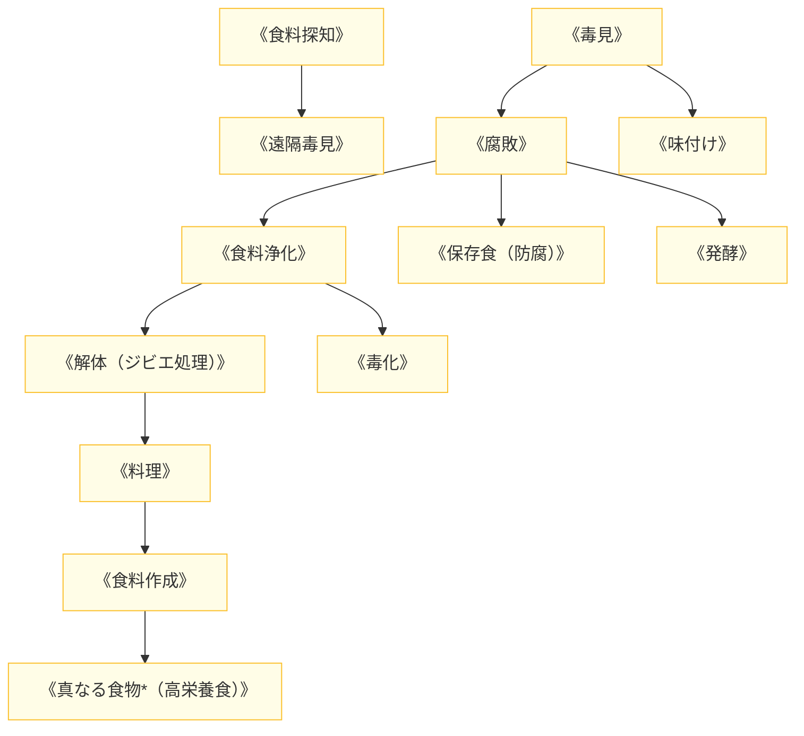

# 食料系呪文 (Food Spells)

本ドキュメントは、ガープス第4版『魔法大全』第11章（pp.74-76）および関連拡張サプリメントの公式データを基に、食料・飲料の生成、腐敗・発酵制御、生体解体、および2026年現代における魔獣肉ジビエ流通（三段階分類法）と安全衛生管理を体系化した公式魔術アーカイブです。

---

## 1. 食料系魔術の力学

食料系呪文は、有機物の生化学的代謝、腐敗細菌・酵素反応、水分保持、栄養素の凝縮をマナで制御する魔術体系です。
※本世界観において**「魔力抜き」という科学的・魔術的工程は存在せず**、毒素中和や解体手順は現実の生化学・衛生管理と経験則に基づいて行われます。

### 1.1 前提条件ツリー (Prerequisite Tree)

---

## 2. 食料系主要呪文データ一覧

| 呪文名（日 / 英） | クラス | 基本消費 / 維持 | 詠唱時間 | 前提条件 | 効果概要・力学 |
| :--- | :---: | :---: | :---: | :--- | :--- |
| **《食料探知》** Seek Food | 情報 | 2 / 不可 | 1秒 | なし | 周囲にある食用可能な動植物・備蓄食料を探知。 |
| **《毒見》** Test Food | 情報 | 1〜3 / 不可 | 1秒 | なし | 飲食物に含まれる生体毒、重金属、細菌汚染を検知。 |
| **《腐敗》** Decay | 通常 | 1 (1食毎) / 永久 | 1秒 | 《毒見》 | 目標の食品の酸化・腐敗菌増殖を爆発的に加速させ廃棄化。 |
| **《味付け》** Season | 通常 | 2 (1食毎) / 永久 | 10秒 | 《毒見》 | 食塩、スパイス、旨味成分の分子構造を模倣して風味を改善。 |
| **《食料浄化》** Purify Food | 通常 | 1 (0.5kg毎) / 永久 | 1秒 | 《腐敗》 | 有害細菌、寄生虫卵、軽度毒素を無害化・滅菌。 |
| **《解体》** Prepare Game | 通常 | 2 / 永久 | 10秒 | 《食料浄化》 | 狩猟した魔獣・鳥獣の内臓摘出、放血、皮剥ぎを瞬時に完了。 |
| **《料理》** Cook | 通常 | 1 (1食毎) / 永久 | 5秒 | 《毒見》, 《炎作成》 | 熱源なしに食品を最適な温度と火加減で均一加熱調理。 |
| **《保存食》** Preserve Food | 通常 | 3 (1食毎) / 永久 | 1秒 | 《腐敗》 | 1週間〜数ヶ月間、味と栄養価を損なわずに完全防腐。 |
| **《食料作成》** Create Food | 通常 | 2 (1食毎) / 永久 | 30秒 | 《料理》, 《食料探知》 | マナを凝縮して無味だが完全な栄養価を持つクラッカー状食品を作成。 |
| **《真なる食物*》** Essential Food | 通常 | 4 (1食毎) / 永久 | 1分 | 《食料作成》, 素質2 | 1口で1日分のエネルギーと代謝活性をもたらす超高機能レーションを作成。 |

---

## 3. 2026年魔獣ジビエ流通（三段階分類法）と解体現場での運用

### 3.1 豊洲中央流通HDおよび解体前線基地（八王子・大宮・柏）での《解体》運用
壁外アウトランドで討伐された魔獣（Class-A: 安全種 / Class-B: 要処理種）は、鮮度低下やマナ変異変質を防ぐため、前線基地の解体プラントへ即時搬送されます。国家資格を持つ専門解体術士が《解体》《食料浄化》を連続発動することで、寄生虫や胆汁の肉への混入をゼロにし、高級ジビエ肉として市場へ供給しています。

### 3.2 汚染種（Class-C）のバイオハザード検知
《毒見》により、摂取すると致命的な細胞変異や精神汚染を引き起こすアビス汚染肉（Class-C）を瞬時にスクリーニングします。Class-C指定を受けた魔獣肉は流通網から完全遮断され、焼却炉で高熱破棄されます。
