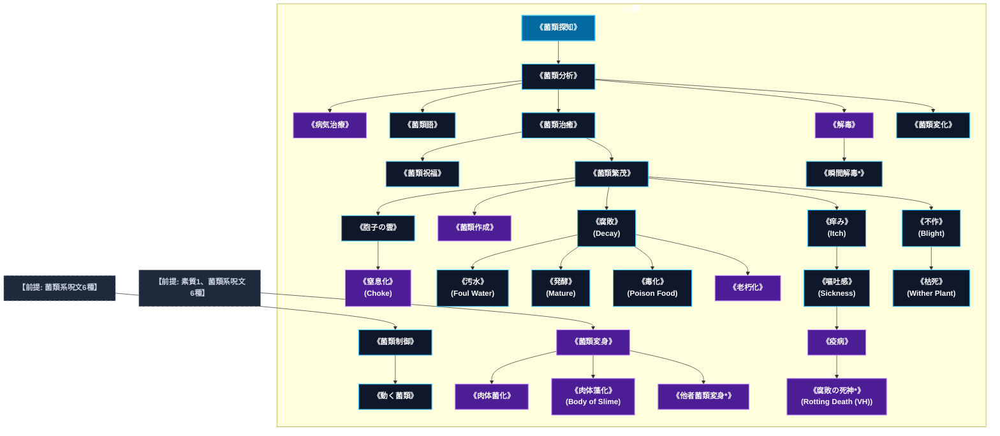

# 菌類系呪文 (Fungus Spells)

本ドキュメントは、ガープス公式拡張サプリメント『GURPS Magic: Plant Spells』に準拠した、**全30種**の菌類系公式呪文アーカイブです。キノコ、カビ、酵母、変異粘菌、菌糸ネットワークの励起・制御、有機物腐敗分解、ならびに2026年現代における結界都市地下インフラ管理・バイオハザード防衛・生化学醸造特許・法規制（CR）の運用データを過不足なく完全網羅しています。

---

## 1. 菌類系魔術の力学体系

菌類系呪文は、マナの低周波共鳴を介して真菌類の胞子発芽、菌糸伸長、酵素分泌による有機物分解、ならびに変異代謝物質（マイコトキシン）の生成速度を直接制御する特殊生命魔術体系です。
- **腐生・分解の超加速**: 《腐敗》《老朽化》は、セルロースやタンパク質、炭化水素化合物を数秒で加水分解・酸化分解し、有機構造物を瞬時に泥状へと崩壊させます。
- **胞子エアロゾルと生体侵襲**: 《胞子の雲》《窒息化》《疫病》は、術士のマナによって活性化された変異微小胞子を大気中に拡散させ、呼吸器の急速閉塞や急性菌血症・皮膚壊死を引き起こします。
- **発酵工学と解毒バイオ**: 《発酵》《解毒》《病気治療》は、有益な酵母・放線菌・分解菌の共生活性を極大化し、工業的な醸造・抗生物質合成や有毒真菌毒素の無害化を瞬時に達成します。

### 1.1 菌類系呪文 前提条件ツリー (Prerequisite Tree)

菌類系呪文全30種の完全な習得体系図です。紫色枠は至難（VH）呪文を示します。菌類系は《菌類探知》を起点とし、分析・治癒・繁茂を経て高度な生体変成・腐敗兵器へと分岐・完結する整然たるツリー構造を有しています。

---

## 2. 公式拡張『Magic: Plant Spells』菌類系呪文（30種）

菌類系呪文の多くは植物系呪文の真菌類対応変種として設計されており、植物系呪文と同等の魔力消費と詠唱時間で真菌・酵母・カビを操作可能です。

| 呪文名（日 / 英） | クラス | 持続時間 | 基本消費 / 維持 | 詠唱時間 | 前提条件 | 効果概要・力学 |
| :--- | :---: | :---: | :---: | :---: | :--- | :--- |
| **《動く菌類》** <small>（《動く植物》の変種）</small> Animate Fungus | 通常 | 1分 | さまざま | 5秒 | 《菌類制御》 | 効果の詳細は公式ルールブック（『魔法大全』または『Magic: Plant Spells』）を参照。 |
| **《菌類祝福》** <small>（《植物祝福》の変種）</small> Bless Fungus | 範囲 | 1収穫期 | 1 | 5分 | 《菌類治癒》 | 効果の詳細は公式ルールブック（『魔法大全』または『Magic: Plant Spells』）を参照。 |
| **《不作》** Blight | 範囲 | 1収穫期 | 1 | 5分 | 《菌類繁茂》 | 効果範囲内の植物は、残りの生育期間、通常より生長が遅く、ひ弱になります。範囲内の収穫量は半減します。また、葉や果実やつぼみが落ちるといった影響が即座に現われます。影響を受けた植物は数日経つと、（部分的にですが）回復します。 |
| **《肉体菌化》** <small>（《肉体木化》の変種）</small> Body of Fungus | 通常 | 1分 | 7・3 | 5秒 | 素質2、《菌類変身》 | 効果の詳細は公式ルールブック（『魔法大全』または『Magic: Plant Spells』）を参照。 |
| **《肉体藻化》** Body of Slime | 通常 | 1分 | 6・2 | 5秒 | 素質2、《菌類変身》 | _ 生命力 、 水中用ので、 目標 は緑色の藻の動く塊になります――水草やアオミドロ、腐葉土など、沼地で見つかるようなものならなんでもかまいません。 目標 は一時的に 共通性質 「 藻の体 」を得ます。 3キロまでの衣服も藻になりますが、 魔法 のものは魔力を失います。 |
| **《窒息化》** Choke | 通常 | 30秒 | 4 | 1秒 | 素質1、《胞子の雲》 | 呪文 呼吸関連 危険 危険 |
| **《菌類作成》** <small>（《植物作成》の変種）</small> Create Fungus | 範囲 | 永久 | さまざま | 秒=コスト | 素質1、《菌類繁茂》 | 効果の詳細は公式ルールブック（『魔法大全』または『Magic: Plant Spells』）を参照。 |
| **《病気治療》** <small>（対菌類のみ）</small> Cure Disease | 通常 | 一瞬 | 4 | 10分 | 素質3、《菌類分析》 | 目標 の身体から、あらゆる 病気 、疫病、微生物による伝染病を1つ選んで取り除くことができます。 術者 かだれかが前もって〈 診断 〉 技能 の判定に成功しなければなりません。 診断 に成功していなければ、 呪文 を使うときの判定に-5します！ 病気 によるダメージを癒すことはできません――かかっている病を取り除くだけです。 |
| **《腐敗》** Decay | 通常 | 永久 | 1/1食毎 | 1秒 | 《菌類繁茂》 | 食料を即座に腐らせ、食べられなくしてしまいます（1分以内にやを唱えれば、食べ物は無事です）。 |
| **《汚水》** Foul Water | 範囲 | 永久 | 3 | 1秒 | 《腐敗》 | 水を飲めなくします。汚水は色も臭いも異様なのですぐにわかりますが、汚染されたビールやワインはもっと見わけにくいでしょう。うっかり汚水を飲んでしまったら、 生命力 判定を行なわねばなりません。成功すれば、気分が悪くなり、 HP を2点失うだけで済みます。失敗すると、激しい腹痛に襲われ、 HP を1D+1点失います。さらに、 HP が完全に回復するまで、 |
| **《菌類制御》** <small>（《植物制御》の変種）</small> Fungus Control | 通常/抵-意志力 | 1分 | 3・半 | 1秒 | 菌類系呪文6種 | 効果の詳細は公式ルールブック（『魔法大全』または『Magic: Plant Spells』）を参照。 |
| **《菌類変身》** <small>（《植物変身》の変種）</small> Fungus Form | 特殊 | 1時間 | 5・2 | 1秒 | 素質1、菌類系呪文6種 | 効果の詳細は公式ルールブック（『魔法大全』または『Magic: Plant Spells』）を参照。 |
| **《他者菌類変身*》** <small>（《他者植物変身》の変種）</small> Fungus Form Other (VH) | 特殊/抵-意志力 | 1時間 | 5・2 | 30秒 | 素質2、《菌類変身》 | （至難）（Fungus Form Other (VH)） の 版。 |
| **《菌類繁茂》** <small>（《植物繁茂》の変種）</small> Fungus Growth | 範囲 | 1分 | 3・2 | 10秒 | 《菌類治癒》 | 効果の詳細は公式ルールブック（『魔法大全』または『Magic: Plant Spells』）を参照。 |
| **《菌類語》** <small>（《植物語》の変種）</small> Fungus Speech | 通常 | 1分 | 3・2 | 1秒 | 《菌類分析》 | 効果の詳細は公式ルールブック（『魔法大全』または『Magic: Plant Spells』）を参照。 |
| **《菌類治癒》** <small>（《植物治癒》の変種）</small> Heal Fungus | 範囲 | 永久 | 3 | 1分 | 《菌類分析》 | 効果の詳細は公式ルールブック（『魔法大全』または『Magic: Plant Spells』）を参照。 |
| **《菌類分析》** <small>（《植物分析》の変種）</small> Identify Fungus | 情報 | 一瞬 | 2 | 1秒 | 《菌類探知》 | 効果の詳細は公式ルールブック（『魔法大全』または『Magic: Plant Spells』）を参照。 |
| **《瞬間解毒*》** <small>（対菌類のみ）</small> Instant Neutralize Poison (VH) | 通常 | 一瞬 | 8 | 1秒 | 《解毒》 | （至難） （至難） と同じ効果ですが、効果は 一瞬 です。事前に〈 毒物 〉判定を行う必要もありません。 |
| **《痒み》** Itch | 通常/抵-生命力 | かくまで# | 2 | 1秒 | 《菌類繁茂》 | 効果の詳細は公式ルールブック（『魔法大全』または『Magic: Plant Spells』）を参照。 |
| **《発酵》** Mature | 通常 | 永久 | 1/1食毎 | 10秒 | 《腐敗》 | 発酵や熟成が必要な食べ物の熟成過程を早めます。ビールやワインに対して最も頻繁に利用されますが、チーズやヨーグルト、パン生地、肉の熟成を早めるのにも使えます。 この 呪文 は、通常なら何日あるいは何週間もかかる熟成過程（ビール、ワイン、熟成したチーズ、ピクルス、干し肉）を1時間で終わらせます。何時間かで済む熟成（パン生地、ヨーグルト、新鮮なチーズ）なら、1分で済みます。何年もかかる熟成（高 |
| **《解毒》** <small>（対菌類のみ）</small> Neutralize Poison | 通常 | 永久 | 5 | 30秒 | 素質3、《菌類分析》 | 身体のなかから選んだ 毒 を1つ、跡形もなく消します。 術者 かだれかが前もって〈 毒 物 技能 の判定に成功し、どんな 毒 であるのかはっきりさせておかなくてはなりません。そうしないと、 呪文 を使うさいに-5の修正を受けます！ 直接にダメージを与えない 霊薬 （エリクサ）には効果がありません。また、すでに受けたダメージを癒すこともできません――残っている 毒 を取り |
| **《疫病》** <small>（菌類由来のみ）</small> Pestilence | 通常 | 永久 | 6 | 30秒 | 素質1、《嘔吐感》 | 目標 を忌まわしい疫病に感染させます（ 目標 は 術者 が選びますが、ふさわしくないものは GM が拒否できます）。これは自然に感染した場合と同じ経過を辿ります。すぐに発病することはあまりないでしょう。 |
| **《毒化》** Poison Food | 通常 | 永久 | 3/1食毎 | 1秒 | 《腐敗》 | 食料に 毒 を混ぜこみます。この 毒 ははっきりとわかりませんが、を使えば感知できます。 毒 化された食料を食べた者は 生命力 判定を行なわねばなりません。成功すれば、気分が悪くなって HP を2点失います。失敗すると激しい胃痙攣を起こし、即座に HP を1D+1点失います。失った HP を回復するまで、すべての 技能 や 呪文 の判定に-3の修正を受けます |
| **《腐敗の死神*》** Rotting Death (VH) | 通常/抵-生命力 | 1秒 | 3・2 | 3秒 | 素質2、《疫病》 | （至難） _ 生命力 、 術者 は 目標 に触れなければなりません。 目標 は身体の内側から腐りはじめます。毎 ターン 、 目標 は 生命力 判定を行なわねばなりません。失敗すると、1D-1点のダメージを受けます。 ファンブル すると6点のダメージを受けます。成功すると、その ターン はダメージを |
| **《老朽化》** <small>（有機的対象のみ）</small> Ruin | 通常 | 1分# | 2/0.5kg毎・同 | 5秒/0.5kg毎 | 素質1、《腐敗》 | 浄化・無生物 が劣化する速度をはやめます。鉄を錆びさせることもできますが、よっぽど長時間かけないかぎり、その他の金属にはほとんど効果がありません。有機物――皮、毛皮、木、 プラスチック など――を腐らせて使い物にならなくすることができます。セラミックはに影響を受けません。 |
| **《菌類探知》** <small>（《植物探知》の変種）</small> Seek Fungus | 情報 | 一瞬 | 2 | 1秒 | - | 効果の詳細は公式ルールブック（『魔法大全』または『Magic: Plant Spells』）を参照。 |
| **《菌類変化》** <small>（《植物変化》の変種）</small> Shape Fungus | 通常 | 1分 | 3・1# | 10秒 | 《菌類分析》 | 効果の詳細は公式ルールブック（『魔法大全』または『Magic: Plant Spells』）を参照。 |
| **《嘔吐感》** Sickness | 通常/抵-生命力 | 1分 | 3・3 | 4秒 | 《痒み》 | で 。と似ているが、こちらの方が「心身不調」や「Sickness」の意味合いが強く、より効果が持続し、の対象になる。 呪文 _ 生命力 、 目標 は気持ち悪くなり 吐き気 をもよおします（目ま |
| **《胞子の雲》** <small>（《花粉の雲》の変種）</small> Spore Cloud | 範囲/抵-生命力 | 5分# | 1 | 1秒 | 《菌類繁茂》 | 効果の詳細は公式ルールブック（『魔法大全』または『Magic: Plant Spells』）を参照。 |
| **《枯死》** Wither Plant | 範囲/抵-生命力 | 永久 | 2 | 10秒 | 《不作》 | 効果の詳細は公式ルールブック（『魔法大全』または『Magic: Plant Spells』）を参照。 |

---

## 3. 2026年現代戦術・都市インフラ防衛・法規制（CR）における運用

### 3.1 結界都市地下調節池・閉鎖空間における真菌災害防除
東京地下調節池要塞網、春日部放水路、地下鉄網、ならびに核・マナシェルター等の高湿度・閉鎖環境において、変異カビや真菌性バイオハザードは都市機能を麻痺させる重大な脅威です。東京都環境保安局および自衛隊施設科は、専門の菌類術士を配備し、《菌類探知》《菌類分析》《菌類治癒》《解毒》を用いた定期的な真菌スキャンと空気清浄フィルターのバイオ防護を常時実施しています。

### 3.2 メガコーポによる発酵バイオテクノロジーと特許利権
テイコク製薬、豊洲中央流通HD、サエデル・シュティフトゥング等のメガコーポは、菌類系呪文を用いた高速発酵・高付加価値バイオ医薬品（抗生ペプチド・抗マナ代謝阻害剤）の製造ラインを工業化しています。特に《発酵》を応用した合成食料・医薬品培養プラントは莫大な利益を生み出しており、野生菌類の採取や無認可培養に対しては厳しい特許侵害監視網が敷かれています。

### 3.3 生化学兵器規制（CWC連動）および法規制（CR）
人体を内部から腐敗・液状化させる《腐敗の死神*》や、広域に致死性真菌症を蔓延させる《疫病》《毒化》《老朽化》は、化学兵器禁止条約（CWC）および国際魔導協定（IMA）により**規制等級CR4（軍事使用厳禁・人道に対する罪）**に指定されています。これらの呪文の所持・研究はアビス異端審問室および公安特殊課の厳格な摘発対象であり、違反者は国際魔導軍事裁判に付されます。

---

## 4. 参考文献・典拠アーカイブ
- 『GURPS Magic: Plant Spells』（SJ Games 公式拡張サプリメント, Fungus Spells Section）
- 『GURPS Magic 4th Edition』各関連呪文（Decay, Itch, Sickness, Ruin, Pestilence等）
- 東京都環境保安局『閉鎖空間における真菌災害防護マニュアル（2026年版）』
