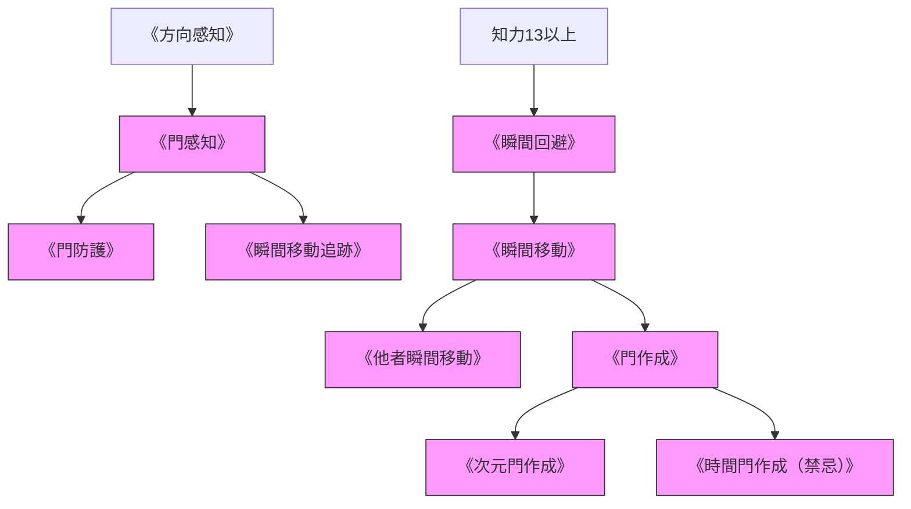

# 門・扉・空間移動系呪文 (Gate & Space-Time Spells)

本ドキュメントは、ガープス第4版『魔法大全』第11章「門・扉系呪文」および関連データ（`magic_page_170`〜`173`）を基に、空間跳躍、異次元ゲート、および2026年現代における4大アビス特異点・歪曲海域との力学を体系化した公式魔術アーカイブです。

---

## 1. 空間移動・特異点力学

空間の歪曲や次元の裂け目を介した移動呪文は、マナの局所的超高密度集中を必要とし、アビス特異点や異界からの侵食現象と直接連動しています。

### 1.1 前提条件ツリー (Prerequisite Tree)

---

## 2. 空間・門系統主要呪文データ一覧

| 呪文名（日 / 英） | 呪文クラス | 基本消費 / 維持 | 詠唱時間 | 前提条件 | 効果概要・力学 |
| :--- | :---: | :---: | :---: | :--- | :--- |
| **《門感知》** Seek Gate | 情報 | 3 / 不可 | 1秒 | 《方向感知》 | 半径数km以内の自然または人工の次元断層・ゲートを探知。 |
| **《門防護》** Ward Gate | 範囲 | 4 / 2 | 5秒 | 《門感知》 | 空間ゲートからの異界生物流入を遮断・封鎖する。 |
| **《瞬間回避》** Blink | 防御 | 2 / 不可 | 即時 | 知力13以上 | 攻撃を受けた瞬間に数m側方へショートワープして完全回避。 |
| **《瞬間移動》** Teleport | 特殊 | 距離依存 | 1秒 | 《瞬間回避》 | 術者自身を既知の座標へ瞬時に転送。重量・距離でFP激増。 |
| **《他者瞬間移動》** Teleport Other | 通常 | 距離・重量依存 | 2秒 | 《瞬間移動》 | 接触または視界内の味方・敵を強制空間転送（意志力抵抗）。 |
| **《門作成》** Create Gate | 特殊（魔化） | 100以上 / 恒久 | 1時間以上 | 《瞬間移動》 | 2つの固定地点を常時連結する空間ポータルを開通。 |
| **《次元門作成》** Planar Gate | 特殊（魔化） | 500以上 / 恒久 | 儀式 | 《門作成》 | アストラル界や異界（アビス）と直接連結するポータル。 |
| **《時間門作成》** Time Gate | 特殊（禁忌） | 2000以上 | 大儀礼 | 《門作成》 | 過去または未来との時間トンネル。国際条約で完全禁止。 |

---

## 3. 現代魔導科学・アビス特異点における適用

### 3.1 4大アビス特異点と自然発生ゲート
世界4大アビス特異点（マリアナ海溝大断層、ツングースカ大空洞、サハラ・オアシス、バミューダ歪曲海域）では、超濃マナによる自然の《次元門》が常時開いており、異界生態系が絶え間なく流入しています。自衛隊および国連特務部隊は、外縁部に《門防護》の永久結界基盤を配置して監視・封じ込めを行っています。

### 3.2 メガコーポの物流・緊急展開
ヤマト重工およびレンラクは、特定重要拠点間に限定的な《門作成》ポータルを維持していますが、莫大な維持コストとマナ漏洩リスクのため、通常物流ではなくVIP緊急脱出や特務部隊の即時投入に限定運用されています。
