# 転送系呪文 (Gate Spells)

本ドキュメントは、ガープス第4版『魔法大全』第19章（pp.116-121）および公式拡張サプリメント（『Magic: Artillery Spells』『Magic: Death Spells』『Magic: The Least of Spells』『Magic: Plant Spells』等）に準拠した、**全38種**の転送系呪文公式アーカイブです。マナ力学、生体媒介作用、ならびに2026年現代における結界都市防衛・軍事兵器工学・法規制（CR）の運用データを過不足なく完全網羅しています。

---

## 1. 転送系呪文の力学体系

転送系呪文は、マナの指向性周波数を介して対象の物理・生体・霊的パラメータを励起・変調・制御する魔術体系です。
- **生体媒介原則**: マナは術士の生体・神経系・霊体を介して作用し、直接の物質変換や物理エネルギー励起を行います。
- **現代技術インフラとの並行性**: 電子回路や通信網を直接破壊するのではなく、物理的現象（熱、圧力、電磁、物質変形等）を介して現代兵器や都市防護壁と相互作用します。

### 1.1 転送系呪文 前提条件ツリー (Prerequisite Tree)

```mermaid
graph TD
    %% クラススタイル定義（高コントラスト・ダークモード規格）
    classDef spell fill:#0f172a,stroke:#38bdf8,stroke-width:1.5px,color:#ffffff;
    classDef root fill:#0369a1,stroke:#38bdf8,stroke-width:2px,color:#ffffff,font-weight:bold;
    classDef ext fill:#1e293b,stroke:#94a3b8,stroke-width:1px,color:#cbd5e1,stroke-dasharray: 5 5;
    classDef special fill:#4c1d95,stroke:#c084fc,stroke-width:1.5px,color:#ffffff;

    %% 系統内呪文ノード定義
    subgraph Sub_63A9D41 ["30種"]
        Teleport["《瞬間移動*》<br>(Teleport)"]:::spell
        TeleportOther["《他者瞬間移動*》<br>(Teleport Other)"]:::special
        Blink["《瞬間回避》<br>(Blink)"]:::spell
        BlinkOther["《他者瞬間回避*》<br>(Blink Other)"]:::spell
        Timeport["《時間移動*》<br>(Timeport)"]:::special
        TimeportOther["《他者時間移動*》<br>(Timeport Other)"]:::spell
        Timeslip["《緊急回避》<br>(Timeslip)"]:::spell
        TimeslipOther["《他者緊急回避*》<br>(Timeslip Other)"]:::spell
        RapidJourney["《往復旅行*》<br>(Rapid Journey)"]:::special
        PlanarSummons["《異次元召喚》<br>(Planar Summons)"]:::special
        PlanarVisit["《異次元訪問*》<br>(Planar Visit)"]:::special
        PlaneShift["《異次元移動*》<br>(Plane Shift)"]:::spell
        PlaneShiftOther["《他者異次元移動*》<br>(Plane Shift Other)"]:::special
        Phase["《瞬間無敵》<br>(Phase)"]:::special
        PhaseOther["《他者無敵*》<br>(Phase Other)"]:::spell
        Beacon["《標識》<br>(Beacon)"]:::spell
        TraceTeleport["《転移追跡》<br>(Trace Teleport)"]:::spell
        DivertTeleport["《移動妨害*》<br>(Divert Teleport)"]:::special
        TeleportShield["《瞬間移動阻止》<br>(Teleport Shield)"]:::spell
        CreateDoor["《扉作成》<br>(Create Door)"]:::spell
        SeekGate["《門探知》<br>(Seek Gate)"]:::special
        ScryGate["《門調査》<br>(Scry Gate)"]:::spell
        ControlGate["《門制御》<br>(Control Gate)"]:::special
        CreateGate["《門作成*》<br>(Create Gate)"]:::spell
        Sp_25_4D2D["《減速空間*》<br>(（旧名：減速）)"]:::special
        Sp_26_4CF9["《加速空間*》<br>(（旧名：加速）)"]:::special
        HideObject["《物体消失》<br>(Hide Object)"]:::spell
        Sanctuary["《隠し部屋*》<br>(Sanctuary)"]:::spell
        SuspendTime["《一時停止*》<br>(Suspend Time)"]:::special
        TimeOut["《時よ止まれ*》<br>(Time Out)"]:::special
    end

    subgraph Sub_6B5BB4DD ["MAS / MDS 拡張 3種"]
        HellZone["《敵界誘引*》<br>(Hell Zone)"]:::special
        NullSphere["《虚空弾*》<br>(Null Sphere)"]:::special
        Splat["《即落*》<br>(Splat)"]:::special
    end

    subgraph Sub_E032978 ["MAS / MDS 拡張 2種"]
        DimensionalDissection["《えぐり飛ばし*》<br>(Dimensional Dissection)"]:::special
        UnderworldImprisonment["《冥界送り*》<br>(Underworld Imprisonment)"]:::special
    end

    %% 前提条件依存関係エッジ
    Ext_1 --> Teleport
    Ext_2 --> TeleportOther
    Ext_2 --> Blink
    Blink --> BlinkOther
    Ext_2 --> Timeport
    Ext_3 --> TimeportOther
    Ext_3 --> Timeslip
    Timeslip --> TimeslipOther
    Ext_2 --> RapidJourney
    Ext_3 --> RapidJourney
    Req_4 --> PlanarSummons
    Ext_5 --> PlanarVisit
    PlanarSummons --> PlanarVisit
    PlanarSummons --> PlaneShift
    Ext_6 --> PlaneShiftOther
    Ext_6 --> Phase
    Ext_7 --> Phase
    Phase --> PhaseOther
    Ext_2 --> Beacon
    Ext_3 --> Beacon
    Ext_6 --> Beacon
    Ext_2 --> TraceTeleport
    Ext_3 --> TraceTeleport
    Ext_6 --> TraceTeleport
    TraceTeleport --> DivertTeleport
    Ext_8 --> TeleportShield
    Ext_9 --> TeleportShield
    Ext_2 --> TeleportShield
    Ext_2 --> CreateDoor
    Ext_10 --> SeekGate
    SeekGate --> ScryGate
    SeekGate --> ControlGate
    ControlGate --> CreateGate
    Ext_2 --> CreateGate
    Ext_3 --> CreateGate
    Ext_6 --> CreateGate
    Req_11 --> Sp_25_4D2D
    Req_11 --> Sp_26_4CF9
    Ext_12 --> HideObject
    Ext_2 --> HideObject
    HideObject --> Sanctuary
    Ext_13 --> SuspendTime
    Ext_14 --> TimeOut
    Beacon --> HellZone
    PlanarSummons --> HellZone
    Ext_15 --> NullSphere
    CreateDoor --> Splat
    Ext_16 --> DimensionalDissection
    Ext_17 --> DimensionalDissection
    Ext_18 --> DimensionalDissection
    Ext_16 --> UnderworldImprisonment

    %% 外部系統・特殊前提ノード
    Ext_1["【他系統: 《高速飛行》】"]:::ext
    Ext_2["【他系統: 《瞬間移動》】"]:::ext
    Ext_3["【他系統: 《時間移動》】"]:::ext
    Req_4["【前提: 素質1、10系統から各1種】"]:::ext
    Ext_5["【他系統: 《幻視》】"]:::ext
    Ext_6["【他系統: 《異次元移動》】"]:::ext
    Ext_7["【他系統: 《幽体離脱》】"]:::ext
    Ext_8["【他系統: 《番犬》】"]:::ext
    Ext_9["【他系統: 《呪文障壁》】"]:::ext
    Ext_10["【他系統: 《魔法探知》】"]:::ext
    Req_11["【前提: 素質2、知力13以上、10系統から各2種】"]:::ext
    Ext_12["【他系統: 《隠し金庫》】"]:::ext
    Ext_13["【他系統: 《減速空間》】"]:::ext
    Ext_14["【他系統: 《加速空間》】"]:::ext
    Ext_15["【他系統: 《門作成》】"]:::ext
    Ext_16["【他系統: 《他者異次元移動》】"]:::ext
    Ext_17["【他系統: 《他者瞬間移動》】"]:::ext
    Ext_18["【他系統: 《他者時間移動》】"]:::ext
```

---

## 2. ガープス第4版『魔法大全』基本転送系呪文（30種）

| 呪文名（日 / 英） | クラス | 持続時間 | 基本消費 / 維持 | 詠唱時間 | 前提条件 | 効果概要・力学 |
| :--- | :---: | :---: | :---: | :---: | :--- | :--- |
| **《瞬間移動*》** Teleport* | 特殊 | 一瞬 | さまざま | 1秒 | 知力13以上と異なる10系統から各1種、ないし《高速飛行》 | 年05月07日(日) 08:31:17 履歴 |
| **《他者瞬間移動*》** Teleport Other* | 通常/抵-意志力+1 | 一瞬 | さまざま | 1秒 | 素質3、《瞬間移動》 | 呪文データ 呪文データ |
| **《瞬間回避》** Blink | 防御 | 一瞬 | 2 | 1秒 | 《瞬間移動》 | 詳細参照 |
| **《他者瞬間回避*》** Blink Other* | 防御 | 一瞬 | 2 | 1秒 | 《瞬間回避》 | 呪文データ 呪文データ |
| **《時間移動*》** Timeport* | 特殊 | 一瞬 | さまざま | 1秒 | 素質3、《瞬間移動》 | 呪文データ 呪文 表 |
| **《他者時間移動*》** Timeport Other* | 通常/抵-意志力+1 | 一瞬 | さまざま | 1秒 | 《時間移動》 | 呪文データ |
| **《緊急回避》** Timeslip | 防御 | 一瞬 | 1/1秒毎 # | 1秒 | 《時間移動》 | 呪文データ 防御 |
| **《他者緊急回避*》** Timeslip Other* | 防御 | 一瞬 | 1/1秒毎 # | 1秒 | 《緊急回避》 | 呪文データ 防御 |
| **《往復旅行*》** Rapid Journey* | 特殊 | 1分 | さまざま | 5秒 | 素質3、《瞬間移動》ないし《時間移動》 | 呪文データ 呪文データ |
| **《異次元召喚》** Planar Summons | 特殊 | 1時間 | 20# | 5分 | 素質1、10系統から各1種 | 年05月06日(月) 21:26:15 履歴 |
| **《異次元訪問*》** Planar Visit* | 特殊 | 1分 | 4/2 | 30秒 | 素質2、《幻視》ないし《異次元召喚》 | もし肉体に戻る前に 呪文 の効果が切れたり、元の肉体が傷つけられた場合、 長距離の修正値 を用いて 生命力 判定を行わねばなりません。失敗すると死んでしまいます！ 言うまでもないことですが、この 呪文 の効果時間中、元の肉体は完全に無防備です。もっとも、簡単な医学的な 診断 によって、肉体は（かろうじて）生きていることが分かります。 |
| **《異次元移動*》** Plane Shift* | 特殊 | 一瞬 | 20 | 5秒 | 《異次元召喚》 | 呪文 要専門化技能 |
| **《他者異次元移動*》** Plane Shift Other* | 通常/抵-意志力+1 | 一瞬 | 20 | 5秒 | 素質3、《異次元移動》 | 呪文データ |
| **《瞬間無敵》** Phase | 防御 | 一瞬 | 3 | 1秒 | 素質3、《異次元移動》ないし《幽体離脱》 | 呪文データ 防御 |
| **《他者無敵*》** Phase Other* | 防御 | 一瞬 | 3 | 1秒 | 《瞬間無敵》 | 呪文データ 防御 |
| **《標識》** Beacon | 範囲 | 24時間 | 10/半 | 30秒 | 《瞬間移動》、《時間移動》、ないし《異次元移動》 | 呪文データ 呪文データ |
| **《転移追跡》** Trace Teleport | 情報/抵-呪文 | 一瞬 | 3 | 1秒 | 《瞬間移動》、《時間移動》、ないし《異次元移動》 | 年06月06日(土) 20:57:21 履歴 |
| **《移動妨害*》** Divert Teleport* | 防御/抵-呪文 | 一瞬 | さまざま | 1秒 | 素質3、《転移追跡》 | 呪文データ 呪文データ |
| **《瞬間移動阻止》** Teleport Shield | 範囲 | 1時間 | 1/同# | 10秒 | 《番犬》と、 《呪文障壁》ないし《瞬間移動》 | 防御・防御・呪文データ 呪文データ 壁・ |
| **《扉作成》** Create Door | 通常 | 10秒 | 2/1平方m毎 # | 5秒 | 《瞬間移動》、通過歩行系呪文1種 | 詳細参照 |
| **《門探知》** Seek Gate | 情報 | 一瞬 | 3 | 10秒 | 素質2、《魔法探知》、10系統から各1種 | 最低魔化e100以下 呪文データ |
| **《門調査》** Scry Gate | 通常 | 1分 | 4/4 | 10秒 | 《門探知》 | 呪文データ |
| **《門制御》** Control Gate | 通常/抵-門作った呪文 | 1分 | 6/3 | 10秒 | 素質3、《門探知》 | 詳細参照 |
| **《門作成*》** Create Gate* | 通常 | 1分 | さまざま | さまざま | 《門制御》 と、対応する《瞬間移動》《時間移動》《異次元移動》のいずれか | 詳細参照 |
| **《減速空間*》** （旧名：減速） Slow Time* | 範囲/抵-特殊 | 1分 | さまざま | 2秒 | 素質2、知力13以上、10系統から各2種 | 呪文データ |
| **《加速空間*》** （旧名：加速） Accelerate Time* | 範囲/抵-特殊 | 1分 | さまざま | 2秒 | 素質2、知力13以上、10系統から各2種 | 呪文データ |
| **《物体消失》** Hide Object | 通常 | 1時間 | 1/0.5kg毎/同 | 10秒 | 《隠し金庫》、《瞬間移動》 | 呪文データ |
| **《隠し部屋*》** Sanctuary* | 特殊 | 1時間 | 5/同 | 10秒 | 《物体消失》 | 年05月23日(土) 15:08:34 履歴 |
| **《一時停止*》** Suspend Time* | 範囲/抵-特殊 | 1日 | 5/5 | 5分 | 素質3、《減速空間》 | 詳細参照 |
| **《時よ止まれ*》** Time Out* | 範囲 | 一瞬# | 5 | 5分 | 素質3、《加速空間》 | 呪文データ |

---

## 3. 魔導兵器・砲兵戦術拡張呪文（MAS / MDS 拡張 3種）

| 呪文名（日 / 英） | クラス | 持続時間 | 基本消費 / 維持 | 詠唱時間 | 前提条件 | 効果概要・力学 |
| :--- | :---: | :---: | :---: | :---: | :--- | :--- |
| **《敵界誘引*》** Hell Zone* | 範囲 | 10秒 | 10・半 | 3秒 | 素質4、《標識》、“ 敵対的 ”領域への《異次元召喚》1種 | （Hell Zone (VH)） p.16 （至難） 召喚・敵対的な異次元存在（ 精霊 、 悪魔 、夢の世界からの悪夢、ヤギひげを生やした鏡像宇宙の自己、 知る能わざるもの 、あるいはそれ以上の存在）に対して、局所的な時空を “ 緩め ” ます。これらの存在は、安全な本来の領域から範囲内 |
| **《虚空弾*》** Null Sphere* | 射撃 | 一瞬 | 4〜4×素質 | 1〜3秒 | 素質5、《門作成》 | （至難（Null Sphere (VH)） p.16 （至難） 片手に黒い虚無の球体を作り出します。これは異次元への小さな 門 です！ 壁や床などに投げつけることができ（命中修正+4）、あるいは個人に投げつけることもできます。 正確さ +2、 半致傷距離 40、 最大射程 80です。 命中判定 には〈 特殊攻撃 /射出物〉 |
| **《即落*》** Splat* | 範囲 | 一瞬 | 5 | 3秒 | 素質4、《扉作成》 | magic_artillery_spells 姿勢関連 |

---

## 4. 魔導兵器・砲兵戦術拡張呪文（MAS / MDS 拡張 2種）

| 呪文名（日 / 英） | クラス | 持続時間 | 基本消費 / 維持 | 詠唱時間 | 前提条件 | 効果概要・力学 |
| :--- | :---: | :---: | :---: | :---: | :--- | :--- |
| **《えぐり飛ばし*》** Dimensional Dissection* | 通常/抵-生命力か意志力 | 一瞬 | 13 | 5秒 | 素質3、および「《他者異次元移動》《他者瞬間移動》《他者時間移動》」のいずれか | （至難）（Dimensional Dissection (VH)） p.13 （至難） _ 生命力 または 意志力 対象の一部を別の場所、時間、または事象の地平面に転送しようとします。対象は 生命力 (構造的完全性を表す) または 意志力 (テレポート系の呪いでのよくある抵抗基準) のどちらかより優れ |
| **《冥界送り*》** Underworld Imprisonment * | 通常/抵-意志力 | 永久 | 14 | 3秒 | 素質3、および1種以上の《他者異次元移動》 | （至難）（Underworld Imprisonment (VH)） p.13 （至難） _ 意志力 対象者の下に次元間の亀裂が開きます。対象者は固い表面 (地面、床、または同様のもの) の上にいる必要があります。その亀裂に抵抗できなければ、犠牲者は持ち物とともに「死者の領域」（the Rea |

---

## 5. 魔導兵器・砲兵戦術拡張呪文（MAS / MDS 拡張 3種）

| 呪文名（日 / 英） | クラス | 持続時間 | 基本消費 / 維持 | 詠唱時間 | 前提条件 | 効果概要・力学 |
| :--- | :---: | :---: | :---: | :---: | :--- | :--- |
| **《転移容易化》（並）** （Easy Rider (A)） | 通常 | 1分 | 2・同 | 1秒 | -（簡単呪文なので） | （並）（Easy Rider (A)） p.10 （並） 対象を、友好的または敵対的を問わず、あらゆる形式のテレポート、時間移動、次元移動などで移動しやすい体質にします。この体質により、対象に前述の能力の使用する際の判定には+1ボーナスがつくようになります。 魔法使い は自分自身にこれを唱えることがで |
| **《見当識》（並）** （Reorient (A)） | 防御 | 一瞬 | 1 | なし | -（簡単呪文なので） | （並）（Reorient (A)） p.10 （並） テレポート、または時間や次元の移動 (攻撃ではない) に応じて、到着時の判定の代わりに発動します (どちらを用いるかを選択します)。成功と失敗はと同様に機能します。の修正は適用されませんが、移動が意図的 (既知の |
| **《呼び声》（並）** （Invoke (A)） | 特殊 | 一瞬 | 1 | 1秒 | -（簡単呪文なので） | （並）（Invoke (A)） pp.14-15 （並） 術者 が 悪魔 、死者、または類似の存在の名前を、地獄や別位相などに確実に聞こえる方法で発声できるようにします。すぐに何かを召喚することはめったにありませんが、繰り返し発動することで、何者かがそれを拾って 術者 を将来の計画に含めることが保証されるかもしれ |

---

## 6. 2026年現代戦術・都市防衛・法規制（CR）における運用

### 6.1 警察・自衛隊・PMCにおける実戦配備
結界都市（セーフゾーン）警備および壁外アウトランドへの遠征作戦において、転送系呪文は索敵・突入支援・防壁維持・目標無力化の標準プロトコルとして統合運用されています。特に部隊随伴術士による即時展開は、通常兵器との複合火力（コンバインド・アームズ）として極めて高い戦闘効率を発揮します。

### 6.2 メガコーポ支配と特許利権
ヤマト重工、テイコク製薬、サエデル・シュティフトゥング、アレス等のメガコーポは、転送系呪文の工業・医療・防衛利用に関する独占特許を保有しており、民間術士に対するライセンス管理や魔導触媒・霊薬の市場流通を掌握しています。

### 6.3 国際魔導協定（IMA）および法規制（CR）
破壊力・精神汚染・非人道性の高い高位呪文は、国家公安委員会および国際魔導協定により**規制等級CR3〜CR4（要特別国家許可・戦時国際法規制）**に指定されており、無認可での行使・研究は厳罰に処されます。