# 治癒系呪文 (Healing Spells)

本ドキュメントは、ガープス第4版『魔法大全』第16章（pp.98-103）および公式拡張サプリメント（『Magic: Artillery Spells』『Magic: Death Spells』『Magic: The Least of Spells』『Magic: Plant Spells』等）に準拠した、**全50種**の治癒系呪文公式アーカイブです。マナ力学、生体媒介作用、ならびに2026年現代における結界都市防衛・軍事兵器工学・法規制（CR）の運用データを過不足なく完全網羅しています。

---

## 1. 治癒系呪文の力学体系

治癒系呪文は、マナの指向性周波数を介して対象の物理・生体・霊的パラメータを励起・変調・制御する魔術体系です。
- **生体媒介原則**: マナは術士の生体・神経系・霊体を介して作用し、直接の物質変換や物理エネルギー励起を行います。
- **現代技術インフラとの並行性**: 電子回路や通信網を直接破壊するのではなく、物理的現象（熱、圧力、電磁、物質変形等）を介して現代兵器や都市防護壁と相互作用します。

### 1.1 治癒系呪文 前提条件ツリー (Prerequisite Tree)

```mermaid
graph TD
    %% クラススタイル定義（高コントラスト・ダークモード規格）
    classDef spell fill:#0f172a,stroke:#38bdf8,stroke-width:1.5px,color:#ffffff;
    classDef root fill:#0369a1,stroke:#38bdf8,stroke-width:2px,color:#ffffff,font-weight:bold;
    classDef ext fill:#1e293b,stroke:#94a3b8,stroke-width:1px,color:#cbd5e1,stroke-dasharray: 5 5;
    classDef special fill:#4c1d95,stroke:#c084fc,stroke-width:1.5px,color:#ffffff;

    %% 系統内呪文ノード定義
    subgraph Sub_63AA868 ["40種"]
        BodyReading["《身体検査》<br>(Body-Reading)"]:::spell
        DetectPoison["《毒検知》<br>(Detect Poison)"]:::spell
        FinalRest["《安息》<br>(Final Rest)"]:::special
        Sp_4_7C72["《活力賦与》<br>(（旧名：エネルギー賦与）)"]:::special
        Sp_5_7201["《生気賦与》<br>(（旧名：バイタリティ賦与）)"]:::spell
        Sp_6_7C72["《活力供与》<br>(（旧名：エネルギー供与）)"]:::spell
        Sp_7_651B["《活力回復》<br>(（旧名：エネルギー回復）)"]:::special
        RemoveContagion["《除菌》<br>(Remove Contagion)"]:::spell
        StopSpasm["《発作止め》<br>(Stop Spasm)"]:::spell
        Awaken["《覚醒》<br>(Awaken)"]:::spell
        RelieveSickness["《病気緩和》<br>(Relieve Sickness)"]:::spell
        Sp_12_7201["《生気供与》<br>(（旧名：バイタリティ供与）)"]:::spell
        ResistDisease["《無病》<br>(Resist Disease)"]:::spell
        ResistPoison["《防毒》<br>(Resist Poison)"]:::spell
        StopBleeding["《止血》<br>(Stop Bleeding)"]:::spell
        MinorHealing["《小治癒》<br>(Minor Healing)"]:::spell
        MajorHealing["《大治癒*》<br>(Major Healing)"]:::special
        GreatHealing["《完全治癒*》<br>(Great Healing)"]:::special
        CureDisease["《病気治療》<br>(Cure Disease)"]:::spell
        NeutralizePoison["《解毒》<br>(Neutralize Poison)"]:::special
        InstantNeutralizePoison["《瞬間解毒*》<br>(Instant Neutralize Poison)"]:::special
        Sp_22_29CC["《中毒緩和》<br>(（旧名：中毒治療）)"]:::spell
        Sp_23_656C["《狂気緩和》<br>(（旧名：狂気回復）)"]:::spell
        RestoreSight["《視覚回復》<br>(Restore Sight)"]:::spell
        RestoreHearing["《聴覚回復》<br>(Restore Hearing)"]:::spell
        RestoreMemory["《記憶復元》<br>(Restore Memory)"]:::spell
        RestoreSpeech["《言語回復》<br>(Restore Speech)"]:::spell
        StopParalysis["《麻痺止め》<br>(Stop Paralysis)"]:::spell
        Sp_29_2688["《麻痺緩和》<br>(（旧名：麻痺治療）)"]:::spell
        Restoration["《接合*》<br>(Restoration)"]:::spell
        InstantRestoration["《瞬間接合*》<br>(Instant Restoration)"]:::special
        Regeneration["《再生*》<br>(Regeneration)"]:::special
        InstantRegeneration["《瞬間再生*》<br>(Instant Regeneration)"]:::special
        CureRadiation["《被曝治療*》<br>(Cure Radiation)"]:::spell
        Cleansing["《異物除去》<br>(Cleansing)"]:::spell
        SuspendedAnimation["《活動中断》<br>(Suspended Animation)"]:::spell
        HealingSlumber["《回復の眠り》<br>(Healing Slumber)"]:::special
        HaltAging["《老化停止*》<br>(Halt Aging)"]:::special
        Youth["《若返り*》<br>(Youth)"]:::special
        Resurrection["《復活*》<br>(Resurrection)"]:::spell
    end

    subgraph Sub_260CCBA7 ["MAS / MDS 拡張 1種"]
        Disinfect["《大除菌*》<br>(Disinfect)"]:::special
    end

    subgraph Sub_E032978 ["MAS / MDS 拡張 2種"]
        Euthanize["《安楽死*》<br>(Euthanize)"]:::special
        Resuscitate["《強引蘇生*》<br>(Resuscitate)"]:::special
    end

    %% 前提条件依存関係エッジ
    Ext_1 --> BodyReading
    Awaken --> BodyReading
    Ext_2 --> DetectPoison
    Ext_3 --> DetectPoison
    Req_4 --> FinalRest
    Req_5 --> Sp_4_7C72
    Sp_4_7C72 --> Sp_5_7201
    Sp_4_7C72 --> Sp_6_7C72
    Sp_4_7C72 --> Sp_7_651B
    Ext_6 --> RemoveContagion
    Ext_7 --> RemoveContagion
    CureDisease --> RemoveContagion
    Ext_8 --> StopSpasm
    Sp_5_7201 --> StopSpasm
    Sp_5_7201 --> Awaken
    Sp_5_7201 --> RelieveSickness
    Sp_5_7201 --> Sp_12_7201
    RemoveContagion --> ResistDisease
    Ext_9 --> ResistDisease
    Ext_9 --> ResistPoison
    Sp_5_7201 --> StopBleeding
    Sp_5_7201 --> MinorHealing
    MinorHealing --> MajorHealing
    Ext_10 --> GreatHealing
    Ext_10 --> CureDisease
    RelieveSickness --> CureDisease
    CureDisease --> NeutralizePoison
    Ext_3 --> NeutralizePoison
    NeutralizePoison --> InstantNeutralizePoison
    NeutralizePoison --> Sp_22_29CC
    Sp_5_7201 --> Sp_23_656C
    Ext_11 --> Sp_23_656C
    MinorHealing --> RestoreSight
    Ext_12 --> RestoreSight
    Ext_13 --> RestoreSight
    MinorHealing --> RestoreHearing
    Ext_14 --> RestoreHearing
    Ext_15 --> RestoreHearing
    Awaken --> RestoreMemory
    MinorHealing --> RestoreSpeech
    Ext_16 --> RestoreSpeech
    Ext_17 --> RestoreSpeech
    Ext_10 --> StopParalysis
    MinorHealing --> StopParalysis
    Ext_18 --> StopParalysis
    StopParalysis --> Sp_29_2688
    Ext_10 --> Restoration
    Sp_29_2688 --> Restoration
    Ext_19 --> InstantRestoration
    Ext_19 --> Regeneration
    Ext_20 --> InstantRegeneration
    Ext_21 --> CureRadiation
    Ext_10 --> CureRadiation
    MinorHealing --> Cleansing
    Ext_22 --> Cleansing
    Ext_23 --> SuspendedAnimation
    Ext_23 --> HealingSlumber
    MinorHealing --> HealingSlumber
    Req_24 --> HaltAging
    Ext_25 --> Youth
    Ext_26 --> Resurrection
    Ext_27 --> Resurrection
    CureDisease --> Disinfect
    RemoveContagion --> Disinfect
    Req_28 --> Euthanize
    Awaken --> Resuscitate
    StopSpasm --> Resuscitate

    %% 外部系統・特殊前提ノード
    Ext_1["【他系統: 《生命感知》】"]:::ext
    Ext_2["【他系統: 《危機感知》】"]:::ext
    Ext_3["【他系統: 《毒見》】"]:::ext
    Req_4["【前提: 素質1ないし「精霊共感」】"]:::ext
    Req_5["【前提: 素質1ないし「共感」】"]:::ext
    Ext_6["【他系統: 《腐敗》】"]:::ext
    Ext_7["【他系統: 《清掃》】"]:::ext
    Ext_8["【他系統: 《ひきつり》】"]:::ext
    Ext_9["【他系統: 《活力》】"]:::ext
    Ext_10["【他系統: 《大治癒》】"]:::ext
    Ext_11["【他系統: 《知恵》】"]:::ext
    Ext_12["【他系統: 《視覚鋭敏化》】"]:::ext
    Ext_13["【他系統: 《目くらまし》】"]:::ext
    Ext_14["【他系統: 《聴覚鋭敏化》】"]:::ext
    Ext_15["【他系統: 《耳封じ》】"]:::ext
    Ext_16["【他系統: 《拡声》】"]:::ext
    Ext_17["【他系統: 《口封じ》】"]:::ext
    Ext_18["【他系統: 《四肢痺れ》】"]:::ext
    Ext_19["【他系統: 《接合》】"]:::ext
    Ext_20["【他系統: 《再生》】"]:::ext
    Ext_21["【他系統: 《放射線防護》】"]:::ext
    Ext_22["【他系統: 《土浄化》】"]:::ext
    Ext_23["【他系統: 《誘眠》】"]:::ext
    Req_24["【前提: 素質2、治癒系8種】"]:::ext
    Ext_25["【他系統: 《老化停止》】"]:::ext
    Ext_26["【他系統: 《瞬間再生》】"]:::ext
    Ext_27["【他系統: 《霊魂召喚》】"]:::ext
    Req_28["【前提: 「共感」、素質1、「精霊共感」、または「“ 聖なる...】"]:::ext
```

---

## 2. ガープス第4版『魔法大全』基本治癒系呪文（40種）

| 呪文名（日 / 英） | クラス | 持続時間 | 基本消費 / 維持 | 詠唱時間 | 前提条件 | 効果概要・力学 |
| :--- | :---: | :---: | :---: | :---: | :--- | :--- |
| **《身体検査》** Body-Reading | 情報/抵-意志力 | 一瞬 | 2 | 30秒 | 《生命感知》ないし《覚醒》 | _ 意志力 、 目標 の肉体内部の 視覚 ・触覚の「イメージ」を 術者 の脳裏に作り出します。原因がよくわからない痛みや 病気 の分析に有効です。内臓破裂や内出血、骨のヒビなどが明らかになります。胎児の性別さえも分かります。通常の 距離修正 の値を用います。基本的に、これはX線（や音波、磁気）などを用いた調査機器と同じ働きをする 呪文 です。得 |
| **《毒検知》** Detect Poison | 範囲/情報 | 一瞬 | 2 | 2秒 | 《危機感知》ないし《毒見》 | 防御・毒 の存在を明らかにし、その後、その物質がなんであるのかを正確に突き止めるための〈 毒物 〉の判定に+2の修正を与えます。 術者 は 呪文 をかけるさい、選んだ 毒 の種類をあらかじめ省くことができます（そうやってとくに神経系の物質を探したり、アルコールのような “ 良性の ” 毒 を除外したりでき |
| **《安息》** Final Rest | 通常 | 永久 | 20 | 10分# | 素質1ないし「精霊共感」 | 死体に対して唱え、その死体にあらゆる 死霊系 の 魔法 をかからなくします。死者の魂を呼びだすことも、死体を操ることも（復活させることも）できません。死体に対する物理的な効果はありません。この 呪文 は 目標 の死後いつでも唱えることができますが、死後1か月経つごとに-1の修正が課されていきます（最大で-10）。同じ 術者 は、同 |
| **《活力賦与》** （旧名：エネルギー賦与） Lend Energy | 通常 | 永久 | さまざま | 1秒 | 素質1ないし「共感」 | 。 呪文 活力・術者 が使った エネルギー 分、 目標 の 疲労 を回復します。 目標 のもともとの FP は越えません。 |
| **《生気賦与》** （旧名：バイタリティ賦与） Lend Vitality | 通常 | 1時間 | 1/1HP毎 | 1秒 | 《活力賦与》 | 。 呪文 活力・術者 が使った エネルギー 分、 目標 の HP を一時的に 回復 します。 目標 のもともとの HP を越えることはありません。この 呪文 で回復した HP は、1時間後には消え去ってしまいます。 この 呪文 を 維持 することはできません |
| **《活力供与》** （旧名：エネルギー供与） Share Energy | 通常 | 特殊 | さまざま | 1秒 | 《活力賦与》 | 。 呪文 活力・ほかの 魔術師 が 呪文 を唱えるとき、 術者 は自分の FP を使わせてやります。 術者 はこの 呪文 を唱えるだけです。そのつぎの ターン にだれに FP を貸してあげるのか、宣言せねばなりません――指定した人物以外はを引きだすことはできま |
| **《活力回復》** （旧名：エネルギー回復） Recover Energy | 特殊 | 特殊 | なし | 特殊 | 素質1、《活力賦与》 | 。 呪文 活力・この 呪文 を習得している 術者 は、周囲の マナ から エネルギー を引き出し、休息したときに、通常より速く FP が回復します。ふつうのキャラクターは、10分間に1点の割り合いで FP を回復します。を15レベルで習得し |
| **《除菌》** Remove Contagion | 範囲 | 一瞬 | 3 | 2秒 | 《腐敗》、《清掃》ないし《病気治療》 | 浄化・回復関連 病気 |
| **《発作止め》** Stop Spasm | 通常 | 一瞬 | 1 | 1秒 | 《ひきつり》ないし《生気賦与》 | 目標 に発生しているすべての 発作 を収めます。これは 痙攣発作 や 吐き気 などに作用します。 |
| **《覚醒》** Awaken | 範囲 | 一瞬 | 1 | 1秒 | 《生気賦与》 | 霊薬 『 覚醒薬 』の旧名。 |
| **《病気緩和》** Relieve Sickness | 通常/抵-呪文 | 10分 | 2 | 10秒 | 《生気賦与》 | 病気 によって一時的にもたらされる症状（熱、めまい、発疹、 咳 など）を 目標 から取り除きます。はこの 呪文 に抵抗します。この 呪文 で取り除かれるのは、「症状」だけである点に注意してください。は |
| **《生気供与》** （旧名：バイタリティ供与） Share Vitality | 通常 | 永久 | 0# | 1秒/1HP毎 | 《生気賦与》 | 活力・活力・ |
| **《無病》** Resist Disease | 通常 | 1時間 | 4/3 | 10秒 | 《除菌》ないし《活力》 | 防御・目標 は |
| **《防毒》** Resist Poison | 通常 | 1時間 | 4/3 | 10秒 | 《活力》 | 防御・目標 は |
| **《止血》** Stop Bleeding | 通常 | 永久 | 1または10 | 1秒 | 《生気賦与》 | 回復関連 用語 回復関連 |
| **《小治癒》** Minor Healing | 通常 | 永久 | 1〜3 | 1秒 | 《生気賦与》 | 目標 の HP を、最大3点ぶん回復します。 病気 や 毒 を取り除くことはできませんが、それによって受けたダメージを治療することはできます。 同じ 目標 に対して同じ 術者 が1日に2回以上この 呪文 を用いると、危険を伴います。連続して治療を試みる場合、2回目は-3、3回目は-6というふうに修正があります。 〈 医師 〉 技能 を15レベル以上習得していれ |
| **《大治癒*》** Major Healing* | 通常 | 永久 | 1〜4 | 1秒 | 素質1、《小治癒》 | （至難） （至難） 目標 の HP を、最大8点ぶん回復します。 病気 や 毒 を取り除くことはできませんが、それによって受けたダメージを治療することはできます。 その他の点については、と同じように働きます。同じ 目標 に対して1日に2回以上この 呪文 を試みるたび、-3の修 |
| **《完全治癒*》** Great Healing* | 通常 | 永久 | 20 | 1分 | 素質3、《大治癒》 | （至難） （至難） 目標 の HP をすべて 回復 します。 病気 や 毒 を取り除くことはできませんし、使えなくなったり失われた 部位 を 回復 させることはできません。しかしそれらによって受けた HP の損失はすべて 回復 します。たとえ 術者 が異なっていたとしても、 目標 は |
| **《病気治療》** Cure Disease | 通常 | 一瞬 | 4 | 10分 | 《大治癒》、《病気緩和》 | 目標 の身体から、あらゆる 病気 、疫病、微生物による伝染病を1つ選んで取り除くことができます。 術者 かだれかが前もって〈 診断 〉 技能 の判定に成功しなければなりません。 診断 に成功していなければ、 呪文 を使うときの判定に-5します！ 病気 によるダメージを癒すことはできません――かかっている病を取り除くだけです。 |
| **《解毒》** Neutralize Poison | 通常 | 永久 | 5 | 30秒 | 《病気治療》ないし「素質3と《毒見》」 | 身体のなかから選んだ 毒 を1つ、跡形もなく消します。 術者 かだれかが前もって〈 毒 物 技能 の判定に成功し、どんな 毒 であるのかはっきりさせておかなくてはなりません。そうしないと、 呪文 を使うさいに-5の修正を受けます！ 直接にダメージを与えない 霊薬 （エリクサ）には効果がありません。また、すでに受けたダメージを癒すこ |
| **《瞬間解毒*》** Instant Neutralize Poison* | 通常 | 一瞬 | 8 | 1秒 | 素質2、《解毒》 | （至難） （至難） と同じ効果ですが、効果は 一瞬 です。事前に〈 毒物 〉判定を行う必要もありません。 |
| **《中毒緩和》** （旧名：中毒治療） Relieve Addiction | 通常 | 1日 | 6 | 10秒 | 《解毒》 | 。 呪文 この 呪文 は特定薬物の「一日分の使用量」の代わりとして扱うことができます。 目標 は薬物を中断していることによる心理的な影響（つまり意志の修正をうけた 生命力 判定）は残りますが、肉体的なダメージをうけることはありません。 修正： 目標 が 術者 本人 |
| **《狂気緩和》** （旧名：狂気回復） Relieve Madness | 通常/抵-呪文 | 10分 | 2 | 10秒 | 《生気賦与》、《知恵》 | 呪文 目標 の心理状態を一時的に平静にします。「 妄想 」「〜〜 恐怖症 」「 強迫観念 」と 魔法 によってもたらされた狂気を1つ取り除きます（ 術者 が選択します）。はこの 呪文 に抵抗します。 |
| **《視覚回復》** Restore Sight | 通常 | 1時間 | さまざま | 5秒 | 《小治癒》、《視覚鋭敏化》ないし《目くらまし》 | 目標 の 視覚 を一時的に 回復 させます。失明の原因は問いません（原因がもし 呪文 によるものなら、その 呪文 はこの 呪文 に対抗します）。 目 を完全に喪失していれば、この 呪文 で視力を 回復 させることはできません（させなければなりません）。 永久 に治すためにはが必要です。 |
| **《聴覚回復》** Restore Hearing | 通常 | 1時間 | さまざま | 5秒 | 《小治癒》、《聴覚鋭敏化》ないし《耳封じ》 | と同じですが、 回復 するのは 聴覚 です。耳（厳密には聴覚を司る器官）を完全に喪失していれば、この 呪文 で 聴覚 を 回復 させることはできません。 |
| **《記憶復元》** Restore Memory | 通常 | 永久 | 3 | 10秒 | 《覚醒》、知力11以上 | 呪文 ストレス |
| **《言語回復》** Restore Speech | 通常 | 1時間 | 5/3 | 5秒 | 《小治癒》、《拡声》ないし《口封じ》 | と同じですが、 回復 するのは声です。舌と発声器官を完全に喪失していれば、この 呪文 で声を 回復 させることはできません。 |
| **《麻痺止め》** Stop Paralysis | 通常 | 永久 | 1または2 | 1秒 | 《大治癒》ないし、「《小治癒》と 《四肢痺れ》」 | 一時的な 麻痺 （ 魔法 、麻痺銃など）を取り除きます。現在進行中の 呪文 （など）はこの 呪文 に抵抗します。 |
| **《麻痺緩和》** （旧名：麻痺治療） Relieve Paralysis | 通常 | 1分 | さまざま | 10秒 | 《麻痺止め》 | 。 呪文 この 呪文 は 麻痺 した 四肢 や使えなくなった 四肢 を一時的に動くようにします。当然ですが 目標 の 四肢 が完全に失われた状態だとこの 呪文 は使えません（が必要です）。 四肢 は長い間使っていないと筋力は低下しますが、それが 敏捷力 |
| **《接合*》** Restoration* | 通常 | 永久 | 15 | 1分# | 《大治癒》ないし、「《麻痺緩和》か特定回復系呪文」内から2種。 | （至難） （至難） 使えなくなった 四肢 の1本や見えなくなった 目 を元通りにします――失った 聴覚 、嗅覚を取り戻すこともできます。 四肢 や 目 を失っているときは効きません――それにはが必要です。（ 切断 した 四肢 がそのまま残っているなら、1時間以内に-5でをお |
| **《瞬間接合*》** Instant Restoration* | 通常 | 永久 | 50 | 特殊 | 素質2、《接合》 | （至難） （至難） と同じですが、効果は一瞬です。 |
| **《再生*》** Regeneration* | 通常 | 永久 | 20 | 特殊# | 素質2、《接合》 | 霊薬 アイテムデータ 霊薬 医療系霊薬 |
| **《瞬間再生*》** Instant Regeneration* | 通常 | 永久 | 80 | 特殊 | 素質3、《再生》 | （至難） （至難） と同じですが、効果は一瞬です。 |
| **《被曝治療*》** Cure Radiation* | 通常 | 永久 | 1/10ラド毎# | 30秒 | 《放射線防護》、《大治癒》 | 詳細参照 |
| **《異物除去》** Cleansing | 通常/抵-特殊 | 永久 | さまざま | 3秒 | 《小治癒》、《土浄化》 | _特殊、 浄化・サボテンやヤマアラシのとげ、やじり、茨、銃弾、破片......などの異物を身体から取り除きます。同様に「体内に侵入した」バクテリアや寄生 動物 を除去します（元々体内に存在するものは対象になりません）。この 呪文 は 病気 、 毒 、薬物には効果がありません。 目標 はこの 呪文 をすすんで受け入れるか、または完全 |
| **《活動中断》** Suspended Animation | 通常/抵-生命力 | 不定# | 6 | 30秒 | 《誘眠》、治癒系4種 | _ 生命力 、 目標 は表面上、いつまでも眠っているように見えます。致命的な 出血 、 病気 などの影響はすべて、 呪文 が効いているあいだは停止します。 目標 には食料も空気も必要ありませんが、 炎 、 武器 、自然の 危険 ではダメージを受けます。 効果の意図をかんがみるに、「床ずれ」も停止してよいでしょう。 |
| **《回復の眠り》** Healing Slumber | 通常/抵-特殊 | 8時間# | 6または10 | 30秒 | 素質2、《誘眠》、《小治癒》 | _抵抗は自動成功、 目標 は深い眠りに落ちます。1時間の 睡眠 ごとに1点の HP を回復します。 疲労 は通常の2倍の速度で回復します。 目標 は完全に回復するか、8時間経過すると目が覚めます。その後 睡眠不足 による 疲労 は完全に回復します。 術者 の指示か 負傷 、（あるいはや《 |
| **《老化停止*》** Halt Aging* | 通常 | 1月 | 20 | 1秒 | 素質2、治癒系8種 | （至難） （至難） 1か月のあいだ、 目標 が 老化 するのを抑えます。 呪文 の効果が切れるまでは、再びかけ直すことはできません。 |
| **《若返り*》** Youth* | 通常 | 特殊 | 100 | 1秒 | 素質3、《老化停止》 | ここでの 年齢 の値は「人間換算」でのものと考えるべきでしょう。寛容な GM なら、人間よりも「 寿命が短い 」ものは文字通りの年齢を適用させるかもしれませんが。 |
| **《復活*》** Resurrection* | 通常 | 永久 | 300 | 2時間 | 《瞬間再生》、《霊魂召喚》 | 霊薬 『 復活薬 』の旧名。 |

---

## 3. 魔導兵器・砲兵戦術拡張呪文（MAS / MDS 拡張 1種）

| 呪文名（日 / 英） | クラス | 持続時間 | 基本消費 / 維持 | 詠唱時間 | 前提条件 | 効果概要・力学 |
| :--- | :---: | :---: | :---: | :---: | :--- | :--- |
| **《大除菌*》** Disinfect* | 範囲/抵-生命力 | 一瞬 | 2〜10 | 1秒/基本消費2点毎 | 素質4、《病気治療》と《除菌》を含む治癒系呪文10種 | 効果なので、今の呪文名に意訳している。 （至難）（Disinfect (VH)） p.17 （至難） ＿ 生命力 、 浄化・このの強力版は、対象が単なる微生物だけにとどまりません。オートクレーブ、漂白、燻蒸、放射線照射と同程度には生物にとって安全な方法 |

---

## 4. 魔導兵器・砲兵戦術拡張呪文（MAS / MDS 拡張 2種）

| 呪文名（日 / 英） | クラス | 持続時間 | 基本消費 / 維持 | 詠唱時間 | 前提条件 | 効果概要・力学 |
| :--- | :---: | :---: | :---: | :---: | :--- | :--- |
| **《安楽死*》** Euthanize* | 特殊 | 一瞬 | 8 | 1分 | 「共感」、素質1、「精霊共感」、または「“ 聖なる ”ステータス」、のいずれか。 | （至難） p.14 （至難） 死 に至る状態異常が残っていない、または 死 ぬ原因が明らかでない、生きている対象を痛みなく殺します。術者は儀式の間ずっと対象に触れていなければなりません。 呪文 が効く場合、 死 を望む対象は 死 にます。そうでない場合は自動的に抵抗します。患者は精神的に同意する必要があり |
| **《強引蘇生*》** Resuscitate * | 白兵 | 一瞬 | 12 | 1秒 | 素質2、、《覚醒》、《発作止め》 | magic＿death＿spells |

---

## 5. 魔導兵器・砲兵戦術拡張呪文（MAS / MDS 拡張 7種）

| 呪文名（日 / 英） | クラス | 持続時間 | 基本消費 / 維持 | 詠唱時間 | 前提条件 | 効果概要・力学 |
| :--- | :---: | :---: | :---: | :---: | :--- | :--- |
| **《手当補助》（並）** （Aid (A)） | 通常 | 1分# | 1・同 | 1秒 | -（簡単呪文なので） | 年09月05日(木) 22:37:35 履歴 |
| **《治癒儀礼補助》（並）** （Aide (A)） | 通常 | 1分# | 2・1 | 1秒 | -（簡単呪文なので） | （並）（Aide (A)） p.10 （並） と混同しないでください。 術者 は他の 魔法 のヒーラーをよりよくサポートできます。 儀礼魔法 として を支援する場合、 魔法 、 呪文 などの能力に関係なく、常に少なくとも エネルギー 3点を貢献できます。 このような “ヘルパー |
| **《症状軽減/種別》（並）** （Analgesic (A)） | 通常 | 1分 | 1・同 | 1秒 | -（簡単呪文なので） | （並）（Analgesic (A)） p.10 （並） この呪文はペナルティを与える症状ごとに専門化が必要です（それぞれ異なる呪文と扱われます）。 例えば、だと、対象は持続的な 痛み に対して |
| **《深酒防止》（並）** （Bender Defender (A)） | 通常 | 1時間 | 2・1 | 10秒 | -（簡単呪文なので） | （並）（Bender Defender (A)） p.10 （並） 防御・対象者は、この 呪文 が重要になるまで維持されていれば、「 アルコールに強い 」と「 二日酔いしない 」の恩恵を受けます。しばしば禁止されているにもかかわらず、魔法学校では大流行しています。 |
| **《避妊》（並）** （Birth Control (A)） | 通常 | 1時間 | 2・同 | 7秒 | -（簡単呪文なので） | （並）（Birth Control (A)） p.10 （並） 意志のある対象は、同じ種族または非常に類似した種族と戯れるときに、完璧な避妊の恩恵を得ます。ただし、豊穣の薬、インキュバスまたはサキュバスの呪い、「 運命 」（有利でも不利でも！）、または同様のものを克服するには、この 呪文 は弱すぎます。 |
| **《病毒検査/種別》（並）** （Test (A)） | 防御 | 一瞬 | 1 | 30秒 | -（簡単呪文なので） | （並）（Test (A)） p.10 （並） 特定の 病気 や 毒物 が被験者に影響を与えているかどうかを明らかにします。 それぞれの症状に対して異なる呪文が存在します…… （Test (Leprosy)）、 《 病毒検査 /蛇の毒 |
| **《船酔い抵抗》（並）** （Sea Legs (A)） | 通常 | 1時間 | 1・同 | 2秒 | -（簡単呪文なので） | （並）（Sea Legs (A)） p.17 （並） 対象は 船酔い への 抵抗判定 に+3ボーナスを得ます。 |

---

## 6. 2026年現代戦術・都市防衛・法規制（CR）における運用

### 6.1 警察・自衛隊・PMCにおける実戦配備
結界都市（セーフゾーン）警備および壁外アウトランドへの遠征作戦において、治癒系呪文は索敵・突入支援・防壁維持・目標無力化の標準プロトコルとして統合運用されています。特に部隊随伴術士による即時展開は、通常兵器との複合火力（コンバインド・アームズ）として極めて高い戦闘効率を発揮します。

### 6.2 メガコーポ支配と特許利権
ヤマト重工、テイコク製薬、サエデル・シュティフトゥング、アレス等のメガコーポは、治癒系呪文の工業・医療・防衛利用に関する独占特許を保有しており、民間術士に対するライセンス管理や魔導触媒・霊薬の市場流通を掌握しています。

### 6.3 国際魔導協定（IMA）および法規制（CR）
破壊力・精神汚染・非人道性の高い高位呪文は、国家公安委員会および国際魔導協定により**規制等級CR3〜CR4（要特別国家許可・戦時国際法規制）**に指定されており、無認可での行使・研究は厳罰に処されます。