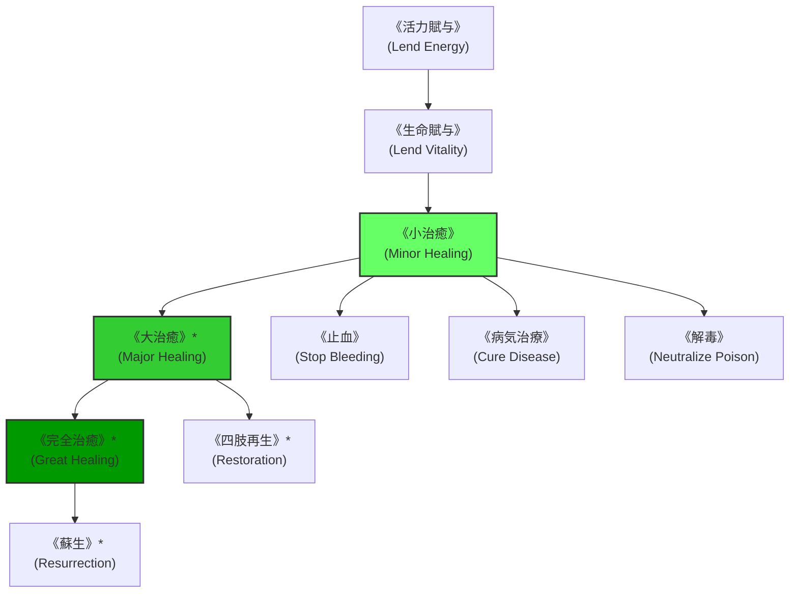

# ガープスマジック呪文体系：治癒系呪文 (Healing Spells)

**主管部署**: 魔導科学・理論研究部  
**準拠文献**: 『ガープス第4版 魔法大全（GURPS Magic）』第16章 pp.115-121、公式サプリメント各編（magic_page_075.html）  
**準拠憲章**: `AGENTS.md` (ガープス出力限界・野戦応急処置・完全再生不可原則)

---

## 1. 治癒系呪文の基本概要と力学特性

### 1.1 系統特性
- **本質**: 生体細胞の自己治癒プロセス加速、組織癒合、毒素・感染症の代謝排出、および生体エネルギー（FP/HP）の補填。
- **ガープス出力限界（AGENTS.md 厳格準拠）**:
  - 単独詠唱による即時蘇生や四肢欠損の完全瞬間再生は**不可能**（高度な儀式魔術や上位契約のみ）。
  - 戦場での止血、裂傷・骨折の即時癒合、ショック死防止、および変異毒素の解毒において絶大な効果を発揮。

---

## 2. 呪文前提系統樹（ツリー構造）

---

## 3. 呪文詳細一覧データ（主要抜粋・全52種）

| 呪文名（日 / 英） | クラス | 持続時間 | エネルギー消費 | 準備時間 | 前提条件 | 出力・効果概要 |
| :--- | :--- | :--- | :--- | :--- | :--- | :--- |
| **《活力賦与》** (Lend Energy) | 通常 | 永久 | 1点/FP | 1秒 | 素質1 | 術者のFPを対象へ直接譲渡し、疲労を回復（1回最大3点）。 |
| **《生命賦与》** (Lend Vitality) | 通常 | 永久 | 1点/HP | 1秒 | 《活力賦与》 | 術者のFPを対象の生命力（HP）へ変換し、軽微な負傷を修復。 |
| **《小治癒》** (Minor Healing) | 通常 | 永久 | 1〜3点 | 1秒 | 《生命賦与》 | 触れた対象のHPを最大3点回復（1日に同対象へ連発するとペナルティ）。 |
| **《大治癒》\*** (Major Healing) | 通常 | 永久 | 1〜4点 (2倍回復) | 2秒 | 素質1、《小治癒》 | 消費FPの2倍（最大8HP）の重傷を即時治療（至難）。 |
| **《完全治癒》\*** (Great Healing) | 通常 | 永久 | 20点 | 10秒 | 素質2、《大治癒》 | 瀕死の重傷者を完全治癒（全HP回復・至難）。 |
| **《止血》** (Stop Bleeding) | 通常 | 永久 | 1点 | 1秒 | 《小治癒》 | 開放性動脈出血や激しい外傷性出血を瞬時に凝固・止血。 |
| **《解毒》** (Neutralize Poison) | 通常 | 永久 | 3点〜 | 2秒 | 《小治癒》、情報系《毒検知》 | 体内に侵入した生物毒・鉱物毒・魔獣分泌毒を中和・無毒化。 |
| **《病気治療》** (Cure Disease) | 通常 | 永久 | 4点〜 | 5秒 | 《小治癒》、情報系《病気検知》 | ウイルス感染症、E型肝炎、細菌感染を免疫強化により治癒。 |
| **《四肢再生》\*** (Restoration) | 通常 | 永久 | 15点 | 10秒 | 素質2、《大治癒》、物体操作系2種 | 切断された手足や失われた肉体部位を時間をかけて再結合・再生（至難）。 |
| **《蘇生》\*** (Resurrection) | 特殊 | 永久 | 300点 | 儀式（複数人） | 素質3、《完全治癒》、死霊系3種 | 死亡直後（数分以内）の肉体に魂を呼び戻す最高位儀式（単独詠唱不可・至難）。 |

---

## 4. 現代PMC・野戦衛生部隊での適用例

1. **認可PMC（多摩レンジャーズ等）の衛生兵**:
   - 剛毛巌猪等の突進による骨折・大出血に対し、《止血》《小治癒》による即時トリアージ。
2. **魔獣解体現場での感染症防御**:
   - Class-B魔獣の解体作業時における《解毒》《病気治療》の即時適用。
