# 幻覚・作成系呪文 (Illusion and Creation Spells)

本ドキュメントは、ガープス第4版『魔法大全』第7章（pp.46-49）および公式拡張サプリメント（『Magic: Artillery Spells』『Magic: Death Spells』『Magic: The Least of Spells』『Magic: Plant Spells』等）に準拠した、**全32種**の幻覚・作成系呪文公式アーカイブです。マナ力学、生体媒介作用、ならびに2026年現代における結界都市防衛・軍事兵器工学・法規制（CR）の運用データを過不足なく完全網羅しています。

---

## 1. 幻覚・作成系呪文の力学体系

幻覚・作成系呪文は、マナの指向性周波数を介して対象の物理・生体・霊的パラメータを励起・変調・制御する魔術体系です。
- **生体媒介原則**: マナは術士の生体・神経系・霊体を介して作用し、直接の物質変換や物理エネルギー励起を行います。
- **現代技術インフラとの並行性**: 電子回路や通信網を直接破壊するのではなく、物理的現象（熱、圧力、電磁、物質変形等）を介して現代兵器や都市防護壁と相互作用します。

### 1.1 幻覚・作成系呪文 前提条件ツリー (Prerequisite Tree)

```mermaid
graph TD
    %% クラススタイル定義（高コントラスト・ダークモード規格）
    classDef spell fill:#0f172a,stroke:#38bdf8,stroke-width:1.5px,color:#ffffff;
    classDef root fill:#0369a1,stroke:#38bdf8,stroke-width:2px,color:#ffffff,font-weight:bold;
    classDef ext fill:#1e293b,stroke:#94a3b8,stroke-width:1px,color:#cbd5e1,stroke-dasharray: 5 5;
    classDef special fill:#4c1d95,stroke:#c084fc,stroke-width:1.5px,color:#ffffff;

    %% 系統内呪文ノード定義
    subgraph Sub_571DEE43 ["21種"]
        Sp_1_2693["《単純幻覚》<br>(（旧名：幻影）)"]:::spell
        PhantomFlame["《幻炎》<br>(Phantom Flame)"]:::spell
        Sp_3_78FB["《複雑幻覚》<br>(（旧名：幻覚）)"]:::spell
        PerfectIllusion["《完全幻覚》<br>(Perfect Illusion)"]:::special
        IllusionShell["《幻覚かぶせ》<br>(Illusion Shell)"]:::spell
        IllusionDisguise["《幻覚変身》<br>(Illusion Disguise)"]:::spell
        Independence["《独立幻覚》<br>(Independence)"]:::spell
        KnowIllusion["《幻覚感知》<br>(Know Illusion)"]:::spell
        ControlIllusion["《幻覚奪取》<br>(Control Illusion)"]:::spell
        DispelIllusion["《幻覚破壊》<br>(Dispel Illusion)"]:::spell
        Inscribe["《刻銘》<br>(Inscribe)"]:::spell
        Phantom["《幻像*》<br>(Phantom)"]:::special
        Initiative["《自律思考》<br>(Initiative)"]:::spell
        CreateObject["《物体作成*》<br>(Create Object)"]:::special
        Sp_15_B2C9["《物体複製*》<br>(（旧名：複製）)"]:::spell
        CreateServant["《従者作成》<br>(Create Servant)"]:::special
        CreateWarrior["《戦士作成》<br>(Create Warrior)"]:::spell
        CreateAnimal["《動物作成》<br>(Create Animal)"]:::spell
        CreateMount["《乗騎作成》<br>(Create Mount)"]:::special
        ControlCreation["《作成物奪取》<br>(Control Creation)"]:::spell
        DispelCreation["《作成物破壊》<br>(Dispel Creation)"]:::spell
    end

    subgraph Sub_E032978 ["MAS / MDS 拡張 2種"]
        CreateTrap["《斬撃罠作成*》<br>(Create Trap)"]:::special
        MirrorMirror["《幻像の陣*》<br>(Mirror, Mirror)"]:::special
        CreateForeignBody["《異物作成*》<br>(Create Foreign Body)"]:::special
        PhantomKiller["《死の幻像*》<br>(Phantom Killer)"]:::special
    end

    subgraph Sub_260CCBA7 ["MAS / MDS 拡張 1種"]
        PhantasmalPoisonVH["《幻毒*》<br>(Phantasmal Poison(VH))"]:::special
    end

    %% 前提条件依存関係エッジ
    Req_1 --> Sp_1_2693
    Ext_2 --> PhantomFlame
    Sp_1_2693 --> PhantomFlame
    Ext_3 --> Sp_3_78FB
    Sp_1_2693 --> Sp_3_78FB
    Sp_3_78FB --> PerfectIllusion
    Sp_1_2693 --> IllusionShell
    Sp_1_2693 --> IllusionDisguise
    Sp_1_2693 --> Independence
    Sp_1_2693 --> KnowIllusion
    PerfectIllusion --> ControlIllusion
    ControlIllusion --> DispelIllusion
    Sp_1_2693 --> Inscribe
    Ext_4 --> Inscribe
    PerfectIllusion --> Phantom
    Ext_5 --> Phantom
    Ext_6 --> Phantom
    Independence --> Initiative
    Ext_7 --> Initiative
    Ext_8 --> CreateObject
    PerfectIllusion --> CreateObject
    Ext_9 --> Sp_15_B2C9
    Ext_4 --> Sp_15_B2C9
    Ext_9 --> CreateServant
    CreateServant --> CreateWarrior
    Ext_10 --> CreateAnimal
    Ext_9 --> CreateAnimal
    CreateAnimal --> CreateMount
    CreateAnimal --> ControlCreation
    CreateServant --> ControlCreation
    ControlCreation --> DispelCreation
    Ext_9 --> CreateTrap
    Initiative --> MirrorMirror
    Ext_11 --> MirrorMirror
    Ext_12 --> CreateForeignBody
    Ext_9 --> CreateForeignBody
    Ext_11 --> PhantomKiller
    Ext_13 --> PhantasmalPoisonVH
    Ext_11 --> PhantasmalPoisonVH

    %% 外部系統・特殊前提ノード
    Req_1["【前提: 目が見えている、知力11以上】"]:::ext
    Ext_2["【他系統: 《炎変化》】"]:::ext
    Ext_3["【他系統: 《作音》】"]:::ext
    Ext_4["【他系統: 《複写》】"]:::ext
    Ext_5["【他系統: 《のろま》】"]:::ext
    Ext_6["【他系統: 《念動》】"]:::ext
    Ext_7["【他系統: 《知恵》】"]:::ext
    Ext_8["【他系統: 《土作成》】"]:::ext
    Ext_9["【他系統: 《物体作成》】"]:::ext
    Ext_10["【他系統: 《水作成》】"]:::ext
    Ext_11["【他系統: 《幻像》】"]:::ext
    Ext_12["【他系統: 《身体検査》】"]:::ext
    Ext_13["【他系統: 《毒塗り》】"]:::ext
```

---

## 2. ガープス第4版『魔法大全』基本幻覚・作成系呪文（21種）

| 呪文名（日 / 英） | クラス | 持続時間 | 基本消費 / 維持 | 詠唱時間 | 前提条件 | 効果概要・力学 |
| :--- | :---: | :---: | :---: | :---: | :--- | :--- |
| **《単純幻覚》** （旧名：幻影） Simple Illusion | 範囲 | 1分 | 1/半 | 1秒 | 目が見えている、知力11以上 | 幻覚・幻覚・知覚関連 |
| **《幻炎》** Phantom Flame | 範囲 | 1分 | 1/同 | 1秒 | 《炎変化》ないし《単純幻覚》 | 幻覚・効果範囲に非実体の 炎 を作り出します。近くにいる者は 熱 さを感じます（触れば痛みも感じます）。 炎 の中の品物は燃えているかのように見えます。しかし、この 炎 は広がることもなく、実際のダメージも与えません。痛みも最初の 衝撃 が過ぎれば、ただうずくだけになります。とは、この幻の 炎 に有効ですが、水は効果 |
| **《複雑幻覚》** （旧名：幻覚） Complex Illusion | 範囲 | 1分 | 2/半 | 1秒 | 《作音》、《単純幻覚》 | 幻覚・幻覚・知覚関連 幻覚・魔化なし |
| **《完全幻覚》** Perfect Illusion | 範囲 | 1分 | 3/半# | 1秒 | 素質1、《複雑幻覚》 | 幻覚・と似ていますが、触覚以外すべての感覚をだますことができます（ |
| **《幻覚かぶせ》** Illusion Shell | 通常 | 1分 | 1または2/半 | 1秒 | 《単純幻覚》 | 幻覚・物体に 幻覚 を投げかけ、見た目や音、触った感じを違うものにします。もととなる物体は変えるものにふさわしい形と大きさをしていなければいけません。 幻覚 は信じられないものかもしれませんが、それ以外はしっかりしたものです。しかし、下にある物体ごと動かさないと、 幻覚 を移動させることはできません。また、下の物体が与えるダメージにはなんの影響もありません |
| **《幻覚変身》** Illusion Disguise | 通常 | さまざま | 3 | 1秒 | 《単純幻覚》 | 幻覚・生き物に 幻覚 をまとわせて変装させます。 術者 はまず 幻覚 を作り出します（の中から選んで使います）。つぎにを使って 目標 に 幻覚 をかぶせます。 幻覚 は 目標 といっしょに移動することになります。 幻覚 がよくできたものであ |
| **《独立幻覚》** Independence | 範囲 | さまざま | 2 | さまざま | 《単純幻覚》 | 幻覚・術者 が操る 作成物 や 幻覚 といっしょに用います。 “ プログラム ” により 作成物 や 幻覚 を、動かしたり、しゃべらせたり（音を出せるものなら）、決まった方法でふるまわせたりできます。このため 術者 は 集中 する必要がなくなります。は「 維持 中の 呪文 」にはカウントしません。 “ プログラム ” されていない状況に出会う |
| **《幻覚感知》** Know Illusion | 情報 | 一瞬 | 2 | 1秒 | 《単純幻覚》 | 幻覚・目標 が現実の存在か、 幻覚 あるいは 作成物 なのか、さらにどんな物体であるのか詳しくわかります。 術者 は 目標 を目で見なくてはいけません。 |
| **《幻覚奪取》** Control Illusion | 通常/抵-呪文 | 永久 | 1 | 2秒 | 《完全幻覚》 | _ 目標 の 呪文 、 幻覚・他人が作った 幻覚 を自由に操ります。 呪文 に成功したら、 幻覚 を 維持 するため、さらに エネルギー を消費せねばなりません。失敗すると、 幻覚 は相変わらず作成者のものです。には効果がありません。 幻覚 ではない物体にこの 呪文 をかけると、 エネルギー は消費するのに 呪 |
| **《幻覚破壊》** Dispel Illusion | 通常/抵-呪文 | 一瞬 | 1 | 1秒 | 《幻覚奪取》 | _ 目標 の 呪文 、 幻覚・浄化・各種 幻覚 や 幻覚変身 を消し去ります。 作成物 には効きません。 |
| **《刻銘》** Inscribe | 範囲/抵-意志力 | 1分 | 2/同 | 1秒 | 《単純幻覚》、《複写》 | _ 意志力 、 幻覚・任意の表面に銘（文字や像）を残します。その芸術的な評価については、適切な 芸術系技能 （〈 美術 /書道〉〈 美術 /絵画〉など）で判定します。銘は 術者 が望んだとおりのデザインになります。銀色の炎のような文字、単純なブロック体、水に反射した光のような文字......などなど。 呪文 の効果が消えるか |
| **《幻像*》** Phantom* | 範囲 | 1分 | 5/半# | 1秒 | 素質2、《完全幻覚》、《のろま》、《念動》 | （至難） （至難） 幻覚・と似ていますが、 幻像 は 移動 を妨げ、「本当の」ダメージを与えます。 幻像 と物理的に接触した 知性 体は、 知力 と 術者 の 技能 で 即決勝負 を行います。 術者 が負ければ、 幻像 はあらゆる意味でと同じに扱います。 術者 が |
| **《自律思考》** Initiative | 範囲 | 不定# | さまざま | 10秒 | 《独立幻覚》、《知恵》 | 幻覚・幻覚・幻覚・魔化なし |
| **《物体作成*》** Create Object* | 通常 | 不定# | 2/2.5kg毎 | 秒=コスト | 素質2、《土作成》、《完全幻覚》 | （至難） （至難） 幻覚・術者 になじみのある品物を1つ、作り出すことができます――ローブ、剣、コップなどです。 魔法の品物 や生き物を作ることはできません。 制限：こうして作り出した食料は栄養がありそうに見えても実際はまったくありません。情報はいっしょに作れないのです |
| **《物体複製*》** （旧名：複製） Duplicate* | 通常 | 不定# | 3/2.5kg毎 | 秒=コスト | 《物体作成》、《複写》 | 年05月27日(水) 19:58:47 履歴 |
| **《従者作成》** Create Servant | 通常 | 1分 | さまざま | 3秒 | 素質3、知力12以上、《物体作成》 | 幻覚・召喚・愚かながらも忠実な従者（ 体力 、 敏捷力 、 知力 、 生命力 すべてが9）を作り出し、 術者 の命令に従わせます。 術者 は従者の外見を決めねばなりません。同じ 呪文 で「力持ち」―― 体力 16の従者――を作ることもできます。あるいは、 戦闘 以外で 知力 基準ではない 技能 1つを16レベル |
| **《戦士作成》** Create Warrior | 通常 | 1分 | さまざま | 4秒 | 《従者作成》 | 幻覚・召喚・戦士を作り出し、 術者 の命令で戦わせます。戦士は 知力 10、 体力 、 敏捷力 、 生命力 12で、 術者 が選んだ 武器 1種（あるいは〈 格闘 〉）の 技能 をレベル16で持っています。作られた時点で 武器 や 防具 は持っていませんが、与えられれば使うことでしょう。 |
| **《動物作成》** Create Animal | 通常 | 1分 | さまざま | 秒=コスト | 《水作成》、《物体作成》、知力12以上 | 幻覚・幻覚・動物 呪文 動物 幻覚・ |
| **《乗騎作成》** Create Mount | 通常 | 1時間 | さまざま | 3秒 | 素質3、《動物作成》 | 幻覚・幻覚・動物 呪文 乗り物関連 幻覚・ |
| **《作成物奪取》** Control Creation | 通常/抵-呪文 | 一瞬 | 1 | 2秒 | 《動物作成》ないし《従者作成》 | _ 目標 の 呪文 、 幻覚・他人が作り出した、動く 作成物 を自由に操ります。 呪文 に成功すれば、 作成物 を 維持 するため、さらに エネルギー を消費せねばなりません。失敗すると、相変わらず作成者のものです。 幻覚 には効きません。 |
| **《作成物破壊》** Dispel Creation | 通常/抵-呪文 | 一瞬 | 1または3# | 1秒 | 《作成物奪取》 | _ 目標 の 呪文 、 幻覚・浄化・あらゆるタイプの 作成物 を破壊します。 幻覚 には効きません。 |

---

## 3. 魔導兵器・砲兵戦術拡張呪文（MAS / MDS 拡張 2種）

| 呪文名（日 / 英） | クラス | 持続時間 | 基本消費 / 維持 | 詠唱時間 | 前提条件 | 効果概要・力学 |
| :--- | :---: | :---: | :---: | :---: | :--- | :--- |
| **《斬撃罠作成*》** Create Trap* | 範囲 | 5秒 | 5 | 1秒/半径1ｍ毎 | 素質4、《物体作成》含む幻覚・作成系呪文10種 | 幻覚・magic_artillery_spells 幻覚・罠 |
| **《幻像の陣*》** Mirror, Mirror* | 範囲/抵-特殊 | 1分# | 10・半 | 1秒/半径1ｍ毎 | 素質4、《自律思考》、《幻像》 | （至難）（Mirror, Mirror (VH)） pp.17-18 （至難） ＿特殊、 幻覚・召喚・このの亜種は、効果範囲内の意識あるもの（ 知力 1以上）1体につき、その対象にとっての敵性幻覚を1体生成します。対象は 知力 、 意志力 、 知覚力 のうち最も |

---

## 4. 魔導兵器・砲兵戦術拡張呪文（MAS / MDS 拡張 2種）

| 呪文名（日 / 英） | クラス | 持続時間 | 基本消費 / 維持 | 詠唱時間 | 前提条件 | 効果概要・力学 |
| :--- | :---: | :---: | :---: | :---: | :--- | :--- |
| **《異物作成*》** Create Foreign Body * | 通常/抵-生命力 | 永久 | 11 | 2秒 | 素質3、、《身体検査》、《物体作成》 | （至難）（Create Foreign Body (VH)） p.14 （至難） _ 生命力 幻覚・と同様に物質を実体化します……ただし、対象の体内にです！ この 呪文 の 作成物 にはと同様に、生きている、思考する存在との接触が必要です。この 呪文 は前述 |
| **《死の幻像*》** Phantom Killer * | 通常/抵-知力か知覚力 | 1分 | 25 | 1秒 | 素質3、《幻像》 | とかで良かったかもしれない（だとと紛らわしいし）。 （至難）（Phantom Killer (VH)） p.14 （至難） _ 知力 または 知覚力 幻覚・このの変種は、精神を持つもの（ 知力 1以上の存在）なら何でも殺すことができます。これは |

---

## 5. 魔導兵器・砲兵戦術拡張呪文（MAS / MDS 拡張 6種）

| 呪文名（日 / 英） | クラス | 持続時間 | 基本消費 / 維持 | 詠唱時間 | 前提条件 | 効果概要・力学 |
| :--- | :---: | :---: | :---: | :---: | :--- | :--- |
| **《無個性顔》（並）** （Blend In (A)） | 通常/抵-生命力 | 1時間 | 2・1 | 1秒 | -（簡単呪文なので） | （並）（Blend In (A)） p.7 （並） _ 生命力 幻覚・対象の顔は特徴を失い、群衆の中での〈 尾行 〉に+1修正が付与され、他の人が一列に並んでいるときや写真で認識するとき、または会ったことを思い出す際の判定に-1修正が付与されます。「 目立つ外見 」、「 変な容姿 」、または |
| **《目立つ顔》（並）** （Stand Out (A)） | 通常/抵-生命力 | 1時間 | 2・1 | 1秒 | -（簡単呪文なので） | （並）（Stand Out (A)） p.7 （並） _ 生命力 幻覚・と同様ですが、対象の顔の特徴を鮮明にします。修正が逆になります： 人混みでの〈 尾行 〉に -1修正、人混みから対象者の認識または思い出す判定に +1修正。対象の外見に関係なく機能します。 |
| **《石像の肌》（並）** （Gargoyle Skin (A)） | 通常/抵-生命力 | 1分 | 2・1 | 2秒 | -（簡単呪文なので） | （並）（Gargoyle Skin (A)） p.8 （並） _ 生命力 幻覚・対象の皮膚が 石 のような外観 (硬さではありません!) になります。完全に静止し、完全に裸の場合、岩の横にいる間は〈 偽装 〉と〈 忍び 〉に+2ボーナスが付与されます。また、石像、ガーゴイル、 ストーン・ゴーレム |
| **《不信強化》（並）** （Disbelieve (A)） | 通常/防御 | 1分 | 1〜5 | 1秒 | -（簡単呪文なので） | （並）（Disbelieve (A)） p.11 （並） 幻覚・術者 がまたはへの「 不信 」前に発動します。次の ターン の 意志力判定 へのボーナスは、 呪文 の |
| **《静画投影》（並）** （Image (A)） | 範囲 | 1分 | 1・同 | 1秒 | -（簡単呪文なので） | （並）（Image (A)） p.11 （並） 幻覚・写真スライドを通した光のように、静止した、変化のない 2次元イメージを表面に投影します。品質は〈 美術 /幻影〉 技能 に依存します。 不信 状態は自動的に発生しますが、それでは解除されません。接触、 攻撃 、 呪文 によって解除されます。 通常は水平ではなく垂直の表面に |
| **《影絵》（並）** （Shadowplay (A)） | 範囲 | 1分 | 1・半 | 1秒 | -（簡単呪文なので） | （並）（Shadowplay (A)） p.11 （並） 幻覚・光・動き、変化する 2次元の影 (明るい光の中の手のシルエットや紙の切り抜きなど) を投影します。それ以外はの注釈とルールに従います。影であるため、色や細かいディテールがありません。主に娯楽のために使用されます。 |

---

## 6. 魔導兵器・砲兵戦術拡張呪文（MAS / MDS 拡張 1種）

| 呪文名（日 / 英） | クラス | 持続時間 | 基本消費 / 維持 | 詠唱時間 | 前提条件 | 効果概要・力学 |
| :--- | :---: | :---: | :---: | :---: | :--- | :--- |
| **《幻毒*》** Phantasmal Poison(VH) | 通常 | 1分 | 4・2 | 2秒 | 素質2、《毒塗り》および《幻像》 | （至難）（Phantasmal Poison(VH)） ｐ.7 （至難） 幻覚・術者 は対象の 武器 に 毒 の 幻覚 を作り出します。対象の 武器 を見た者はその 武器 に当たるたびに、 術者 の 修正後技能レベル と相手の 知力 の間で 即決勝負 を行います。 術者 が勝った場合、相手は 毒 を投与されたと信じるため、被害 |

---

## 7. 2026年現代戦術・都市防衛・法規制（CR）における運用

### 7.1 警察・自衛隊・PMCにおける実戦配備
結界都市（セーフゾーン）警備および壁外アウトランドへの遠征作戦において、幻覚・作成系呪文は索敵・突入支援・防壁維持・目標無力化の標準プロトコルとして統合運用されています。特に部隊随伴術士による即時展開は、通常兵器との複合火力（コンバインド・アームズ）として極めて高い戦闘効率を発揮します。

### 7.2 メガコーポ支配と特許利権
ヤマト重工、テイコク製薬、サエデル・シュティフトゥング、アレス等のメガコーポは、幻覚・作成系呪文の工業・医療・防衛利用に関する独占特許を保有しており、民間術士に対するライセンス管理や魔導触媒・霊薬の市場流通を掌握しています。

### 7.3 国際魔導協定（IMA）および法規制（CR）
破壊力・精神汚染・非人道性の高い高位呪文は、国家公安委員会および国際魔導協定により**規制等級CR3〜CR4（要特別国家許可・戦時国際法規制）**に指定されており、無認可での行使・研究は厳罰に処されます。