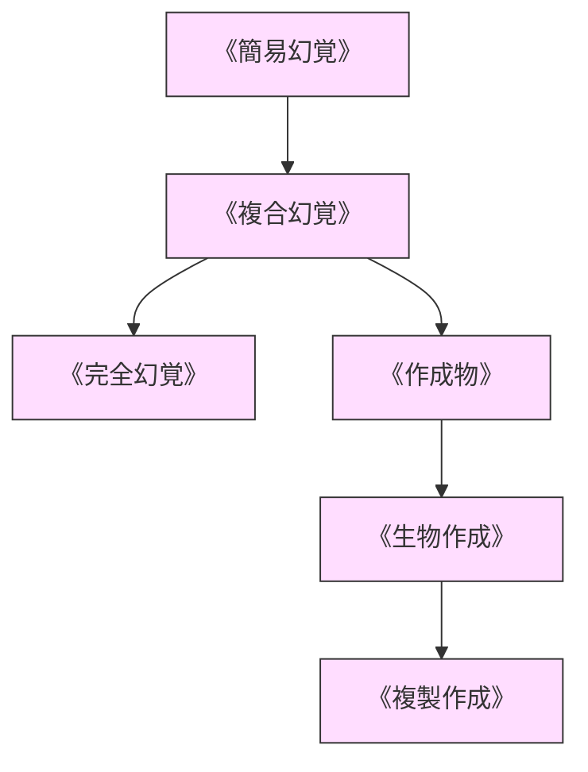

# 幻覚・作成系呪文 (Illusion & Creation Spells)

本ドキュメントは、ガープス第4版『魔法大全』第12章「幻覚・作成系呪文」および関連データ（`magic_page_149`〜`152`）を基に、視覚・聴覚・触覚幻覚、準実体作成物、不信判定（Disbelief）の力学、および2026年現代における電脳ホログラム技術との複合を体系化した公式魔術アーカイブです。

---

## 1. 幻覚力学と不信判定 (Disbelief)

幻覚・作成系呪文は、大気中の微粒子や光波・音波をマナで偏向させて偽りの知覚像を形成するか、純粋なマナを一時的な物質構造（エクトプラズム / 準実体）として凝縮させる術式です。

### 1.1 不信判定（Disbelief）の力学
幻覚を目撃した対象が「これは本物ではない」と疑って意識的に見破ろうとする場合、**知力（IQ）判定（または知力対術者の呪文技能との即対抗判定）**を行います。
- **見破り成功**: 幻覚は目撃者にとって半透明な陽炎となり、物理的・心理的脅威を失う。
- **接触による不信**: 触覚を持たない簡易幻覚に触れた場合、知力判定に **+4以上の強烈なボーナス**が与えられる。

### 1.2 前提条件ツリー (Prerequisite Tree)

---

## 2. 幻覚・作成系主要呪文データ一覧

| 呪文名（日 / 英） | 呪文クラス | 基本消費 / 維持 | 詠唱時間 | 前提条件 | 効果概要・力学 |
| :--- | :---: | :---: | :---: | :--- | :--- |
| **《簡易幻覚》** Simple Illusion | 範囲 | 1 / 半分 | 1秒 | なし | 視覚のみの静止・単純運動する立体映像を投影。触覚・音なし。 |
| **《複合幻覚》** Complex Illusion | 範囲 | 2 / 半分 | 2秒 | 《簡易幻覚》 | 視覚＋音響＋臭気を伴うリアルな幻影。 |
| **《完全幻覚》** Perfect Illusion | 範囲 | 3 / 半分 | 3秒 | 《複合幻覚》 | 触覚・温度・電磁反射までも再現した完璧な知覚欺瞞。 |
| **《幻覚消去》** Dispel Illusion | 通常 | 3 / 不可 | 1秒 | 《簡易幻覚》 | 視界内の幻覚術式を強制分解・霧散させる。 |
| **《作成物》** Create Object | 通常 | 重量依存 / 1 | 2秒 | 《複合幻覚》 | 物理的実体を持つ無機物（ロープ、剣、壁等）を一時実体化。 |
| **《生物作成》** Create Animal | 通常 | 4〜10 / 2 | 3秒 | 《作成物》 | 術者の命令に従って物理攻撃可能な一時的擬似生物を実体化。 |
| **《複製作成》** Duplicate | 通常 | 対象重量依存 | 5秒 | 《完全幻覚》 | 実在する物品の完全なクローン（物理・視覚）を一時作成。 |

---

## 3. 現代電脳魔術・市街戦における適用

### 3.1 電脳ホログラム・AR欺瞞との複合
三ツ菱マナテックおよびレンラクは、AR（拡張現実）スマートグラスや都市監視カメラ網と《複合幻覚》を同期させる欺瞞システムを開発。肉眼だけでなく光学センサー・サーモグラフィにも反応する立体囮を展開して魔獣や敵対PMCを誘導します。

### 3.2 警察・自衛隊の非致死性制圧
結界都市内部で暴走した魔獣や暴徒に対し、警視庁特務班は《作成物》で即席のバリケードを形成し、実弾や致死性兵器を使わずに被害を最小限に食い止める戦術を採用しています。
