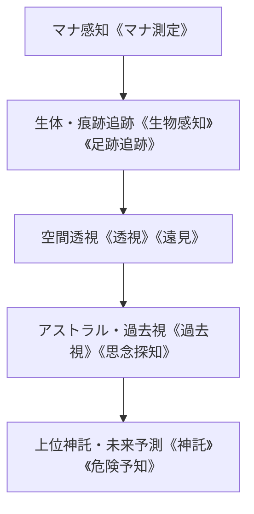

# 知識・情報系呪文アーカイブ (Knowledge & Information Spells Archive)

本ドキュメントは、現代（2026年）におけるマナ測定、透視、索敵、魔獣追跡、アストラル波長解析、および神託系呪文（計52種＋サプリメント追加9種、全61種）の公式リファレンスです。

---

## 1. 知識・情報系呪文体系の特徴と現代適用

### 1.1 現代科学センサーとの協調・生体媒介原則
- 知識系呪文は電波や光学カメラと競合せず、**「魔力波長」「生体反応」「魂・アストラル痕跡」「因果の糸」**を探知する。
- 現代の特務魔導偵察部隊や現場ハンターにおいて、ドローン索敵と並ぶ中核情報収集手段として運用される。

---

## 2. 主要知識・情報系呪文一覧 (Representative Knowledge Spells)

| 呪文名 | 英語名 | 呪文分類 | 詠唱時間 | 消費/維持 | 前提条件 | 現代戦術・調査用途 |
| :--- | :--- | :--- | :--- | :--- | :--- | :--- |
| **《マナ測定》** | Detect Mana | 通常 | 1秒 | 2 / 1 | 素質 1 | 局所空間のマナ濃度（無・疎・並・濃・超濃）を即時測定。 |
| **《魔法感知》** | Detect Magic | 通常 | 1秒 | 2 / なし | 《マナ測定》 | 周囲 10m 内の活性化呪具、結界、詠唱痕跡を探知。 |
| **《生物感知》** | Sense Emotion / Life | 通常 | 1秒 | 2 / 1 | 素質 1 | 壁や遮蔽の向こうに潜む魔獣・人間の生体熱・心拍・感情を探知。 |
| **《足跡追跡》** | Pathfinder | 通常 | 3秒 | 3 / 1 | 《生物感知》 | 対象魔獣が通過した直近 24時間のアストラル痕跡を可視化追跡。 |
| **《透視》** | See Through | 通常 | 2秒 | 3 / 1 | 《魔法感知》 | コンクリート壁、装甲ドア、地下金庫の内部を直接視認。 |
| **《遠見》** | Far-Seeing | 通常 | 3秒 | 4 / 2 | 《透視》 | 数キロ先の指定地点を上空から俯瞰視認（魔導ドローン視覚）。 |
| **《思念探知》** | Mind-Reading | 通常 | 2秒 | 4 / 2 | 《感情感知》 | 対象の表層意識・直近の思考・敵意を読み取る（尋問・防諜）。 |
| **《過去視》** | History | 儀礼 | 10分 | 8 / なし | 《遠見》 | 現場に残された残留思念から、過去に起きた事件・交戦を再生。 |
| **《危険予知》** | Danger Sense | 通常/受動 | 即時 | 3 / なし | 素質 2 | 不意打ち・待ち伏せ・ブービートラップの直前に危機を直感。 |
| **《神託》** | Oracle | 儀礼 | 1時間 | 15 / なし | 素質 3, 過去視 | 高位精霊・上位神格に問いかけ、大規模災害・アビス侵攻の予兆を得る。 |

---

## 3. 魔獣調査・壁外探査における運用プロトコル

1. **侵入前スクリーニング**: 遠隔地から《マナ測定》および《遠見》により、アビス歪曲の有無と大型魔獣の生息を確認。
2. **近接索敵**: 建造物・洞窟内進入時、《透視》と《生物感知》により遮蔽物越しの奇襲を完全無力化。
3. **解体・素材鑑定**: 討伐直後、《魔法感知》により生体装甲や結晶核の魔力残量を測定し、最高品質部位を特定。
