# 簡単呪文・民間魔法 (The Least of Spells / Hedge Magic)

本ドキュメントは、ガープス第4版サプリメント『GURPS Magic: The Least of Spells』の公式データを基に、前提条件のない簡易呪文（カントリップ・小真言・民間儀式）、および2026年現代の市民生活・新人類居留区スラムにおける日常的魔術利用を体系化した公式魔術アーカイブです。

---

## 1. 簡単呪文（民間魔法）の力学

簡単呪文（Trivial Spells / Hedge Magic）は、前提条件（Prerequisites）が一切存在しない「知力/並（IQ/A）」の基礎魔術です。「魔法の素質（Magery）」を持たない一般市民であっても、標準マナ濃度下であれば誰でも学習・行使が可能であり、マナ濃度「疎」による詠唱ペナルティも受けません。

### 1.1 前提条件構造（フラットツリー）

```mermaid
graph TD
    %% クラススタイル定義（高コントラスト・ダークモード規格）
    classDef spell fill:#0f172a,stroke:#38bdf8,stroke-width:1.5px,color:#ffffff;
    classDef root fill:#0369a1,stroke:#38bdf8,stroke-width:2px,color:#ffffff,font-weight:bold;
    classDef ext fill:#1e293b,stroke:#94a3b8,stroke-width:1px,color:#cbd5e1,stroke-dasharray: 5 5;
    classDef special fill:#4c1d95,stroke:#c084fc,stroke-width:1.5px,color:#ffffff;

    %% 系統内呪文ノード定義
    subgraph Sub_33FC4513 ["簡単呪文主要データ一覧"]
        Spark["《火花》<br>(Spark)"]:::spell
        Dribble["《滴り》<br>(Dribble)"]:::spell
        Breeze["《そよ風》<br>(Breeze)"]:::spell
        Pebble["《小石作成》<br>(Pebble)"]:::spell
        WarmUp["《微温》<br>(Warm Up)"]:::spell
        CleanSpot["《部分染み抜き》<br>(Clean Spot)"]:::spell
        Tick["《秒針鳴らし》<br>(Tick)"]:::spell
        Stitch["《仮縫い》<br>(Stitch)"]:::spell
        GlowDot["《小光》<br>(Glow Dot)"]:::spell
    end

    %% 前提条件依存関係エッジ
    Req_1 --> Spark
    Req_2 --> Dribble
    Req_3 --> Breeze
    Req_4 --> Pebble
    Req_5 --> WarmUp
    Req_6 --> CleanSpot
    Req_7 --> Tick
    Req_8 --> Stitch
    Req_9 --> GlowDot

    %% 外部系統・特殊前提ノード
    Req_1["【前提: 指先から小さな火花を飛ばし、タバコやガスコンロに着...】"]:::ext
    Req_2["【前提: 手のひらに一口分（数ミリリットル）の清潔な飲料水を...】"]:::ext
    Req_3["【前提: 術者の顔や体に心地よい微風を吹き付け、汗を気化冷却...】"]:::ext
    Req_4["【前提: 指先にパチンコ弾サイズの小石を作成（投擲用・重り）...】"]:::ext
    Req_5["【前提: 冷めた缶コーヒーや弁当をほんのり温かい適温に再加熱...】"]:::ext
    Req_6["【前提: シャツについた醤油や泥の染み（コイン大）を瞬時に消...】"]:::ext
    Req_7["【前提: 頭の中に正確な1秒刻みのリズムを鳴らし、経過時間を...】"]:::ext
    Req_8["【前提: 破れた衣服の縫い目を一時的にマナの糸で応急接合。】"]:::ext
    Req_9["【前提: 爪の先に小さな蛍のような光を灯し、鍵穴や足元を照ら...】"]:::ext
```

---

## 2. 簡単呪文主要データ一覧

| 呪文名（日 / 英） | クラス | 基本消費 / 維持 | 詠唱時間 | 前提条件 | 効果概要・力学 |
| :--- | :---: | :---: | :---: | :--- | :--- |
| **《火花》** Spark | 通常 | 1 / 不可 | 1秒 | なし | 指先から小さな火花を飛ばし、タバコやガスコンロに着火。 | 詳細参照 | **《滴り》** Dribble | 通常 | 1 / 不可 | 1秒 | なし | 手のひらに一口分（数ミリリットル）の清潔な飲料水を生成。 | 詳細参照 | **《そよ風》** Breeze | 通常 | 1 / 不可 | 1秒 | なし | 術者の顔や体に心地よい微風を吹き付け、汗を気化冷却。 | 詳細参照 | **《小石作成》** Pebble | 通常 | 1 / 不可 | 1秒 | なし | 指先にパチンコ弾サイズの小石を作成（投擲用・重り）。 | 詳細参照 | **《微温》** Warm Up | 通常 | 1 / 不可 | 1秒 | なし | 冷めた缶コーヒーや弁当をほんのり温かい適温に再加熱。 | 詳細参照 | **《部分染み抜き》** Clean Spot | 通常 | 1 / 不可 | 1秒 | なし | シャツについた醤油や泥の染み（コイン大）を瞬時に消去。 | 詳細参照 | **《秒針鳴らし》** Tick | 通常 | 1 / 1分 | 1秒 | なし | 頭の中に正確な1秒刻みのリズムを鳴らし、経過時間を計測。 | 詳細参照 | **《仮縫い》** Stitch | 通常 | 1 / 不可 | 2秒 | なし | 破れた衣服の縫い目を一時的にマナの糸で応急接合。 | 詳細参照 | **《小光》** Glow Dot | 通常 | 1 / 10分 | 1秒 | なし | 爪の先に小さな蛍のような光を灯し、鍵穴や足元を照らす。 | 詳細参照 
---

## 3. 2026年現代社会・スラム居留区における市民生活の知恵

### 3.1 東京湾岸スラム（夢の島・有明）のサバイバル民間魔法
インフラが不安定な新人類（メタヒューマン）特別居留区や壁外開拓スラムでは、ガスや水道が止まった際、住民たちが《火花》《滴り》《微温》を日常的に使い回して生活を維持しています。これらは「民間知恵（フォーク・ロア）」として親から子へ口伝されています。

### 3.2 法規制と生活保護（CR0〜CR1）
簡単呪文は攻撃性や社会破壊力が極めて低いため、魔術統制法上は**CR0（完全自由・登録不要）**として扱われており、小学生の理科・生活科の自由研究や、キャンプ・防災講習でも広く教えられています。
