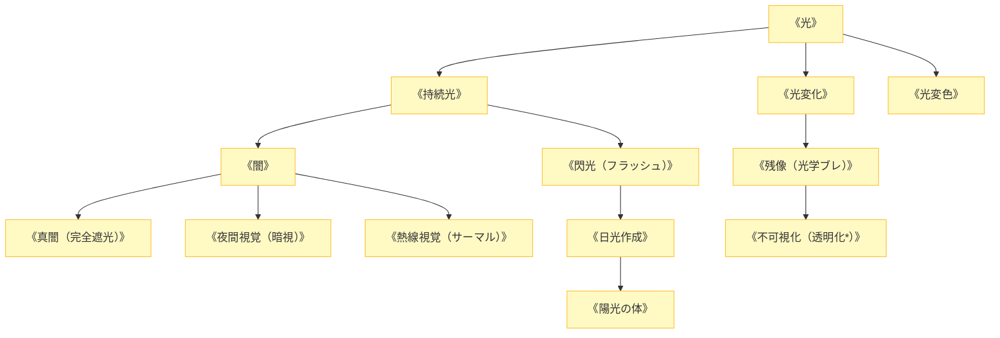

# 光・闇系呪文 (Light & Darkness Spells)

本ドキュメントは、ガープス第4版『魔法大全』第22章（pp.155-159）および関連拡張サプリメントの公式データを基に、電磁波・可視光・赤外線・紫外線・光学迷彩・絶対暗黒領域、および2026年現代における暗視戦・対ドローン光学欺瞞を体系化した公式魔術アーカイブです。

---

## 1. 光・闇系魔術の力学

光・闇系呪文は、光子の生成・偏光・散乱・吸収をマナで制御する魔術体系です。可視光領域にとどまらず、暗視ゴーグルが依存する近赤外線（熱線）や紫外線スペクトルにも直接干渉し、完全な不可視化や光学センサーの飽和無力化を行います。

### 1.1 前提条件ツリー (Prerequisite Tree)

---

## 2. 光・闇系主要呪文データ一覧

| 呪文名（日 / 英） | クラス | 基本消費 / 維持 | 詠唱時間 | 前提条件 | 効果概要・力学 |
| :--- | :---: | :---: | :---: | :--- | :--- |
| **《光》** Light | 通常 | 1 / 1 | 1秒 | なし | 術者の手元や指定座標に小型の浮遊発光体を生成。 |
| **《持続光》** Continual Light | 通常 | さまざま / 恒久 | 1秒 | 《光》 | 物体に半永久的な発光特性を付与（ペンライト〜街灯級）。 |
| **《閃光》** Flash | 通常 | 4 / 不可 | 1秒 | 《持続光》 | 爆発的な強烈閃光を放ち、周囲の視覚・光学センサーを一時盲目化。 |
| **《夜間視覚》** Night Vision | 通常 | 3 / 1 | 1秒 | 《視覚鋭敏化》 or 5種 | 暗闇ペナルティ（最大-9）を完全に無視して昼間同様に視認。 |
| **《熱線視覚》** Infravision | 通常 | 3 / 1 | 1秒 | 《視覚鋭敏化》 or 5種 | 対象の体温・排熱（赤外線パターン）をサーモグラフィとして視認。 |
| **《闇》** Darkness | 範囲 | 2 / 1 | 1秒 | 《持続光》 | 効果範囲内の光を吸収・遮断し、視界-5〜-9の暗黒域を形成。 |
| **《真闇》** Blackout | 範囲 | 2 / 1 | 1秒 | 《闇》 | 赤外線・暗視装置すら貫通できない完全な光子ゼロ空間を形成。 |
| **《残像》** Blur | 通常 | 1〜5 / 半 | 1秒 | 《光変化》 | 輪郭を光学的にぼやけさせ、敵の射撃・格闘命中率を大幅低下。 |
| **《不可視化*》** Invisibility | 通常 | 5 / 3 | 1秒 | 《残像》, 素質2 | 光を完全に迂回させ、肉眼・カメラから完全に姿を消す（光学迷彩）。 |
| **《日光作成》** Sunlight | 範囲 | 2 (面積毎) / 同 | 2秒 | 《閃光》, 素質1 | 吸血鬼・死霊系魔獣に致命的ダメージを与える純粋な自然太陽光を投射。 |

---

## 3. 2026年現代戦術・対光学センサーおよびアンチ・アンデッド戦

### 3.1 壁外アンチ・ナイトビジョン戦術（光学電子戦）
夜間のアウトランド前線では、暗視ゴーグルやドローンカメラを装備したPMC・自衛隊に対し、知能魔獣やゲリラ術士が《真闇》や《閃光》を展開してセンサーをホワイトアウト・無力化する交戦が多発しています。対抗策として、《熱線視覚》と魔力波探知（マナレーダー）を複合した照準装置が配備されています。

### 3.2 死霊系アビス特異点における《日光作成》の戦略的照射
ツングースカ大空洞や地下墓地などの死霊系魔獣密集地帯において、特殊魔法部隊は《日光作成》の投光器（サンライト・プロジェクター）を用いて広範囲のグール・吸血変異種を一掃する掃討戦術を実施しています。
