# 光・闇系呪文 (Light and Darkness Spells)

本ドキュメントは、ガープス第4版『魔法大全』第22章（pp.136-141）および公式拡張サプリメント（『Magic: Artillery Spells』『Magic: Death Spells』『Magic: The Least of Spells』『Magic: Plant Spells』等）に準拠した、**全42種**の光・闇系呪文公式アーカイブです。マナ力学、生体媒介作用、ならびに2026年現代における結界都市防衛・軍事兵器工学・法規制（CR）の運用データを過不足なく完全網羅しています。

---

## 1. 光・闇系呪文の力学体系

光・闇系呪文は、マナの指向性周波数を介して対象の物理・生体・霊的パラメータを励起・変調・制御する魔術体系です。
- **生体媒介原則**: マナは術士の生体・神経系・霊体を介して作用し、直接の物質変換や物理エネルギー励起を行います。
- **現代技術インフラとの並行性**: 電子回路や通信網を直接破壊するのではなく、物理的現象（熱、圧力、電磁、物質変形等）を介して現代兵器や都市防護壁と相互作用します。

### 1.1 光・闇系呪文 前提条件ツリー (Prerequisite Tree)

```mermaid
graph TD
    %% クラススタイル定義（高コントラスト・ダークモード規格）
    classDef spell fill:#0f172a,stroke:#38bdf8,stroke-width:1.5px,color:#ffffff;
    classDef root fill:#0369a1,stroke:#38bdf8,stroke-width:2px,color:#ffffff,font-weight:bold;
    classDef ext fill:#1e293b,stroke:#94a3b8,stroke-width:1px,color:#cbd5e1,stroke-dasharray: 5 5;
    classDef special fill:#4c1d95,stroke:#c084fc,stroke-width:1.5px,color:#ffffff;

    %% 系統内呪文ノード定義
    subgraph Sub_639328A6 ["33種"]
        Light["《光》<br>(Light)"]:::root
        ContinualLight["《持続光》<br>(Continual Light)"]:::spell
        Sp_3_6F27["《光変色》<br>(（旧名：色彩変化）)"]:::spell
        RemoveShadow["《影消し》<br>(Remove Shadow)"]:::spell
        ShapeLight["《光変化》<br>(Shape Light)"]:::spell
        Sp_6_3BD6["《耐光視覚》<br>(（旧名：閃光防御）)"]:::spell
        Sp_7_6681["《熱線視覚》<br>(（旧名：赤外線視覚）)"]:::spell
        Sp_8_6A2E["《夜間視覚》<br>(（旧名：暗視）)"]:::spell
        HawkVision["《鷹目》<br>(Hawk Vision)"]:::spell
        SmallVision["《拡大視覚》<br>(Small Vision)"]:::spell
        Sp_11_21DB["《闇中視覚》<br>(（旧名：闇視）)"]:::spell
        Darkness["《闇》<br>(Darkness)"]:::spell
        Blackout["《真闇》<br>(Blackout)"]:::spell
        Glow["《白光》<br>(Glow)"]:::spell
        Gloom["《消灯》<br>(Gloom)"]:::spell
        Sp_16_2FF1["《光噴射》<br>(（旧名：光条）)"]:::spell
        Flash["《閃光》<br>(Flash)"]:::spell
        Mirror["《鏡》<br>(Mirror)"]:::spell
        RemoveReflection["《鏡像消し》<br>(Remove Reflection)"]:::spell
        WallofLight["《光の壁》<br>(Wall of Light)"]:::spell
        Shade["《日傘》<br>(Shade)"]:::spell
        Blur["《ぼやけ》<br>(Blur)"]:::spell
        Sp_23_6F0F["《闇変化》<br>(（旧名：闇操作）)"]:::spell
        Sp_24_7019["《盲点化》<br>(（旧名：隠匿）)"]:::spell
        SeeInvisible["《透明看破》<br>(See Invisible)"]:::spell
        MageLight["《魔法の光》<br>(Mage Light)"]:::spell
        ContinualMageLight["《魔法の持続光》<br>(Continual Mage Light)"]:::spell
        Sunlight["《陽光》<br>(Sunlight)"]:::special
        ContinualSunlight["《持続陽光》<br>(Continual Sunlight)"]:::spell
        Sp_30_6C19["《透明術》<br>(（旧名：透明）)"]:::spell
        BodyofShadow["《肉体影化*》<br>(Body of Shadow)"]:::special
        Sunbolt["《陽光撃》<br>(Sunbolt)"]:::spell
        Sp_33_F8D2["《残影再現》<br>(（旧名：過去視覚）)"]:::special
    end

    subgraph Sub_260CCBA7 ["MAS / MDS 拡張 1種"]
        TrappedLight["《光込め》<br>(Trapped Light)"]:::spell
    end

    subgraph Sub_E032978 ["MAS / MDS 拡張 2種"]
        Sunburst["《爆裂陽球*》<br>(Sunburst)"]:::special
        SunsArc["《陽光噴射*》<br>(Sun’s Arc)"]:::special
        CleansingLight["《死光噴射*》<br>(Cleansing Light)"]:::special
        ShadowSlay["《肉体影失*》<br>(Shadow-Slay)"]:::special
    end

    %% 前提条件依存関係エッジ
    Light --> ContinualLight
    Light --> Sp_3_6F27
    Light --> RemoveShadow
    Light --> ShapeLight
    Ext_1 --> Sp_6_3BD6
    Ext_1 --> Sp_7_6681
    Ext_1 --> Sp_8_6A2E
    Ext_1 --> HawkVision
    Ext_1 --> SmallVision
    Sp_8_6A2E --> Sp_11_21DB
    Sp_7_6681 --> Sp_11_21DB
    ContinualLight --> Darkness
    Darkness --> Blackout
    ContinualLight --> Glow
    ContinualLight --> Gloom
    ContinualLight --> Sp_16_2FF1
    ShapeLight --> Sp_16_2FF1
    ContinualLight --> Flash
    Sp_3_6F27 --> Mirror
    RemoveShadow --> RemoveReflection
    ContinualLight --> WallofLight
    ContinualLight --> Shade
    Ext_2 --> Shade
    Darkness --> Blur
    Gloom --> Blur
    Darkness --> Sp_23_6F0F
    Blur --> Sp_24_7019
    Ext_3 --> Sp_24_7019
    Sp_30_6C19 --> SeeInvisible
    Sp_11_21DB --> SeeInvisible
    Sp_7_6681 --> SeeInvisible
    Ext_4 --> MageLight
    Light --> MageLight
    MageLight --> ContinualMageLight
    ContinualLight --> ContinualMageLight
    Glow --> Sunlight
    Sp_3_6F27 --> Sunlight
    Sunlight --> ContinualSunlight
    Blur --> Sp_30_6C19
    Ext_5 --> BodyofShadow
    Sunlight --> Sunbolt
    Ext_6 --> Sp_33_F8D2
    Ext_7 --> Sp_33_F8D2
    Flash --> TrappedLight
    Ext_8 --> TrappedLight
    Flash --> Sunburst
    Sunbolt --> Sunburst
    Sp_16_2FF1 --> SunsArc
    Sunbolt --> SunsArc
    Flash --> CleansingLight
    Sp_16_2FF1 --> CleansingLight
    Sunbolt --> CleansingLight
    Ext_9 --> ShadowSlay
    RemoveShadow --> ShadowSlay

    %% 外部系統・特殊前提ノード
    Ext_1["【他系統: 《視覚鋭敏化》】"]:::ext
    Ext_2["【他系統: 《魔盾》】"]:::ext
    Ext_3["【他系統: 《忘却》】"]:::ext
    Ext_4["【他系統: 《魔術師眼》】"]:::ext
    Ext_5["【他系統: 《闇操作》】"]:::ext
    Ext_6["【他系統: 《来歴》】"]:::ext
    Ext_7["【他系統: 《単純幻覚》】"]:::ext
    Ext_8["【他系統: 《植物繁茂》】"]:::ext
    Ext_9["【他系統: 《肉体影化》】"]:::ext
```

---

## 2. ガープス第4版『魔法大全』基本光・闇系呪文（33種）

| 呪文名（日 / 英） | クラス | 持続時間 | 基本消費 / 維持 | 詠唱時間 | 前提条件 | 効果概要・力学 |
| :--- | :---: | :---: | :---: | :---: | :--- | :--- |
| **《光》** Light | 通常 | 1分 | 1/1 | 1秒 | - | よりもずっと単純な呪文はなかなかありません。 GM は、やを導入する代わりに、を「 知力 /並」にすることを好むかもしれません。 呪文 光・ロウソクの火のような、小さな 光 を作りだします。 光 は、 術者 が 集中 して動かさないかぎり、その場 |
| **《持続光》** Continual Light | 通常 | さまざま | さまざま | 1秒 | 《光》 | 光・小さな品物（拳大か重さ0.5キロまで）や大きな品物の一部にかけ、白色光で包みます。 |
| **《光変色》** （旧名：色彩変化） Colors | 通常 | 1分 | 2/1 | 1秒 | 《光》 | 。命名法則への異物で、 でないのに名前に「変化」がついていた。 呪文 光・光の色を変えることができます。 呪文 は光源にかけなければなりません。 術者 は 集中 すれば何度でも別の色に変えることができます。 |
| **《影消し》** Remove Shadow | 通常/抵-意志力 | 1分 | 2/1 | 1秒 | 《光》 | _ 意志力 、 光・浄化・目標 の影を消します。 目標 がそれを望まないときには 意志力 で抵抗します（複数の光源があっても、すべての影が消えます）。 |
| **《光変化》** Shape Light | 通常 | 1分 | 2/2 | 1秒 | 《光》 | 光・術者 は 目標 とした光源が照らす向きを一方向に固定することができます。 術者 は明るさをどこまでも絞ることができますし、ある光線を全く輝かなくさせることもできます。この 呪文 をつかうと、 たいまつ をフードつきランタンのように輝かせることができます。光の形を変えるには 集中 が必要ですが、 維持 だけなら 集中 不要です。 この 呪文 |
| **《耐光視覚》** （旧名：閃光防御） Bright Vision | 通常 | 1分 | 2/1 | 1秒 | 《視覚鋭敏化》ないし光・闇系5種、「視覚障害」なし | 光・光・光・ |
| **《熱線視覚》** （旧名：赤外線視覚） Infravision | 通常 | 1分 | 3/1 | 1秒 | 《視覚鋭敏化》ないし光・闇系5種 | 光・光・光・ |
| **《夜間視覚》** （旧名：暗視） Night Vision | 通常 | 1分 | 3/1 | 1秒 | 《視覚鋭敏化》ないし光・闇系5種 | 光・光・光・ |
| **《鷹目》** Hawk Vision | 通常 | 1分 | 2/レベル毎/半# | 2秒 | 《視覚鋭敏化》ないし光・闇系5種、「視覚障害」「視力が悪い」なし | 光・遠くにある物でも、ずっと近くにあるかのように見ることができます（「 望遠視覚 」（『 ベーシックセット 1巻』90ページ）と同様です）。「 望遠視覚 」1レベルについて 視覚判定 における 距離修正 -1を、あるいは特定の 目標 に1回「 狙い 」をつけることで 距離修正 -2を打ち消します。また遠距離 攻撃 でボーナスと |
| **《拡大視覚》** Small Vision | 通常 | 1分 | 4/2# | 2秒 | 《視覚鋭敏化》ないし光・闇系5種、「視覚障害」「視力が悪い」なし | 有利特徴「拡大視覚」 B42P |
| **《闇中視覚》** （旧名：闇視） Dark Vision | 通常 | 1分 | 5/2 | 1秒 | 《夜間視覚》ないし《熱線視覚》 | 光・光・光・ |
| **《闇》** Darkness | 範囲 | 1分 | 2/1 | 1秒 | 《持続光》 | 光・光・前提条件数2 |
| **《真闇》** Blackout | 範囲 | 1分 | 2/1 | 1秒 | 《闇》 | 光・光・前提条件数3 |
| **《白光》** Glow | 範囲 | さまざま | さまざま | さまざま | 《持続光》 | 光・範囲内は一定の光で照らされます。範囲内に立った人や物は、より強力な光で照らされるのでないかぎり影ができません。 |
| **《消灯》** Gloom | 範囲 | さまざま | さまざま | さまざま | 《持続光》 | 光・範囲内を薄暗くします。より エネルギー を費やすほど、効果範囲外からの光は薄暗くなります。とは異なり、効果範囲内の明かりは通常通りに働きます。 |
| **《光噴射》** （旧名：光条） Light Jet | 通常 | 1分 | 2/1 | 1秒 | 《持続光》ないし《光変化》 | 。 原書名に「Jet」が冠されている だが、『 魔法大全 』ではその命名法則から外れていた。 呪文 光・術者 の指先から明るい光の矢が飛び、 閃光 のように使うことができます。狙った方向を10メートルにわたって照らすこともできます。また30メートルまでなら離れた |
| **《閃光》** Flash | 通常 | 一瞬 | 4 | 2秒 | 《持続光》 | 光・あざやかな 閃光 を作りだします。 閃光 は見た者の視力を奪い、 敏捷力 を-3します（ 敏捷力 を基準とする 技能 のレベルも下がります）。この 呪文 は、 閃光 のほうを見ていて 目 を開けている者なら誰にでも効果があります（ マップ を使っていないときは GM が判断してください）。 術者 は 呪文 をかける瞬間に 目 を閉じれば、影響を受けません。 閃 |
| **《鏡》** Mirror | 通常 | 1分 | 2/2 | 1秒 | 《光変色》 | 光・光・前提条件数2 |
| **《鏡像消し》** Remove Reflection | 通常/抵-意志力 | 1分 | 2/1 | 1秒 | 《影消し》 | _ 意志力 、 光・浄化・目標 は 鏡 （や水面など）に映らなくなります。 TL の高い世界だと、 目標 はある種の センサー にひっかからなくなります（内部に 鏡 で光の向きを変える機構をもつもの）。最終的には GM の判断です。 目標 がそれを望まないときには 意志力 で抵抗します。 |
| **《光の壁》** Wall of Light | 範囲 | 1分 | 1〜3/同 | 1秒 | 《持続光》 | 光・壁・効果範囲内を光のカーテンで包みます。高さは4メートルですが、 基本消費 を倍にすることで8メートル、3倍にすることで12メートルにできます。 この壁が遮るのは視線だけです。内から外、外から内ともに遮ります。 呪文 、生き物、音などには何の影響もありません。の効果を受けていれば、この壁を見通すことができます。 |
| **《日傘》** Shade | 通常 | 1時間 | 1/半 | 10秒 | 《持続光》ないし《魔盾》 | 光・防御・目標 に日よけを提供します。 日焼け を防ぎ、暑さを軽減します（ 目標 の周囲の実質的な気温を5度下げます。ただし主要な熱源が日光である場合にかぎります）。目に見えない傘を差しているようなものだと思ってください。 |
| **《ぼやけ》** Blur | 通常 | 1分 | 1〜5/同 | 2秒 | 《闇》ないし《消灯》 | 光・目標 を見えにくくして、 攻撃 が命中しないようにします。 エネルギー を1点消費するごとに、その 目標 に対する 攻撃 の 命中判定 が-1になります（最大-5）。 |
| **《闇変化》** （旧名：闇操作） Shape Darkness | 範囲 | 1分 | 2/同# | 1秒 | 《闇》 | 。 呪文 光・やで作り出した三次元の闇の形を変えたり 移動 させたり（5メートル/秒）できます。すでにある二次元の影を、違う形にすることもできますが、あくまでも二次元のみです。影を小さくするのは簡単ですが、大きくすると、わずかに透き通って |
| **《盲点化》** （旧名：隠匿） Hide | 通常 | 1時間 | 1〜5/同 | 5秒 | 《ぼやけ》ないし《忘却》 | 詳細参照 |
| **《透明看破》** See Invisible | 通常 | 1分 | 4/2 | 1秒 | 《透明術》、ないし 《闇中視覚》と 《熱線視覚》 | 光・目標 はの 呪文 で隠されていたり、「自然に」透明のものがなんでも見えるようになります。こういったものはわずかに半透明になって見えます。そのため「どうやら他の人には透明にみえるらしい」ということがわかります。 |
| **《魔法の光》** Mage Light | 通常 | 1分 | さまざま | 1秒 | 《魔術師眼》、《光》 | 光・小さな明かり（ろうそくのサイズ）をつくりだします。しかしこの光による照明は、 魔術師 、 魔法 の生物、の効果を受けている者にしか役に立ちません。と同じように動きます。この光を見たり使ったりするのに、「 知力 + 素質 レベル」の判定は必要ありません。 |
| **《魔法の持続光》** Continual Mage Light | 通常 | さまざま | さまざま | 1秒 | 《魔法の光》、《持続光》 | 光・小さな品物（拳大か05キロまで）や大きな品物の一部にかけて、で包みます。 |
| **《陽光》** Sunlight | 範囲 | 1分 | 2/1 | 1秒 | 素質1、《白光》、《光変色》 | 光・効果範囲内は真昼の太陽光で照らされます――たとえ地下であっても！ 上方向の効果範囲は「天井に当たるまで」です。洞穴で唱えれば、効果範囲内は岩盤まで届く巨大な光の軸になるでしょう。曇りの日に屋外で唱えれば、光は上空の雲を通り抜けてくるように見えるでしょう。夜唱えたら、頭上の星が太陽と同じ明るさで輝いて範囲内を照らしているかのように見えるでしょう。 この 呪文 は |
| **《持続陽光》** Continual Sunlight | 範囲 | さまざま | 3 | 1秒 | 《陽光》 | 光・範囲内をで照らしますが、より長時間持続し、 維持 することはできません。 |
| **《透明術》** （旧名：透明） Invisibility | 通常 | 1分 | 5/3 | 3秒 | 《ぼやけ》含む光・闇系6種 | 「 透明 」は複数の性質名を指します。 |
| **《肉体影化*》** Body of Shadow* | 通常/抵-生命力 | 1分 | 6/3 | 5秒 | 素質2、《闇操作》 | （至難） _ 生命力 、 光・目標 の肉体は影だけを残して消失します。 目標 は |
| **《陽光撃》** Sunbolt | 射撃 | 一瞬 | 1〜素質# | 1〜3秒 | 《陽光》含む光・闇系6種 | 光・術者 の指先から非常に強く収斂された太陽光が発射されます。 正確さ +2、 半致傷距離 75、 最大射程 150で、〈 特殊攻撃 〉 技能 を用います。レーザー光のようにふるまい、 焼き ダメージを与えます。非常によく磨かれた 盾 であれば、この 呪文 に対しては 防御ボーナス を50%増し（端数切り捨て）にします。最終的に 鎧 を抜けてダメージを与えなかっ |
| **《残影再現》** （旧名：過去視覚） Images of the Past | 通常 | 1分 | 3/3# | 10秒 | 素質2、《来歴》、《単純幻覚》 | 。 呪文 光・鏡など反射する面に対して唱えます。この 呪文 はその面が過去に「見た」場面を「再生」します。 術者 は唱えるさいに再生を開始する時間を指定します（「今から1年前にこの部屋で何があったか映しなさい......」）。 時間修正表 を用 |

---

## 3. 魔導兵器・砲兵戦術拡張呪文（MAS / MDS 拡張 1種）

| 呪文名（日 / 英） | クラス | 持続時間 | 基本消費 / 維持 | 詠唱時間 | 前提条件 | 効果概要・力学 |
| :--- | :---: | :---: | :---: | :---: | :--- | :--- |
| **《光込め》** Trapped Light | 通常 | 10分 | 3・1 | 5秒 | 《閃光》、《植物繁茂》 | ＿plant＿spells 呪文 光・光・知覚関連 危険 |

---

## 4. 魔導兵器・砲兵戦術拡張呪文（MAS / MDS 拡張 2種）

| 呪文名（日 / 英） | クラス | 持続時間 | 基本消費 / 維持 | 詠唱時間 | 前提条件 | 効果概要・力学 |
| :--- | :---: | :---: | :---: | :---: | :--- | :--- |
| **《爆裂陽球*》** Sunburst* | 射撃 | 一瞬 | 2〜2×素質# | 1〜3秒 | 素質4、《閃光》と《陽光撃》を含む光・闇系呪文10種 | （至難）（Sunburst (VH)） p.18 （至難） 光・術者 は小さな太陽のような輝くエネルギー球を作り出し、片手から投げつけることができます。 正確さ +1、 半致傷距離 25、 最大射程 50です。 命中判定 には、を用います。敵に投げつけることも、命中修正+4で壁や床などに投げつける |
| **《陽光噴射*》** Sun’s Arc* | 通常 | 一瞬 | 5〜15 | 1秒 | 素質4、《光噴射》と《陽光撃》を含む光・闇系呪文10種 | 光・magic_artillery_spells 呪文 吸血鬼 |

---

## 5. 魔導兵器・砲兵戦術拡張呪文（MAS / MDS 拡張 2種）

| 呪文名（日 / 英） | クラス | 持続時間 | 基本消費 / 維持 | 詠唱時間 | 前提条件 | 効果概要・力学 |
| :--- | :---: | :---: | :---: | :---: | :--- | :--- |
| **《死光噴射*》** Cleansing Light * | 通常 | 1分# | 12+1/1d毎 | 3秒 | 素質3、および《閃光》、《光噴射》、《陽光撃》を含む光・闇系呪文10種。 | （至難）（Cleansing Light (VH)） p.16 （至難） 光・片手から破壊的エネルギーのビームを発射します。これは10mの 攻撃範囲 を持つ 白兵武器 として扱い、 長射程攻撃 と |
| **《肉体影失*》** Shadow-Slay * | 通常/抵-生命力か意志力 | 一瞬 | 14 | 5秒 | 素質3、《肉体影化》、《影消し》 | （至難）（Shadow-Slay (VH)） p.16 （至難） _ 生命力 または 意志力 光・対象と最大3kgの衣服を2次元の影に変えます 。これはとに似た魔法で続けざまに一工程で処理されたようなもので、犠牲者は消滅します。唯一の防御手段は抵抗することですが |

---

## 6. 魔導兵器・砲兵戦術拡張呪文（MAS / MDS 拡張 4種）

| 呪文名（日 / 英） | クラス | 持続時間 | 基本消費 / 維持 | 詠唱時間 | 前提条件 | 効果概要・力学 |
| :--- | :---: | :---: | :---: | :---: | :--- | :--- |
| **《影絵》（並）** （Shadowplay (A)） | 範囲 | 1分 | 1・半 | 1秒 | -（簡単呪文なので） | （並）（Shadowplay (A)） p.11 （並） 幻覚・光・動き、変化する 2次元の影 (明るい光の中の手のシルエットや紙の切り抜きなど) を投影します。それ以外はの注釈とルールに従います。影であるため、色や細かいディテールがありません。主に娯楽のために使用されます。 |
| **《光害微減》（並）** （Goggles (A)） | 通常 | 1分 | 1・同 | 1秒 | -（簡単呪文なので） | （並）（ひかりがいびげん。Goggles (A)） p.12 （並） 光・防御・対象は明るい光による 視覚 ペナルティの -1点分を相殺し、眩しい効果（など）に抵抗するための 生命力 判定と明るい光による 集中切れ に抵抗するための 意志力判定 に+1ボーナスを得ます。 |
| **《燐光》（並）** （Phosphorescence (A)） | 範囲 | 一瞬 | 2 | 2秒 | -（簡単呪文なので） | （並）（りんこう。Phosphorescence (A)） p.12 （並） 光・範囲内のすべてのものが短時間柔らかい光を発します。これにより、範囲に視線を向けているすべてのものが暗闇のペナルティなしで 視覚 判定を実行できます (他のすべての 視覚 修正はそのままです)。この 呪文 に成功すると、範囲にあるもののスナップショットが表 |
| **《蛍火》（並）** （Twinkle (A)） | 通常 | 1分 | 1・同 | 1秒 | -（簡単呪文なので） | （並）（Twinkle (A)） p.12 （並） 光・夜空の星、またはせいぜいホタルのような、非常に小さな光を生成します。呪文のみを使用した場合の 視覚判定 のペナルティが何であれ、の光量はそれより-2悪化したものです（元の 可視性 が闇なら“星明り”程度）。 術者 が光の 移動 に 集中 しない限り、光は静止 |

---

## 7. 2026年現代戦術・都市防衛・法規制（CR）における運用

### 7.1 警察・自衛隊・PMCにおける実戦配備
結界都市（セーフゾーン）警備および壁外アウトランドへの遠征作戦において、光・闇系呪文は索敵・突入支援・防壁維持・目標無力化の標準プロトコルとして統合運用されています。特に部隊随伴術士による即時展開は、通常兵器との複合火力（コンバインド・アームズ）として極めて高い戦闘効率を発揮します。

### 7.2 メガコーポ支配と特許利権
ヤマト重工、テイコク製薬、サエデル・シュティフトゥング、アレス等のメガコーポは、光・闇系呪文の工業・医療・防衛利用に関する独占特許を保有しており、民間術士に対するライセンス管理や魔導触媒・霊薬の市場流通を掌握しています。

### 7.3 国際魔導協定（IMA）および法規制（CR）
破壊力・精神汚染・非人道性の高い高位呪文は、国家公安委員会および国際魔導協定により**規制等級CR3〜CR4（要特別国家許可・戦時国際法規制）**に指定されており、無認可での行使・研究は厳罰に処されます。