# 物体操作系呪文 (Making and Breaking Spells)

本ドキュメントは、ガープス第4版『魔法大全』第24章（pp.148-154）および公式拡張サプリメント（『Magic: Artillery Spells』『Magic: Death Spells』『Magic: The Least of Spells』『Magic: Plant Spells』等）に準拠した、**全41種**の物体操作系呪文公式アーカイブです。マナ力学、生体媒介作用、ならびに2026年現代における結界都市防衛・軍事兵器工学・法規制（CR）の運用データを過不足なく完全網羅しています。

---

## 1. 物体操作系呪文の力学体系

物体操作系呪文は、マナの指向性周波数を介して対象の物理・生体・霊的パラメータを励起・変調・制御する魔術体系です。
- **生体媒介原則**: マナは術士の生体・神経系・霊体を介して作用し、直接の物質変換や物理エネルギー励起を行います。
- **現代技術インフラとの並行性**: 電子回路や通信網を直接破壊するのではなく、物理的現象（熱、圧力、電磁、物質変形等）を介して現代兵器や都市防護壁と相互作用します。

### 1.1 物体操作系呪文 前提条件ツリー (Prerequisite Tree)

```mermaid
graph TD
    %% クラススタイル定義（高コントラスト・ダークモード規格）
    classDef spell fill:#0f172a,stroke:#38bdf8,stroke-width:1.5px,color:#ffffff;
    classDef root fill:#0369a1,stroke:#38bdf8,stroke-width:2px,color:#ffffff,font-weight:bold;
    classDef ext fill:#1e293b,stroke:#94a3b8,stroke-width:1px,color:#cbd5e1,stroke-dasharray: 5 5;
    classDef special fill:#4c1d95,stroke:#c084fc,stroke-width:1.5px,color:#ffffff;

    %% 系統内呪文ノード定義
    subgraph Sub_337FE448 ["35種"]
        InspiredCreation["《創作意欲*》<br>(Inspired Creation)"]:::root
        AwakenCraftSpirit["《付喪神》<br>(Awaken Craft Spirit)"]:::spell
        FindWeakness["《弱点看破》<br>(Find Weakness)"]:::spell
        Weaken["《弱体化》<br>(Weaken)"]:::spell
        Restore["《見せかけ》<br>(Restore)"]:::spell
        Clean["《清掃》<br>(Clean)"]:::spell
        Soilproof["《埃避け》<br>(Soilproof)"]:::spell
        Dye["《染色》<br>(Dye)"]:::spell
        Copy["《複写》<br>(Copy)"]:::spell
        Rejoin["《応急修理》<br>(Rejoin)"]:::spell
        Shatter["《粉砕*》<br>(Shatter)"]:::special
        AnimateObject["《動く物体*》<br>(Animate Object)"]:::special
        Inscribe["《刻銘》<br>(Inscribe)"]:::spell
        Sp_14_222E["《軟物硬化》<br>(（旧名：硬化）)"]:::spell
        Knot["《結び目》<br>(Knot)"]:::spell
        Sp_16_3785["《こねり手》<br>(（旧名：変形）)"]:::special
        Rive["《裂け目*》<br>(Rive)"]:::special
        Ruin["《老朽化》<br>(Ruin)"]:::special
        Sp_19_2BA5["《爆砕*》<br>(（旧名：爆破）)"]:::special
        Sp_20_3C17["《拘束具化》<br>(（旧名：拘束）)"]:::spell
        Sp_21_7DEF["《地図描き》<br>(（旧名：地図作製）)"]:::spell
        Sp_22_2FA7["《修繕》<br>(（旧名：修理）)"]:::special
        Shatterproof["《物質硬化》<br>(Shatterproof)"]:::spell
        Sharpen["《切れ味》<br>(Sharpen)"]:::spell
        Toughen["《硬度上昇》<br>(Toughen)"]:::spell
        Sp_26_1B9F["《外見透過》<br>(（旧名：透過）)"]:::spell
        MysticMark["《魔印》<br>(Mystic Mark)"]:::spell
        WeaponSelf["《武器化*》<br>(Weapon Self)"]:::special
        TransformObject["《物体変形*》<br>(Transform Object)"]:::special
        ContractObject["《物体短縮*》<br>(Contract Object)"]:::special
        ExtendObject["《物体延長*》<br>(Extend Object)"]:::special
        ShrinkObject["《物体縮小*》<br>(Shrink Object)"]:::spell
        EnlargeObject["《物体拡大*》<br>(Enlarge Object)"]:::spell
        Disintegrate["《分解*》<br>(Disintegrate)"]:::special
        RebuildTL["《再構築/TL*》<br>(Rebuild/TL)"]:::special
    end

    subgraph Sub_E032978 ["MAS / MDS 拡張 2種"]
        ExplosiveMine["《地面地雷化*》<br>(Explosive Mine)"]:::special
        Minefield["《地雷原化*》<br>(Minefield)"]:::special
        Annihilation["《生体崩壊*》<br>(Annihilation)"]:::special
        Destabilization["《生体爆散*》<br>(Destabilization)"]:::special
    end

    %% 前提条件依存関係エッジ
    Ext_1 --> AwakenCraftSpirit
    Ext_2 --> AwakenCraftSpirit
    Req_3 --> FindWeakness
    FindWeakness --> Weaken
    FindWeakness --> Restore
    Ext_4 --> Restore
    Restore --> Clean
    Clean --> Soilproof
    Restore --> Dye
    Ext_5 --> Dye
    Dye --> Copy
    Weaken --> Rejoin
    Restore --> Rejoin
    Weaken --> Shatter
    Req_6 --> AnimateObject
    Ext_4 --> Inscribe
    Copy --> Inscribe
    Rejoin --> Sp_14_222E
    Sp_14_222E --> Knot
    Weaken --> Sp_16_3785
    Ext_7 --> Sp_16_3785
    Ext_8 --> Sp_16_3785
    Ext_9 --> Rive
    Weaken --> Ruin
    Ext_10 --> Ruin
    Ext_9 --> Sp_19_2BA5
    Ext_11 --> Sp_19_2BA5
    Knot --> Sp_20_3C17
    Inscribe --> Sp_21_7DEF
    Ext_12 --> Sp_21_7DEF
    Rejoin --> Sp_22_2FA7
    Sp_22_2FA7 --> Shatterproof
    Ext_9 --> Shatterproof
    Sp_22_2FA7 --> Sharpen
    Shatterproof --> Toughen
    Dye --> Sp_26_1B9F
    Ext_13 --> Sp_26_1B9F
    Dye --> MysticMark
    Ext_14 --> MysticMark
    Ext_11 --> WeaponSelf
    Ext_15 --> WeaponSelf
    Ext_15 --> TransformObject
    Ext_16 --> ContractObject
    Ext_16 --> ExtendObject
    Ext_17 --> ShrinkObject
    Ext_18 --> EnlargeObject
    Ext_9 --> Disintegrate
    Ruin --> Disintegrate
    Sp_22_2FA7 --> RebuildTL
    Ext_19 --> RebuildTL
    Ext_20 --> ExplosiveMine
    Ext_21 --> Minefield
    Ext_22 --> Annihilation
    Ext_23 --> Annihilation
    Ext_24 --> Annihilation
    Ext_25 --> Destabilization
    Ext_20 --> Destabilization

    %% 外部系統・特殊前提ノード
    Ext_1["【他系統: 《創作意欲》】"]:::ext
    Ext_2["【他系統: 《霊魂感知》】"]:::ext
    Req_3["【前提: 四大精霊系呪文の各系統から各1種】"]:::ext
    Ext_4["【他系統: 《単純幻覚》】"]:::ext
    Ext_5["【他系統: 《光変色》】"]:::ext
    Req_6["【前提: 素質2、形状変化系呪文3種】"]:::ext
    Ext_7["【他系統: 《土変化》】"]:::ext
    Ext_8["【他系統: 《植物変化》】"]:::ext
    Ext_9["【他系統: 《粉砕》】"]:::ext
    Ext_10["【他系統: 《腐敗》】"]:::ext
    Ext_11["【他系統: 《念動》】"]:::ext
    Ext_12["【他系統: 《測定》】"]:::ext
    Ext_13["【他系統: 《石を土》】"]:::ext
    Ext_14["【他系統: 《追跡》】"]:::ext
    Ext_15["【他系統: 《変形》】"]:::ext
    Ext_16["【他系統: 《物体変形》】"]:::ext
    Ext_17["【他系統: 《物体短縮》】"]:::ext
    Ext_18["【他系統: 《物体延長》】"]:::ext
    Ext_19["【他系統: 《物体作成》】"]:::ext
    Ext_20["【他系統: 《爆砕》】"]:::ext
    Ext_21["【他系統: 《地面地雷化》】"]:::ext
    Ext_22["【他系統: 《分解》】"]:::ext
    Ext_23["【他系統: 《死の手》】"]:::ext
    Ext_24["【他系統: 《生気奪取》】"]:::ext
    Ext_25["【他系統: 《生体崩壊》】"]:::ext
```

---

## 2. ガープス第4版『魔法大全』基本物体操作系呪文（35種）

| 呪文名（日 / 英） | クラス | 持続時間 | 基本消費 / 維持 | 詠唱時間 | 前提条件 | 効果概要・力学 |
| :--- | :---: | :---: | :---: | :---: | :--- | :--- |
| **《創作意欲*》** Inspired Creation* | 通常 | 永久 | 5/1日毎 | さまざま | - | （至難） （至難） 目標 が1点の品物&#8212;&#8212; 武器 、 鎧 一揃い、絵画など――を作成するのを補助し、本来の能力をはるかに越える仕上がりにします。その過程は過酷で、 目標 は HP 5点と FP 10点を失います。作品は、 目標 の実際の |
| **《付喪神》** Awaken Craft Spirit | 通常 | 1分 | 3/1 | 5秒 | 《創作意欲》、《霊魂感知》 | 霊・道具、 武器 、絵画など、よく出来た品物の中には霊が眠っています。この 呪文 は、職人が 成功度 5以上で作りだした品物の中に眠る霊を目覚めさせます（ 技能レベル 15の職人を仮定しています）。の効果を受けて作られた品には霊が宿っています。品物の中の霊は1分間に1つ、作成者や所有者に関する質問に答えるこ |
| **《弱点看破》** Find Weakness | 情報 | 一瞬 | 1# | 2秒 | 四大精霊系呪文の各系統から各1種 | 目標 の弱点がわかります。大きな物体の一部にかけることもできます。たとえば、城壁全体にかけなくても、1メートルずつ調べていくことができるわけです。もちろん、特に弱点のない物体も少なくありません。 この 呪文 は複雑な物体の点検用に使うことができます。正常に動けなくなるような欠陥は弱い部分と見なされます。 |
| **《弱体化》** Weaken | 通常 | 永久 | 2〜6 | 5秒 | 《弱点看破》 | 浄化・目標 のもっとも弱い部分に1Dのダメージを与えます（ 無生物 にしか効果がありません）。さまざまな物体の 防護点 や HP は『 ベーシックセット 2巻』531ページ「 物と遮蔽のHP・DR 」を見てください。この 呪文 は、ひとつの物体には1時間に1度しか使えません。 目標 の 防護点 は無視します。 |
| **《見せかけ》** Restore | 通常 | 10分 | 2/1 | 3秒 | 《弱点看破》ないし《単純幻覚》 | 壊れた品物を、一時的に新品に見せかけます。 視覚 以外の感覚やの 呪文 をごまかすことはできません。 |
| **《清掃》** Clean | 範囲 | 永久 | 2 | 1秒 | 《見せかけ》 | 浄化・目標 となる範囲あるいは生き物をきれいにします（つまり、ほこりや汚れを取り除き、ぴかぴかに磨き上げます）。しみついた臭いを取り除くのは無理でしょう（を使ってください）。 |
| **《埃避け》** Soilproof | 通常 | 10分 | 2/1 | 2秒 | 《清掃》 | 浄化・目標 （人、生き物、あるいは 無生物 ）、着ている服、持ち運んでいる全ての 装備 品は埃がつかなくなります。衣服は汚れませんし、土も付きません。手にあかはつきません。この 呪文 は唱えた時点ですでについている汚れには影響しません。 |
| **《染色》** Dye | 通常 | 2d日 | さまざま | 3秒 | 《見せかけ》、《光変色》 | 無生物 の色を 術者 の思いどおりに変えます（この 呪文 では髪の毛や皮膚の角質層などは 無生物 と考えます！）。色は2D日で消えますが、ふつうに洗ったり溶かそうとするくらいでは落ちません。透明な色合いも作り出すことができます。色は1種類しか作れません――模様はだめです。ただし 目標 の一部にだけ色をつけるくらいなら可能でしょう。 |
| **《複写》** Copy | 通常 | 永久 | 2+（1/複写1枚毎） | 5秒 | 《染色》、「なまりがある」以上で読み書きできる言語1種 | 書類の1ページ分の写しを複数枚作れます。複写するための紙や羊皮紙を準備しなければなりません。 魔法 の 巻物 やルーンを書いた羊皮紙などを写しても、魔力は持ちません。 文明レベル が高ければ、デジタルデータにも使用できます。1回かけるとおよそ1キロバイトの情報をコピーできます。 |
| **《応急修理》** Rejoin | 通常 | 10分 | 1/5kg毎/半 | 4秒/5kg毎 | 《弱体化》、《見せかけ》 | 壊れた品物を一時的に直します。欠けている部分がある場合は、 技能レベル に-3の修正がありますが、 呪文 が成功すればうまくまとまります。 |
| **《粉砕*》** Shatter* | 通常 | 一瞬 | 1〜3 | 1秒 | 素質1、《弱体化》 | （至難） （至難） 浄化・とよく似ていますが、1 ターン でかけることができ、繰り返しかけることができます。しかし、 目標 を一撃で破壊してしまわないかぎり、部分的なダメージを与えることはできません。 無生物 にしか効果がありません。 |
| **《動く物体*》** Animate Object* | 通常/抵-特殊 | 1分 | さまざま | 3秒 | 素質2、形状変化系呪文3種 | （至難） （至難） _特殊、 霊・すでに存在する物体（彫像、剣、椅子......）を動かします。その能力と性質は元が何であるかに 依存 します。これは完全に GM が判断することがらです。 例：椅子は脛を蹴って回ることができるでしょう。剣は持ち主の |
| **《刻銘》** Inscribe | 範囲/抵-意志力 | 1分 | 2/同 | 1秒 | 《単純幻覚》、《複写》 | _ 意志力 、 幻覚・任意の表面に銘（文字や像）を残します。その芸術的な評価については、適切な 芸術系技能 （〈 美術 /書道〉〈 美術 /絵画〉など）で判定します。銘は 術者 が望んだとおりのデザインになります。銀色の炎のような文字、単純なブロック体、水に反射した光のような文字......などなど。 呪文 の効果が消えるか |
| **《軟物硬化》** （旧名：硬化） Stiffen | 通常/抵-特殊 | 10分 | 1/0.5kg毎/半# | 2秒/0.5kg毎 | 《応急修理》 | 移動・衝突・踏み・落下 魔化なし |
| **《結び目》** Knot | 通常 | 不定# | 2 | 3秒 | 《軟物硬化》 | 魔法 を使わないとほどけないような結び目を作ります（ロープなら当然切ることができますが）。結び目は、誰かがロープに触りながら合言葉（ 呪文 詠唱時に特定します）を唱えるとほどけます。このため崖のてっぺんに結びつけたロープは、触れさえできれば、誰か崖の下にいる者が合言葉を唱えるとほどけるわけです。紐、ベルトにも効果があります。 を使っても《 |
| **《こねり手》** （旧名：変形） Reshape | 通常 | 1分 | 6/3 | 10秒 | 素質1、《弱体化》、《土変化》ないし《植物変化》 | 詳細参照 |
| **《裂け目*》** Rive* | 通常 | 一瞬 | 1/サイコロ1個毎 | 1秒 | 素質2、《粉砕》 | 浄化・余計な計算 |
| **《老朽化》** Ruin | 通常 | 1分# | 2/0.5kg毎/同 | 5秒/0.5kg毎 | 素質1、《弱体化》、《腐敗》 | 浄化・無生物 が劣化する速度をはやめます。鉄を錆びさせることもできますが、よっぽど長時間かけないかぎり、その他の金属にはほとんど効果がありません。有機物――皮、毛皮、木、 プラスチック など――を腐らせて使い物にならなくすることができます。セラミックはに影響を受けません。 |
| **《爆砕*》** （旧名：爆破） Explode* | 通常 | 一瞬 | 2〜6 | 1秒 | 素質2、《粉砕》、《念動》 | 浄化・差替名称 呪文 爆発物 |
| **《拘束具化》** （旧名：拘束） Fasten | 通常/抵-敏捷力 | 永久 | 3# | 1秒 | 《結び目》 | 呪文 敏捷力抵抗 移動・衝突・踏み・落下 |
| **《地図描き》** （旧名：地図作製） Mapmaker | 特殊 | 1時間 | 4/2 | 10秒 | 《刻銘》、《測定》 | 巻物など書き入れることができるもの（未完成の 地図 を含みます）に唱えます。 目標 の巻物など持っている人が知覚した範囲の 地図 を作製します。 |
| **《修繕》** （旧名：修理） Repair | 通常 | 永久 | 2/2.5kg毎# | 1秒/0.5kg毎 | 素質2、《応急修理》 | 年03月24日(日) 23:03:46 履歴 |
| **《物質硬化》** Shatterproof | 通常 | 1時間 | 3/3 | 1秒 | 《修繕》、《粉砕》 | 小さな物体（ 武器 のようなもの）を壊れにくくします。 品質 「 安価 」や通常の金属の 武器 は、この 呪文 が続くかぎり 品質 「 優 」 武器 として扱います。「 優 」 武器 は 品質 「 特優 」と考えます。その他の品物は、 HP が2倍になり、落として壊れることはなくなります。 盾 破壊のルール（『 ベーシックセット 2巻』458ページ「 盾 |
| **《切れ味》** Sharpen | 通常 | 1分 | さまざま | 4秒 | 《修繕》 | 攻撃型 が「 切り 」「 刺し 」の 武器 を、一時的に並外れて鋭くします―― 基本ダメージ を+1します。 エラッタ修正：【誤】「 突き 」 → 【正】「 刺し 」 |
| **《硬度上昇》** Toughen | 通常 | 1時間 | さまざま | 5秒 | 《物質硬化》 | 無生物 の 防護点 を増加させて、貫通されにくくします。 鎧 の 防護点 を増やす効果はありません。 目標 が一度に（増やした後の合計） 防護点 以上の 基本ダメージ を受けると、この 呪文 は効果を失ってしまいます。かけ直してください。 |
| **《外見透過》** （旧名：透過） Transparency | 通常 | 1分 | 4/2 | 10秒 | 《染色》、《石を土》 | 。 呪文 目標 の見た目は透けて見えるようになります。輪郭は目に見えるままです。また、その物理的な特性は変わりません（固さ、重さなど）。透明ではなく色つき（ 術者 が選びます）にもできます。 |
| **《魔印》** Mystic Mark | 通常/抵-特殊 | 不定# | 3 | 10秒 | 《染色》、《追跡》 | _特殊、 目標 に見えない印を記します。この印は 術者 （ 集中 が必要です）、、およびそれらに類似する 呪文 によって見ることができます。これはルーン文字や魔術記号、モノグラムなどです（ キャンペーン 世界によっては〈 紋章学 〉がその模様と使われる意味の解読に |
| **《武器化*》** Weapon Self* | 通常/抵-生命力# | 1分 | 8/4 | 5秒 | 素質2、《念動》、《変形》を含む物体操作系6種 | （至難） （至難） _ 生命力 または 魔法 武器 の 修正後技能レベル 、 術者 の肉体はその時持っている 白兵武器 と融合します。衣服（3キロまで）も同時に消えますが、その他の装備品は地面に落ちます。 武器 は空中に浮いて、目に見えない戦士が操っているように動きます。 武器 |
| **《物体変形*》** Transform Object* | 通常/抵-特殊 | 1時間 | さまざま | さまざま | 素質2、《変形》および特定作成系呪文4種 | （至難） （至難） _特殊、 目標 の物体を同じ質量の違う物体にかえます。何に変更しても構いません。例えば銃をぬいぐるみにすることもできます。と同様に、変形後の物体は 術者 のなじみのあるものでなければなりません。何か機能のある物体に変形させるには、 |
| **《物体短縮*》** Contract Object* | 通常 | 1時間 | さまざま | 3秒 | 素質3、《物体変形》 | （至難） （至難） 目標 の寸法をある方向だけ半分にします。例えば ロープ や 剣 を短くできます。衣服は簡単に着用不可能になるでしょう。 防護点 は変わりません。 HP は一般的に、同じ割合で減少します。 |
| **《物体延長*》** Extend Object* | 通常 | 1時間 | さまざま | 3秒 | 素質3、《物体変形》 | （至難） （至難） 目標 の寸法をある方向だけ倍にします。の正反対の 呪文 です。 |
| **《物体縮小*》** Shrink Object* | 通常 | 1時間 | さまざま | 3秒 | 《物体短縮》 | （至難） （至難） 目標 の サイズ修正 を下げて、縮尺を小さくします。 サイズ修正 を-1するごとに 重量 は3分の1で HP は3分の2。 サイズ修正 を-2するごとに 防護点 を-1します。 |
| **《物体拡大*》** Enlarge Object* | 通常 | 1時間 | さまざま | 3秒 | 《物体延長》 | （至難） （至難） 目標 の サイズ修正 を上げて、縮尺を大きくします。 サイズ修正 を+1するごとに 重量 は35倍、 HP は1.5倍。 サイズ修正 を+2するごとに 防護点 を+1します。 |
| **《分解*》** Disintegrate* | 通常 | 永久 | 1〜4 | 1秒 | 素質2、《粉砕》、《老朽化》# | （至難） （至難） 浄化・に似ていますが、あとには塵しか残りません（ 修理 不可能です！）。最大4D点のダメージを与えます。与えたダメージで 目標 を壊せないようだと、影響はなかったことになります。 無生物 にしか効かず、物体の一部だけというわけにもいきません。 |
| **《再構築/TL*》** Rebuild/TL* | 通常 | 永久 | さまざま | さまざま | 素質3、《修繕》、《物体作成》、四大精霊系呪文から各3種# | （至難） p.41 （至難） 、 の上位版です。たとえ破片からでも、あらゆる物体を完全に 再構築 することができます。 術者 はまず、 目標 に対しての 呪文 をかけねばなりません。そして、その 設計図 が脳内に存在する |

---

## 3. 魔導兵器・砲兵戦術拡張呪文（MAS / MDS 拡張 2種）

| 呪文名（日 / 英） | クラス | 持続時間 | 基本消費 / 維持 | 詠唱時間 | 前提条件 | 効果概要・力学 |
| :--- | :---: | :---: | :---: | :---: | :--- | :--- |
| **《地面地雷化*》** Explosive Mine* | 通常 | 1分# | 4〜4×素質# | 1秒 | 素質4、《爆砕》を含む物体操作系呪文10種 | （Explosive Mine (VH)） p.19 （至難） 戦闘マップ 上の1 ヘクス 分の小さな地面が 魔法 的に不安定になります。この罠を通常の方法で発見することはできませんが、、などを使えば容易に発見できます。 2.5kg以上の人物や物体が対象 ヘクス に初めて 移動 |
| **《地雷原化*》** Minefield* | 範囲/抵-生命力 | 1分# | 4〜4×素質# | 1秒/威力1d毎 | 素質4、《地面地雷化》 | （Minefield (VH)） p.19 （至難） ランダムに範囲内をで埋め尽くします。 術者 自身でさえ、地雷の位置は分かりません！ 2.5kg以上の人物または物体が、最初に地雷の影響を受ける ヘクス に移動した時、1dを振ります。1〜3が出た場合は何も起こりません。地雷は存在しません。4〜6 |

---

## 4. 魔導兵器・砲兵戦術拡張呪文（MAS / MDS 拡張 2種）

| 呪文名（日 / 英） | クラス | 持続時間 | 基本消費 / 維持 | 詠唱時間 | 前提条件 | 効果概要・力学 |
| :--- | :---: | :---: | :---: | :---: | :--- | :--- |
| **《生体崩壊*》** Annihilation * | 通常/抵-生命力 | 一瞬 | 6+2/1d毎 | 3秒 | 素質3、《分解》、および「《死の手》か《生気奪取》のいずれか」 | （至難）（Annihilation (VH)） p.16 （至難） _ 生命力 この 呪文 は、『 GURPS Thaumatology: Magical Styles 』で初めて説明されましたが、 |
| **《生体爆散*》** Destabilization * | 通常/抵-生命力 | 一瞬 | 8+2/1d毎 | 3秒 | 素質3、《生体崩壊》、《爆砕》 | magic＿death＿spells 呪文 爆発物 |

---

## 5. 魔導兵器・砲兵戦術拡張呪文（MAS / MDS 拡張 2種）

| 呪文名（日 / 英） | クラス | 持続時間 | 基本消費 / 維持 | 詠唱時間 | 前提条件 | 効果概要・力学 |
| :--- | :---: | :---: | :---: | :---: | :--- | :--- |
| **《タック》（並）** （Tack (A)） | 通常 | 一瞬# | 1〜 | 1秒 | -（簡単呪文なので） | （並）（Tack (A)） p.12 （並） DR 0の薄くて軽量なシート (紙など) を、厚さ 2.5cmあたり最大 DR 1の表面 (壁板など) に固定します。シートも表面も生物であってはなりません。シートが剥がれるのを防ぐのではなく、シートが落ちるのを防ぎます。魔法学校ではこの 呪文 でポスターをピン留めしているのをよ |
| **《工芸補助》（並）** （Wizardly Workshop (A)） | 通常 | 1分# | 2〜10・同 | 5秒 | -（簡単呪文なので） | は 文明レベル技能 に値する可能性があると書かれています。 （並）（Wizardly Workshop (A)） p.12 （並） 発動時に指定された 1つの 工芸系技能 か 修理・整備系技能 の 装備修正 が-5より悪い対象が受けるペナルティを軽減します。最大相殺は- |

---

## 6. 2026年現代戦術・都市防衛・法規制（CR）における運用

### 6.1 警察・自衛隊・PMCにおける実戦配備
結界都市（セーフゾーン）警備および壁外アウトランドへの遠征作戦において、物体操作系呪文は索敵・突入支援・防壁維持・目標無力化の標準プロトコルとして統合運用されています。特に部隊随伴術士による即時展開は、通常兵器との複合火力（コンバインド・アームズ）として極めて高い戦闘効率を発揮します。

### 6.2 メガコーポ支配と特許利権
ヤマト重工、テイコク製薬、サエデル・シュティフトゥング、アレス等のメガコーポは、物体操作系呪文の工業・医療・防衛利用に関する独占特許を保有しており、民間術士に対するライセンス管理や魔導触媒・霊薬の市場流通を掌握しています。

### 6.3 国際魔導協定（IMA）および法規制（CR）
破壊力・精神汚染・非人道性の高い高位呪文は、国家公安委員会および国際魔導協定により**規制等級CR3〜CR4（要特別国家許可・戦時国際法規制）**に指定されており、無認可での行使・研究は厳罰に処されます。