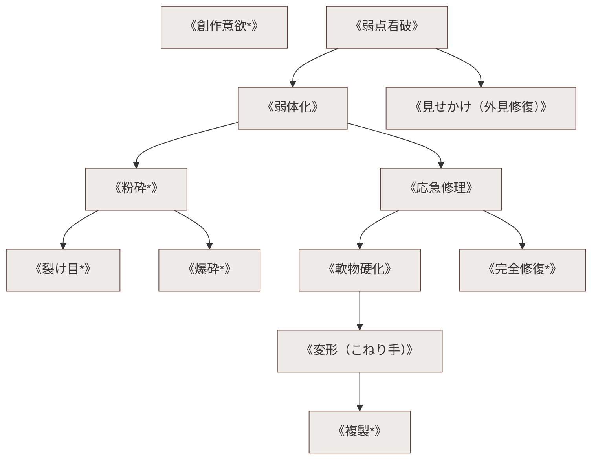

# 物体操作・作成破壊系呪文 (Making & Breaking Spells)

本ドキュメントは、ガープス第4版『魔法大全』第24章（pp.166-171）および関連拡張サプリメントの公式データを基に、物質の分子結合・応力集中・結晶破壊・即時修理・精密加工、および2026年現代における工廠兵器整備・メガコーポ工業生産を体系化した公式魔術アーカイブです。

---

## 1. 物体操作・作成破壊魔術の力学

物体操作系呪文は、金属、高分子、セラミック、岩石などの非生命物質における原子・分子間の結合エネルギーおよび応力テンソルをマナで直接変調させる魔術体系です。微細な亀裂を共振させて一撃で粉砕する破壊工学から、破損した銃身や装甲板を分子レベルで再接合する即時修理工学までを網羅します。

### 1.1 前提条件ツリー (Prerequisite Tree)

---

## 2. 物体操作系主要呪文データ一覧

| 呪文名（日 / 英） | クラス | 基本消費 / 維持 | 詠唱時間 | 前提条件 | 効果概要・力学 |
| :--- | :---: | :---: | :---: | :--- | :--- |
| **《弱点看破》** Find Weakness | 情報 | 1 / 不可 | 2秒 | 四大精霊各1種 | 建造物、装甲板、魔獣の甲殻に潜む構造的歪み・微細亀裂を透視。 |
| **《弱体化》** Weaken | 通常 | 2〜6 / 永久 | 5秒 | 《弱点看破》 | 対象のDR（防護点）や耐久度（HP）を恒久的に低下・脆弱化。 |
| **《応急修理》** Rejoin | 通常 | 1 (5kg毎) / 半 | 4秒/5kg | 《弱体化》, 《見せかけ》 | 破断した刃、破損した小銃レシーバーを数分間だけ分子結合。 |
| **《粉砕*》** Shatter | 通常 | 1〜3 / 不可 | 1秒 | 素質1, 《弱体化》 | 触れたガラス、岩石、脆性金属を一瞬で粉々に破砕。 |
| **《爆砕*》** Explode | 通常 | 2〜6 / 不可 | 1秒 | 素質2, 《粉砕》, 《念動》 | 物体内部に応力を瞬間蓄積させ、手榴弾のように破片爆散させる。 |
| **《軟物硬化》** Stiffen | 通常/抵 | 1 (0.5kg毎) / 半 | 2秒 | 《応急修理》 | 布、ロープ、液体を一時的に鋼鉄並みの剛性と硬度に硬化。 |
| **《変形》** Reshape | 通常 | 6 / 3 | 10秒 | 素質1, 《弱体化》, 変化系 | 金属やプラスチックを粘土のように素手で自由に変形加工。 |
| **《完全修復*》** Repair | 通常 | さまざま / 永久 | 1分 | 素質2, 《応急修理》, 《変形》 | 完全に破壊・断裂した精密機器や武器を新品同様に再生。 |
| **《複製*》** Duplicate | 通常 | 10 (儀式) / 永久 | 1時間 | 素質3, 《完全修復》, 10系統 | 鍵や極小部品、特殊カートリッジを原子配置レベルで精密複製。 |

---

## 3. 2026年現代兵器整備・ヤマト重工工廠における応用

### 3.1 壁外前線基地（FOB）における装甲車両・重火器の即時レストア
激戦区でキャタピラが吹き飛び、主砲身が歪んだ戦闘車両（16式機動戦闘車など）に対し、工兵術士が《完全修復》《変形》を施すことで、通常数日を要する重整備をわずか数分で完了させ、戦線崩壊を防止しています。

### 3.2 警察・対テロ特殊班のエントリーツール（《粉砕》《爆砕》）
突入部隊（SAT）は、防爆扉や強化ガラス窓を一撃で突破するため、指向性爆薬の代わりに《粉砕》《裂け目》を用い、爆風被害を最小限に抑えつつ電撃エントリーを実行します。
