# 呪文操作系呪文 (Meta-Spells)

本ドキュメントは、ガープス第4版『魔法大全』第8章（pp.50-55）および公式拡張サプリメント（『Magic: Artillery Spells』『Magic: Death Spells』『Magic: The Least of Spells』『Magic: Plant Spells』等）に準拠した、**全49種**の呪文操作系呪文公式アーカイブです。マナ力学、生体媒介作用、ならびに2026年現代における結界都市防衛・軍事兵器工学・法規制（CR）の運用データを過不足なく完全網羅しています。

---

## 1. 呪文操作系呪文の力学体系

呪文操作系呪文は、マナの指向性周波数を介して対象の物理・生体・霊的パラメータを励起・変調・制御する魔術体系です。
- **生体媒介原則**: マナは術士の生体・神経系・霊体を介して作用し、直接の物質変換や物理エネルギー励起を行います。
- **現代技術インフラとの並行性**: 電子回路や通信網を直接破壊するのではなく、物理的現象（熱、圧力、電磁、物質変形等）を介して現代兵器や都市防護壁と相互作用します。

### 1.1 呪文操作系呪文 前提条件ツリー (Prerequisite Tree)

```mermaid
graph TD
    %% クラススタイル定義（高コントラスト・ダークモード規格）
    classDef spell fill:#0f172a,stroke:#38bdf8,stroke-width:1.5px,color:#ffffff;
    classDef root fill:#0369a1,stroke:#38bdf8,stroke-width:2px,color:#ffffff,font-weight:bold;
    classDef ext fill:#1e293b,stroke:#94a3b8,stroke-width:1px,color:#cbd5e1,stroke-dasharray: 5 5;
    classDef special fill:#4c1d95,stroke:#c084fc,stroke-width:1.5px,color:#ffffff;

    %% 系統内呪文ノード定義
    subgraph Sub_571DE2FD ["41種"]
        Counterspell["《対抗呪文》<br>(Counterspell)"]:::special
        Scryguard["《感知防御》<br>(Scryguard)"]:::special
        SuspendSpell["《呪文停止》<br>(Suspend Spell)"]:::special
        Ward["《呪文防御》<br>(Ward)"]:::special
        SeekMagic["《魔法探知》<br>(Seek Magic)"]:::spell
        ConcealMagic["《魔法隠匿》<br>(Conceal Magic)"]:::spell
        Reflect["《呪文反射》<br>(Reflect)"]:::spell
        Scrywall["《感知防御壁》<br>(Scrywall)"]:::spell
        GreatWard["《複数防御》<br>(Great Ward)"]:::special
        FalseAura["《霊気偽装》<br>(False Aura)"]:::spell
        MagicResistance["《呪文抵抗》<br>(Magic Resistance)"]:::special
        Scryfool["《捜査攪乱》<br>(Scryfool)"]:::special
        PenetratingSpell["《貫通呪文》<br>(Penetrating Spell)"]:::spell
        CatchSpell["《呪文捕獲*》<br>(Catch Spell)"]:::special
        SuspendMagic["《魔法停止》<br>(Suspend Magic)"]:::spell
        DisplaceSpell["《呪文移動》<br>(Displace Spell)"]:::spell
        SpellShield["《呪文障壁》<br>(Spell Shield)"]:::special
        SpellWall["《呪文防壁》<br>(Spell Wall)"]:::spell
        Pentagram["《魔法障壁》<br>(Pentagram)"]:::spell
        SuspendCurse["《呪い停止》<br>(Suspend Curse)"]:::special
        Sp_21_14FA["《マナ停止*》<br>(（旧名：魔力停止）)"]:::spell
        DispelMagic["《呪文除去》<br>(Dispel Magic)"]:::spell
        LendSpell["《呪文賦与》<br>(Lend Spell)"]:::special
        RemoveCurse["《呪い除去》<br>(Remove Curse)"]:::special
        Sp_25_F418["《魔力石充電*》<br>(（旧名：パワーストーン充電）)"]:::special
        Spellguard["《呪文保護*》<br>(Spellguard)"]:::spell
        RemoveAura["《霊気除去》<br>(Remove Aura)"]:::spell
        Sp_28_57F8["《マナ枯渇*》<br>(（旧名：魔力除去）)"]:::spell
        Sp_29_74DA["《マナ回復*》<br>(（旧名：魔力回復）)"]:::spell
        StealSpell["《呪文奪取*》<br>(Steal Spell)"]:::spell
        Telecast["《遠隔詠唱*》<br>(Telecast)"]:::special
        HangSpell["《呪文待機*》<br>(Hang Spell)"]:::spell
        MaintainSpell["《呪文維持*》<br>(Maintain Spell)"]:::spell
        ThrowSpell["《呪文投擲*》<br>(Throw Spell)"]:::spell
        Bless["《祝福》<br>(Bless)"]:::special
        Curse["《呪い》<br>(Curse)"]:::special
        SuspendMagery["《素質停止*》<br>(Suspend Magery)"]:::special
        DrainMagery["《素質除去*》<br>(Drain Magery)"]:::special
        Sp_39_1ED1["《呪文遅発》<br>(（旧名：遅発）)"]:::special
        Sp_40_2BEE["《呪文連動》<br>(（旧名：連動）)"]:::spell
        Reflex["《瞬間防御》<br>(Reflex)"]:::spell
    end

    subgraph Sub_6B5BB4DD ["MAS / MDS 拡張 3種"]
        ManaStorm["《マナ嵐*》<br>(Mana Storm)"]:::special
        PunishmentCircle["《対魔罰円*》<br>(Punishment Circle)"]:::special
        SelfDestruct["《自爆》<br>(Self-Destruct)"]:::special
    end

    subgraph Sub_E032978 ["MAS / MDS 拡張 2種"]
        DispelSpark["《魔命除去*》<br>(Dispel Spark)"]:::special
        DreadCurse["《破滅の呪い*》<br>(Dread Curse)"]:::special
    end

    %% 前提条件依存関係エッジ
    Req_1 --> Counterspell
    Req_1 --> Scryguard
    Counterspell --> SuspendSpell
    Req_1 --> Ward
    Ext_2 --> SeekMagic
    Ext_2 --> ConcealMagic
    Ward --> Reflect
    Scryguard --> Scrywall
    Ward --> GreatWard
    ConcealMagic --> FalseAura
    Ext_3 --> FalseAura
    Req_4 --> MagicResistance
    Ext_5 --> Scryfool
    Ext_6 --> Scryfool
    Sp_39_1ED1 --> PenetratingSpell
    Ext_7 --> PenetratingSpell
    Ext_8 --> CatchSpell
    SuspendSpell --> SuspendMagic
    SuspendSpell --> DisplaceSpell
    Scryguard --> SpellShield
    MagicResistance --> SpellShield
    SpellShield --> SpellWall
    SpellShield --> Pentagram
    Req_9 --> SuspendCurse
    SuspendSpell --> Sp_21_14FA
    Counterspell --> DispelMagic
    Ext_10 --> LendSpell
    SuspendCurse --> RemoveCurse
    Ext_11 --> Sp_25_F418
    Ext_12 --> Sp_25_F418
    DispelMagic --> Spellguard
    DispelMagic --> RemoveAura
    Ext_3 --> RemoveAura
    DispelMagic --> Sp_28_57F8
    Ext_13 --> Sp_28_57F8
    DispelMagic --> Sp_29_74DA
    Ext_13 --> Sp_29_74DA
    LendSpell --> StealSpell
    GreatWard --> StealSpell
    Ext_14 --> Telecast
    Ext_15 --> Telecast
    Sp_39_1ED1 --> HangSpell
    Sp_40_2BEE --> MaintainSpell
    Sp_39_1ED1 --> ThrowSpell
    Ext_16 --> ThrowSpell
    Req_17 --> Bless
    Req_17 --> Curse
    Req_17 --> SuspendMagery
    Ext_18 --> DrainMagery
    Req_19 --> Sp_39_1ED1
    Sp_39_1ED1 --> Sp_40_2BEE
    Sp_39_1ED1 --> Reflex
    Ward --> Reflex
    Ext_20 --> ManaStorm
    Ext_21 --> ManaStorm
    Pentagram --> PunishmentCircle
    Ext_22 --> PunishmentCircle
    Req_23 --> SelfDestruct
    Ext_20 --> DispelSpark
    RemoveAura --> DispelSpark
    Curse --> DreadCurse

    %% 外部系統・特殊前提ノード
    Req_1["【前提: 素質1】"]:::ext
    Ext_2["【他系統: 《魔法感知》】"]:::ext
    Ext_3["【他系統: 《霊気感知》】"]:::ext
    Req_4["【前提: 素質1、7系統から各1種】"]:::ext
    Ext_5["【他系統: 《調査感知》】"]:::ext
    Ext_6["【他系統: 《単純幻覚》】"]:::ext
    Ext_7["【他系統: 《弱点看破》】"]:::ext
    Ext_8["【他系統: 《瞬間矢返し》】"]:::ext
    Req_9["【前提: 素質1、12系統から各1種】"]:::ext
    Ext_10["【他系統: 《技能賦与》】"]:::ext
    Ext_11["【他系統: 《魔力石》】"]:::ext
    Ext_12["【他系統: 《活力賦与》】"]:::ext
    Ext_13["【他系統: 《マナ停止》】"]:::ext
    Ext_14["【他系統: 《瞬間移動》】"]:::ext
    Ext_15["【他系統: 《魔法の目》】"]:::ext
    Ext_16["【他系統: 《呪文捕獲》】"]:::ext
    Req_17["【前提: 素質2、10系統から各2種#】"]:::ext
    Ext_18["【他系統: 《素質停止》】"]:::ext
    Req_19["【前提: 素質3、呪文15種】"]:::ext
    Ext_20["【他系統: 《マナ枯渇》】"]:::ext
    Ext_21["【他系統: 《マナ回復》】"]:::ext
    Ext_22["【他系統: 《悪霊祓い》】"]:::ext
    Req_23["【前提: 素質1、異なる10系統から各呪文1種#】"]:::ext
```

---

## 2. ガープス第4版『魔法大全』基本呪文操作系呪文（41種）

| 呪文名（日 / 英） | クラス | 持続時間 | 基本消費 / 維持 | 詠唱時間 | 前提条件 | 効果概要・力学 |
| :--- | :---: | :---: | :---: | :---: | :--- | :--- |
| **《対抗呪文》** Counterspell | 通常/抵-呪文 | 一瞬 | さまざま | 5秒 | 素質1 | _ 目標 の 呪文 、 持続している 呪文 ひとつを無効にします。与えた変化が 永久 に続く 呪文 （たとえばをで元に戻すことはできません。 魔法の品物 には効きませんが、 魔法の品物 を使って唱えられた 呪文 になら対抗できます。の “ 目標 ” は、無 |
| **《感知防御》** Scryguard | 通常 | 10時間 | 3/1 | 5秒 | 素質1 | に抵抗、 目標 はどんな にもかかりにくくなります。された 目標 を「見る」には、 がとの 即決勝負 に勝たねばなりません。それでもはがかかっていることを感知します。 エラッタ修正：【誤】 技能勝負 → 【正】 即決勝負 |
| **《呪文停止》** Suspend Spell | 通常/抵-呪文 | 1分 | さまざま | 1秒 | 素質1、《対抗呪文》 | _ 目標 の 呪文 、 この 呪文 は現在発揮している 呪文 の効果を一時的に停止します。 術者 は停止しようとしている 呪文 を習得していなければなりません。は 魔法の品物 には効果がありませんが、それによって唱えられた 呪文 には効果があります。でしか取り除けない 呪文 はで効果を止めるこ |
| **《呪文防御》** Ward | 防御/抵-呪文 | 一瞬 | 2または3# | なし | 素質1 | _ 目標 の 呪文 、 呪文 が 目標 に投げかけられた直後にこの 呪文 を唱えると、対抗しようとする 呪文 が働くのを防ぐことができます。 魔法 による 攻撃 ひとつにしか効きません。 攻撃 的な 呪文 が複数の人物に効果を持つときは、1回でひとりしか救うことはできません。また、 には効果ありません。 |
| **《魔法探知》** Seek Magic | 情報 | 一瞬 | 6 | 10秒 | 《魔法感知》 | もっとも近い位置にある、ある程度以上の魔力を持った品物・効果を発揮している 呪文 ・ 魔法 的な生物（悪魔、精霊、霊魂など。ただし「 魔法の素質 」をもつ個人はこれに含まれません）の方向とおよその距離が分かります。通常の 距離修正 値を使います。 術者 はすでに知っている 魔法 をあらかじめ省いたうえで 呪文 を欠けるこ |
| **《魔法隠匿》** Conceal Magic | 通常 | 10時間 | 1〜5/同# | 3秒 | 《魔法感知》 | 生き物や品物1つにかけると、それを 目標 としてかけられた の邪魔をします。消費した エネルギー （最大5点まで）1点ごとに、その生き物や品物を探したり調べたりする 呪文 の 技能 判定に-2の修正をうけます。例： エネルギー を4点消費しての 呪文 を指輪にかけました。 呪文 の効果が切れるまでは、指輪にをかけ |
| **《呪文反射》** Reflect | 防御/抵-呪文 | 一瞬 | 4または6# | なし | 《呪文防御》 | _ 目標 の 呪文 、 がより進歩したもので、働きは似たようなものです。違いといえば、かけられた 呪文 を無効にするのではなく反射するところです。つまりに成功すると、 呪文 は本来の 術者 に向かって 攻撃 をしかけます。 攻撃 的な のときは、 目標 を防御しながら、本来の 術者 に対して効果範囲 |
| **《感知防御壁》** Scrywall | 範囲 | 10時間 | 3/2 | 秒=コスト | 《感知防御》 | に抵抗、 壁・と同じですが、範囲全体とそのなかに含まれるすべてのものを守ります。 |
| **《複数防御》** Great Ward | 防御/抵-呪文 | 一瞬 | 1/目標1つ毎# | なし | 素質2、《呪文防御》 | _ 目標 の 呪文 、 と似ていますが、 攻撃 的な 呪文 に影響を受ける複数の 目標 を守ることができます。 |
| **《霊気偽装》** False Aura | 通常/範囲/抵-知力# | 10時間 | 4/半 | 10秒 | 《魔法隠匿》、《霊気感知》 | に抵抗、 霊・生物や物体が放つ 魔法 的波動を偽物にとりかえます。生物の「オーラ」が文字通りそれに当たります。例えば人間が発するオーラを ゾンビ のそれに見せかけることもできます。ふつうの剣をに見せかけることができます。ただの床にやが 魔化 されているように偽装できます |
| **《呪文抵抗》** Magic Resistance | 通常/抵-意志力+素質 | 1分 | 1〜5/同# | 3秒 | 素質1、7系統から各1種 | _ 意志力 + 素質 、 呪文 に消費した エネルギー 1点ごとに（最大5点）、 目標 の 呪文 抵抗の 目標値 が+2されます（抵抗したくないときには+1）。この 呪文 は、 目標 に 魔法 が唱えられたときには「 魔法の耐性 」（『 ベーシックセット 1巻』94ページ）と同じように働きます。ただし 目標 は 呪文 を唱 |
| **《捜査攪乱》** Scryfool | 通常/抵-特殊 | 10時間 | 4/2 | 10秒 | 素質2、《調査感知》、《単純幻覚》 | （そうさかくらん。Scryfool） _特殊、 の 目標 を本来の 目標 から「おとり」である別の 目標 に変更します。 呪文 を唱えるとき、2つの 目標 は 術者 の近くになければなりません。もし必要なら通常の 距離修正 を使用します。望まない 目標 は 意志力 で抵抗します。 この 呪文 |
| **《貫通呪文》** Penetrating Spell | 通常 | さまざま | さまざま | 3秒 | 《呪文遅発》、《弱点看破》 | ダメージを与える他の 呪文 に対して唱え、「 徹甲除数 」（『 ベーシックセット 2巻』357ページ）を与えます。これらの 呪文 は、1つを唱え終えたらすぐに次をかけねばなりません。を先にかけ、続いて他の 呪文 をかけるため、続けて唱える 呪文 の 修正後技能レベル は 呪文 を1つ 維持 しているものとして決めます。 で |
| **《呪文捕獲*》** Catch Spell* | 防御 | 一瞬 | 3 | 1秒 | 素質2、敏捷力12以上、《瞬間矢返し》 | （至難） が投げられたときに唱えます（唱えられた瞬間ではありません）。 術者 は自分の手の届く範囲に飛んできた 呪文 をつかむことができます。うまくつかむことができたら、「自分がその 呪文 を唱えていま出現した」ものとして扱います。その後投げてください（元の 術 |
| **《魔法停止》** Suspend Magic | 範囲/抵-呪文 | 1分 | 3/2 | 秒=コスト | 《呪文停止》、他の呪文8種 | _ 目標 の 呪文 、 範囲内にある他の 呪文 の効果をすべて一時的に停止します。 魔法の品物 には効果がありません。また一部の強力な 呪文 にも効果がありません――例えばでしか取り除けないような 呪文 です。それぞれの 呪文 は個別に抵抗します。は 目標 を選べません。（他の全ての と同じく） 術 |
| **《呪文移動》** Displace Spell | 通常/抵-呪文 | さまざま | さまざま | 5秒 | 《呪文停止》 | _ 目標 の 呪文 、 の効果範囲を 永久 に移動させます。一部の強力な 呪文 には効果がありません――例えばでしか取り除けないような 呪文 です。別々の 呪文 は個別に移動させなければなりません。ただししているものは一度にすべて移動します。 術者 は移動させようとしている 呪文 を知っている必要は |
| **《呪文障壁》** Spell Shield | 範囲 | 1分 | 3/2 | 1秒 | 素質2、《感知防御》、《呪文抵抗》 | 唱えられた 呪文 すべてに抵抗、 壁・範囲内にいる者を狙って外側からかけられた 呪文 にの 耐久度 で抵抗します。前記のに似ています。例外： には効きません。 外からかけた 呪文 のほうが判定で勝ったら、壁を通り抜けます――ただしは 耐久度 が1点減るだけで、壊れたりしません。《 |
| **《呪文防壁》** Spell Wall | 通常/抵-呪文 | 1分 | 2/2# | 1秒 | 《呪文障壁》 | 壁・呪文 を防ぐ壁を作り出します。 術者 が指定された側から唱えられた 呪文 に抵抗します。としても働きます。例外： （投げられたものを含めて）には効きません。もしが抵抗に失敗したら、 呪文 は壁を抜けます――しかし壁は 耐久度 が1点減るだけです。壁の 耐久度 が0になったら壊れてしまいます。こ |
| **《魔法障壁》** Pentagram | 特殊 | 永久 | 1/同/0.1平方m毎# | 1秒/0.1平方m毎# | 《呪文障壁》 | 年06月03日(水) 09:57:20 履歴 |
| **《呪い停止》** Suspend Curse | 通常/抵-呪文 | 10分 | 10/10 | 1分 | 素質1、12系統から各1種 | _ 目標 の 呪文 、 を1つ一時的に停止します。さらに敵の等の 呪文 で引き起こされた肉体や精神の傷も一時的に停止できます。何らかの理由で 目標 の 呪文 の 技能レベル が不明の時には、 GM が最終的に判断します。 修正前の表記。旧表記は色々漏れがあったり、命名法則による問題が生じていた。 |
| **《マナ停止*》** （旧名：魔力停止） Suspend Mana* | 範囲 | さまざま | 5 | 10分 | 《呪文停止》、10系統から各1種 | 呪文データ 差替名称 |
| **《呪文除去》** Dispel Magic | 範囲/抵-呪文 | 永久 | 3 | 秒=コスト | 《対抗呪文》 他の呪文12種 | _ 目標 の 呪文 、 浄化・この 呪文 に成功すると、範囲内にある 呪文 を無効にします。 |
| **《呪文賦与》** Lend Spell | 通常 | 永久 | さまざま | 3秒 | 素質1、《技能賦与》、6系統から各1種 | 術者 が唱えた、 維持 可能な 呪文 に唱えます。他人にその 呪文 を “ 貸して ” 、その人が 維持 できるようになります。借り手はその 呪文 を自分で唱えたのと同じように制御でき、全ての面において責任を持つようになります。借り手は 呪文 自体の制限内で、自由に 維持 したり操作したりできます。 借り手は 呪文 の 特徴 と 能力値 の条件をすべて満 |
| **《呪い除去》** Remove Curse | 通常/抵-呪文 | 一瞬 | 20 | 1時間 | 素質2、《呪い停止》ないし15系統から各1種 | _ 目標 の 呪文 、 浄化・を1つ、無効にします。さらに、敵のなどの 呪文 で引き起こされた肉体や精神の傷も取り除くことができます。なんらかの理由で 目標 の 呪文 の 技能レベル が不明のときは、 GM が最終的に判断します。 修正前の表記。旧表記は色々漏れがあったり、命名法則による問題が生じて |
| **《魔力石充電*》** （旧名：パワーストーン充電） Charge Powerstone* | 通常 | 永久 | 3/充電1点毎 | 10分 | 素質3、《魔力石》、《活力賦与》 | 呪文 差替名称 アイテム 差替名称 |
| **《呪文保護*》** Spellguard* | 通常/抵-特殊 | 10時間 | 1〜3/同# | さまざま | 《呪文除去》 | （至難） 呪文 を 目標 とした別の 呪文 に影響、 他の 呪文 に対して唱え、 目標 が別の 呪文 によって何か影響を受けるのを防ぎます。以下の はに費やした エネルギー （最大3点）の倍だけマイナス修正をうけます――《 |
| **《霊気除去》** Remove Aura | 通常/抵-意志力# | 永久 | 5 | 10秒 | 《呪文除去》、《霊気感知》 | _特殊/ に抵抗、 霊・に似ていますが、 魔法 の波動を「完全に」取り除きます。 無生物 に唱えた場合、といった 呪文 を唱えても何もわからなくなります（の場合、持ち主との関係を失ってしまうので-5の修正をうけることになります） |
| **《マナ枯渇*》** （旧名：魔力除去） Drain Mana* | 範囲 | 永久 | 10 | 1時間 | 《呪文除去》、《マナ停止》 | 呪文データ 差替名称 |
| **《マナ回復*》** （旧名：魔力回復） Restore Mana* | 範囲 | 永久 | 10 | 1時間 | 《呪文除去》、《マナ停止》 | 呪文データ 差替名称 |
| **《呪文奪取*》** Steal Spell* | 通常/抵-特殊 | 永久 | さまざま | 秒=コスト | 《呪文賦与》、《複数防御》 | （至難） _ 目標 の 呪文 、 術者 以外が唱えた、 維持 可能な 呪文 のコントロールを奪います。この 呪文 は奪おうとする 呪文 の「 術者 」に唱えるため、 術者 間の通常の 距離修正 がかかります。 術者 は奪おうとする 呪文 を正確に認識してい |
| **《遠隔詠唱*》** Telecast* | 特殊 | 5秒 | さまざま | 1分 | 素質3、《瞬間移動》、《魔法の目》、10系統から各1種 | （至難） この 呪文 はを 瞬間移動 させて、「そこにいるかのように」離れた場所から別の 呪文 を唱えるためのものです。 は 遠隔詠唱 できませんが、 は可能です。接触が必要な 呪文 を 遠隔詠唱 することもできますが、 魔法の目 が 攻撃 に成功し、相 |
| **《呪文待機*》** Hang Spell* | 特殊 | 1時間 | さまざま | 10秒 | 《呪文遅発》 | （至難） 呪文 に対して唱えます。 術者 が望むまで 目標 が効果を発揮するのを遅らせます。 を 目標 にすることはできません。この 呪文 と 目標 の 呪文 は遅れることなく立て続けに唱えられなければなりません。 術者 はまずの判定を行います。 目標 呪文 の |
| **《呪文維持*》** Maintain Spell* | 特殊 | 不定# | さまざま | 2秒# | 《呪文連動》 | （至難） 術者 が唱えた現在効果を発揮している 呪文 に唱え、 エネルギー をためる「電池」を作りだします。がかかった 呪文 は、 維持 に必要な エネルギー をから引き出すようになります。 目標 の 呪文 は元の 術者 との関わりがなくなります。 |
| **《呪文投擲*》** Throw Spell* | 射撃/特殊 | 不定# | 3 | 1秒 | 《呪文遅発》、《呪文捕獲》 | 他の 呪文 に対して唱え、 目標 を にします。この 呪文 と 目標 の 呪文 は遅れることなく立て続けに唱えられなければなりません。を先に唱えます。 目標 の 呪文 を唱えるときは、が “ 効果を発揮している ” ものとして 目標値 を計算します。 術者 はを唱える際に、2つの |
| **《祝福》** Bless | 通常 | 特殊 | さまざま | 分=コスト | 素質2、10系統から各2種# | 有利特徴「祝福」 B59P |
| **《呪い》** Curse | 通常 | 特殊 | さまざま | さまざま | 素質2、10系統から各2種# | 増強 攻撃修正 貫通力修正 修正 名称修正希望 |
| **《素質停止*》** Suspend Magery* | 通常/抵-意志力+素質 | 1時間 | 12/同# | 10秒 | 素質2、10系統から各2種# | （至難） _ 意志力 + 素質 、 目標 がもつ「 魔法の素質 」を一時的に無効化します。 術者 は詠唱のあいだずっと 目標 に触っていなければなりません。 目標 は 魔法 の知識を忘れるわけではありませんが、 マナ 濃度が「密」以上の世界でなけ |
| **《素質除去*》** Drain Magery* | 通常/抵-意志力+素質 | 永久 | 30 | 10分 | 素質3、《素質停止》 | （至難） _ 意志力 + 素質 、 目標 の「 魔法の素質 」を1レベル 永久 に取り除きます。 術者 は詠唱のあいだずっと 目標 に触っていなければなりません。 目標 は 魔法 の知識を忘れるわけではありません。新しい 素質 のレベルが |
| **《呪文遅発》** （旧名：遅発） Delay | 通常 | 2時間 | 3/3 | 10秒 | 素質3、呪文15種 | 詳細参照 |
| **《呪文連動》** （旧名：連動） Link | 範囲 | 不定# | 8 | 4時間 | 《呪文遅発》 | 効果範囲内に連動される 呪文 が唱えられていると、1つでも複数でも、の目の前である出来事がおこるまで、発動する時間を延ばすことができます。引き金となるできごとは 術者 が選びます。単純なものでも複雑なものでもかまいません。（前記）と同じように扱います。同じ |
| **《瞬間防御》** Reflex | 特殊 | 1時間 | さまざま | 10秒 | 《呪文遅発》、《呪文防御》 | 呪文データ |

---

## 3. 魔導兵器・砲兵戦術拡張呪文（MAS / MDS 拡張 3種）

| 呪文名（日 / 英） | クラス | 持続時間 | 基本消費 / 維持 | 詠唱時間 | 前提条件 | 効果概要・力学 |
| :--- | :---: | :---: | :---: | :---: | :--- | :--- |
| **《マナ嵐*》** Mana Storm* | 範囲 | 10秒 | 3・同 | 1秒/半径1ｍ毎 | 素質4、《マナ枯渇》、《マナ回復》 | （至難）（Mana Storm (VH)） p.19 （至難） 激しい魔力変動で効果範囲を満たし、“オーラ”を持つあらゆるものから「 魔法 のエッセンス」を奪います。 知力 1以上のすべての生者および アンデッド （エルフ、人間、火星人、吸血鬼、狼男、その他すべての「実体を持ち、自発的に動く存在」を含む）はオーラを持ち |
| **《対魔罰円*》** Punishment Circle* | 範囲 | 1分 | 3・同 | 1秒/半径1ｍ毎 | 素質3、および《魔法障壁》か《悪霊祓い》のいずれか | （至難）（Punishment Circle (VH)） pp.19-20 （至難） 魔法生物に苦痛と 負傷 を与えるエリアを作り出します。この領域は、召喚された、あるいは召喚されうる存在（例： 天使 、 悪魔 、 精霊 、その他の 霊 ）、 魔法 によって生み出された存在（ 作成物 、 幻覚 、 |
| **《自爆》** Self-Destruct | 範囲 | 一瞬 | 12 | 1秒 | 素質1、異なる10系統から各呪文1種# | magic_artillery_spells |

---

## 4. 魔導兵器・砲兵戦術拡張呪文（MAS / MDS 拡張 2種）

| 呪文名（日 / 英） | クラス | 持続時間 | 基本消費 / 維持 | 詠唱時間 | 前提条件 | 効果概要・力学 |
| :--- | :---: | :---: | :---: | :---: | :--- | :--- |
| **《魔命除去*》** Dispel Spark * | 通常/抵-生命力か意志力 | 一瞬 | 12 | 5秒 | 素質3、《マナ枯渇》、《霊気除去》 | （至難）（Dispel Spark (VH)） p.17 （至難） _ 生命力 または 意志力 浄化・“ 魔法による生命の灯 ” を消し去ります。対象は、 生命力 または 意志力 のよりよい方で表される “ 生きる意志 ” を用いて抵抗します。抵抗に失敗すると、犠牲者はその場で死亡し、自然 |
| **《破滅の呪い*》** Dread Curse * | 通常/抵-意志力 | 一瞬 | 10 | 4秒 | 素質3、《呪い》 | （至難）（Dread Curse (VH)） p.17 （至難） _ 意志力 対象者を呪い殺します。対象者は生きている必要はなく、活動体（animate、動くもの）というだけ |

---

## 5. 魔導兵器・砲兵戦術拡張呪文（MAS / MDS 拡張 3種）

| 呪文名（日 / 英） | クラス | 持続時間 | 基本消費 / 維持 | 詠唱時間 | 前提条件 | 効果概要・力学 |
| :--- | :---: | :---: | :---: | :---: | :--- | :--- |
| **《転移容易化》（並）** （Easy Rider (A)） | 通常 | 1分 | 2・同 | 1秒 | -（簡単呪文なので） | （並）（Easy Rider (A)） p.10 （並） 対象を、友好的または敵対的を問わず、あらゆる形式のテレポート、時間移動、次元移動などで移動しやすい体質にします。この体質により、対象に前述の能力の使用する際の判定には+1ボーナスがつくようになります。 魔法使い は自分自身にこれを唱えることがで |
| **《魔法学師》（並）** （Thaumatomancy (A)） | 情報 | 一瞬 | 10 | 1時間 | -（簡単呪文なので） | （並）（Thaumatomancy (A)） p.12 （並） はっきりと 魔法 に説明を求めてください。1回の詠唱で、既存の 魔法 について、〈 魔法学 〉 技能 が答えられる1つの質問に回答します。新しい 魔法 の独自の研究には使用できません。 技能 判定に影響するペナルティはこの 呪文 にも適用され |
| **《用具認可》（並）** （Use Item (A)） | 通常 | 1秒# | 2・同 | 1秒 | -（簡単呪文なので） | （並）（Use Item (A)） pp.12-13 （並） 術者 は、関連する場合、「 魔法の素質 /0L」の場合と同様に、 “ 魔術師 のみが使用可能” な 魔法の品物 を一時的に使用できます。が失効した瞬間、そのようなアーティファクトが引き起こしたすべての 魔法 効果も終了します。進行中の 呪文 は |

---

## 6. 2026年現代戦術・都市防衛・法規制（CR）における運用

### 6.1 警察・自衛隊・PMCにおける実戦配備
結界都市（セーフゾーン）警備および壁外アウトランドへの遠征作戦において、呪文操作系呪文は索敵・突入支援・防壁維持・目標無力化の標準プロトコルとして統合運用されています。特に部隊随伴術士による即時展開は、通常兵器との複合火力（コンバインド・アームズ）として極めて高い戦闘効率を発揮します。

### 6.2 メガコーポ支配と特許利権
ヤマト重工、テイコク製薬、サエデル・シュティフトゥング、アレス等のメガコーポは、呪文操作系呪文の工業・医療・防衛利用に関する独占特許を保有しており、民間術士に対するライセンス管理や魔導触媒・霊薬の市場流通を掌握しています。

### 6.3 国際魔導協定（IMA）および法規制（CR）
破壊力・精神汚染・非人道性の高い高位呪文は、国家公安委員会および国際魔導協定により**規制等級CR3〜CR4（要特別国家許可・戦時国際法規制）**に指定されており、無認可での行使・研究は厳罰に処されます。