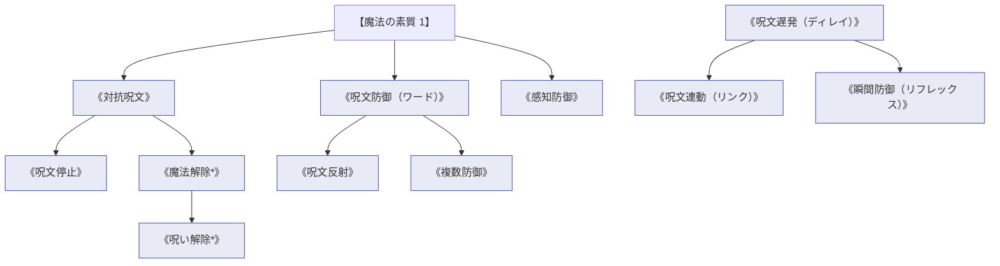

# 呪文操作・連動系呪文 (Meta-Spells & Linking Spells)

本ドキュメントは、ガープス第4版『魔法大全』第8章（pp.52-62）および関連拡張サプリメントの公式データを基に、魔術構造解析・対抗呪文（カウンタースペル）・呪文反射・遅延発動・トリガー連動、および2026年現代における対術士電子魔導戦・結界防空を体系化した公式魔術アーカイブです。

---

## 1. 呪文操作・連動魔術の力学

呪文操作系呪文（Meta-Spells）は、物質や生体ではなく**「術式（マナの構成波形・論理構造）そのもの」**を対象とする最上位のメタ魔術です。すべての呪文に「魔法の素質（Magery 1以上）」が必須であり、飛来する敵の呪文を中和・反射する電子戦（ECM/ECCM）に相当する役割を果たします。

### 1.1 前提条件ツリー (Prerequisite Tree)

---

## 2. 呪文操作・連動系主要呪文データ一覧

| 呪文名（日 / 英） | クラス | 基本消費 / 維持 | 詠唱時間 | 前提条件 | 効果概要・力学 |
| :--- | :---: | :---: | :---: | :--- | :--- |
| **《対抗呪文》** Counterspell | 通常/抵 | さまざま | 5秒 | 素質1 | 展開中の敵呪文を解析し、そのマナ結合を中和・消滅させる。 |
| **《呪文防御》** Ward | 防御/抵 | 2または3 | なし（割込） | 素質1 | 敵の詠唱完了と同時に割り込み、自身に向けられた呪文を打ち消す。 |
| **《呪文反射》** Reflect | 防御/抵 | 4または6 | なし（割込） | 《呪文防御》 | 飛来した攻撃呪文（火球、電撃等）をそのまま詠唱者へ撃ち返す。 |
| **《感知防御》** Scryguard | 通常 | 3 / 1 | 5秒 | 素質1 | 遠隔透視や《思考察知》によるスキャンを完全に遮断。 |
| **《魔法解除*》** Dispel Magic | 範囲/抵 | 3 (面積毎) | 秒=コスト | 素質2, 《対抗呪文》 | 指定範囲内に存在するすべての持続呪文を一括で強制消滅。 |
| **《呪文遅発》** Delay | 連動 | 3 / 不可 | 10秒 | 素質2, 6系統各1種 | 詠唱した呪文を指定時間後、または特定合図で自動発動するようにセット。 |
| **《呪文連動》** Link | 連動 | さまざま | 1分 | 《呪文遅発》 | 「扉が開いた時」「レーザーセンサ感知時」等、トリガー条件と呪文を直結。 |
| **《瞬間防御》** Reflex | 連動 | 2 / 不可 | 5秒 | 《呪文遅発》 | 攻撃を受けた瞬間に《瞬間矢よけ》《呪文防御》が反射的・自動発動。 |
| **《魔力無効化*》** Drain Mana | 儀式 | 100+ | 1時間 | 素質3, 10系統各1種 | 地域一帯のマナ濃度を強制的に希薄化（ノーマナ域化）させ、全魔術を封殺。 |

---

## 3. 2026年現代戦術・対術士電子魔導戦（ECM）

### 3.1 自衛隊専門魔法部隊およびPMC術士護衛班の《呪文防御》《呪文反射》運用
敵性術士や知的魔獣との交戦において、味方小隊を率いる術士は《瞬間防御（リフレックス）》を自己展開しつつ、敵の奇襲投射（火球・電撃）に対して《呪文防御》《呪文反射》をノータイムで展開する「魔導イージスシステム」として機能します。

### 3.2 現代インフラトラップと《呪文連動（リンク）》
重要防衛拠点や特異災害指定地域の封鎖ゲートには、物理センサー（赤外線・感圧スイッチ）と《呪文連動》を組み合わせた「魔導トラップ」が敷設されており、魔獣の接近に合わせて自動で《閃光》《爆裂火球》《蔦絡め》が起動する無人防衛システムが確立されています。
