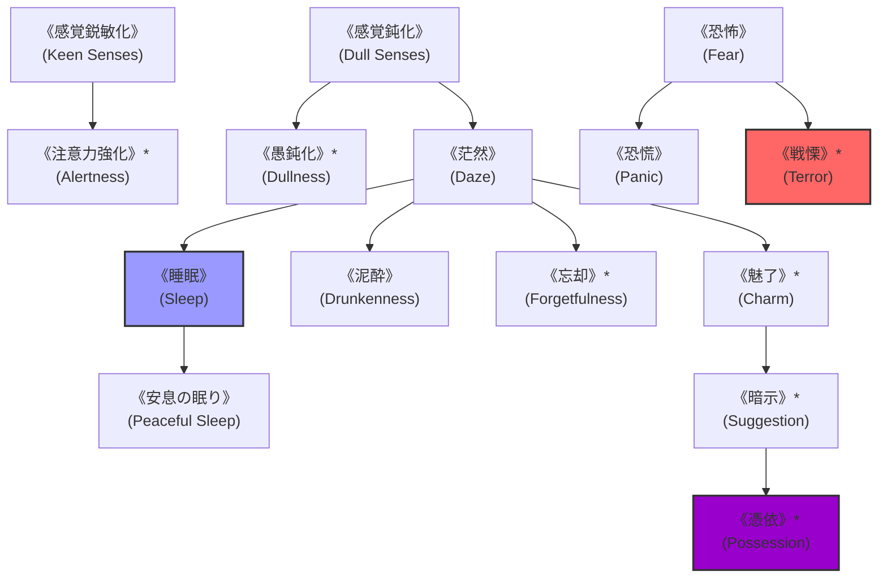

# ガープスマジック呪文体系：精神操作系呪文 (Mind Control Spells)

**主管部署**: 魔導科学・理論研究部  
**準拠文献**: 『ガープス第4版 魔法大全（GURPS Magic）』第14章 pp.98-105、公式サプリメント各編（magic_page_073.html）  
**準拠憲章**: `AGENTS.md` (精神・神経系へのマナ干渉・精神汚染/狂気・暴走魔獣鎮静)

---

## 1. 精神操作系呪文の基本概要と力学特性

### 1.1 系統特性
- **本質**: 知性（知力6以上）と自由意志を持つ生物の脳神経電位・感情・意識への直接干渉。
- **作用対象の制限**: オートマトン、ゾンビ、完全無機機械（知力5以下）には無効（これらには《機械制御》や《死霊支配》を適用）。
- **現代世界での位置づけ**:
  - アビス特異点からの精神汚染（狂気・SAN値崩壊）に対する精神防壁。
  - 暴走した中・大型魔獣に対する鎮静・睡眠による無力化、警察による暴徒・テロリスト鎮圧。

---

## 2. 呪文前提系統樹（ツリー構造）

---

## 3. 呪文詳細一覧データ（主要抜粋・全74種）

| 呪文名（日 / 英） | クラス | 持続時間 | エネルギー消費 | 準備時間 | 前提条件 | 出力・効果概要 |
| :--- | :--- | :--- | :--- | :--- | :--- | :--- |
| **《感覚鋭敏化》** (Keen Senses) | 通常 | 1分 | 1点/感覚 (維持半) | 1秒 | なし | 視覚・聴覚・嗅覚の知覚力判定に+1〜+5のボーナス。 |
| **《感覚鈍化》** (Dull Senses) | 通常/抵 | 1分 | 1点/感覚 (維持半) | 1秒 | なし | 敵の感覚を麻痺させ、知覚力判定にペナルティ。 |
| **《茫然》** (Daze) | 通常/抵 | 1分 | 3点 (維持2) | 1秒 | 《感覚鈍化》 | 対象の思考を停止させ、その場に棒立ち（無抵抗）にさせる。 |
| **《睡眠》** (Sleep) | 通常/抵 | 永久 | 4点 | 2秒 | 《茫然》 | 対象を深い自然な睡眠へと誘導（大声や打撃で覚醒）。 |
| **《恐怖》** (Fear) | 通常/抵 | 1分 | 2点 | 1秒 | 情報系《感情感知》 | 対象に激しい恐怖感を植え付け、恐怖判定を強制。 |
| **《恐慌》** (Panic) | 範囲/抵 | 1分 | 2点/m (同維持) | 2秒 | 《恐怖》 | 指定範囲の生物を一斉にパニック・逃走状態に陥れる。 |
| **《戦慄》\*** (Terror) | 範囲/抵 | 1分 | 4点/m | 2秒 | 素質2、《恐慌》 | アビス邪神の威圧に匹敵する絶対的絶望・精神崩壊（至難）。 |
| **《魅了》\*** (Charm) | 通常/抵 | 1分 | 6点 (維持3) | 3秒 | 素質1、《茫然》、情報系4種 | 術者を最愛の友・主君と誤認させ、従順に従わせる（至難）。 |
| **《暗示》\*** (Suggestion) | 通常/抵 | 1回 | 3点 | 2秒 | 《魅了》 | 目標の脳内に特定の行動命令を「自らの意志」として実行させる（至難）。 |
| **《忘却》\*** (Forgetfulness) | 通常/抵 | 永久 | 3点〜 | 5秒 | 《茫然》、知力12以上 | 標的の特定の記憶・機密情報を脳内から永久消去（至難）。 |
| **《憑依》\*** (Possession) | 通常/抵 | 1分 | 10点 (維持5) | 5秒 | 素質3、《暗示》、肉体操作系4種 | 自らの意識を標的の肉体へ完全転移させ、肉体を乗っ取る（至難）。 |

---

## 4. 現代都市治安・対アビス精神防衛での適用例

1. **アビス汚染地域での精神防壁**:
   - 特異点探索部隊が《注意力強化》《感情隠し》を展開し、精神汚染・狂気判定に対する耐性を獲得。
2. **暴走魔獣・暴徒の非殺傷制圧**:
   - 警視庁・PMCが結界都市内で《睡眠》《茫然》《恐慌》を用いて群衆や魔獣を無力化。
