# 精神操作系呪文 (Mind Control Spells)

本ドキュメントは、ガープス第4版『魔法大全』第14章（pp.84-91）および公式拡張サプリメント（『Magic: Artillery Spells』『Magic: Death Spells』『Magic: The Least of Spells』『Magic: Plant Spells』等）に準拠した、**全72種**の精神操作系呪文公式アーカイブです。マナ力学、生体媒介作用、ならびに2026年現代における結界都市防衛・軍事兵器工学・法規制（CR）の運用データを過不足なく完全網羅しています。

---

## 1. 精神操作系呪文の力学体系

精神操作系呪文は、マナの指向性周波数を介して対象の物理・生体・霊的パラメータを励起・変調・制御する魔術体系です。
- **生体媒介原則**: マナは術士の生体・神経系・霊体を介して作用し、直接の物質変換や物理エネルギー励起を行います。
- **現代技術インフラとの並行性**: 電子回路や通信網を直接破壊するのではなく、物理的現象（熱、圧力、電磁、物質変形等）を介して現代兵器や都市防護壁と相互作用します。

### 1.1 精神操作系呪文 前提条件ツリー (Prerequisite Tree)

```mermaid
graph TD
    %% クラススタイル定義（高コントラスト・ダークモード規格）
    classDef spell fill:#0f172a,stroke:#38bdf8,stroke-width:1.5px,color:#ffffff;
    classDef root fill:#0369a1,stroke:#38bdf8,stroke-width:2px,color:#ffffff,font-weight:bold;
    classDef ext fill:#1e293b,stroke:#94a3b8,stroke-width:1px,color:#cbd5e1,stroke-dasharray: 5 5;
    classDef special fill:#4c1d95,stroke:#c084fc,stroke-width:1.5px,color:#ffffff;

    %% 系統内呪文ノード定義
    subgraph Sub_F00FC51 ["58種"]
        Sp_1_58BF["《感覚鋭敏化》<br>(（旧名：（感覚）鋭敏化　視覚鋭敏化　聴覚鋭敏化　味嗅覚鋭敏化）)"]:::root
        Sp_2_4280["《感覚鈍化》<br>(（旧名：（感覚）鈍化　視覚鈍化　聴覚鈍化　味嗅覚鈍化）)"]:::root
        Alertness["《注意力強化*》<br>(Alertness)"]:::spell
        Dullness["《愚鈍化*》<br>(Dullness)"]:::spell
        Fear["《恐れ》<br>(Fear)"]:::spell
        Sp_6_5FD3["《恐慌》<br>(（旧名：パニック）)"]:::spell
        Terror["《戦慄》<br>(Terror)"]:::spell
        Bravery["《勇気》<br>(Bravery)"]:::spell
        RearVision["《背中の目》<br>(Rear Vision)"]:::spell
        Berserker["《狂戦士》<br>(Berserker)"]:::spell
        Foolishness["《間抜け》<br>(Foolishness)"]:::spell
        Daze["《眩惑》<br>(Daze)"]:::spell
        MentalStun["《心神喪失》<br>(Mental Stun)"]:::spell
        Disorient["《方向喪失》<br>(Disorient)"]:::spell
        Encrypt["《暗号化》<br>(Encrypt)"]:::spell
        Fascinate["《魅惑》<br>(Fascinate)"]:::spell
        Forgetfulness["《忘却》<br>(Forgetfulness)"]:::special
        Sleep["《誘眠》<br>(Sleep)"]:::spell
        Wisdom["《知恵》<br>(Wisdom)"]:::spell
        Sp_20_1127["《能力値増幅》<br>(（旧名：(能力値)増幅　体力増幅　敏捷力増幅　生命力増幅　知力増幅）)"]:::spell
        WeakenWill["《意志弱体化》<br>(Weaken Will)"]:::special
        StrengthenWill["《意志強化》<br>(Strengthen Will)"]:::special
        Memorize["《記憶》<br>(Memorize)"]:::spell
        Loyalty["《忠実》<br>(Loyalty)"]:::spell
        Command["《指示》<br>(Command)"]:::special
        Drunkenness["《酩酊》<br>(Drunkenness)"]:::spell
        Madness["《狂気》<br>(Madness)"]:::spell
        EmotionControl["《感情操作》<br>(Emotion Control)"]:::spell
        MassDaze["《集団眩惑》<br>(Mass Daze)"]:::spell
        Mindlessness["《思考停止*》<br>(Mindlessness)"]:::special
        CompelLie["《虚言》<br>(Compel Lie)"]:::spell
        Lure["《人寄せ》<br>(Lure)"]:::spell
        MassSleep["《集団誘眠》<br>(Mass Sleep)"]:::spell
        PeacefulSleep["《安眠》<br>(Peaceful Sleep)"]:::spell
        Sp_35_16B8["《嘔吐感》<br>(（旧名：吐き気）)"]:::spell
        WillLock["《捕縛円》<br>(Will Lock)"]:::spell
        Oath["《宣誓》<br>(Oath)"]:::special
        PermanentForgetfulness["《完全忘却*》<br>(Permanent Forgetfulness)"]:::special
        Recall["《回想》<br>(Recall)"]:::special
        Sp_40_2CA8["《徹夜*》<br>(（旧名：不眠）)"]:::special
        Sp_41_656C["《狂気緩和》<br>(（旧名：狂気回復）)"]:::spell
        Charm["《魅了》<br>(Charm)"]:::special
        Sp_43_120F["《恍惚*》<br>(（旧名：エクスタシー）)"]:::special
        Enthrall["《独演会》<br>(Enthrall)"]:::spell
        PermanentMadness["《永久狂気*》<br>(Permanent Madness)"]:::special
        DreamSending["《夢送り》<br>(Dream Sending)"]:::spell
        Sp_47_B29E["《夢投影》<br>(（旧名：夢投射）)"]:::spell
        FalseMemory["《偽記憶》<br>(False Memory)"]:::spell
        Avoid["《人払い》<br>(Avoid)"]:::spell
        Sp_50_F007["《凶夢》<br>(（旧名：悪夢）)"]:::special
        Hallucination["《虚像》<br>(Hallucination)"]:::spell
        LesserGeas["《命令*》<br>(Lesser Geas)"]:::special
        Suggestion["《ささやき》<br>(Suggestion)"]:::spell
        MassSuggestion["《集団ささやき》<br>(Mass Suggestion)"]:::spell
        GlibTongue["《舌先三寸》<br>(Glib Tongue)"]:::spell
        Enslave["《奴隷*》<br>(Enslave)"]:::spell
        GreatHallucination["《完全虚像*》<br>(Great Hallucination)"]:::special
        GreatGeas["《大命*》<br>(Great Geas)"]:::special
    end

    subgraph Sub_E032978 ["MAS / MDS 拡張 2種"]
        MassMutilation["《集団自傷*》<br>(Mass Mutilation)"]:::special
        StabbingParty["《同士討ち*》<br>(Stabbing Party)"]:::special
        Coma["《昏睡化*》<br>(Coma)"]:::special
        MindKiller["《自滅意志*》<br>(Mind-Killer)"]:::special
    end

    %% 前提条件依存関係エッジ
    Sp_1_58BF --> Alertness
    Sp_2_4280 --> Dullness
    Req_1 --> Fear
    Fear --> Sp_6_5FD3
    Fear --> Terror
    Fear --> Bravery
    Ext_2 --> RearVision
    Bravery --> Berserker
    Req_3 --> Foolishness
    Foolishness --> Daze
    Daze --> MentalStun
    Ext_4 --> MentalStun
    Foolishness --> Disorient
    Daze --> Encrypt
    Daze --> Fascinate
    Foolishness --> Forgetfulness
    Daze --> Sleep
    Req_5 --> Wisdom
    Ext_6 --> Sp_20_1127
    Ext_7 --> Sp_20_1127
    Ext_8 --> Sp_20_1127
    Ext_9 --> Sp_20_1127
    Ext_10 --> Sp_20_1127
    Ext_11 --> Sp_20_1127
    Ext_12 --> Sp_20_1127
    Wisdom --> Sp_20_1127
    Foolishness --> WeakenWill
    Req_13 --> StrengthenWill
    Wisdom --> Memorize
    Bravery --> Loyalty
    Forgetfulness --> Command
    Foolishness --> Drunkenness
    Ext_14 --> Drunkenness
    Forgetfulness --> Madness
    Drunkenness --> Madness
    Loyalty --> EmotionControl
    MentalStun --> EmotionControl
    Daze --> MassDaze
    Forgetfulness --> Mindlessness
    EmotionControl --> CompelLie
    EmotionControl --> Lure
    Sleep --> MassSleep
    Sleep --> PeacefulSleep
    Ext_15 --> PeacefulSleep
    Drunkenness --> Sp_35_16B8
    Ext_16 --> Sp_35_16B8
    EmotionControl --> WillLock
    EmotionControl --> Oath
    Forgetfulness --> PermanentForgetfulness
    Ext_17 --> Recall
    Wisdom --> Recall
    Sleep --> Sp_40_2CA8
    Ext_18 --> Sp_40_2CA8
    Ext_18 --> Sp_41_656C
    Wisdom --> Sp_41_656C
    Loyalty --> Charm
    EmotionControl --> Sp_43_120F
    Forgetfulness --> Enthrall
    Daze --> Enthrall
    Ext_19 --> Enthrall
    Madness --> PermanentMadness
    Ext_20 --> DreamSending
    Sleep --> DreamSending
    DreamSending --> Sp_47_B29E
    Forgetfulness --> FalseMemory
    Ext_21 --> Avoid
    Fear --> Avoid
    Forgetfulness --> Avoid
    Ext_22 --> Sp_50_F007
    Fear --> Sp_50_F007
    Sleep --> Sp_50_F007
    Madness --> Hallucination
    Suggestion --> Hallucination
    Command --> LesserGeas
    EmotionControl --> Suggestion
    Forgetfulness --> Suggestion
    Suggestion --> MassSuggestion
    Suggestion --> GlibTongue
    Charm --> Enslave
    Ext_23 --> Enslave
    Hallucination --> GreatHallucination
    Ext_24 --> GreatGeas
    Madness --> MassMutilation
    MassSuggestion --> MassMutilation
    Command --> StabbingParty
    MassSuggestion --> StabbingParty
    Ext_24 --> Coma
    Sleep --> Coma
    Sp_35_16B8 --> MindKiller
    StrengthenWill --> MindKiller

    %% 外部系統・特殊前提ノード
    Req_1["【前提: 〈感情感知〉ないし「共感」】"]:::ext
    Ext_2["【他系統: 《注意力強化》】"]:::ext
    Req_3["【前提: 知力12以上】"]:::ext
    Ext_4["【他系統: 《朦朧化》】"]:::ext
    Req_5["【前提: 他の精神操作系6種】"]:::ext
    Ext_6["【他系統: 《体力増幅》】"]:::ext
    Ext_7["【他系統: 《怪力》】"]:::ext
    Ext_8["【他系統: 《敏捷力増幅》】"]:::ext
    Ext_9["【他系統: 《すばやさ》】"]:::ext
    Ext_10["【他系統: 《生命力増幅》】"]:::ext
    Ext_11["【他系統: 《活力》】"]:::ext
    Ext_12["【他系統: 《知力増幅》】"]:::ext
    Req_13["【前提: 素質1、精神操作系6種】"]:::ext
    Ext_14["【他系統: 《不器用》】"]:::ext
    Ext_15["【他系統: 《沈黙》】"]:::ext
    Ext_16["【他系統: 《疫病》】"]:::ext
    Ext_17["【他系統: 《幻覚感知》】"]:::ext
    Ext_18["【他系統: 《生気賦与》】"]:::ext
    Ext_19["【他系統: 《半速》】"]:::ext
    Ext_20["【他系統: 《夢のぞき》】"]:::ext
    Ext_21["【他系統: 《盲点化》】"]:::ext
    Ext_22["【他系統: 《死の幻影》】"]:::ext
    Ext_23["【他系統: 《精神感応》】"]:::ext
    Ext_24["【他系統: 《命令》】"]:::ext
```

---

## 2. ガープス第4版『魔法大全』基本精神操作系呪文（58種）

| 呪文名（日 / 英） | クラス | 持続時間 | 基本消費 / 維持 | 詠唱時間 | 前提条件 | 効果概要・力学 |
| :--- | :---: | :---: | :---: | :---: | :--- | :--- |
| **《感覚鋭敏化》** （旧名：（感覚）鋭敏化　視覚鋭敏化　聴覚鋭敏化　味嗅覚鋭敏化） Keen Sense　Keen Vision　Keen Hearing　Keen Taste and Smell | 通常 | 30分 | 1/修正+1毎/半# | 1秒 | - | 。 呪文（Keen (Sense)） + + 《[ |
| **《感覚鈍化》** （旧名：（感覚）鈍化　視覚鈍化　聴覚鈍化　味嗅覚鈍化） Dull Sense　Dull Vision　Dull Hearing　Dull Taste and Smell | 通常/抵-生命力 | 30分 | 1〜3/半 | 1秒 | - | 呪文（Dull (Sense)） + |
| **《注意力強化*》** Alertness* | 通常 | 10分 | 2〜10/半 | 1秒 | 《感覚鋭敏化》2種 | （至難） （至難） 目標 のあらゆる 知覚判定 にボーナスを与えます。 |
| **《愚鈍化*》** Dullness* | 通常/抵-生命力 | 10分 | 2〜10/半 | 1秒 | 《感覚鈍化》2種 | （至難） （至難） _ 生命力 、 目標 の 知覚力 判定すべてにマイナスの修正を与えます。 |
| **《恐れ》** Fear | 範囲/抵-意志力 | 10分 | 1 | 1秒 | 〈感情感知〉ないし「共感」 | _ 意志力 、 目標 に 恐怖 を感じさせます。 術者 は、 戦闘 など脅威が有効な状況で 反応判定 に+3の修正を得ます。しかし、 忠誠度 の判定やNPCへの脅威が逆効果になる状況では-3の修正を受けてしまいます。 |
| **《恐慌》** （旧名：パニック） Panic | 範囲/抵-意志力 | 1分 | 4/2 | 1秒 | 《恐れ》 | 意志力抵抗 |
| **《戦慄》** Terror | 範囲/抵-意志力 | 一瞬 | 4 | 1秒 | 《恐れ》 | は第4版でのに代わっている。 呪文 _ 意志力 、 抵抗に失敗すると、ただちに-3の修正を課した 恐怖判定 をおこないます。 |
| **《勇気》** Bravery | 範囲/抵-意志力-1 | 1時間 | 2 | 1秒 | 《恐れ》 | _ 意志力 -1、 目標 を恐れ知らずにします。 目標 は臆病になろうとするなら 知力 判定に成功せねばなりません。注意が必要です。 |
| **《背中の目》** Rear Vision | 通常 | 1分 | 3/1 | 1秒 | 《注意力強化》 | 目標 は「 全周視覚 」の 特徴 （『 ベーシックセット 1巻』65ページ）を持っているかのように、まわりのものすべてが見えるようになります。 エラッタ修正：【誤】「全周知覚」 【正】「 全周視覚 」 |
| **《狂戦士》** Berserker | 通常/抵-意志力 | 10分# | 3/2 | 4秒 | 《勇気》 | 年05月30日(土) 20:59:34 履歴 |
| **《間抜け》** Foolishness | 通常/抵-意志力 | 1分 | 1/知力-1毎/半 | 1秒 | 知力12以上 | _ 意志力 、 この 呪文 に費やした エネルギー と同じだけ 目標 の 知力 を一時的に減少します。 知力 を基準にした 技能 や、すべての 呪文 が影響を受けます。 GM は、この 呪文 の効果を受けているあいだに複雑な事柄を思いだそうとするキャラクターに 知力 判定を行なわせてもかまいません。 |
| **《眩惑》** Daze | 通常/抵-生命力 | 1分 | 3/2 | 2秒 | 《間抜け》 | （げんわく。Daze） _ 生命力 、 目標 は通常通り行動できますが、周囲で起こっていることに気づかなかったり、あとで思いだすことができなくなったりします。眩惑された見張りは、盗賊がそばを通り過ぎていっても、静かに立ちつくしたままでしょう。傷を負うか抵抗に成功すると、眩惑から脱し、警戒体勢 |
| **《心神喪失》** Mental Stun | 通常/抵-意志力 | 一瞬 | 2 | 1秒 | 《眩惑》ないし《朦朧化》 | _ 意志力 、 目標 の精神は精神的な 朦朧 状態におちいり、 知力 判定に成功しないと回復できません。 |
| **《方向喪失》** Disorient | 範囲/抵-意志力 | 不定# | 5 | 10秒 | 《間抜け》 | _ 意志力 、 範囲内にいる生物はみな現在位置を見失います。このことには即座に気付くわけではありません。来た道や目印に対する相対位置を思い出す必要が生じた瞬間、迷ったことに気付きます。全く何も思い出せなくなってしまいます。「 方向感覚 」があれば+5で抵抗できます。 |
| **《暗号化》** Encrypt | 通常/抵-特殊 | 1週 | さまざま | 1秒 | 《眩惑》 | _特殊、 紙に書かれた文章など、 視覚 的な情報媒体に唱えます。 目標 は 術者 以外には読めなくなります。誰でもその文章を見ることはできますが、絶望的に不可解か複雑か、あるいは外国語のように感じられます。 GM が許可すれば、 視覚 以外で認識する媒体を暗号化しても構いません（例えば異種族が用いる “ 味 ” や “ 匂い ” で書かれた文 |
| **《魅惑》** Fascinate | 通常/防御/抵-知力 | 不定# | 4 | 1秒 | 《眩惑》 | _ 意志力 、 目を合わせて 集中 している限り、 目標 （ 知性 体）は動くことができず、周囲の事柄に気付きません。暗いと目線が切れてしまうことに注意してください。接近 戦闘 の距離に入ってきた相手に対しては として使うこともできます。この 呪文 を15レベル以上で習得していれば、 術者 は目を合わせたままゆっくり（ |
| **《忘却》** Forgetfulness | 通常/抵-意志力か技能 | 1時間 | 3/3 | 10秒 | 素質1、《間抜け》 | _ 意志力 ないし 技能 、 つの事実、 技能 、 呪文 を一時的に忘れさせます。 技能 ないし 呪文 は、この 呪文 が効いているかぎり使えません。忘れた 呪文 がほかの 呪文 の |
| **《誘眠》** Sleep | 通常/抵-生命力 | 一瞬 | 4 | 3秒 | 《眩惑》 | _ 生命力 、 目標 を眠らせます。立ち上がっている 目標 が眠ると 転倒 しますが、それで目を覚ますことはありません。殴られたり、大きな物音がすれば目を覚まします。ただし目覚めてすぐは精神的 朦朧 状態になっています（『 ベーシックセット 2巻』398ページ）。の 呪文 を使えば、すぐにはっきり目覚めさせることができます。目覚めな |
| **《知恵》** Wisdom | 通常 | 1分 | 4/知力+1毎/同 | 1秒 | 他の精神操作系6種 | 霊薬 『 知恵薬 』の旧名。 |
| **《能力値増幅》** （旧名：(能力値)増幅　体力増幅　敏捷力増幅　生命力増幅　知力増幅） Boost (Attribute)　Boost Strength　Boost Dexterity　Boost Health　Boost Intelligence | 通常 ないし防御 | 一瞬 | 1〜5 | なし | 《体力増幅》は《怪力》《敏捷力増幅》は《すばやさ》《生命力増幅》は《活力》《知力増幅》は《知恵》 | （Boost (Attribute)） のみ これだけ 肉体操 |
| **《意志弱体化》** Weaken Will | 通常/抵-意志力 | 1分 | 2/意志力-1毎/半 | 1秒 | 素質1、《間抜け》 | _ 意志力 、 目標 の 意志力 を一時的に弱めます。 |
| **《意志強化》** Strengthen Will | 通常 | 1分 | 1/意志力+1毎/半 | 1秒 | 素質1、精神操作系6種 | 目標 の 意志力 を一時的に強めます。 |
| **《記憶》** Memorize | 通常 | 1日 # | 3 | 2秒 | 《知恵》ないし知識系6種 | 霊薬 『 記憶薬 』の旧名。 |
| **《忠実》** Loyalty | 通常/抵-意志力 | 1時間 | 2/2# | 2秒 | 《勇気》、他の精神操作系2種 | _ 意志力 、 目標 は 術者 に忠実に仕えます。直接の命令はなんでも従います。直接命令をくだされないでいると、 目標 は自分が知っている限りにおいて「もっとも 術者 の利益にかなう行動」をとります。 術者 が 目標 を 攻撃 すると、 呪文 は即座に解けてしまいます。たいへん危険なことを命じられたり、ふだんの行動基準とは正反 |
| **《指示》** Command | 防御/抵-意志力 | 一瞬 | 2 | 1秒 | 素質2、《忘却》 | _ 意志力 、 術者 は 目標 に1つの「即座に実行できる」命令――1〜2語あるいは身ぶり1つで――を下します。 目標 はそれに従わなければなりません。 目標 が完全な1 ターン （現在の ターン か、次の ターン ）かけて実行できる内容でなければ、この 呪文 は効果がありません。 指示の例：「待て！」―― 目標 は次の ターン 「 待機 」を |
| **《酩酊》** Drunkenness | 通常/抵-意志力 | 1分 | さまざま | 2秒 | 《間抜け》、《不器用》 | 霊薬 『 酩酊薬 』の旧名。 |
| **《狂気》** Madness | 通常/抵-意志力-2 | 1分 | 4/2 | 2秒 | 《忘却》ないし《酩酊》 | 霊薬 『 狂気薬 』の旧名。 |
| **《感情操作》** Emotion Control | 範囲/抵-意志力 | 1時間 | 2 | 1秒 | 《忠実》ないし《心神喪失》 | _ 意志力 、 術者 が選んだ感情を1つ、 目標 に植えつけることができます。 GM が必要と思わないかぎり「ゲーム・システム」上の影響はありませんが、 目標 はきちんと演技してください！ 例としてつぎのような感情があげられます。愛情、憎悪、欲望、怒り、欲張り、嫉妬、飢え、恐怖、悲しみ、歓喜、安堵、不安、憂鬱、愛国心、退屈 |
| **《集団眩惑》** Mass Daze | 範囲/抵-生命力 | 1分 | 2/1# | 秒=コスト | 《眩惑》、知力13以上 | _ 生命力 、 広い範囲にをかけます。 |
| **《思考停止*》** Mindlessness* | 通常/抵-意志力 | 1分 | 8/4 | 5秒 | 素質2、《忘却》 | （至難） （至難） _ 意志力 、 目標 の 知力 を、一時的に1点にまで落とします（植物なみ）。 目標 は 呪文 を唱えることも 維持 することもできず、 技能 を使う、しゃべるなど、 GM が決めたその他の行動をとれません。歩く、笑う、叫ぶ、よだれを流 |
| **《虚言》** Compel Lie | 通常/抵-意志力 | 5分 | 4/2 | 1秒 | 《感情操作》 | _ 意志力 、 目標 は真実を述べることができません。 目標 は自分が真実だと感じていることを喋ることはできず、強制的に嘘をつかされていることに気付くでしょう。ただし（この 呪文 の効果を受けていることに気付いていれば）黙り込むことはできます。とは対立する 呪文 です。同じ 目標 |
| **《人寄せ》** Lure | 範囲/抵-意志力 | 1時間 | 1/同 | 10秒 | 《感情操作》 | _ 意志力 、 効果範囲内に足を踏み入れた 目標 は、その中央へと引き寄せられます。 抵抗判定 は GM がかくして行い、不幸にも失敗したキャラクターには「そこにある宝箱が気になった」などという僅かなヒントを与えてください。犠牲者が一度中央に到達すると、 呪文 の効果から逃れることができます（一度効果範囲を離れてから再度範囲内に踏み込むと、再 |
| **《集団誘眠》** Mass Sleep | 範囲/抵-生命力 | 一瞬 | 3# | 秒=コスト | 《誘眠》、知力13以上 | _ 生命力 、 広い範囲にをかけます。 |
| **《安眠》** Peaceful Sleep | 通常/抵-特殊 | 8時間 | 4 | 30秒 | 《誘眠》、《沈黙》 | _特殊、 目標 は安らかな夜の眠りにつきます。不眠症を治すこともでき、どんなに周囲がうるさく混乱していても眠れます。また、悪夢やの 呪文 からも守ってくれます。安眠をとっているあいだは、 HP と FP の回復の速さが2倍になります。 術者 が一言声をかければ 目標 を起こすことができますが、それ以外では、傷つけたりの |
| **《嘔吐感》** （旧名：吐き気） Sickness | 通常/抵-生命力 | 1分 | 3/3 | 4秒 | 《酩酊》ないし《疫病》 | で 。と似ているが、こちらの方が「心身不調」や「Sickness」の意味合いが強く、より効果が持続し、の対象になる。 呪文 _ 生命力 、 目標 は気持 |
| **《捕縛円》** Will Lock | 範囲/抵-(体力+意志力)/2 | 1日 | 3 | さまざま | 《感情操作》 | _（ 体力 + 意志力 ）÷2、 壁・その中に入った生物を捕らえる「円」を描きます。この障壁は純粋に精神的なもので、捕らわれた者の意志に作用します。 範囲内に捕らわれた犠牲者は、1日に1度脱出する機会があります。《 捕縛円 の 耐久度 と犠牲者の（ 体力 + 意志力 ）÷2で 通常勝負 を行ないます。生物が1体脱出するごとに《 |
| **《宣誓》** Oath | 通常/抵-特殊 | 永久 | 4 | 1分 | 素質1、《感情操作》 | _特殊、 と似て “ 継続した命令 ” を与えますが、自ら志願した 目標 にしか唱えられません。 呪文 は 術者 が唱えますが、宣誓そのものは 目標 自身が口頭で宣言します。 目標 は「故意に」宣誓を破ろうと試みても構いません（ 意志力 で判定）。ただし一日に一度だけです。はこの試みに抵抗します。 目標 |
| **《完全忘却*》** Permanent Forgetfulness* | 通常/ 抵-意志力か技能 | 永久 | 15 | 1時間 | 素質2、《忘却》、知力13以上 | （至難） （至難） _ 意志力 ないし 技能 、 と似ていますが、 永久 に続きます。 目標 は忘れた事実を過去に知っていたことも、 魔法 をかけられたことも忘れてしまいます。この 呪文 を別の 魔術師 が知ってい |
| **《回想》** Recall | 通常 | 1日 # | 4 | 10秒 | 素質2、《幻覚感知》、《知恵》 | 目標 は忘れていたりあやふやな事実や出来事を思い起こします。「 写真記憶 」の 特徴 （『 ベーシックセット 1巻』58ページ）を持っているかのように扱います。思い出そうとする出来事までの時間に応じて、 時間修正表 （135ページ）を適用します。「 記憶力 」の 特徴 があれば+5、「 写真記憶 」があれば+10の修正があります（「 写真 |
| **《徹夜*》** （旧名：不眠） Vigil* | 通常 | 1夜 | 8 | 1秒 | 素質2、《誘眠》、《生気賦与》 | 危険 睡眠関連 呪文 睡眠関連 |
| **《狂気緩和》** （旧名：狂気回復） Relieve Madness | 通常/抵-呪文 | 10分 | 2 | 10秒 | 《生気賦与》、《知恵》 | 呪文 目標 の心理状態を一時的に平静にします。「 妄想 」「〜〜 恐怖症 」「 強迫観念 」と 魔法 によってもたらされた狂気を1つ取り除きます（ 術者 が選択します）。はこの 呪文 に抵抗します。 |
| **《魅了》** Charm | 通常/抵-意志力 | 1分 | 6/3 | 3秒 | 素質1、《忠実》、他の精神操作系7種 | 技能〈魅了〉 B218P マンガ技能。 |
| **《恍惚*》** （旧名：エクスタシー） Ecstasy* | 通常/抵-意志力 | 10秒 | 6 | 3秒 | 素質2、《感情操作》 | 呪文（至難） （至難） _ 意志力 、 目標 は抗い難い多幸感に包まれます。 |
| **《独演会》** Enthrall | 特殊/抵-意志力 | 1時間 | 3/3 | 1秒 | 《忘却》、《眩惑》、《半速》 | _ 意志力 、 思わず引き込まれてしまうような面白い話をします。この 呪文 が唱えられたときに 術者 の声が聞こえるところにいて、その 言語 を理解できる生物は 意志力 で抵抗しなければなりません。失敗すると興味を持ってしまいます。聴衆は1分間話を聞いたつもりでも、実際には1時間経過しています。抵抗に成功したキャラクターからは、 術者 と犠牲 |
| **《永久狂気*》** Permanent Madness* | 通常/抵-意志力-2 | 永久 | 20 | 10分 | 素質2、《狂気》、知力13以上 | の方は当てはまっており、を考慮するとも に含めてもよいだろう。 呪文（至難） （至難） _ 意志力 -2、 と似ていますが、 永久 に持続します。 |
| **《夢送り》** Dream Sending | 通常/抵-意志力 | 1時間 | 3 | 1分 | 《夢のぞき》ないし《誘眠》 | _ 意志力 、 術者 は、眠っている 目標 が見ている夢の中に特定のイメージを送ります。メッセージを受け取った側が正しく理解できたかどうかは、 知力 -5または〈 占い師 /夢占い〉（『 ベーシックセット 1巻』491ページ）の 技能 判定を行ないます。 成功度 は、どれだけ正しく理解できたかの指針になりま |
| **《夢投影》** （旧名：夢投射） Dream Projection | 通常 | 1分 | 3/3 | 1分 | 《夢送り》 | 。「投射」は「Projection」の対訳として間違ってはいないが、他性質との傾向を統一するために極力、飛び道具関連の方に回したい。 呪文 術者 は、 目標 の夢に自分のイメージを投影した存在を登場させることができます。 術者 の 呪 |
| **《偽記憶》** False Memory | 通常/抵-意志力 | さまざま | さまざま | 5秒 | 《忘却》、他の精神操作系6種 | _ 意志力 、 術者 は 目標 の心のなかに、単純な偽の記憶を1つだけ入りこませることができます。この 呪文 を使えば商取引の支払いをせずに済むので、多くの地域できわめて非合法的な 呪文 と見なされます。 植えつける記憶が現実の記憶と矛盾するようなものなら、 目標 の頭はとにかく新しいほうに合わせるのがふつうで、少しだけ混乱 |
| **《人払い》** Avoid | 範囲 | 1時間 | 3/3 | 1分 | 《盲点化》、《恐れ》、《忘却》 | 目標 の範囲は、 術者 以外の生き物にとってまったく興味を引かない場所になります。見ようとしても視線をよそに向けさせ、近づいてる激しく不安を感じて別な場所に追い立てられます。この場所を見つめたり入ってこようとするなら、この 呪文 は抵抗を試みます（ 術者 の 技能レベル と捜索者の 意志力 で 抵抗判定 を行ないます）。犠牲者は、巧妙なやり方で追い払われた |
| **《凶夢》** （旧名：悪夢） Nightmare | 通常/抵-意志力 | 1時間 | 6 | 1分 | 素質2、《死の幻影》、《恐れ》、《誘眠》 | 。「凶夢」は悪夢の異名としてのニュアンスで名づけたもの。より正確な意訳は「魘夢/厭夢」（えんむ）や「夢魘」（むえん）あたりだが、非常用漢字を用いるので避けた。 呪文 _ 意志力 、 眠っている 目標 にかけると、 術者 の選んだ悪夢を見させることができます。 目標 が恐れている |
| **《虚像》** Hallucination | 通常/抵-意志力 | 1分 | 4/2 | 3秒 | 《狂気》、《ささやき》 | _ 意志力 、 目標 の知覚を騙します。 目標 は実際に存在しない1つのものが存在していると感じます（あるいはその逆）。 目標 にはそれが見え、それの音が聞こえ、それを触ることができます（他感覚も同様）。この 呪文 はある意味 幻覚 と似ていますが、この 呪文 でつくったものは 目標 の心の中に存在するのです。 あるように、ま |
| **《命令*》** Lesser Geas* | 通常/抵-意志力 | 永久 | 12 | 30秒 | 素質2、《指示》を含む精神操作系10種 | （至難） （至難） _ 意志力 、 術者 は 目標 に命令をひとつ与え、 目標 はかならず従わなければなりません。この命令はなにか特別なことを1つさせるようなものです。最終的には GM が判断しますが、この命令は「無理なく可能なもの」でなければなりません。「この大陸 |
| **《ささやき》** Suggestion | 通常/抵-意志力 | 10分 | 4/3 | 10秒 | 《感情操作》、《忘却》 | _ 意志力 、 目標 の心のなかにささやきかけます。単純な1つのアイディアでなければなりません。送り込むアイディアが 目標 の母語で表せないものでないかぎり、 言語 の壁は障害になりません。ささやきが 目標 個人の安全を乱すものであれば抵抗に+5の修正をうけます。 目標 の信念、確信、知識に対抗するものなら修正は+3です。 |
| **《集団ささやき》** Mass Suggestion | 範囲/抵-意志力 | 10分 | 4/2# | 秒=コスト | 《ささやき》 | _ 意志力 、 と似ていますが、場所が対象で、その場にいる全員が同一のささやきを受けます。 |
| **《舌先三寸》** Glib Tongue | 通常/抵-意志力 | 5分 | 2/1 | 1秒 | 《ささやき》 | _ 意志力 、 魔法 の能力により、 目標 は 術者 の喋る話ならどんなことでも喜んで聞くようになります。 術者 の言葉がまったくのでたらめでも、 目標 は心から同意します。しかし、 目標 が自分の話を聞いてどう感じているのかという手がかりを 術者 が得ることはできません。この 呪文 をうまく演じたPCに対して、 GM はPCの演技の周到さ |
| **《奴隷*》** Enslave* | 通常/抵-意志力 | 永久 | 30 | 1秒 | 《魅了》、《精神感応》 | （至難） （至難） _ 意志力 、 と似ていますが、効果は 永久 に続きます。 呪文 が終わるか除去されるまで、 目標 は 術者 の命令に従います。 術者 は 集中 すればいつでも、 目標 と精神のつながりを持ち、 目標 を通してものを見たり、音を聞いたり、命令 |
| **《完全虚像*》** Great Hallucination* | 通常/抵-意志力 | 1分 | 6/3 | 4秒 | 素質2、《虚像》 | （至難） （至難） _ 意志力 、 と同じですが、 目標 をとりまく環境全てを偽造します。切り立った崖の上、市中の人混みの中、池の中......といった光景を見せることができます。 術者 が想像できるかぎり、どれほど込み入った内容 |
| **《大命*》** Great Geas* | 通常/抵-意志力 | 永久 | 30 | 1分 | 素質3、 《命令》含む精神操作系15種 | （至難） （至難） _ 意志力 、 目標 に1つの継続する命令を与えます。たとえば「 武器 に触るな」「すべてのオークを殺せ」などです。と比べのほうは、合理的なものでなくてもかまいません。 呪文 を除去されないかぎり、 目標 は残りの人生ずっと |

---

## 3. 魔導兵器・砲兵戦術拡張呪文（MAS / MDS 拡張 2種）

| 呪文名（日 / 英） | クラス | 持続時間 | 基本消費 / 維持 | 詠唱時間 | 前提条件 | 効果概要・力学 |
| :--- | :---: | :---: | :---: | :---: | :--- | :--- |
| **《集団自傷*》** Mass Mutilation* | 範囲/抵-意志力 | 1秒 | 4 | 1秒/半径1ｍ毎 | 素質4、《狂気》と《集団ささやき》を含む精神操作系呪文10種 | （至難）（Mass Mutilation (VH)） p.20 （至難） ＿ 意志力 抵抗、 の亜種であるこの 呪文 は、 |
| **《同士討ち*》** Stabbing Party* | 範囲/抵-意志力 | 1秒 | 4 | 1秒/半径1ｍ毎 | 素質4、《指示》と《集団ささやき》を含む精神操作系呪文10種 | （至難）（Stabbing Party (VH)） pp.20-21 （至難） ＿ 意志力 抵抗、 この 呪文 も（p.20）同様に、迅速で効果時間が短く、非常に限定的なの亜種です。抵抗に失敗した者は、次の 戦闘行動 で最も近い味方（敵や中立パーティではない）を 攻撃 |

---

## 4. 魔導兵器・砲兵戦術拡張呪文（MAS / MDS 拡張 2種）

| 呪文名（日 / 英） | クラス | 持続時間 | 基本消費 / 維持 | 詠唱時間 | 前提条件 | 効果概要・力学 |
| :--- | :---: | :---: | :---: | :---: | :--- | :--- |
| **《昏睡化*》** Coma * | 通常/抵-生命力 | 一瞬 | 11 | 3秒 | 素質3、《命令》、《誘眠》 | （至難）（Coma (VH)） p.17 （至難） _ 生命力 呪文 の致命的な発展版です。対象を8時間「 睡眠 」状態にする代わりに、無期限の「 昏睡 」状態を引き起こします。これは、被害者が自発的に目覚めるための 生命力 判定を行わないことを除いて、「 昏睡 」で説明されているのとほぼ同じよ |
| **《自滅意志*》** Mind-Killer * | 通常/抵-意志力 | 1分 | 13 | 4秒 | 素質3、《嘔吐感》、《意志強化》 | （至難）（Mind-Killer (VH)） p.17 （至難） _ 意志力 対象に自死を強制します。抵抗に失敗すると、対象は呪文の効果を受け、毎秒 意志力 と 生命力 の 即決勝負 しなければならなりません ( |

---

## 5. 魔導兵器・砲兵戦術拡張呪文（MAS / MDS 拡張 10種）

| 呪文名（日 / 英） | クラス | 持続時間 | 基本消費 / 維持 | 詠唱時間 | 前提条件 | 効果概要・力学 |
| :--- | :---: | :---: | :---: | :---: | :--- | :--- |
| **《感情偽装》（並）** （Drama (A)） | 通常 | 1分 | 2・同 | 1秒 | -（簡単呪文なので） | （並）（Drama (A)） p.7 （並） 術者は怒り、絶望、恐怖、憎しみ、喜び、愛など、1 つの強い感情を偽装します。〈 演技 〉 技能 と同様ですが、嘘、模倣、なりすましには役に立ちません。一方、〈 仕草読み 〉や〈 嘘発見 〉などの 技能 はを貫通できません。を |
| **《不信強化》（並）** （Disbelieve (A)） | 通常/防御 | 1分 | 1〜5 | 1秒 | -（簡単呪文なので） | （並）（Disbelieve (A)） p.11 （並） 幻覚・術者 がまたはへの「 不信 」前に発動します。次の ターン の 意志力判定 へのボーナスは、 呪文 の |
| **《置き場所回想》（並）** （Keyfinder (A)） | 通常 | 一瞬 | 1 | 5秒 | -（簡単呪文なので） | （並）（Keyfinder (A)） p.11 （並） 術者 は、自分が所有しているが見つけられないアイテムをどこに置いたかを思い出します (事実や出来事などは決して思い出せません) 。これに対し、 GM は「（そのようなものを思い出すための）従来の 知力 判定へのボーナス」も提供します。通常は |
| **《真面目な話》（並）** （Know Thyself (A)） | 通常 | 1分 | 2・1 | 5秒 | -（簡単呪文なので） | （並）（Know Thyself (A)） p.11 （並） 対象の考えを整理し、知識を正直に提示することのみを目的として、〈 演説 〉や〈 指導 〉に +1ボーナスを与えます。聞き手は、対象が嘘をついていないことを確認するための、〈 嘘発見 〉や〈 尋問 〉に +1ボーナスを得ます。この 呪文 は専 |
| **《甘い忘却》（並）** （Sweet Oblivion (A)） | 通常 | 永久 | 3 | 10秒 | -（簡単呪文なので） | （並）（Sweet Oblivion (A)） p.11 （並） 術者 (だけ！) が 1つの事実 (言語、技能、呪文などではないもの) を永久に忘れます。恐ろしい何かを見たり学んだりしないようにしたり、読心を阻止したりするのに役立ちます。ただし本格的な魔法の尋問者を止めるには弱すぎま |
| **《自己宣誓》（並）** （Adjuration (A)） | 通常 | 永久 | 4 | 1分 | -（簡単呪文なので） | （並）（Adjuration (A)） p.13 （並） 呪文 と同じですが、 術者 に対してのみ有効です。人々は、神々の前や先祖の墓などで誓いを立てることがよくあります。異界のものがこの世に定期的に介入する設定では、これを拘束する儀式があるかもしれません。これは 呪文 （多くの場合、 神聖性 を必要とする |
| **《疑似催眠》（並）** （Hypnotize (A)） | 通常/抵-特殊 | 1分 | 2・同 | 5秒 | -（簡単呪文なので） | （並）（Hypnotize (A)） p.13 （並） _特殊 技能 と同様に機能しますが、簡単（「 知力 /難」ではなく「 知力 /並」）である代わりに、 |
| **《根気作業》（並）** （Patience (A)） | 通常 | 1時間# | 2・1 | 10秒 | -（簡単呪文なので） | （並）（Patience (A)） p.13 （並） 対象は、自発的である必要がありますが、詠唱時に選択した特定の長い作業に関して、「 凝り性 」の効果を得ます。その作業の判定に+1修正、他のものに気付くには-3修正がつきます。魔法学校ではこの 呪文 は一般的な学習補助です！ |
| **《びっくり》（並）** （Startle (A)） | 通常/抵-意志力 | 一瞬 | 1 | 1秒 | -（簡単呪文なので） | （並）（Startle (A)） p.13 （並） _ 意志力 抵抗に失敗した対象は怯えます。静かな環境でのみ機能し、騒々しい社交状況、追跡、 戦闘 などでは機能しません。ゲームに一定の効果はありません。これは「ブー!」と叫ぶのと同等の 魔法 であり、 GM が望む結果になります (例:「イーッ!」と叫ぶ、 |
| **《自制弱化》（並）** （Volatility (A)） | 通常/抵-特殊 | 1分 | 1 〜 3・同# | 1秒 | -（簡単呪文なので） | （並）（Volatility (A)） p.14 （並） _特殊 対象は 意志力 とこの 呪文 のエネルギーを使用して抵抗します ( 意志力 +1 〜 意志力 +3)。抵抗に失敗すると、次の 自制判定 に同じ大きさのペナルティ（-1 〜 -3）が課せられます。そのような判定が必要になる前に 呪文 が終了した |

---

## 6. 2026年現代戦術・都市防衛・法規制（CR）における運用

### 6.1 警察・自衛隊・PMCにおける実戦配備
結界都市（セーフゾーン）警備および壁外アウトランドへの遠征作戦において、精神操作系呪文は索敵・突入支援・防壁維持・目標無力化の標準プロトコルとして統合運用されています。特に部隊随伴術士による即時展開は、通常兵器との複合火力（コンバインド・アームズ）として極めて高い戦闘効率を発揮します。

### 6.2 メガコーポ支配と特許利権
ヤマト重工、テイコク製薬、サエデル・シュティフトゥング、アレス等のメガコーポは、精神操作系呪文の工業・医療・防衛利用に関する独占特許を保有しており、民間術士に対するライセンス管理や魔導触媒・霊薬の市場流通を掌握しています。

### 6.3 国際魔導協定（IMA）および法規制（CR）
破壊力・精神汚染・非人道性の高い高位呪文は、国家公安委員会および国際魔導協定により**規制等級CR3〜CR4（要特別国家許可・戦時国際法規制）**に指定されており、無認可での行使・研究は厳罰に処されます。