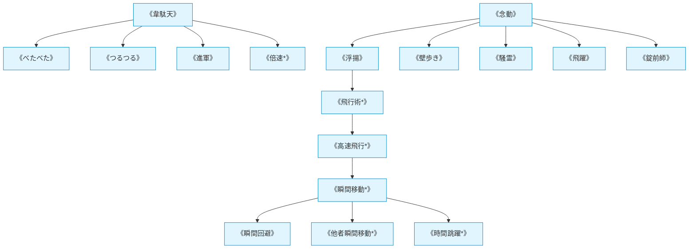

# 移動系呪文 (Movement Spells)

本ドキュメントは、ガープス第4版『魔法大全』第3章（pp.23-29）および関連拡張サプリメントの公式データを基に、運動エネルギー操作、空間的移動変位、および2026年現代における結界都市防衛・特殊部隊強襲機動を体系化した公式魔術アーカイブです。

---

## 1. 移動系魔術の力学

移動系呪文は、マナを介して目標の運動量、重力加速度ベクトル、空間的変位を操作する魔術体系です。標準的な重力加速度環境下において、目標の移動速度や慣性を1秒あたり最大10m/s加速・制御します。

### 1.1 前提条件ツリー (Prerequisite Tree)

---

## 2. 移動系主要呪文データ一覧

| 呪文名（日 / 英） | クラス | 基本消費 / 維持 | 詠唱時間 | 前提条件 | 効果概要・力学 |
| :--- | :---: | :---: | :---: | :--- | :--- |
| **《韋駄天》** Haste | 通常 | 2（+1毎）/ 半 | 2秒 | なし | 目標の基本移動力を一時的に+2〜+5強化。 |
| **《念動》** Apportation | 通常/抵 | さまざま | 1秒 | 素質1 | 物理的接触なしに物体を遠隔移動・浮遊させる。 |
| **《べたべた》** Glue | 範囲 | 3 / 同 | 1秒 | 《韋駄天》 | 床面を強力な接着状態にし、通過者の移動を阻害。 |
| **《つるつる》** Grease | 範囲 | 3 / 同 | 1秒 | 《韋駄天》 | 床面の摩擦係数をゼロにし、転倒・スリップを誘発。 |
| **《瞬間矢よけ》** Deflect Missile | 防御 | 1 / 不可 | 1秒 | 《念動》 | 飛来する小口径弾や矢の弾道を直前で逸らす。 |
| **《浮揚》** Levitation | 通常/抵 | 1 (40kg毎) / 半 | 2秒 | 《念動》 | 重力を打ち消し、目標を垂直方向に上下移動。 |
| **《飛行術*》** Flight | 通常 | 5 / 3 | 2秒 | 素質2, 《浮揚》 | 空中を三次元的に自由飛行（最大移動力=知力）。 |
| **《高速飛行*》** Hawk Flight | 通常 | 8 / 4 | 3秒 | 《飛行術》 | 飛行速度を時速80km〜100km超まで急加速。 |
| **《倍速*》** Great Haste | 通常 | 5 / 不可 | 3秒 | 素質1, 《韋駄天》, IQ12+ | 10秒間、目標の行動回数・手番を2倍化（終了後疲労5）。 |
| **《瞬間移動*》** Teleport | 特殊 | さまざま | 1秒 | 10系統各1種 or 《高速飛行》 | 視認・記憶している座標へ一瞬で空間転送。 |
| **《瞬間回避》** Blink | 防御 | 2 / 不可 | 1秒 | 《瞬間移動》 | 敵の近接・射撃攻撃を受けた瞬間、1m横へ転送回避。 |
| **《幽体離脱*》** Ethereal Body | 通常 | 8 / 4 | 30秒 | 素質3, 移動系6種 | 物理的実体を失い、壁をすり抜ける霊体化状態となる。 |

---

## 3. 2026年現代戦術・法規制（CR）における運用

### 3.1 警察・自衛隊特殊急襲部隊（SAT/SOG）の立体機動
都市部での対テロ・結界破り事案において、術士随伴班は《浮揚》《壁歩き》《瞬間回避》を駆使してビルの垂直登攀・突入ルートを確保します。特に《瞬間矢よけ》は暴徒鎮圧や小口径銃撃戦においてポイントマンの生存率を飛躍的に高めています。

### 3.2 《瞬間移動》《倍速》の厳格な法的規制（CR4 / Class-3ライセンス）
《瞬間移動》および《倍速》は、銀行金庫侵入や暗殺への悪用リスクが極めて高いため、国家公安委員会および国際魔導協定（IMA）により**規制等級CR4（要特別国家許可・魔力署名常時発信義務）**に指定されています。無認可での使用はテロ等準備罪と同等の重罰が科されます。
