# 移動系呪文 (Movement Spells)

本ドキュメントは、ガープス第4版『魔法大全』第3章（pp.23-29）および公式拡張サプリメント（『Magic: Artillery Spells』『Magic: Death Spells』『Magic: Plant Spells』『Magic: The Least of Spells』）に準拠した、**全61種**の移動系公式呪文アーカイブです。運動エネルギー操作、重力・慣性制御、三次元空間飛行、位相跳躍（テレポート）、ならびに2026年現代における結界都市防衛・軍事特殊急襲作戦での運用データを過不足なく完全網羅しています。

---

## 1. 移動系魔術の力学体系

移動系呪文は、マナの指向性励起を介して目標の運動量ベクトル、重力加速度、慣性質量、および局所空間の幾何構造を直接操作する魔術体系です。
- **力学的加速限界**: 通常の術士単独詠唱下では、質量100kg前後の目標に対して毎秒最大10m/sの加速制御が物理的・生体媒介的上限となります。
- **慣性制御とG耐性**: 《浮揚》《飛行術》等では術士自身の生体平衡感覚がマナ流と同調するため急激なG負荷が相殺されますが、《倍速》《瞬間移動》の急激な位相変異は術士の心肺および中枢神経系に激しい代謝疲労（FP消費）を強制します。

### 1.1 移動系呪文 前提条件ツリー (Prerequisite Tree)

```mermaid
graph TD
    %% クラススタイル定義（高コントラスト・ダークモード規格）
    classDef spell fill:#0f172a,stroke:#38bdf8,stroke-width:1.5px,color:#ffffff;
    classDef root fill:#0369a1,stroke:#38bdf8,stroke-width:2px,color:#ffffff,font-weight:bold;
    classDef ext fill:#1e293b,stroke:#94a3b8,stroke-width:1px,color:#cbd5e1,stroke-dasharray: 5 5;
    classDef special fill:#4c1d95,stroke:#c084fc,stroke-width:1.5px,color:#ffffff;

    %% 系統内呪文ノード定義
    subgraph Sub_F00FC70 ["48種"]
        Haste["《韋駄天》<br>(Haste)"]:::root
        Apportation["《念動》<br>(Apportation)"]:::special
        Glue["《べたべた》<br>(Glue)"]:::spell
        Grease["《つるつる》<br>(Grease)"]:::spell
        Hinder["《のろま》<br>(Hinder)"]:::spell
        HoldFast["《ふんばり》<br>(Hold Fast)"]:::spell
        IncreaseBurden["《荷重増加》<br>(Increase Burden)"]:::spell
        Jump["《飛躍》<br>(Jump)"]:::spell
        Levitation["《浮揚》<br>(Levitation)"]:::spell
        Locksmith["《錠前師》<br>(Locksmith)"]:::spell
        LongMarch["《鈍行》<br>(Long March)"]:::special
        Poltergeist["《騒霊》<br>(Poltergeist)"]:::spell
        QuickMarch["《進軍》<br>(Quick March)"]:::special
        SlowFall["《軟着陸》<br>(Slow Fall)"]:::spell
        Wallwalker["《壁歩き》<br>(Wallwalker)"]:::spell
        DancingObject["《踊る物体》<br>(Dancing Object)"]:::special
        DistantBlow["《遠隔攻撃》<br>(Distant Blow)"]:::special
        Manipulate["《見えない手》<br>(Manipulate)"]:::spell
        Slow["《半速》<br>(Slow)"]:::special
        Undo["《縄ほどき》<br>(Undo)"]:::spell
        WingedKnife["《飛ぶ剣》<br>(Winged Knife)"]:::spell
        LightTread["《足跡消し》<br>(Light Tread)"]:::spell
        Slide["《滑走》<br>(Slide)"]:::spell
        FlyingCarpet["《空飛ぶ絨毯*》<br>(Flying Carpet)"]:::special
        HawkFlight["《高速飛行*》<br>(Hawk Flight)"]:::spell
        WizardHand["《魔法の手》<br>(Wizard Hand)"]:::spell
        EtherealBody["《幽体離脱*》<br>(Ethereal Body)"]:::special
        GreatHaste["《倍速*》<br>(Great Haste)"]:::special
        Pull["《引力》<br>(Pull)"]:::special
        Repel["《斥力》<br>(Repel)"]:::special
        Teleport["《瞬間移動*》<br>(Teleport)"]:::spell
        TeleportOther["《他者瞬間移動*》<br>(Teleport Other)"]:::special
        Blink["《瞬間回避》<br>(Blink)"]:::spell
        BlinkOther["《他者瞬間回避*》<br>(Blink Other)"]:::spell
        Beacon["《標識》<br>(Beacon)"]:::spell
        TraceTeleport["《転移追跡》<br>(Trace Teleport)"]:::spell
        RapidJourney["《往復旅行*》<br>(Rapid Journey)"]:::special
        DivertTeleport["《移動妨害*》<br>(Divert Teleport)"]:::special
        AirVortex["《風の渦》<br>(Air Vortex)"]:::special
        Freedom["《解放》<br>(Freedom)"]:::spell
        CloudWalking["《雲上歩行》<br>(Cloud-Walking)"]:::spell
        CloudVaulting["《雲飛び*》<br>(Cloud-Vaulting)"]:::special
    end

    subgraph Sub_43347C3D ["植物・天候連動"]
        RunAcrossTreetops["《樹上駆け》<br>(Run Across Treetops)"]:::spell
    end

    subgraph Sub_1F421D8F ["MAS / MDS 拡張 7種"]
        Collision["《衝突場*》<br>(Collision)"]:::special
        CrushingFist["《魔法の巨拳*》<br>(Crushing Fist)"]:::special
        Slasher["《飛ぶ剣舞*》<br>(Slasher)"]:::special
        ForceBall["《連鎖球*》<br>(Force Ball)"]:::special
        Splat["《即落*》<br>(Splat)"]:::special
        Disruption["《内部攪拌*》<br>(Disruption)"]:::special
        Quarter["《四つ裂き*》<br>(Quarter)"]:::special
    end

    %% 前提条件依存関係エッジ
    Req_1 --> Apportation
    Haste --> Glue
    Haste --> Grease
    Haste --> Hinder
    Ext_2 --> Hinder
    Apportation --> HoldFast
    Apportation --> IncreaseBurden
    Apportation --> Jump
    Apportation --> Levitation
    Apportation --> Locksmith
    Ext_2 --> LongMarch
    Ext_3 --> LongMarch
    Apportation --> Poltergeist
    Haste --> QuickMarch
    Apportation --> SlowFall
    Apportation --> Wallwalker
    Apportation --> DancingObject
    Apportation --> DistantBlow
    Locksmith --> Manipulate
    Haste --> Slow
    Hinder --> Slow
    Locksmith --> Undo
    Poltergeist --> WingedKnife
    Apportation --> LightTread
    Ext_4 --> LightTread
    Apportation --> Slide
    Grease --> Slide
    Ext_5 --> FlyingCarpet
    Ext_6 --> FlyingCarpet
    Ext_6 --> HawkFlight
    Manipulate --> WizardHand
    Ext_7 --> WizardHand
    Ext_8 --> EtherealBody
    Haste --> GreatHaste
    Levitation --> Pull
    Levitation --> Repel
    Ext_9 --> Teleport
    Ext_10 --> TeleportOther
    Ext_10 --> Blink
    Blink --> BlinkOther
    Ext_10 --> Beacon
    Ext_11 --> Beacon
    Ext_12 --> Beacon
    Ext_10 --> TraceTeleport
    Ext_11 --> TraceTeleport
    Ext_12 --> TraceTeleport
    Ext_10 --> RapidJourney
    Ext_11 --> RapidJourney
    TraceTeleport --> DivertTeleport
    Ext_8 --> AirVortex
    Ext_13 --> AirVortex
    Req_14 --> Freedom
    Ext_5 --> CloudWalking
    Ext_15 --> CloudWalking
    Jump --> CloudVaulting
    CloudWalking --> CloudVaulting
    Ext_16 --> RunAcrossTreetops
    Levitation --> RunAcrossTreetops
    Poltergeist --> Collision
    Pull --> Collision
    DistantBlow --> CrushingFist
    WizardHand --> CrushingFist
    DancingObject --> Slasher
    Ext_17 --> ForceBall
    Ext_18 --> ForceBall
    Ext_19 --> ForceBall
    Ext_20 --> Splat
    Manipulate --> Disruption
    Undo --> Disruption
    Pull --> Quarter
    Repel --> Quarter

    %% 外部系統・特殊前提ノード
    Req_1["【前提: 素質1】"]:::ext
    Ext_2["【他系統: 《不器用》】"]:::ext
    Ext_3["【他系統: 《疲れ》】"]:::ext
    Ext_4["【他系統: 《土変化》】"]:::ext
    Ext_5["【他系統: 《空気歩行》】"]:::ext
    Ext_6["【他系統: 《飛行術》】"]:::ext
    Ext_7["【他系統: 《手触り》】"]:::ext
    Ext_8["【他系統: 《肉体気化》】"]:::ext
    Ext_9["【他系統: 《高速飛行》】"]:::ext
    Ext_10["【他系統: 《瞬間移動》】"]:::ext
    Ext_11["【他系統: 《時間移動》】"]:::ext
    Ext_12["【他系統: 《異次元移動》】"]:::ext
    Ext_13["【他系統: 《風嵐》】"]:::ext
    Req_14["【前提: 肉体操作系3種、移動系3種、防御・警戒系3種】"]:::ext
    Ext_15["【他系統: 《水面歩行》】"]:::ext
    Ext_16["【他系統: 《植物軟着陸》】"]:::ext
    Ext_17["【他系統: 《呪文捕獲》】"]:::ext
    Ext_18["【他系統: 《物質障壁》】"]:::ext
    Ext_19["【他系統: 《敵感知》】"]:::ext
    Ext_20["【他系統: 《扉作成》】"]:::ext
```

---

## 2. ガープス第4版『魔法大全』基本移動系呪文（48種）

| 呪文名（日 / 英） | クラス | 持続時間 | 基本消費 / 維持 | 詠唱時間 | 前提条件 | 効果概要・力学 |
| :--- | :---: | :---: | :---: | :---: | :--- | :--- |
| **《韋駄天》** Haste | 通常 | 1分 | 2/+1点毎/半 | 2秒 | - | 目標 の 移動力 と よけ を最大+3します。 |
| **《念動》** Apportation | 通常/抵-意志力 | 1分 | さまざま | 1秒 | 素質1 | 触れることなく物体を動かします。 目標 は1秒間に1メートル 移動 させることができます。ダメージを生じるほどの速さではありません。 目標 が生き物であれば、 意志力 で抵抗できます。 |
| **《べたべた》** Glue | 範囲 | 10分 | 3/同 | 1秒 | 《韋駄天》 | 表面がねばねばの状態になります。この面に足を踏み入れると、の 呪文 と同じ効果があります。一度抵抗に成功すると、そこから1メートル以内は自由に行動できます。1メートル以上離れ、そこがまだ効果範囲なら（一度抜け出たところに戻っても）、すぐにまたを受けます。 |
| **《つるつる》** Grease | 範囲 | 10分 | 3/同 | 1秒 | 《韋駄天》 | 地面を非常に滑りやすくします。効果範囲内で1メートル移動するごとに 敏捷力 -2の判定を行います。失敗すると 転倒 します。立ち上がるときにも 敏捷力 -2の判定が必要です（ 膝立ち ・ 座り 状態のときには判定は不要です）。すべての 近接戦闘 、素手の 命中判定 、 能動防御 に-3の修正をうけます。その他全ての肉体 技能 （射撃なども含みます）も、足場が悪いため-2の修正を受けます。この 呪文 |
| **《のろま》** Hinder | 通常 | 1分 | 1〜4/同 | 1秒 | 《韋駄天》ないし《不器用》 | エネルギー 1点につき、 目標 の 移動力 （と「 よけ 」）を1点減らします。 |
| **《瞬間矢よけ》（旧名：射撃武器屈折）** Deflect Missile | 防御 | 一瞬 | 1 | 1秒 | 《念動》 | 目標 に向けられた1つの 長射程攻撃 をそらします――すべての を含みます。 戦闘 においては「 受け 」1回として扱います。 術者 自身が標的でない場合、 の 距離修正 がかかります。屈折させられた 攻撃 は、本来の標的の“向こう側”にあるものに命中するかもしれません。 |
| **《ふんばり》** Hold Fast | 防御 | 一瞬 | 1/1ｍ毎# | 1秒 | 《念動》 | あらゆる原因による 突き飛ばし の効果を無効にします。 |
| **《荷重増加》** Increase Burden | 通常/抵-特殊 | 10分 | 1/12.5kg毎# | 3秒 | 《念動》 | 目標 の 重量 を増やします。 目標 の着用者（もしいれば）の 意志力 で抵抗します。追ってくる騎士を足止めする、何かが風に飛ばされるのを防ぐ、などの使い道があります。 |
| **《飛躍》** Jump | 通常 | 1分 | 1〜3 | 1秒 | 《念動》 | 目標 の 跳躍 能力を増加します―― 跳ぶ 判定における 基本移動力 が増加します。 |
| **《浮揚》** Levitation | 通常/ 抵-体力か意志力 | 1分 | 1/40kg毎/半# | 2秒 | 《念動》 | 目標 は生き物でなければいけません。 目標 は空中をただよい、 術者 の思うように動かせます。浮き上がらせたものを移動させるには、 術者 が自分を対象にしているのでないかぎり、 集中 が必要です。空中に浮かせておくだけなら、 集中 は不要です。浮揚しているあいだの最大 移動力 は3（垂直あるいは水平に）です。 術者 が自分を浮揚させようとするなら、 敏捷力 が基本の 技能 はそのままです。他人が |
| **《荷重軽減》（旧名：軽荷）** Lighten Burden | 通常 | 10分 | 3または5/半# | 3秒 | 《念動》 | 目標 が運んでいる荷物の 重量 が減ります。 |
| **《錠前師》** Locksmith | 通常 | 1分 | 2/2 | 1秒 | 《念動》 | たとえば錠のなかなど小さな部品に細かい細工をほどこします。ふつうの 工具 があれば〈 鍵開け 〉 技能 に+5されます。鍵の回転金具などに直接触れることなく動かすことができるからです。 工具 が全くない状態でも、〈 鍵開け 〉 技能 そのままのレベルで判定することができます。「3本めの手」があれば便利と思われる〈 メカニック 〉などの 技能 に対しても、同様のボーナスを与えてください。 |
| **《鈍行》** Long March | 通常/抵-体力 | 1日 | 3 | 1分 | 素質1、《不器用》ないし《疲れ》 | 長距離の移動速度（ 走る 、 長距離を歩く を参照）を半分にします。 戦闘 時の 移動力 や 基本反応速度 には影響ありません。 |
| **《騒霊》** Poltergeist | 射撃/抵-生命力 | 一瞬 | 1または2# | 1秒 | 《念動》 | 術者 が選んだ相手に 目標 を 投げ つけます。 体力 15で 投げ たのと同じに扱います（「 投げる 」参照）。命中すると 叩き ダメージを与えます。狙った相手に命中させるには、 敏捷力 -4の判定が必要です。相手は通常どおり、 よけ と 止め ができます。 呪文 に抵抗できるのはこの 呪文 の 目標 となったものだけです――狙った相手は抵抗できません！ 目標 は 半致傷距離 20、 正確 +1 |
| **《進軍》** Quick March | 通常 | 1日の進軍 | 4# | 1分 | 素質1、《韋駄天》 | 通常長距離での移動速度を2倍にします（ 走る 、 長距離を歩く を参照）。 目標 は1日の終わりに FP を10点失い、 睡眠 をとらなければいけません。この 呪文 は 戦闘 中の 移動力 や 基本反応速度 には影響しません。 |
| **《軟着陸》** Slow Fall | 通常 | 1分 | 1/25kg毎/半 | 1秒 | 《念動》 | 目標 の 落下 速度を毎秒1メートルに落とします。通常の表面なら着陸してもダメージはありません（釘の上などでは半分のダメージ）。 目標 が空中に出る前に唱えることもできます。 目標 がすでに落ちはじめているときは、 呪文 の 準備 に必要な時間がたつあいだに、約3メートル落ちることになるでしょう（ 重力 が標準の1Gとして）。 |
| **《壁歩き》** Wallwalker | 通常 | 1分 | 1/25kg毎/半# | 1秒 | 《念動》 | 通常壁や天井を、まるで水平な地面にいるかのように歩くことができます。手足のいずれか1本が、表面――水平面でも垂直面でも――に接触していなければなりません。いったんすべてが離れると、 呪文 は消えてしまいます。 戦闘 中にこの 呪文 を使うと、妙な角度から 攻撃 することになるので双方が-2の修正をうけます。 |
| **《踊る物体》** Dancing Object | 通常 | 1時間 | 4/2 | 10秒 | 素質2、《念動》 | 物体を1つ動かし、繰り返しの作業を行ないます。川から水を運んで樽に移す、箒で建物を何度も掃除する、 クロスボウ の矢をつがえるといった、 体力 15の人間が行なう作業とおおむね同じことができます。物体への“プログラム”を変更したり、出来事に対応させたりすることはできません.......愚かにただ作業を続けるだけです。を巧みに使えば、を状況にうまく対応させることができ |
| **《遠隔攻撃》** Distant Blow | 通常 | 5秒 | 3/3 | 3秒 | 素質2、《念動》 | 術者 は 目標 を遠くから 攻撃 できるようになります。 術者 は 白兵武器 を1つ選びます。 |
| **《錠前大師》（旧名：鍵開け）** Lockmaster | 通常/ 抵-《魔法の鍵》 | 永久 | 3 | 10秒 | 《錠前師》ないし《念動》と素質2 | ふつうの鍵を 魔法 をつかって開けます。を開ける場合は抵抗されます。 技能 の〈 鍵開け 〉とまったく同じ修正が適用されます。 |
| **《見えない手》** Manipulate | 通常 | 1分 | 4/3# | 3秒 | 《錠前師》 | よりも大きな物体を取り扱います。 ロープ をほどく、ドアの取っ手を回す、 ナイフ を研ぐ、ひきうすを回す、などができます。 術者 は 目標 に触る必要はありません。 敏捷力 判定にマイナスの修正をうけるような複雑な行動のときは、この 呪文 を使っても同じような修正をうけます。 |
| **《半速》** Slow | 通常/抵-生命力 | 10秒 | 5/4 | 3秒 | 素質1、《韋駄天》、《のろま》 | 目標 の動きを非常に遅くします。 |
| **《縄ほどき》** Undo | 通常/抵-特殊 | 一瞬 | 3または6# | 1秒 | 《錠前師》 | 手でふつうにほどけるような結び目や締め具をはずします（錠ははずせません）。 クリティカル で成功すると、チェインメイルをばらばらの輪にすることもできるでしょう！ だれかがつけているイヤリングやネックレスなどをこっそり盗むという使い道もあります。ほかにも 弓 の弦を取る、シャツのボタンをはずす、胴着の紐をゆるめる、ベルトをゆるめる、などができます。 |
| **《飛ぶ剣》** Winged Knife | 射撃 | 一瞬 | 1/0.5kg毎# | 1秒 | 《騒霊》 | あらゆる 武器 を 魔法 の力で飛ばします。この 呪文 の 目標 は「 武器 」です。 距離修正 を考えるときには 術者 と 武器 の距離をみてください。は、 正確さ +1、 半致傷距離 20、 最大射程 40の 射撃武器 として扱います。命中すれば、 体力 15で 投げ たのと同じだけのダメージを与えます。 体力 15の 突き による 基本致傷力 は1D+1、 振り なら2D+1で |
| **《飛行術*》（旧名：飛行*）** Flight* | 通常 | 1分 | 5/3 | 2秒 | 素質2、《浮揚》 | 目標 は翼がなくても自由に空中を飛ぶことができます。 移動力 は10で、 荷重 により通常どおり減らしてください。飛んでいるキャラクターは普通に移動も 戦闘 もできます。敵の上空で戦えば、 戦闘 で優位にたてるでしょう（「 真上からの攻撃 」参照）。 |
| **《足跡消し》** Light Tread | 通常 | 10分 | 4/1# | 1秒 | 《念動》、《土変化》 | 目標 はどんな地面（ 重量 に耐える強度でなければなりません）であっても、一切の痕跡を残さず歩くことができます。追跡は不可能です。もし地面に植物がびっしりと生えている場合はわずかに痕跡が残り、-8の修正で〈 足跡追跡 〉判定が可能です。この 呪文 を使えば圧力探知式の 罠 を発動させません。 エラッタ修正：【誤】〈追跡〉判定が可能です。【正】〈 足跡追跡 〉判定が可能です。 |
| **《滑走》** Slide | 通常/抵-意志力 | 1分 | 2/2 | 1秒 | 《念動》、《つるつる》 | 目標 はまるでスキーを履いているかのように斜面を滑り降りることができます。 移動 には〈 スキー 〉 技能 が必要です、なければ 技能 なし値で判定してください。進行方向を制御するストックがなければ-2の修正をうけます。この 呪文 はどんな地面（砂、草、石......）に対しても機能しますが、 目標 は自分で障害物を避けなければなりません。 良好な路面であれば、 目標 の〈 スキー 〉 技能 レベ |
| **《空飛ぶ絨毯*》** Flying Carpet* | 通常 | 10分 | 1/0.1平方m毎/半 | 5秒 | 素質2 、《空気歩行》ないし《飛行術》 | ふつうの絨毯（あるいは、人が乗ったり入ったりできる物体――大釜、椅子、タオル、ほうきなど）を 魔法 の 乗り物 にします。最初に乗った人の命令で動きます。すでに複数の知的生物が乗った状態で唱えた場合、誰がコントロールするかは全員で 意志力 の 即決勝負 で決定します。 術者 は（乗っていれば）この判定に+5の修正があります。「パイロット」が降りた場合、残った乗客が 意志力 の 即決勝負 を行って次 |
| **《高速飛行*》** Hawk Flight* | 通常 | 1分 | 8/4 | 3秒 | 《飛行術》 | をさらに速くしたものです。 目標 の 移動力 は、 荷重 がなければ40（時速120キロ）になります。 荷重 は通常通り 移動力 を減少させます。飛んでいるキャラクターはふつうに 移動 も 戦闘 もできます。敵の上空で戦えば、 戦闘 で優位にたてるでしょう（「 真上からの攻撃 」参照）。 |
| **《魔法の手》** Wizard Hand | 通常 | 1分 | さまざま | 3秒 | 《見えない手》、《手触り》 | 術者 によく似た 手 を作り出します。 術者 はその 手 でものをつかんだり触ったりできます。 手 は 移動力 10で 術者 の ターン に移動しますが、ものにぶつかりそうであれば 移動 しないかもしれません（と組み合わせない限り）。 あるいは 移動力 3で壁や床を伝って 移動 させることもできます。 移動 させるには 集中 が必要ですが、つかんだり触ったりするだけ |
| **《幽体離脱*》** Ethereal Body* | 通常 | 10秒 | 8/4 | 30秒 | 素質3、《肉体気化》ないし移動系6種 | 目標 の身体は霊のようになり、固い物体や生き物も、まるでそこに存在しないかのように通り抜けることができます。 衣服 も身体といっしょに幽体になりますが、 装備 を持っていくことはできません。幽体のあいだは呼吸したり食べたり飲んだりする必要もありませんが、 武器 を振るったりなにかを動かしたりはできません。幽霊と多くの点で似ています。半透明の姿とはいえ見ることはでき、話し声も聞こえます。 幽体の相手 |
| **《倍速*》** Great Haste* | 通常 | 10秒 | 5# | 3秒 | 素質1、《韋駄天》、知力12以上 | 目標 の速度がきわめて速くなります。 |
| **《引力》** Pull | 通常 | 1分 | 1/2ST毎/同 | 5秒 | 素質2、《浮揚》を含む移動系呪文4種 | ある1点に唱え、引力圏をつくりだします。すべての物体（生物を含みます）はその一点に向かって 移動力 1で引っ張られます。引っ張られた生き物は、毎秒 体力 の 即決勝負 で“抵抗”できます。 呪文 がかけられた中心点では、その 体力 は費やされた エネルギー の2倍で、1メートル離れるごとに 呪文 の 体力 は1ずつ減少します。 この 呪文 は、 呪文 の 体力 の20倍よりも大きな 重量 の物体に |
| **《斥力》** Repel | 通常 | 1分 | 1/2ST毎/同 | 5秒 | 素質2、《浮揚》を含む移動系呪文4種 | と同様ですが、働く力は斥力です。生き物や物体は引っ張られるのではなく押されます。 |
| **《水泳術》（旧名：水泳）** Swim | 通常 | 1分 | 6/3 | 3秒 | 《水変化》、《浮揚》 | 目標 は水のなかでも、通常どおり 移動 することができます（ 荷重 による修正はふつうに計算します）。 目標 は自分の動きを完全にコントロールし、水中 戦闘 でふつう受けるペナルティなしで戦うこともできます。ただし水中で息ができるわけではありません！ しかし、完全に水中に引きこまれていたりするのでない限り、 疲労 や 荷重 に関係なく、 目標 はすべての〈 水泳 〉判定に自動的に成功します。 この |
| **《瞬間移動*》** Teleport* | 特殊 | 一瞬 | さまざま | 1秒 | 知力13以上と異なる10系統から各1種、ないし《高速飛行》 | 術者 を一瞬にして別の場所に移動させます。ただし、 目標 の位置が遠くなればなるほど、より多くの エネルギー が必要となり、 技能 修正も大きくなります。 瞬間移動表 |
| **《他者瞬間移動*》** Teleport Other* | 通常/抵-意志力+1 | 一瞬 | さまざま | 1秒 | 素質3、《瞬間移動》 | に似ていますが、 術者 が移動するのではなく、他人や物体を移動させます。物体の一部だけを移動させることはできません。固体を別の固体のなかに移動させることもできません。つながった2つの部品を分けるように移動させるときは、GMがペナルティを課していいでしょう。ビンのふたを外すなら-1、鍵をドアの枠から外すなら-5といったところです。着ている 衣服 や身につけている宝石、しっかりと抱えら |
| **《瞬間回避》** Blink | 防御 | 一瞬 | 2 | 1秒 | 《瞬間移動》 | 術者 は 攻撃 を避けて近くの開けた場所に移動することができます。だれかが立っている場所は開けているとはみなしません。人間より小さな障害物なら、この 呪文 では “ 開けている ” とみなします。 術者 は任意の方向で3メートル以内にある開けた場所に移動します。 術者 の体の向きはかわりません。 術者 は〈 身体感覚 〉 技能 の判定を行なわなければならず、失敗すると次の ターン は行動できません |
| **《他者瞬間回避*》** Blink Other* | 防御 | 一瞬 | 2 | 1秒 | 《瞬間回避》 | と同じですが、他人に唱えます。 この 呪文 は かつ でもあります。 |
| **《標識》** Beacon | 範囲 | 24時間 | 10/半 | 30秒 | 《瞬間移動》、《時間移動》、ないし《異次元移動》 | この 呪文 はその場所の時空を “ やわらかく ” することで、 瞬間移動 や 時間移動 、世界移動を容易にします。のかかった場所への移動は必要 エネルギー と不利な修正が半分（端数切り捨て）になります。また、の近辺から 術者 に向かっての移動にも効果があります。の効果は 術者 だけのものではありません。 魔法 でその範囲内に移動しようとする者はすべてこの恩恵を |
| **《転移追跡》** Trace Teleport | 情報/抵-呪文 | 一瞬 | 3 | 1秒 | 《瞬間移動》、《時間移動》、ないし《異次元移動》 | 誰か（何か）が空間や時間、次元を移動した（してきた）直後に唱えます。 術者 の脳裏に目的地（出発地点）の映像が浮かびます。また、その転移はどの程度不利な修正をうけて唱えられたのかが分かります。 クリティカル で成功すれば、正確な目的地が分かります。しかし普通に成功した場合でも、1分以内に追いかける 呪文 を唱えれば追跡できます。 これは かつ です。 修正：移動が行われてか |
| **《往復旅行*》** Rapid Journey* | 特殊 | 1分 | さまざま | 5秒 | 素質3、《瞬間移動》ないし《時間移動》 | やと同様ですが、 術者 はすぐに戻ってきます。 術者 本人にのみ有効です。この 呪文 はとは併用できません。 重荷 まであれば、持っている物もすべて移動します。 技能 判定に失敗すると移動は行われませんが、それ以外の不利な効果（ダメージ、 方向感覚 の喪失、 朦朧 ）はすべて適用されます。は、この 呪文 に対して2回抵抗します。 |
| **《移動妨害*》** Divert Teleport* | 防御/抵-呪文 | 一瞬 | さまざま | 1秒 | 素質3、《転移追跡》 | 目標 が 瞬間移動 、 時間移動 、異世界移動した ターン に唱えると、 術者 は 目標 の移動先を指定することが出来ます。 術者 は、この 呪文 で変更しようとする移動の 呪文 を知っていなければなりません。判定にはとその 呪文 のうち低い方の 技能 レベルを用います。例えばをに変更しようと思ったら、《 異次元移動 |
| **《風の渦》** Air Vortex | 範囲/抵-生命力か敏捷力 | 10秒 | 8/3 | 2秒 | 素質2、《肉体気化》、《風嵐》 | 効果範囲内にいる全員を、巨大な風の渦に変えて別の場所に移動させます。渦は 移動力 10。 術者 は範囲内にいる特定の人物を効果から除外できます。効果範囲内にいる者は 生命力 か 敏捷力 の高い方で抵抗することができます。 渦によって運ばれる者はの 呪文 と同じ、気体状態になります。風の渦は固体を通り抜けることはできません。 |
| **《解放》** Freedom | 通常 | 1分 | 2/修正+1毎/同 | 1秒 | 肉体操作系3種、移動系3種、防御・警戒系3種 | 目標 が「身体の自由を回復するための」 技能 判定や 能力値 判定すべてにボーナスを与えます。 以下はその例です： つかまれる のを避ける、 ふりほどく 、 すり抜ける 際の 敏捷力 ・ 体力 の 即決勝負 、〈 脱出 〉〈 鍵開け 〉 技能 、逃亡防止用の壁を突破する際の〈 跳躍 〉〈 登攀 〉判定。檻の鉄棒を曲げる、ドアを蹴破る、への抵抗、などなど。 |
| **《雲上歩行》** Cloud-Walking | 通常 | 1時間 | 3/2 | 1秒 | 《空気歩行》、《水面歩行》 | 目標 はまるで固体に乗るかのように雲（霧を含みます）の上を歩けるようになります。 目標 が何らかの理由で 転倒 したら（例えば 負傷 ） 呪文 の効果は失われてしまいます！この 呪文 を急いでかけ直したら、 目標 は1秒間 落下 するだけで済みます（5メートル降下）。もしまだ雲の中にいたら、5秒間かけて “ 掘り進み ” 雲の上に戻れます。もし雲を突き抜けてしまったら......困ったことになるで |
| **《雲飛び*》** Cloud-Vaulting* | 通常 | 150km毎に1秒# | 7 | 1秒 | 素質2、《飛躍》、《雲上歩行》 | 目標 は一瞬で非常に大きな距離を移動できます。空に飛び上がり、雲をトランポリンのように使って目的地まで跳ねて移動します。は屋外でなければ唱えることができません。 目標 は150km移動できます。〈 軽業 〉 技能 レベルが 敏捷力 を越えていれば、1越えているごとにさらに150km移動できます。雲一つない青空のときには（砂漠などではよくある光景です）150kmしか移動できません。嵐な |

---

## 3. 複合・環境適応移動系呪文（植物・天候連動）

| 呪文名（日 / 英） | クラス | 持続時間 | 基本消費 / 維持 | 詠唱時間 | 前提条件 | 効果概要・力学 |
| :--- | :---: | :---: | :---: | :---: | :--- | :--- |
| **《樹上駆け》** Run Across Treetops | 通常/抵-生命力 | 1分 | 2・2 | 1秒 | 《植物軟着陸》（p.13）、《浮揚》 | 対象は樹冠を横切ってジョギングまたはランニングできます。対象は木々の上に半透明の表面が敷き詰められているような幻影を見ることができます。走行中は樹木の輪郭がはっきりと見えますが、つまずくほど深くはありません。木々の間が3ｍ以上離れた所には、架空シートの隙間ができます。これは「 |

---

## 4. 魔導兵器・砲兵戦術拡張呪文（MAS / MDS 拡張 7種）

『GURPS Magic: Artillery Spells（MAS）』および『GURPS Magic: Death Spells（MDS）』に収録された、移動力学を破壊・衝撃・致死ベクトルへ極限転化させた軍事拡張呪文です。

| 呪文名（日 / 英） | クラス | 持続時間 | 基本消費 / 維持 | 詠唱時間 | 前提条件 | 効果概要・力学 |
| :--- | :---: | :---: | :---: | :---: | :--- | :--- |
| **《衝突場*》** Collision* | 通常 | 一瞬 | 1/引力ST+2毎 | 3秒 | 素質4、《騒霊》と《引力》を含む移動系呪文10種 | 強力なを短時間生成します。この効果は、物体やクリーチャーではなく、空間または地面の一点に発動する必要があります。 中心において、引力の 体力 は 呪文 の |
| **《魔法の巨拳*》** Crushing Fist* | 範囲 | 一瞬 | 3 | 1秒 | 素質4、《遠隔攻撃》と《魔法の手》を含む移動系呪文10種 | この 呪文 はに似ていますが、 準備時間 が速く、効果は一度だけで、範囲攻撃を行います。核となる効果は 術者 の 手 だけに及びますが、 術者 の拳の巨大なレプリカが範囲の頭上に現れ、その下にあるもすべてに叩きつけられます！ この 呪文 を唱えると、範囲内のあらゆるものがパワーの巨拳で叩きつけられます。唯一の 防御 手段は、「 遮蔽物に飛び込む 」ことや範囲からの脱出です。その他の |
| **《飛ぶ剣舞*》** Slasher* | 範囲 | 5秒# | 1/重量0.5kg毎 | 1秒/半径1ｍ毎 | 素質4、《踊る物体》と〈飛ぶ剣〉を含む移動系呪文を10種 | まるで不可視の切り裂き魔が狂い振るうかのように、「 切り 」 武器 を範囲内に飛び回らせます。この 武器 は 術者 の 手 から発射されなければなりません。 呪文 を唱えると、刃物は翼をもち、目で追えないほどの速さで空中を飛び回りします。 範囲内のすべての者は、毎 ターン 、自身の 能動ターン に飛ぶ 武器 から（その 武器 の 技能レベル 15で）攻撃されます。被害者は 武器 の音を察知するため |
| **《連鎖球*》** Force Ball* | 射撃 | 一瞬 | 2〜2×素質 | 1〜3秒 | 素質4、、《呪文捕獲》、《物質障壁》、《敵感知》 | 片手に小型のの球体を作り出し、敵に向かって射出します。これは 正確さ +2、 最大射程 80ですが、 半致傷距離 はありません。 命中判定 には、〈 特殊攻撃 /射出物〉を用います。命中すると、ボールはやのように、強烈な「 叩き 」ダメージを与え、その後、対象から弾き飛ばされます。この効果には2つの重要な違いがあります。 1つ目は、 突き飛ばし 効果のみでダ |
| **《即落*》** Splat* | 範囲 | 一瞬 | 5 | 3秒 | 素質4、《扉作成》 | 範囲内に、繋がった一対の「 扉 」（『 魔法大全 』の参照）を短時間開きます。1つは範囲内の水平面上に、もう1つはその上にあります。地面にいる者、または無生物は下の 扉 から “ 落下 ” し、上の 扉 から出てきて再び 落下 するという動作を繰り返し、これは 重力 によって 加速 します。その後 扉 が閉じ、犠牲者はほんの少し前に 重量 を支えていたものに叩きつけられます。 これは |
| **《内部攪拌*》** Disruption * | 通常/抵-生命力 | 一瞬 | 10+2/1d毎 | 3秒 | 素質3、《見えない手》と 《縄ほどき》を含む10個の移動系呪文 | 目標 の内側に強烈で混沌とした力場を誘発します。対象が抵抗に失敗した場合、 呪文 の 仮威力 (1d から 4d) を振り、その HP 分のダメージを評価します。このダメージが被害者の HP 値と同等かそれ以上の場合、 生命力 や 特徴 に関係なく、即座に致命的となります。 によ |
| **《四つ裂き*》** Quarter * | 通常/抵-生命力 | 一瞬 | 15 | 5秒 | 素質3、 および移動系呪文10種（《引力》および《斥力》を含む） | 対象を外部からの強力な 魔法 の力にさらします。これは、誰かまたは何かを引き裂くための全か無かの試みです。抵抗成功とは、対象の構造的完全性が 魔法 に打ち勝ち、永続的な悪影響がないことを意味します。そうでない場合、犠牲者は四等分に割かれてしまいます（4つのほぼ等しいサイズの塊に裂かれます）。 ほとんどの物質的な対象は、「 集合体 」であっても、四つ裂きによって即座に殺されるか破壊されます。ただし、 |

---

## 5. 日常・民間簡単呪文（The Least of Spells 拡張 6種）

『GURPS Magic: The Least of Spells（Mtlos）』に収録された、民間術士（ヘッジ・メイジ）や現場作業員が日常的に行使する低燃費・実用呪文です。前提条件不要または極小のエネルギーで即時発動可能です。

| 呪文名（日 / 英） | クラス | 持続時間 | 基本消費 / 維持 | 詠唱時間 | 前提条件 | 効果概要・力学 |
| :--- | :---: | :---: | :---: | :---: | :--- | :--- |
| **《見当識》（並）** （Reorient (A)） | 防御 | 一瞬 | 1 | なし | -（簡単呪文なので） | テレポート、または時間や次元の移動 (攻撃ではない) に応じて、到着時の判定の代わりに発動します (どちらを用いるかを選択します)。成功と失敗はと同様に機能します。の修正は適用されませんが、移動が意図的 (既知の 門 を通過するなど) でない限り-5修正が適用されます。 主に、（ 敏捷力 /難）よりも「 知力 /並」 技能 の方が適し |
| **《工芸補助》（並）** （Wizardly Workshop (A)） | 通常 | 1分# | 2〜10・同 | 5秒 | -（簡単呪文なので） | 発動時に指定された 1つの 工芸系技能 か 修理・整備系技能 の 装備修正 が-5より悪い対象が受けるペナルティを軽減します。最大相殺は-5点分です。 元々-5以内の対象には、何の利益もありません。 GM がどの 技能 を許可するかを決定します。〈 武具屋 〉、〈 大工 〉、〈 電気技師 〉、〈 電子機器修理 〉、〈 修理工 〉、〈 石工 〉、〈 メカニック 〉は妥当です。〈 錬金術 〉、〈 生物 |
| **《クッション》（並）** （Cushion (A)） | 防御 | 一瞬 | さまざま | なし | -（簡単呪文なので） | 落下 を阻止します。のように事前にではなく、 衝突 の直前に詠唱します。高さ、着地、〈 軽業 〉などを考慮して、 落下 ダメージを通常どおり判定します。 |
| **《疾走》（並）** （Flee (A)） | 通常 | 1分 | 2〜6・半 | 1秒 | -（簡単呪文なので） | 「 高速移動 」または 短距離走 が適用される状況で、対象の 移動力 を増加します。は原書名「Flee（逃走）」ですが、 戦闘 に突撃するために使用できます。とは効果が累積しません。適用可能な最高のボーナスのみを使用してください。 |
| **《開扉》（並）** （Open Door (A)） | 通常/防御 | 一瞬 | 1 | 1秒 | -（簡単呪文なので） | 対象のドア (自由にスイングでき、他の存在と接触していない必要があります) を、 術者 が片手で押したかのように、自動的に開きます。 術者 が動かせない門（重すぎる、詰まっている、ロックされているなど） では役に立ちません。 逃走中に詠唱したり、ドアが 術者 の 顔 にぶつかるのを防ぐために詠唱でき、どちらも として扱うことができます。その場合、高い 技能レベル は |
| **《沈ませ》（並）** （Sink (A)） | 通常 | 1分 | 3・1 | 3秒 | -（簡単呪文なので） | 対象は、同意する必要がありますが、一時的に「 水に浮かない 」を獲得します。無生物にも発動できますが、誰かを浮かせておくために発動する場合は、影響を受ける全員が同意する必要があります。 発動者は、潜るために自分自身にを発動し、浮上するためにそれを 中断 することがよくあります。これは、重りを持って潜ってから放すのと同じくらい効果的です。非常に塩分の多い水に潜るときに便利でしょう！ |

---

## 6. 2026年現代戦術・結界都市防衛・法規制（CR）における運用

### 6.1 警察・自衛隊特殊急襲部隊（SAT/SOG）の三次元立体機動
都市部での対テロ・対大型魔獣戦において、術士随伴班は《浮揚》《壁歩き》《瞬間回避》を駆使してビルの垂直登攀・突入ルートを確保します。特に《瞬間矢よけ》は暴徒鎮圧や小口径銃撃戦（5.56mm/7.62mm弾）においてポイントマンの生存率を飛躍的に高めています。また、森林・山岳魔境（奥多摩・富士樹海等）では《樹上駆け》《滑走》による高速走破部隊が重用されます。

### 6.2 《瞬間移動》《他者瞬間移動》《倍速》の厳格な法的規制（CR4 / Class-3ライセンス）
《瞬間移動》および《倍速》は、重要防護施設・結界内部への不法侵入や要人暗殺への悪用リスクが極めて高いため、国家公安委員会および国際魔導協定（IMA）により**規制等級CR4（要特別国家許可・魔力署名常時発信義務）**に指定されています。無認可での行使はテロ等準備罪と同等の重罪が科され、各都市の防衛検問線には《移動妨害*》《転移追跡》を展開する術士部隊が24時間常駐しています。

### 6.3 メガコーポによる軍事・工業特許と魔導兵器（MAS/MDS）の統制
《衝突場*》《魔法の巨拳*》《内部攪拌*》などの軍事拡張呪文は、ヤマト重工およびテイコク製薬の防衛部門によって「戦略機動破壊術式」として厳重に特許管理・軍事秘匿されています。民間PMCのハンターであっても、Class-IV以上の特異災害指定地域への派遣命令がない限り、実戦行使は厳禁とされています。