# 死霊系呪文 (Necromantic Spells)

本ドキュメントは、ガープス第4版『魔法大全』第12章（pp.69-76）および公式拡張サプリメント（『Magic: Artillery Spells』『Magic: Death Spells』『Magic: The Least of Spells』『Magic: Plant Spells』等）に準拠した、**全56種**の死霊系呪文公式アーカイブです。マナ力学、生体媒介作用、ならびに2026年現代における結界都市防衛・軍事兵器工学・法規制（CR）の運用データを過不足なく完全網羅しています。

---

## 1. 死霊系呪文の力学体系

死霊系呪文は、マナの指向性周波数を介して対象の物理・生体・霊的パラメータを励起・変調・制御する魔術体系です。
- **生体媒介原則**: マナは術士の生体・神経系・霊体を介して作用し、直接の物質変換や物理エネルギー励起を行います。
- **現代技術インフラとの並行性**: 電子回路や通信網を直接破壊するのではなく、物理的現象（熱、圧力、電磁、物質変形等）を介して現代兵器や都市防護壁と相互作用します。

### 1.1 死霊系呪文 前提条件ツリー (Prerequisite Tree)

```mermaid
graph TD
    %% クラススタイル定義（高コントラスト・ダークモード規格）
    classDef spell fill:#0f172a,stroke:#38bdf8,stroke-width:1.5px,color:#ffffff;
    classDef root fill:#0369a1,stroke:#38bdf8,stroke-width:2px,color:#ffffff,font-weight:bold;
    classDef ext fill:#1e293b,stroke:#94a3b8,stroke-width:1px,color:#cbd5e1,stroke-dasharray: 5 5;
    classDef special fill:#4c1d95,stroke:#c084fc,stroke-width:1.5px,color:#ffffff;

    %% 系統内呪文ノード定義
    subgraph Sub_6F27852C ["44種"]
        DeathVision["《死の幻影》<br>(Death Vision)"]:::special
        FinalRest["《安息》<br>(Final Rest)"]:::special
        SenseSpirit["《霊魂感知》<br>(Sense Spirit)"]:::special
        Sp_4_5EF8["《霊魂召喚》<br>(（旧名：霊媒）)"]:::special
        Animation["《動く像*》<br>(Animation)"]:::spell
        AwakenCraftSpirit["《付喪神》<br>(Awaken Craft Spirit)"]:::spell
        Sp_7_61D4["《活力奪取》<br>(（旧名：エネルギー奪取）)"]:::spell
        Sp_8_21FC["《生気奪取》<br>(（旧名：バイタリティ奪取）)"]:::spell
        Materialize["《可視化》<br>(Materialize)"]:::spell
        Solidify["《実体化》<br>(Solidify)"]:::spell
        AffectSpirits["《霊体干渉》<br>(Affect Spirits)"]:::spell
        WeakenBlood["《血液弱体化》<br>(Weaken Blood)"]:::spell
        SkullSpirit["《悪霊召喚》<br>(Skull-Spirit)"]:::spell
        TurnSpirit["《悪霊返し》<br>(Turn Spirit)"]:::spell
        Zombie["《死人使い》<br>(Zombie)"]:::spell
        ControlZombie["《死人奪取》<br>(Control Zombie)"]:::spell
        TurnZombie["《死人返し》<br>(Turn Zombie)"]:::spell
        Sp_18_35A7["《死人寄せ》<br>(（旧名：死人召喚）)"]:::spell
        MassZombie["《死人の群れ*》<br>(Mass Zombie)"]:::spell
        Sp_20_CED6["《星幽視覚*》<br>(（旧名：アストラル視覚）)"]:::spell
        SlowHealing["《治癒力低下》<br>(Slow Healing)"]:::special
        StopHealing["《治癒力停止》<br>(Stop Healing)"]:::spell
        CommandSpirit["《悪霊支配》<br>(Command Spirit)"]:::spell
        Sp_24_2511["《不妊化》<br>(（旧名：不妊）)"]:::special
        Age["《老化*》<br>(Age)"]:::spell
        Evisceration["《内臓摘出*》<br>(Evisceration)"]:::special
        Pestilence["《疫病》<br>(Pestilence)"]:::special
        AnimateShadow["《動く影》<br>(Animate Shadow)"]:::spell
        RottingDeath["《腐敗の死神*》<br>(Rotting Death)"]:::special
        SoulJar["《魂の壺*》<br>(Soul Jar)"]:::special
        SummonDemon["《悪魔召喚》<br>(Summon Demon)"]:::special
        Banish["《退散》<br>(Banish)"]:::special
        BurningDeath["《炎の死神*》<br>(Burning Death)"]:::special
        Resurrection["《復活*》<br>(Resurrection)"]:::spell
        EntrapSpirit["《霊体封印》<br>(Entrap Spirit)"]:::special
        RepelSpirits["《悪霊祓い》<br>(Repel Spirits)"]:::spell
        BindSpirit["《悪霊呪縛*》<br>(Bind Spirit)"]:::spell
        Sp_38_4D42["《能力値奪取　体力奪取　敏捷力奪取　知力奪取　生命力奪取*》<br>(（旧名：（能力値）奪取）)"]:::spell
        StealSkill["《技能奪取*》<br>(Steal Skill)"]:::special
        StealYouth["《若さ奪取*》<br>(Steal Youth)"]:::spell
        StealBeauty["《容貌奪取*》<br>(Steal Beauty)"]:::special
        Sp_42_6A84["《星幽遮断》<br>(（旧名：アストラル防護壁）)"]:::spell
        Lich["《死王*》<br>(Lich)"]:::special
        Wraith["《死霊化*》<br>(Wraith)"]:::special
    end

    subgraph Sub_260CCBA7 ["MAS / MDS 拡張 1種"]
        PlantZombie["《植物ゾンビ》<br>(Plant Zombie)"]:::spell
    end

    subgraph Sub_649106C5 ["MAS / MDS 拡張 5種"]
        PlagueTouch["《感染の死の手*》<br>(Plague Touch)"]:::special
        HellZone["《敵界誘引*》<br>(Hell Zone)"]:::special
        PunishmentCircle["《対魔罰円*》<br>(Punishment Circle)"]:::special
        SpiritIncursion["《悪霊襲来*》<br>(Spirit Incursion)"]:::special
        SelfDestruct["《自爆》<br>(Self-Destruct)"]:::special
    end

    subgraph Sub_6B5BB4DD ["MAS / MDS 拡張 3種"]
        SoulPrison["《魂剥がし*》<br>(Soul Prison)"]:::special
        Zombify["《死人化病*》<br>(Zombify)"]:::special
        Suicide["《自殺*》<br>(Suicide)"]:::special
    end

    %% 前提条件依存関係エッジ
    Req_1 --> DeathVision
    Req_2 --> FinalRest
    DeathVision --> SenseSpirit
    Ext_3 --> SenseSpirit
    DeathVision --> Sp_4_5EF8
    Sp_4_5EF8 --> Animation
    Ext_4 --> AwakenCraftSpirit
    SenseSpirit --> AwakenCraftSpirit
    Ext_5 --> Sp_7_61D4
    Sp_7_61D4 --> Sp_8_21FC
    Sp_4_5EF8 --> Materialize
    Materialize --> Solidify
    Solidify --> AffectSpirits
    Ext_6 --> WeakenBlood
    Sp_8_21FC --> WeakenBlood
    Req_7 --> SkullSpirit
    Ext_8 --> TurnSpirit
    SenseSpirit --> TurnSpirit
    Sp_4_5EF8 --> Zombie
    Ext_9 --> Zombie
    Zombie --> ControlZombie
    Zombie --> TurnZombie
    Zombie --> Sp_18_35A7
    Zombie --> MassZombie
    SenseSpirit --> Sp_20_CED6
    Ext_10 --> Sp_20_CED6
    Ext_11 --> SlowHealing
    Sp_8_21FC --> SlowHealing
    SlowHealing --> StopHealing
    Sp_4_5EF8 --> CommandSpirit
    TurnSpirit --> CommandSpirit
    Sp_8_21FC --> Sp_24_2511
    Ext_12 --> Sp_24_2511
    Ext_13 --> Age
    Ext_14 --> Evisceration
    Sp_8_21FC --> Evisceration
    Sp_8_21FC --> Pestilence
    Ext_12 --> Pestilence
    SkullSpirit --> AnimateShadow
    Ext_15 --> AnimateShadow
    Ext_6 --> RottingDeath
    Pestilence --> RottingDeath
    Sp_8_21FC --> SoulJar
    Req_16 --> SummonDemon
    Req_16 --> Banish
    Ext_17 --> BurningDeath
    Ext_6 --> BurningDeath
    Ext_18 --> Resurrection
    Sp_4_5EF8 --> Resurrection
    Ext_19 --> EntrapSpirit
    TurnSpirit --> EntrapSpirit
    Banish --> RepelSpirits
    TurnSpirit --> RepelSpirits
    CommandSpirit --> BindSpirit
    Ext_19 --> BindSpirit
    Sp_8_21FC --> Sp_38_4D42
    Ext_20 --> Sp_38_4D42
    Ext_21 --> Sp_38_4D42
    Ext_22 --> Sp_38_4D42
    Sp_7_61D4 --> Sp_38_4D42
    Ext_11 --> Sp_38_4D42
    Ext_23 --> StealSkill
    Ext_24 --> StealSkill
    Ext_13 --> StealYouth
    Ext_25 --> StealYouth
    Sp_8_21FC --> StealYouth
    Ext_26 --> StealBeauty
    Sp_8_21FC --> StealBeauty
    Sp_4_5EF8 --> Sp_42_6A84
    RepelSpirits --> Sp_42_6A84
    Ext_27 --> Lich
    Ext_19 --> Lich
    Zombie --> Lich
    Ext_27 --> Wraith
    Ext_28 --> Wraith
    Ext_19 --> Wraith
    Zombie --> PlantZombie
    Ext_29 --> PlagueTouch
    Pestilence --> PlagueTouch
    Ext_30 --> PlagueTouch
    Ext_31 --> HellZone
    Ext_32 --> HellZone
    Ext_33 --> PunishmentCircle
    RepelSpirits --> PunishmentCircle
    SkullSpirit --> SpiritIncursion
    Req_34 --> SelfDestruct
    Banish --> SoulPrison
    Ext_19 --> SoulPrison
    Pestilence --> Zombify
    Zombie --> Zombify
    Req_1 --> Suicide

    %% 外部系統・特殊前提ノード
    Req_1["【前提: 素質1】"]:::ext
    Req_2["【前提: 素質1ないし「精霊共感」】"]:::ext
    Ext_3["【他系統: 《生命感知》】"]:::ext
    Ext_4["【他系統: 《創作意欲》】"]:::ext
    Ext_5["【他系統: 《小治癒》】"]:::ext
    Ext_6["【他系統: 《嘔吐感》】"]:::ext
    Req_7["【前提: 他の死霊系4種】"]:::ext
    Ext_8["【他系統: 《恐れ》】"]:::ext
    Ext_9["【他系統: 《生気賦与》】"]:::ext
    Ext_10["【他系統: 《透明看破》】"]:::ext
    Ext_11["【他系統: 《虚弱》】"]:::ext
    Ext_12["【他系統: 《腐敗》】"]:::ext
    Ext_13["【他系統: 《若返り》】"]:::ext
    Ext_14["【他系統: 《念動》】"]:::ext
    Ext_15["【他系統: 《闇変化》】"]:::ext
    Req_16["【前提: 素質1、10系統から各1種】"]:::ext
    Ext_17["【他系統: 《加熱》】"]:::ext
    Ext_18["【他系統: 《瞬間再生》】"]:::ext
    Ext_19["【他系統: 《魂の壺》】"]:::ext
    Ext_20["【他系統: 《疲れ》】"]:::ext
    Ext_21["【他系統: 《不器用》】"]:::ext
    Ext_22["【他系統: 《間抜け》】"]:::ext
    Ext_23["【他系統: 《技能借用》】"]:::ext
    Ext_24["【他系統: 《眩惑》】"]:::ext
    Ext_25["【他系統: 《老化》】"]:::ext
    Ext_26["【他系統: 《顔変え》】"]:::ext
    Ext_27["【他系統: 《魔化》】"]:::ext
    Ext_28["【他系統: 《老化停止》】"]:::ext
    Ext_29["【他系統: 《死の手》】"]:::ext
    Ext_30["【他系統: 《敵感知》】"]:::ext
    Ext_31["【他系統: 《標識》】"]:::ext
    Ext_32["【他系統: 《異次元召喚》】"]:::ext
    Ext_33["【他系統: 《魔法障壁》】"]:::ext
    Req_34["【前提: 素質1、異なる10系統から各呪文1種#】"]:::ext
```

---

## 2. ガープス第4版『魔法大全』基本死霊系呪文（44種）

| 呪文名（日 / 英） | クラス | 持続時間 | 基本消費 / 維持 | 詠唱時間 | 前提条件 | 効果概要・力学 |
| :--- | :---: | :---: | :---: | :---: | :--- | :--- |
| **《死の幻影》** Death Vision | 通常 | 1秒 | 2 | 3秒 | 素質1 | 目標 は自分の 死 をはっきりと予感します。それは未来の映像であったりしますが、ときには間違っていることもあります（別の可能性へと進んだ未来の映像です）。浮かぶ映像はいずれにせよ恐ろしいものです。 目標 は 知力 判定に成功して 呪文 の効果を振り払うまで、精神的 朦朧 状態が続きます。命取りになりかねない |
| **《安息》** Final Rest | 通常 | 永久 | 20 | 10分# | 素質1ないし「精霊共感」 | 死体に対して唱え、その死体にあらゆる 死霊系 の 魔法 をかからなくします。死者の魂を呼びだすことも、死体を操ることも（復活させることも）できません。死体に対する物理的な効果はありません。この 呪文 は 目標 の死後いつでも唱えることができますが、死後1か月経つごとに-1の修正が課されていきます（最大で-10）。同じ 術者 は、同 |
| **《霊魂感知》** Sense Spirit | 情報/範囲 | 一瞬 | 1# | 1秒 | 素質1に加えて、《死の幻影》ないし《生命感知》 | 霊・効果範囲内に幽霊、霊体、 アンデッド などの超自然体がいるかどうか知ることができます。 成功度 が高ければ、どういう種類のものか一般的な印象がわかります。 術者 は 呪文 を唱えるとき、霊魂のタイプを限定したり、あるタイプを除外するといったことも可能です。 |
| **《霊魂召喚》** （旧名：霊媒） Summon Spirit | 情報/抵-意志力 | 1分 | 20/10# | 5分 | 《死の幻影》、素質2 | 。 呪文 霊体の 意志力 で抵抗、 召喚・霊・術者 は死んでしまっただれかの霊に話しかけます。それが 術者 の友人なら、抵抗に-5します。 呪文 が成功すると、 目標 は持てるかぎりの知識をめぐらし、1つ質問に答えてくれます（死んだ時点での知識で |
| **《動く像*》** Animation* | 通常 | 1分 | さまざま | 5秒 | 《霊魂召喚》 | （至難） 霊・知力 9の霊体を召喚して、既成の彫像や絵画などの品物に生命を吹きこみます。生を受ける 目標 は人間や 動物 の姿をしていなければなりません。 能力値 や 特徴 はその肉体しだいです。これについては完全に GM の判断にまかされています――たとえば、絵画は口がきけるだけで |
| **《付喪神》** Awaken Craft Spirit | 通常 | 1分 | 3/1 | 5秒 | 《創作意欲》、《霊魂感知》 | 霊・道具、 武器 、絵画など、よく出来た品物の中には霊が眠っています。この 呪文 は、職人が 成功度 5以上で作りだした品物の中に眠る霊を目覚めさせます（ 技能レベル 15の職人を仮定しています）。の効果を受けて作られた品には霊が宿っています。品物の中の霊は1分間に1つ、作成者や所有者に関する質問に答えるこ |
| **《活力奪取》** （旧名：エネルギー奪取） Steal Energy | 通常 | 永久 | なし# | 1分/3FP毎# | 《小治癒》 | 。 呪文 活力・目標 から 疲労点 を奪い、失われた 術者 自身の 疲労 を 回復 します。 目標 が自ら望むか、完全に無力な状態（たとえば拘束状態や 意識不明 の状態）でなければ奪取できません。 術者 は 目標 に触れなければなりません。この |
| **《生気奪取》** （旧名：バイタリティ奪取） Steal Vitality | 通常 | 永久 | なし# | 1分/3HP毎# | 《活力奪取》 | 。 呪文 活力・目標 から HP を奪い、 術者 自身の 負傷 を癒します。 目標 が自らそれを望むか、完全に無力な状態（たとえば 拘束 状態や 意識不明 の状態）でなければ奪取できません。 術者 は 目標 に触れなければなりません。この 呪 |
| **《可視化》** Materialize | 特殊 | 1分 | 5/5 | 1秒 | 《霊魂召喚》 | _ 体力 か 知力 、 霊・この 呪文 は、通常では見えない幽霊（ゴースト）やその他の霊体が、物質世界に姿を現わすのに利用します。 また、 魔術師 がこれを使って、強制的に（幽霊や）霊体1体の姿を見えるようにもできます。この場合は、幽霊（ゴースト）は 体力 か 知力 の高いほうで抵抗できます。 |
| **《実体化》** Solidify | 特殊 | 1分 | 50/10 | 1秒 | 《可視化》 | _ 体力 か 知力 、 霊・この 呪文 は実体のない霊体が利用します。これにより、物質世界の品物や生き物に接触して、影響を与えられるようになります。実体化した霊体はあらゆる点で、ふつうの肉体を持つ生き物と同様に扱います。 また、 魔術師 がこれを使って、霊体を強制的に実体化させることもできます。この場合、幽霊（ゴースト）は 体力 か |
| **《霊体干渉》** Affect Spirits | 通常 | 1分 | 4/2 | 2秒 | 《実体化》 | 霊・この 呪文 をキャラクターや物体にかけると、非実体の霊体をまるで固体のように扱えるようになります。 武器 にかけると、非実体の霊体にダメージを与えることができます。 |
| **《血液弱体化》** Weaken Blood | 通常/抵-生命力 | 1日 | 9/5 | 1秒 | 《嘔吐感》ないし《生気奪取》 | 年06月06日(土) 19:47:58 履歴 |
| **《悪霊召喚》** Skull-Spirit | 通常 | 24時間 | 20 | 1秒 | 他の死霊系4種 | 召喚・霊・術者 の命令に従う、幽霊の様な暗殺者「 悪霊 」を召還します。知的生物の頭蓋骨が必要です。これは 呪文 の詠唱中に破壊されます。 |
| **《悪霊返し》** Turn Spirit | 通常/抵-意志力 | 10秒 | 4/2# | 1秒 | 《恐れ》、《霊魂感知》 | _ 意志力 、 霊・霊の姿をした 目標 1体を追い払うことができます。 術者 には 目標 が見えていなければなりません。 目標 は 呪文 の効果が切れるか、 術者 が 目標 を見失うまで、その時点での最大 移動力 で 術者 から遠ざかろうとします。この間は、 目標 は特殊能力や 呪文 も含め、いかなる手段でも 術者 を 攻撃 でき |
| **《死人使い》** Zombie | 通常 | 永久 | 8 | 1分 | 《霊魂召喚》、《生気賦与》 | 召喚・霊・目標 は、ある程度まで原型をとどめた死体でなければなりません。死体のタイプと状態によって、作成される アンデッド のタイプが決まります。息を吹きこまれた死体は アンデッド となり、 術者 の忠実な従者になります。死人の 能力値 は本来の肉体のものに基づき、肉体に関わる「 有利な特徴 」と、 敏捷力 基準の 技能 もその |
| **《死人奪取》** Control Zombie | 通常/抵-呪文 | 永久 | 3 | 1秒 | 《死人使い》 | _、 霊・他の 魔術師 がの 呪文 で生み出した アンデッド を支配します。元のの 呪文 と 即決勝負 をして、 術者 が勝利すれば、 目標 の アンデッド はまるで 術者 が生みの親であるかのように命令に従います。もしをかけた 魔術師 が100メ |
| **《死人返し》** Turn Zombie | 範囲 | 1日 | 2 | 4秒 | 《死人使い》# | 霊・の 呪文 によって動いている効果範囲内の死人すべてに1Dのダメージを与えます。 防護点 は無効です。さらに、死人1体ごとに1Dを振ります。1が出れば、死人は退散させられ、 術者 から逃げだします。 |
| **《死人寄せ》** （旧名：死人召喚） Zombie Summoning | 特殊 | 1分 | 5/2# | 4秒 | 《死人使い》 | 召喚・霊・術者 のそばにいる死人を1体召喚します（この 呪文 の対象にはの 呪文 で作られる死人のすべてが含まれます）。 距離修正 はかかりません。 呪文 に成功したら、 術者 には最も近くにいる死人の位置と、それが到着するまでの時間がわかります（詠唱前に 術者 がすでに知っている死人の種類を特定し、効果の対象か |
| **《死人の群れ*》** Mass Zombie* | 範囲 | 永久 | 7 | さまざま# | 《死人使い》、「カリスマ 2L以上」 | （至難） 召喚・霊・と同様ですが、効果範囲内にいるほぼ完全な死体すべてに息を吹きこみます。同様、異なる状態の死体からは異なる種類の アンデッド が生まれます。1回ので、異なる種類の アンデッド が生まれる可 |
| **《星幽視覚*》** （旧名：アストラル視覚） Astral Vision* | 通常 | 1分 | 4/2 | 1秒 | 《霊魂感知》、《透明看破》 | 呪文データ 呪文データ 霊・ |
| **《治癒力低下》** Slow Healing | 通常/抵-生命力 | 1日 | 1〜5/同 | 30秒 | 素質1、《虚弱》、《生気奪取》 | _ 生命力 、 目標 のダメージ回復が遅れたり、 目標 の行なう治癒の効果が減少します。 自然回復 （『 ベーシックセット 2巻』402ページ）判定や治療に関する 技能 （〈 応急処置 〉〈 医師 〉〈 手術 〉など）、 のすべてにペナルティがかかります。 病気 や 疲労点 回復、 生命力 基準の 抵抗判定 には |
| **《治癒力停止》** Stop Healing | 通常 | 不定# | 10 | 10秒 | 《治癒力低下》 | _ 回復 手段、 と似ていますが、この 呪文 は 自然回復 と治療の 技能 判定、 に「抵抗」します。治癒を行なう場合は必ず、治癒者の 技能 との「 耐久度 」（10ページ）で 即決勝負 を行なわねばなりません。の 呪文 が負けると、「 耐久度 」が1減ります |
| **《悪霊支配》** Command Spirit | 通常/抵-意志力 | 1分 | さまざま | 2秒 | 《霊魂召喚》、《悪霊返し》 | _霊体の 意志力 霊・に似ていますが、霊体にのみ影響を与えます。霊体の各クラス（バンシー、スペクター、マニトゥーなど）ごとに別々の 呪文 が必要です。 呪文 名はと表記されることもあります。 悪魔 や 精霊 には対応していません。これらについては、それぞれか《 精霊支配 |
| **《不妊化》** （旧名：不妊） Strike Barren | 通常/抵-生命力 | 永久 | 5 | 30秒 | 素質1、《生気奪取》、《腐敗》 | 詳細参照 |
| **《老化*》** Age* | 通常/抵-生命力 | 永久 | 10〜50 | 1分 | 《若返り》ないし死霊系6種 | 年06月03日(水) 10:03:41 履歴 |
| **《内臓摘出*》** Evisceration* | 通常/抵-生命力か知力 | 一瞬 | 10 | 5秒 | 素質3、《念動》、《生気奪取》 | （至難） _ 生命力 または 知力 、 術者 は 目標 の体内に手を入れて、重要な器官を1つ引きだすことができます。あとには傷が開いたままの穴が残ります。 脳を摘出されると、肉体は即死します。しかし、脳自身は数分間、生きのびる可能性があります！ 目標 は1秒 |
| **《疫病》** Pestilence | 通常 | 永久 | 6 | 30秒 | 素質1、《生気奪取》、《腐敗》 | 目標 を忌まわしい疫病に感染させます（ 目標 は 術者 が選びますが、ふさわしくないものは GM が拒否できます）。これは自然に感染した場合と同じ経過を辿ります。すぐに発病することはあまりないでしょう。 |
| **《動く影》** Animate Shadow | 通常/抵-生命力 | 10秒 | 4/4 | 2秒 | 《悪霊召喚》、《闇変化》 | _ 生命力 、 霊・霊体を呼びだして 目標 の影を操り、 目標 を 攻撃 させます。影は 知力 9、 生命力 10、 敏捷力 は 術者 がこの 呪文 を唱えたときの 目標 値と同じ、 体力 と 移動力 は 目標 と同じになります。影は 呪文 が詠唱された時点で 目標 が手にしていたのと同じ 武器 を持っています（その後、 目標 が |
| **《腐敗の死神*》** Rotting Death* | 通常/抵-生命力 | 1秒 | 3/2 | 3秒 | 素質2、《嘔吐感》、《疫病》 | （至難） _ 生命力 、 術者 は 目標 に触れなければなりません。 目標 は身体の内側から腐りはじめます。毎 ターン 、 目標 は 生命力 判定を行なわねばなりません。失敗すると、1D-1点のダメージを受けます。 ファンブル すると6点のダメージを受けます |
| **《魂の壺*》** Soul Jar* | 通常 | 永久 | 8 | 1分 | 素質1、《生気奪取》含む死霊系6種 | （至難） 霊・目標 の魂をなにかの物体（目に見える場所になければいけません）に封印します。 術者 以外の者を 目標 にする場合、 目標 も目に見える場所に存在している必要があります。さらに、 目標 が自ら希望するか、 意識不明 でなければなりません。 魂が “ 壺 ” に封印されている |
| **《悪魔召喚》** Summon Demon | 特殊 | 1時間# | 20# | 5分 | 素質1、10系統から各1種 | 呪文データ 悪役 呪文 召喚・ |
| **《退散》** Banish | 特殊/抵-意志力 | 一瞬 | さまざま | 5秒 | 素質1、10系統から各1種 | _ 意志力 、 異世界からの訪問者（ 悪魔 など）を元いた世界に送り返します。この 呪文 は 術者 が自分自身の世界にいる場合にだけ使えます。異次元にいて自分を故郷に “ 追いはらう ” ことはできません。しかし、その世界本来の住人があなたを「追い払う」ことはできます。この 呪文 はすでに自身の世界にいる生き物には効きません。 を試みる |
| **《炎の死神*》** Burning Death* | 通常/抵-生命力 | 1秒 | 3/2 | 3秒 | 素質2、《加熱》、《嘔吐感》 | （至難） （至難） _ 生命力 、 目標 を内部から燃やします。この 呪文 を発動させるには、 術者 が 目標 に 攻撃 を命中させねばなりません（どこに命中したかは関係ありません）。 目標 は毎 ターン 生命力 判定を行ないます。判定に失敗（ ファン |
| **《復活*》** Resurrection* | 通常 | 永久 | 300 | 2時間 | 《瞬間再生》、《霊魂召喚》 | 霊薬 『 復活薬 』の旧名。 |
| **《霊体封印》** Entrap Spirit | 特殊 | 5分 | さまざま | 1秒 | 素質1、《魂の壺》、《悪霊返し》 | 霊・体の霊体の入った閉鎖空間や部屋を封印し、 |
| **《悪霊祓い》** Repel Spirits | 範囲/抵-意志力 | 1時間 | 4/半 | 10秒 | 《退散》、《悪霊返し》 | 霊・効果範囲内の霊体を追い払います。この 呪文 は霊体（の効果で実体を持たない生き物を含む）が範囲内に入ったり留まろうとするのを阻害します。 霊体は1時間に1度だけ、この範囲に入ろうと試みることができます。霊体の 意志力 と 術者 の 修正後技能レベル で 通常勝負 を行ないます（1回の勝負に1秒かかります）。 |
| **《悪霊呪縛*》** Bind Spirit* | 通常/抵-意志力 | 永久 | さまざま | 5分 | 《悪霊支配》、《魂の壺》 | （至難） （至難） _霊体の 意志力 霊・霊体を目標にします。の各クラスに対応するがあります。 効果は永久に続き、 呪文 が終わるか除去されるまで、 目標 は 術者 の命令に従います。 術者 は精神 集中 している ターン |
| **《能力値奪取　体力奪取　敏捷力奪取　知力奪取　生命力奪取*》** （旧名：（能力値）奪取） Steal Attribute*　Steal Might*　Steal Grace*　Steal Wisdom*　Steal Vigor* | 通常/抵-特殊 | 1日 | さまざま | 1分 | さまざま《生気奪取》、《疲れ》《生気奪取》、《不器用》《生気奪取》、《間抜け》《活力奪取》、《虚弱》 | （至難） （至難） _その 能力値 で抵抗、 《 生 |
| **《技能奪取*》** Steal Skill* | 通常/抵-意志力 | 24時間 | さまざま | 1分 | 素質3、《技能借用》、《眩惑》 | （至難） _ 意志力 、 目標 の 技能 を 術者 に移します。 術者 は 呪文 の詠唱中、 目標 に接触しつづけ、それを捕らえていなければなりません。両者ともそのあいだ他のことはなにもできません。 抵抗判定 による抵抗があったかどうかは、 呪文 の詠唱が終わるまで |
| **《若さ奪取*》** Steal Youth* | 通常/抵-生命力 | 永久 | 10〜30 | 1時間 | 《若返り》、《老化》、《生気奪取》 | （至難） _ 生命力 、 他人の若さを奪います。 エネルギー を10点使うごとに、 術者 は1歳若返り、 目標 （必ず同種族でなければなりません）は2歳 老化 します。 目標 が自らそれを望むか、まったく無力の状態でなければなりません。 術者 は 目標 に触れなけれ |
| **《容貌奪取*》** Steal Beauty* | 通常 | 24時間 | さまざま | 30秒 | 素質3、《顔変え》、《生気奪取》 | （至難） 目標 の美しさを 術者 に移します。 術者 は 容貌 が1レベル以上良くなり、 目標 は同じだけのレベル、悪くなります（『 ベーシックセット 1巻』22ページ）。 術者 よりも 容貌 が良い 目標 からしか美しさを奪うことはできません。また、 術者 は 目標 のも |
| **《星幽遮断》** （旧名：アストラル防護壁） Astral Block | 範囲 | 10分 | 4/2# | 2秒 | 《霊魂召喚》、《悪霊祓い》 | 。 呪文 壁・霊・霊体や実体のない存在はの |
| **《死王*》** Lich* | 魔化 | 永久 | さまざま | さまざま | 素質3、知力13以上、《魔化》、《魂の壺》、《死人使い》 | （至難） 術者 を 死王 （リッチ）に変えます。 死王 （リッチ）とは強力な 魔法 と 錬金術 により不死となって生きつづける 魔術師 です。 術者 は本来の人格や知識、 知力 、 技能 、 呪文 、その他精神に関する 有利な特徴 （「 魔法の素質 」を含めて） |
| **《死霊化*》** Wraith* | 魔化/抵-生命力 | 永久 | 250または500# | さまざま | 素質3、知力13以上、《魔化》、《老化停止》、《魂の壺》 | （至難） _ 生命力 、 「[[死霊化アイテム>死霊化]]」 指輪や護符を 魔化 して、着用者を 死霊 （レイス）に変えます。 死霊 とは 魔法 で動く アンデッド の守護者です。 魔化 された道具を身につけるたびに、着用者は影響を受ける危険が |

---

## 3. 魔導兵器・砲兵戦術拡張呪文（MAS / MDS 拡張 1種）

| 呪文名（日 / 英） | クラス | 持続時間 | 基本消費 / 維持 | 詠唱時間 | 前提条件 | 効果概要・力学 |
| :--- | :---: | :---: | :---: | :---: | :--- | :--- |
| **《植物ゾンビ》** Plant Zombie | 通常/抵-生命力 | 永久 | 8 | 1分 | 《死人使い》と、植物系呪文4種 | .10 召喚・霊・死んだ（枯れた） 植物 を奇妙な アンデッド として 活動体 化させます。対象は比較的完全な状態の死んだ 植物 でなければなりません。『 魔法大全 』の「 スケルトン 」 テンプレート を使用し、 共通性質 「 木の体 」を適用しま |

---

## 4. 魔導兵器・砲兵戦術拡張呪文（MAS / MDS 拡張 5種）

| 呪文名（日 / 英） | クラス | 持続時間 | 基本消費 / 維持 | 詠唱時間 | 前提条件 | 効果概要・力学 |
| :--- | :---: | :---: | :---: | :---: | :--- | :--- |
| **《感染の死の手*》** Plague Touch* | 白兵 | 不定# | 3の倍数 | 2秒 | 素質4、《死の手》、《疫病》、《敵感知》 | （至難）（Plague Touch (VH)） p.11 （至難） この狡猾なの亜種は、複数の対象に連続して効果を及ぼします。発動すると、 |
| **《敵界誘引*》** Hell Zone* | 範囲 | 10秒 | 10・半 | 3秒 | 素質4、《標識》、“ 敵対的 ”領域への《異次元召喚》1種 | （Hell Zone (VH)） p.16 （至難） 召喚・敵対的な異次元存在（ 精霊 、 悪魔 、夢の世界からの悪夢、ヤギひげを生やした鏡像宇宙の自己、 知る能わざるもの 、あるいはそれ以上の存在）に対して、局所的な時空を “ 緩め ” ます。これらの存在は、安全な本来の領域から範囲内 |
| **《対魔罰円*》** Punishment Circle* | 範囲 | 1分 | 3・同 | 1秒/半径1ｍ毎 | 素質3、および《魔法障壁》か《悪霊祓い》のいずれか | （至難）（Punishment Circle (VH)） pp.19-20 （至難） 魔法生物に苦痛と 負傷 を与えるエリアを作り出します。この領域は、召喚された、あるいは召喚されうる存在（例： 天使 、 悪魔 、 精霊 、その他の 霊 ）、 魔法 によって生み出された存在（ 作成物 、 幻覚 、 |
| **《悪霊襲来*》** Spirit Incursion* | 範囲 | 10秒 | 3・同 | 1秒/半径1ｍ毎 | 素質4、《悪霊召喚》を含む死霊系呪文10種 | （至難）（Spirit Incursion (VH)） p.22 （至難） 霊・が召喚する 悪霊 に似た邪霊を召喚します。しかし、この 呪文 による召喚 霊 はのように24時間従順に仕え、自由に動き回る単一の存在ではありません。召喚霊は特定の場所に縛られ、数 |
| **《自爆》** Self-Destruct | 範囲 | 一瞬 | 12 | 1秒 | 素質1、異なる10系統から各呪文1種# | magic_artillery_spells |

---

## 5. 魔導兵器・砲兵戦術拡張呪文（MAS / MDS 拡張 3種）

| 呪文名（日 / 英） | クラス | 持続時間 | 基本消費 / 維持 | 詠唱時間 | 前提条件 | 効果概要・力学 |
| :--- | :---: | :---: | :---: | :---: | :--- | :--- |
| **《魂剥がし*》** Soul Prison * | 通常/抵-意志力 | 永久 | 12 | 3秒 | 素質3、《退散》、および《魂の壺》 | （至難）（Soul Prison (VH)） p.18 （至難） _ 意志力 霊・この 呪文 （『 GURPS Magical Styles: Dungeon Magic 』で初登場）は、対象の魂を引き剥がし、その肉体を（抜け殻にすることで）滅ぼそうとします。この 呪文 は、肉体とそこから分離 |
| **《死人化病*》** Zombify * | 特殊 | 永久 | 10 | 1分 | 素質3、《疫病》、《死人使い》 | magic＿death＿spells |
| **《自殺*》** Suicide * | 特殊 | 一瞬 | さまざま | 1秒 | 素質1 | （至難） p.19 （至難） （暫定的に） 術者 自身を即座に殺します。 魔法使い は、必要なだけの FP と HP を消費することを宣言します。通常は、少なくとも-5× HP に達するのに十分な量です。成功すると、これらの損失は即座に発生し、 術者 の HP が -5× HP 以下であれば、 生命力 判定や 抵抗 |

---

## 6. 魔導兵器・砲兵戦術拡張呪文（MAS / MDS 拡張 3種）

| 呪文名（日 / 英） | クラス | 持続時間 | 基本消費 / 維持 | 詠唱時間 | 前提条件 | 効果概要・力学 |
| :--- | :---: | :---: | :---: | :---: | :--- | :--- |
| **《派手な死》（並）** （Dramatic Departure (A)） | 特殊 | 永久 | 0 | なし | -（簡単呪文なので） | （並）（Dramatic Departure (A)） p.14 （並） 術者 は、最も徹底的かつ瞬間的な方法以外で 死 亡した直後にこの 呪文 を判定できます (それだけでもドラマチックです！)。成功すると、印象的な光景が得られます…… 頭が爆発したり、肉が崩壊したり、 術者 が好むものなら何でも。これらの効果は、混乱を引 |
| **《呼び声》（並）** （Invoke (A)） | 特殊 | 一瞬 | 1 | 1秒 | -（簡単呪文なので） | （並）（Invoke (A)） pp.14-15 （並） 術者 が 悪魔 、死者、または類似の存在の名前を、地獄や別位相などに確実に聞こえる方法で発声できるようにします。すぐに何かを召喚することはめったにありませんが、繰り返し発動することで、何者かがそれを拾って 術者 を将来の計画に含めることが保証されるかもしれ |
| **《死の予見》（並）** （Reverie of Ruin (A)） | 情報 | 一瞬 | 1 | さまざま | -（簡単呪文なので） | （並）（Reverie of Ruin (A)） p.15 （並） 術者 は 死 について瞑想し、のような予感を受け取りますが、さらに悪いのは、効果のために 恐怖表 で 3d を振ることです。 術者 の 朦朧 または無力化が終了した後、 GM は致命的な危険または致命的に悪い選択を明らかにする場合があります |

---

## 7. 2026年現代戦術・都市防衛・法規制（CR）における運用

### 7.1 警察・自衛隊・PMCにおける実戦配備
結界都市（セーフゾーン）警備および壁外アウトランドへの遠征作戦において、死霊系呪文は索敵・突入支援・防壁維持・目標無力化の標準プロトコルとして統合運用されています。特に部隊随伴術士による即時展開は、通常兵器との複合火力（コンバインド・アームズ）として極めて高い戦闘効率を発揮します。

### 7.2 メガコーポ支配と特許利権
ヤマト重工、テイコク製薬、サエデル・シュティフトゥング、アレス等のメガコーポは、死霊系呪文の工業・医療・防衛利用に関する独占特許を保有しており、民間術士に対するライセンス管理や魔導触媒・霊薬の市場流通を掌握しています。

### 7.3 国際魔導協定（IMA）および法規制（CR）
破壊力・精神汚染・非人道性の高い高位呪文は、国家公安委員会および国際魔導協定により**規制等級CR3〜CR4（要特別国家許可・戦時国際法規制）**に指定されており、無認可での行使・研究は厳罰に処されます。