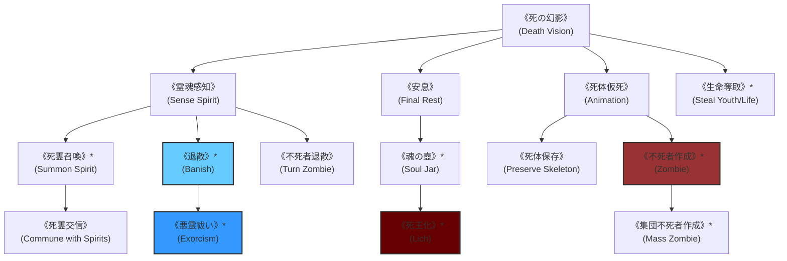

# ガープスマジック呪文体系：死霊系呪文 (Necromantic Spells)

**主管部署**: 魔導科学・理論研究部  
**準拠文献**: 『ガープス第4版 魔法大全（GURPS Magic）』第12章 pp.77-88、公式サプリメント各編（magic_page_071.html）  
**準拠憲章**: `AGENTS.md` (霊体・ゴーストへの非物理干渉・専門魔法部隊専任領域)

---

## 1. 死霊系呪文の基本概要と世界観的位置づけ

### 1.1 系統特性
- **本質**: 生命活動の停止した有機体（死体・白骨）、アストラル界に残留する意識・霊体（ゴースト、レイス、悪霊）、および魂の構造への直接干渉。
- **物理兵器無効存在への唯一の有効打（AGENTS.md 絶対遵守）**:
  - 実体を持たないゴースト・悪霊・怨霊に対しては、小銃や重機関銃などの現代通常火器が一切通用しない。
  - 防衛省・警察の「専門魔法部隊（陰陽師、祓魔師、メイジ術士等）」が出動し、死霊系・呪文操作系呪文を用いて除霊・成仏・消滅を執行する。

---

## 2. 呪文前提系統樹（ツリー構造）

---

## 3. 呪文詳細一覧データ（主要抜粋・全64種）

| 呪文名（日 / 英） | クラス | 持続時間 | エネルギー消費 | 準備時間 | 前提条件 | 出力・効果概要 |
| :--- | :--- | :--- | :--- | :--- | :--- | :--- |
| **《死の幻影》** (Death Vision) | 通常/抵 | 1秒 | 2点 | 1秒 | 素質1 | 対象に自らの死の瞬間の幻影を見せ、恐怖判定（精神ショック）を強制。 |
| **《霊魂感知》** (Sense Spirit) | 情報/範 | 一瞬 | 1点/m | 1秒 | 《死の幻影》 | 半径内の不可視ゴースト、怨霊、浮遊霊を探知。 |
| **《安息》** (Final Rest) | 通常 | 永久 | 3点 | 5秒 | 《死の幻影》 | 死体に霊的封印を施し、アンデッド化や死霊術による再起を完全遮断。 |
| **《死霊交信》** (Commune with Spirits) | 通常 | 1分 | 3点 (維持1) | 3秒 | 《霊魂感知》 | 霊体と直接対話を行い、生前の情報や死因を聴取。 |
| **《不死者退散》** (Turn Zombie) | 通常/抵 | 1分 | 2点〜 | 1秒 | 《霊魂感知》 | ゾンビやスケルトン等の低級アンデッドを恐怖・敗走させる。 |
| **《退散》\*** (Banish) | 特殊/抵 | 永久 | 対象HP点 | 5秒 | 素質2、《霊魂感知》 | 異界から流入した悪霊・外来霊体を元のプレーンへ強制追放（至難）。 |
| **《悪霊祓い》\*** (Exorcism) | 通常/抵 | 永久 | 10点 | 1時間 | 《退散》、意志力13以上 | 生体や機械に憑依した悪霊・怨念を儀式的に完全除霊・消滅（至難）。 |
| **《死体保存》** (Preserve Skeleton) | 通常 | 永久 | 3点 | 1分 | 《死の幻影》 | 死体の腐敗を止め、法医学標本や解体素材として完全保持。 |
| **《不死者作成》\*** (Zombie) | 特殊 | 永久 | 8点/体 | 1分 | 素質2、《死の幻影》、禁忌術式 | 死体に偽りの生命を与え、自律使役アンデッドとして使役（国際法違反・至難）。 |
| **《魂の壺》\*** (Soul Jar) | 特殊 | 永久 | 20点 | 1日 | 素質3、死霊系10種 | 魂を宝石等の容器に封入・保存（至難）。 |
| **《死王化》\*** (Lich) | 特殊 | 永久 | 100点 | 儀式 | 素質3、《魂の壺》《肉体保存》等 | 自らの魂を切り離し、不死の魔導君主（リッチ）へと変異（最高位禁忌・至難）。 |

---

## 4. 現代治安維持・バイオハザード対策での適用例

1. **警察・自衛隊「専門魔法部隊」の除霊任務**:
   - 事故物件や旧式地下道、アウトランド廃墟群で発生する怨霊・ポルターガイストに対し、《霊魂感知》《悪霊祓い》《退散》を用いて無力化。
2. **魔獣解体現場での死後硬直・腐敗防止**:
   - 八王子・豊洲解体場において《死体保存》《安息》を施し、変異ウイルスの活性化や不随意変異を抑止。
