# 植物系呪文 (Plant Spells)

本ドキュメントは、ガープス第4版『魔法大全』第10章（pp.61-64）および公式拡張サプリメント（『Magic: Plant Spells』『Magic: Artillery Spells』『Magic: Death Spells』『Magic: The Least of Spells』）に準拠した、**全86種**の植物系公式呪文アーカイブです。木・草・蔦・藻類の成長促進、有機形態変化、木材硬化、ならびに2026年現代における結界都市外縁防護壁・アウトランド魔境緑化対策・軍事機動戦術・法規制（CR）の運用データを過不足なく完全網羅しています。

---

## 1. 植物系魔術の力学体系

植物系呪文は、マナの指向性励起を介して植物細胞の代謝速度、細胞壁のセルロース重合度、光合成変換効率、および局所バイオマス形態を直接操作・変容させる生体変成魔術体系です。
- **細胞増殖と時間短縮**: 《植物繁茂》《植物急成長》は、周囲の地脈マナと大気中の二酸化炭素を瞬時に高分子セルロースへと転換固定し、数ヶ月〜数年分の生長を数秒〜数分で成し遂げます。
- **生体媒介と材質変性**: 《真なる木》《草を剣》等は、木質繊維の結合エネルギーをマナ結合によってダイヤモンド構造に匹敵する強度へと励起し、鋼鉄と同等以上の防護点（DR）と切断力を付与します。
- **生化学兵器・毒素励起**: 《花粉の雲》《毒の茨》《魔粉塵*》は、植物が分泌するアレルゲンや神経毒素を異常分泌させ、非装甲目標や密閉不完全な兵員の呼吸器・皮膚粘膜を即座に無力化します。

### 1.1 植物系呪文 前提条件ツリー (Prerequisite Tree)

植物系呪文全86種の完全な習得体系図です。点線枠は他系統（地霊系、水霊系、移動系、死霊系等）の前提呪文を示し、紫色枠は至難（VH）呪文を示します。

```mermaid
graph TD
    %% クラススタイル定義（高コントラスト・ダークモード規格）
    classDef spell fill:#0f172a,stroke:#38bdf8,stroke-width:1.5px,color:#ffffff;
    classDef root fill:#0369a1,stroke:#38bdf8,stroke-width:2px,color:#ffffff,font-weight:bold;
    classDef ext fill:#1e293b,stroke:#94a3b8,stroke-width:1px,color:#cbd5e1,stroke-dasharray: 5 5;
    classDef special fill:#4c1d95,stroke:#c084fc,stroke-width:1.5px,color:#ffffff;

    %% 系統内呪文ノード定義
    subgraph Sub_3F144BF5 ["32種"]
        SeekPlant["《植物探知》<br>(Seek Plant)"]:::root
        IdentifyPlant["《植物分析》<br>(Identify Plant)"]:::spell
        HealPlant["《植物治癒》<br>(Heal Plant)"]:::spell
        ShapePlant["《植物変化》<br>(Shape Plant)"]:::spell
        BlessPlants["《植物祝福》<br>(Bless Plants)"]:::spell
        HidePath["《獣道》<br>(Hide Path)"]:::spell
        PlantGrowth["《植物繁茂》<br>(Plant Growth)"]:::spell
        PlantVision["《木中視覚》<br>(Plant Vision)"]:::spell
        PollenCloud["《花粉の雲》<br>(Pollen Cloud)"]:::spell
        Blight["《不作》<br>(Blight)"]:::spell
        Blossom["《芽生え》<br>(Blossom)"]:::spell
        Sp_12_5B50["《偽装植物》"]:::spell
        ForestWarning["《見張りの森》<br>(Forest Warning)"]:::spell
        TangleGrowth["《よじれ枝》<br>(Tangle Growth)"]:::spell
        PurifyEarth["《土浄化》<br>(Purify Earth)"]:::spell
        CreatePlant["《植物作成》<br>(Create Plant)"]:::special
        FalseTracks["《足跡偽装》<br>(False Tracks)"]:::spell
        PlantSense["《植物知覚》<br>(Plant Sense)"]:::spell
        RejuvenatePlant["《植物再生》<br>(Rejuvenate Plant)"]:::special
        WitherPlant["《枯死》<br>(Wither Plant)"]:::spell
        WalkThroughPlants["《草中歩行》<br>(Walk Through Plants)"]:::spell
        WalkThroughWood["《木中歩行》<br>(Walk Through Wood)"]:::spell
        PlantControl["《植物制御》<br>(Plant Control)"]:::spell
        Sp_24_2449["《真なる木》"]:::spell
        AnimatePlant["《動く植物》<br>(Animate Plant)"]:::spell
        PlantForm["《植物変身》<br>(Plant Form)"]:::special
        Sp_27_4E13["《植物語》"]:::special
        RainofNuts["《実の雨》<br>(Rain of Nuts)"]:::special
        ArborealImmurement["《埋伏》<br>(Arboreal Immurement)"]:::special
        PlantFormOtherVH["《他者植物変身*》<br>(Plant Form Other (VH))"]:::special
        BodyofWood["《肉体木化》<br>(Body of Wood)"]:::special
        BodyofSlime["《肉体藻化》<br>(Body of Slime)"]:::special
    end

    subgraph Sub_337FEF6F ["45種"]
        BladeofGrass["《草を剣》<br>(Blade of Grass)"]:::spell
        BloodsuckingBranches["《吸血の枝》<br>(Bloodsucking Branches)"]:::special
        BodyofLeaves["《肉体葉化》<br>(Body of Leaves)"]:::spell
        BreakfallPlants["《植物軟着陸》<br>(Breakfall Plants)"]:::special
        BuoyantPlantLife["《植物浮水》<br>(Buoyant Plant Life)"]:::special
        CapturingVines["《拘束の蔓》<br>(Capturing Vines)"]:::spell
        ChangeSpecies["《品種変更》<br>(Change Species)"]:::special
        CreatePaper["《紙作成》<br>(Create Paper)"]:::special
        DruidsPanacea["《森僧の静養》<br>(Druid's Panacea)"]:::special
        ExplodingVegetableVH["《野菜爆砕（至難）*》<br>(Exploding Vegetable (VH))"]:::spell
        FastPlantGrowth["《植物急成長》<br>(Fast Plant Growth)"]:::special
        FlingFruit["《飛ぶ果物》<br>(Fling Fruit)"]:::special
        ForestDefense["《瞬間森鎧》<br>(Forest Defense)"]:::spell
        GatherMoss["《苔むし》<br>(Gather Moss)"]:::spell
        GrantPlantIntelligence["《植物知力強化》<br>(Grant Plant Intelligence)"]:::special
        GraspingBranch["《つかみ枝》<br>(Grasping Branch)"]:::special
        GreenDeath["《緑の死神》<br>(Green Death)"]:::special
        GreenTelurgy["《緑の回線》<br>(Green Telurgy)"]:::spell
        Harvest["《収穫》<br>(Harvest)"]:::special
        HypnoticLeaves["《催眠の葉》<br>(Hypnotic Leaves)"]:::special
        ImprovedFirewood["《薪改良》<br>(Improved Firewood)"]:::spell
        InvokeFence["《柵構築》<br>(Invoke Fence)"]:::special
        JoinPlants["《植物接続》<br>(Join Plants)"]:::spell
        MiniaturizePlant["《植物縮小》<br>(Miniaturize Plant)"]:::special
        PlanttoObject["《植物を物体》<br>(Plant to Object)"]:::special
        ProcessPlantTL["《植物処理/TL》<br>(Process Plant/TL)"]:::special
        RazorGrass["《剃刀草》<br>(Razor Grass)"]:::special
        ResilientVegetation["《植生防護》<br>(Resilient Vegetation)"]:::special
        ReversePlantGrowth["《植物若化》<br>(Reverse Plant Growth)"]:::special
        RunAcrossTreetops["《樹上駆け》<br>(Run Across Treetops)"]:::spell
        SearchingRoots["《捜索の根》<br>(Searching Roots)"]:::special
        SeePlantHealth["《植物傷看破》<br>(See Plant Health)"]:::root
        ShurikenLeaf["《手裏剣の葉》<br>(Shuriken Leaf)"]:::special
        SlimySkin["《ぬめる皮》<br>(Slimy Skin)"]:::spell
        SpyingBlossom["《スパイ花》<br>(Spying Blossom)"]:::spell
        SummonDryad["《ドリアード召喚》<br>(Summon Dryad)"]:::special
        ToxicPlant["《噴毒植物》<br>(Toxic Plant)"]:::special
        TrappedLight["《光込め》<br>(Trapped Light)"]:::spell
        TreeBarkArmor["《樹皮の鎧》<br>(Tree Bark Armor)"]:::special
        TreetopBlink["《樹上瞬間回避》<br>(Treetop Blink)"]:::special
        UndergrowthAmbush["《下草の伏兵》<br>(Undergrowth Ambush)"]:::spell
        VinetoSnake["《蔓を蛇》<br>(Vine to Snake)"]:::special
        WoodGolem["《ウッド・ゴーレム》<br>(Wood Golem)"]:::spell
        WoodenArm["《木の腕》<br>(Wooden Arm)"]:::special
        Woodfall["《植物落下》<br>(Woodfall)"]:::spell
    end

    subgraph Sub_1F421D8F ["MAS / MDS 拡張 7種"]
        PoisonThorns["《毒の茨》<br>(Poison Thorns)"]:::special
        RainofThorns["《茨の雨》<br>(Rain of Thorns)"]:::spell
        PlantZombie["《植物ゾンビ》<br>(Plant Zombie)"]:::spell
        DevilsDustVH["《魔粉塵*》<br>(Devil’s Dust (VH))"]:::special
        IronweedVH["《棘床畑*》<br>(Ironweed (VH))"]:::special
        MurderBlossomVH["《殺人花*》<br>(Murder Blossom (VH))"]:::special
        SwampRotVH["《肉体腐失*》<br>(Swamp Rot (VH))"]:::special
    end

    subgraph Sub_22E35AC2 ["The Least of Spells 拡張 2種"]
        RitualofReapingA["《刈手（並）》<br>(Ritual of Reaping (A)"]:::spell
        SpellofSowingA["《種まき（並）》<br>(Spell of Sowing (A)"]:::spell
    end

    %% 前提条件依存関係エッジ
    SeekPlant --> IdentifyPlant
    IdentifyPlant --> HealPlant
    IdentifyPlant --> ShapePlant
    HealPlant --> BlessPlants
    HealPlant --> HidePath
    HealPlant --> PlantGrowth
    ShapePlant --> PlantVision
    ShapePlant --> PollenCloud
    PlantGrowth --> Blight
    PlantGrowth --> Blossom
    PlantGrowth --> Sp_12_5B50
    Ext_1 --> ForestWarning
    PlantGrowth --> TangleGrowth
    Ext_2 --> PurifyEarth
    PlantGrowth --> PurifyEarth
    PlantGrowth --> CreatePlant
    ShapePlant --> FalseTracks
    Ext_3 --> FalseTracks
    ForestWarning --> PlantSense
    HidePath --> PlantSense
    PlantGrowth --> RejuvenatePlant
    Blight --> WitherPlant
    HidePath --> WalkThroughPlants
    ShapePlant --> WalkThroughPlants
    WalkThroughPlants --> WalkThroughWood
    PlantSense --> PlantControl
    Req_4 --> Sp_24_2449
    Req_5 --> AnimatePlant
    Req_6 --> PlantForm
    PlantSense --> Sp_27_4E13
    ShapePlant --> RainofNuts
    WalkThroughWood --> ArborealImmurement
    PlantForm --> PlantFormOtherVH
    PlantForm --> BodyofWood
    PlantForm --> BodyofSlime
    Ext_7 --> BodyofSlime
    ShapePlant --> BladeofGrass
    Ext_8 --> BloodsuckingBranches
    BodyofSlime --> BodyofLeaves
    Ext_9 --> BodyofLeaves
    Ext_10 --> BreakfallPlants
    WalkThroughPlants --> BreakfallPlants
    IdentifyPlant --> BuoyantPlantLife
    GraspingBranch --> CapturingVines
    ReversePlantGrowth --> ChangeSpecies
    HealPlant --> CreatePaper
    BodyofWood --> DruidsPanacea
    ShapePlant --> ExplodingVegetableVH
    PlantGrowth --> FastPlantGrowth
    Ext_10 --> FlingFruit
    ShapePlant --> FlingFruit
    AnimatePlant --> ForestDefense
    FastPlantGrowth --> GatherMoss
    Ext_11 --> GatherMoss
    Sp_27_4E13 --> GrantPlantIntelligence
    AnimatePlant --> GraspingBranch
    CreatePlant --> GreenDeath
    Ext_12 --> GreenDeath
    Sp_27_4E13 --> GreenTelurgy
    Ext_10 --> Harvest
    IdentifyPlant --> Harvest
    Ext_13 --> Harvest
    Ext_14 --> HypnoticLeaves
    PlantSense --> HypnoticLeaves
    IdentifyPlant --> ImprovedFirewood
    HealPlant --> InvokeFence
    ShapePlant --> JoinPlants
    ReversePlantGrowth --> MiniaturizePlant
    ShapePlant --> PlanttoObject
    Ext_15 --> ProcessPlantTL
    HealPlant --> ProcessPlantTL
    Sp_24_2449 --> RazorGrass
    PlantGrowth --> RazorGrass
    ShapePlant --> ResilientVegetation
    PlantGrowth --> ReversePlantGrowth
    BreakfallPlants --> RunAcrossTreetops
    Ext_16 --> RunAcrossTreetops
    AnimatePlant --> SearchingRoots
    BladeofGrass --> ShurikenLeaf
    Ext_7 --> SlimySkin
    WoodenArm --> SlimySkin
    PlantSense --> SpyingBlossom
    Ext_17 --> SummonDryad
    PlantGrowth --> ToxicPlant
    Ext_12 --> ToxicPlant
    Ext_18 --> TrappedLight
    PlantGrowth --> TrappedLight
    Sp_24_2449 --> TreeBarkArmor
    ShapePlant --> TreeBarkArmor
    ForestDefense --> TreetopBlink
    RunAcrossTreetops --> TreetopBlink
    SearchingRoots --> UndergrowthAmbush
    CreatePlant --> VinetoSnake
    Ext_19 --> WoodGolem
    Ext_20 --> WoodGolem
    ShapePlant --> WoodGolem
    Req_21 --> WoodenArm
    RainofNuts --> Woodfall
    Req_21 --> PoisonThorns
    PoisonThorns --> RainofThorns
    Ext_22 --> PlantZombie
    PollenCloud --> DevilsDustVH
    Sp_24_2449 --> IronweedVH
    PlantGrowth --> IronweedVH
    CreatePlant --> MurderBlossomVH
    PollenCloud --> MurderBlossomVH
    Req_23 --> SwampRotVH
    Req_24 --> RitualofReapingA
    Req_24 --> SpellofSowingA

    %% 外部系統・特殊前提ノード
    Ext_1["【他系統: 《危機感知》】"]:::ext
    Ext_2["【他系統: 《土作成》】"]:::ext
    Ext_3["【他系統: 《土変化》】"]:::ext
    Req_4["【前提: 植物系6種】"]:::ext
    Req_5["【前提: 植物系7種】"]:::ext
    Req_6["【前提: 素質1、植物系6種】"]:::ext
    Ext_7["【他系統: 《水変化》】"]:::ext
    Ext_8["【他系統: 《血液弱体化》】"]:::ext
    Ext_9["【他系統: 《他者植物変身》】"]:::ext
    Ext_10["【他系統: 《念動》】"]:::ext
    Ext_11["【他系統: 《養毛》】"]:::ext
    Ext_12["【他系統: 《嘔吐感》】"]:::ext
    Ext_13["【他系統: 《測定》】"]:::ext
    Ext_14["【他系統: 《眩惑》】"]:::ext
    Ext_15["【他系統: 《蒸留》】"]:::ext
    Ext_16["【他系統: 《浮揚》】"]:::ext
    Ext_17["【他系統: 《霊魂感知》】"]:::ext
    Ext_18["【他系統: 《閃光》】"]:::ext
    Ext_19["【他系統: 《動く像》】"]:::ext
    Ext_20["【他系統: 《魔化》】"]:::ext
    Req_21["【前提: 素質1、植物系呪文6種】"]:::ext
    Ext_22["【他系統: 《死人使い》】"]:::ext
    Req_23["【前提: 素質3、〈肉体藻化〉】"]:::ext
    Req_24["【前提: -（簡単呪文なので）】"]:::ext
```

---

## 2. ガープス第4版『魔法大全』基本植物系呪文（32種）

| 呪文名（日 / 英） | クラス | 持続時間 | 基本消費 / 維持 | 詠唱時間 | 前提条件 | 効果概要・力学 |
| :--- | :---: | :---: | :---: | :---: | :--- | :--- |
| **《植物探知》** Seek Plant | 情報 | 一瞬 | 2 | 1秒 | - | 最も近くにある、一定量以上の植物生育地までの方角とおおよその距離を探知します。特定の種類の植物を探知することもできます。 長距離の修正値 （14ページ）を適用してください。 術者 が前もって指定すれば、既知の植物を 目標 からはずすこともできます。 エラッタ修正：【誤】既知の 呪文 を 目標 からはずすこともできます。 【正】既知の 植物 を 目標 からはずすこともでき |
| **《植物分析》** Identify Plant | 情報 | 一瞬 | 2 | 1秒 | 《植物探知》 | 植物1つの種類と名前がわかります。さらに、その植物の基本的知識も得られます（食用か有 毒 かなど）。 呪文 の詠唱に成功すれば、その植物に薬効その他の特別な効能があるかどうかを調べるさい、〈 医師 〉〈 自然知識 〉の 技能 判定に+3の修正を得ます。 エラッタ修正：Naturalist 【誤】〈動植物知識〉 【正】〈 自然知識 〉 |
| **《植物治癒》** Heal Plant | 範囲 | 永久 | 3 | 1分 | 《植物分析》 | 範囲内の植物の 病気 や寄生、損傷を癒します。 呪文 が効果を発揮するには、植物が生きていなければなりません。 |
| **《植物変化》** Shape Plant | 通常 | 1分 | 3/1# | 10秒 | 《植物分析》 | 効果の詳細は公式ルールブック（『魔法大全』または『Magic: Plant Spells』）を参照。 |
| **《植物祝福》** Bless Plants | 範囲 | 1収穫期 | 1 | 5分 | 《植物治癒》 | 効果範囲内の植物は残りの生育期間中、ふつうより速く、たくましく生長します。効果範囲内の収穫高が2倍になります。 |
| **《獣道》** Hide Path | 通常 | 1分 | 2/1 | 1秒 | 《植物治癒》 | 人間大の生き物5体または馬に乗った 術者 1人が、草や下生え、密林のなかを跡を残さず通りぬけることができます。このかすかな痕跡をたどろうとすれば、 技能 判定に-8の修正を受けます！ |
| **《植物繁茂》** Plant Growth | 範囲 | 1分 | 3/2 | 10秒 | 《植物治癒》 | 目標 の植物はふつう1か月かけて生長する分を、わずか1分で生長します。樹木ならそれほど大きな変化は現われませんが、雑草なら目をみはるほど大きくなります。庭を造ったり（もちろん雑草はきれいに抜いたあとで！）植物を発芽させるのに役に立つでしょう。 |
| **《木中視覚》** Plant Vision | 通常 | 30秒 | 1/10ｍ毎 | 1秒 | 《植物変化》 | 植物を見通して、植物に覆われた建物や徘徊する敵などを発見できます。自然の植物の茂みはすべて透けて見えます。ただし、 魔法 の木立ちや枯れた森や木造建築物などは見通せません。 |
| **《花粉の雲》** Pollen Cloud | 範囲/抵-生命力 | 5分# | 1 | 1秒 | 《植物変化》 | _ 生命力 、 花粉の雲が範囲内を満たします。範囲内にいる全員、 くしゃみ をしたり、泣いたり、 咳 き込んだりしはじめます。その雲のなかにいるあいだ、及び抜け出してからもさらに3D ターン 、 敏捷力 判定に-2のペナルティを受けます。 雲が消える速度は、場所と風速によります。ふつうは |
| **《不作》** Blight | 範囲 | 1収穫期 | 1 | 5分 | 《植物繁茂》 | 効果範囲内の植物は、残りの生育期間、通常より生長が遅く、ひ弱になります。範囲内の収穫量は半減します。また、葉や果実やつぼみが落ちるといった影響が即座に現われます。影響を受けた植物は数日経つと、（部分的にですが）回復します。 |
| **《芽生え》** Blossom | 範囲 | 1時間 | 2 | 5分 | 《植物繁茂》 | 呪文 が効果を発揮する1時間のあいだに、範囲内の植物を芽生えさせ、結実させます。この影響を受けるには、植物全体が効果範囲内に入っていなければなりません。植物は24時間、急生長したあと、落葉期に入ります。広葉樹は紅葉し、花や果実は地面に落ちるでしょう。 呪文 の詠唱時に、1本の植物や1種類の植物など 目標 を絞ることができます。 |
| **《偽装植物》** <small>（旧名：隠蔽）</small> Conceal | 範囲 | 1分 | さまざま# | 4秒 | 《植物繁茂》 | 効果の詳細は公式ルールブック（『魔法大全』または『Magic: Plant Spells』）を参照。 |
| **《見張りの森》** Forest Warning | 範囲 | 10時間 | 2#/同 | 1秒 | 《危機感知》ないし植物系4種 | （173ページ）と同様ですが、植物の生えた場所で効果を発揮します。 |
| **《よじれ枝》** Tangle Growth | 範囲 | 1分 | 1または2#/半 | 2秒 | 《植物繁茂》 | 効果の詳細は公式ルールブック（『魔法大全』または『Magic: Plant Spells』）を参照。 |
| **《土浄化》** Purify Earth | 範囲 | 永久 | 2# | 30秒 | 《土作成》、《植物繁茂》 | 浄化・土から不純物、 毒 、有害な物質を取り除き、植物の成長に適した土に変えます。土に欠けている成分をこの 呪文 で補うこともできます。土中にある小さな異物（コイン、釘）は破壊され、中型の異物（剣、砲弾、宝箱、胸像）は地面に “ 浮き上がって ” きます。大きな物体（棺、壁、大きな影像）があると、この 呪文 は失敗しますが、 術者 は何故失敗したのか分 |
| **《植物作成》** Create Plant | 範囲 | 永久 | さまざま | 秒=コスト | 素質1、《植物繁茂》 | なにも生えていないところに植物を作りだします。この植物が生きのびられるかどうかは場所によります。 |
| **《足跡偽装》** False Tracks | 通常/抵-意志力 | 1分 | 2/1 | 1秒 | 《植物変化》、《土変化》 | _ 意志力 、 目標 は獣やその他の生き物であるかのような足跡を残します。この効果を受けたくない 目標 は、 意志力 で抵抗します。追跡者の〈 足跡追跡 〉と 術者 の〈 自然知識 〉（または同名 呪文 のレベルかどちらか低いほう）で 即決勝負 を行ない、追跡者を騙せたかどうかを決定します。 |
| **《植物知覚》** Plant Sense | 通常/ 抵-《獣道》 | 1分 | 3/2 | 1秒 | 《見張りの森》、《獣道》 | _、 周囲の植物の感知している状況を目と耳で感じることができます。たとえば、生き物と遭遇したり、生き物が姿を隠していることによって生じる災難などです。〈 足跡追跡 〉 技能 に+4、あらゆる 知覚判定 に+2の修正を得ます。さらに、通常の 知覚判定 を行なうだけで、 透明 なものや、 魔法 で隠された生き物を発見する能力を得ます。うっそうと樹木の茂る場所 |
| **《植物再生》** Rejuvenate Plant | 通常 | 永久 | 3 | 1秒 | 素質1、《植物繁茂》 | 死んだ植物や枯れかけの植物、古い植物をたちまち生き返らせます。机（あるいは ロングボウ ！）には葉が茂り、老いた果樹はまた実をつけるでしょう。植物が復活した力を 維持 できるかどうかは、その場所の環境次第です。たとえば、椅子を復活させても、脚から出た根が土の養分を吸収できなければ、ゆっくりと枯れていくでしょう。 |
| **《枯死》** Wither Plant | 範囲/抵-生命力 | 永久 | 2 | 10秒 | 《不作》 | 効果の詳細は公式ルールブック（『魔法大全』または『Magic: Plant Spells』）を参照。 |
| **《草中歩行》** Walk Through Plants | 通常 | 1分 | 3/1 | 1秒 | 《獣道》、《植物変化》 | 目標 は植物に行く手を妨げられることなく、草や下生え、深い森や密林を移動できます。まるで開けた土地を歩くように、（通常の移動 速度 で） 移動 することができます。植物は脇に退いて 目標 を通し、 目標 が行きすぎるとまた元の場所にもどります。 この 呪文 によって、追跡が困難になります。その場所にどの程度、植物が茂っているかによって、-1から-8までのペナルティがかかります。《 |
| **《木中歩行》** Walk Through Wood | 通常 | 1秒 | 3/2 | 1秒 | 《草中歩行》 | まるでそれが空気であるかのように、固い木（枯れていても生きていても）のなかを通りぬけることができます。通路を開くわけではないので、 目標 以外のものが後をついていくことはできません。また、向こう側になにがあるかもわかりません。この 呪文 は空気を供給してくれないので、 目標 は息を止めていなければなりません！ 開けた場所に出る前に 呪文 の効果が切れてしまったら、 目標 は木のな |
| **《植物制御》** Plant Control | 通常/抵-意志力 | 1分 | 3/半 | 1秒 | 《植物知覚》 | _ 意志力 、 つの大きな植物（サイズは問いません）、または合計50キロまでの小さな植物群1つの行動を制御します。通常は「もともと自分で動くことのできる植物」にしか効果がありません。 術者 は 集中 が必要です。また、 知性 のある植物（ 知力 6以上）には効果がありません。この 呪文 によって、といった 呪文 が、植物 |
| **《真なる木》** <small>（旧名：聖木）</small> Essential Wood | 通常 | 永久 | 8 | 30秒 | 植物系6種 | 効果の詳細は公式ルールブック（『魔法大全』または『Magic: Plant Spells』）を参照。 |
| **《動く植物》** Animate Plant | 通常 | 1分 | さまざま | 5秒 | 植物系7種 | 霊・（78ページ）と似ていますが、生きた植物1体しか動かせません。動く植物は、 呪文 に消費された エネルギー の2倍の 生命力 を得ます。大きな樹木は概して 防護点 が高く、恐ろしい敵になることに注意してください。 知性 のある植物（ 知力 6以上）は動かせません。 |
| **《植物変身》** Plant Form | 特殊 | 1時間 | 5/2 | 1秒 | 素質1、植物系6種 | 術者 は自身の2分の1から5倍までの大きさの植物や樹木に姿を変えることができます。衣服は消えますが、元の姿にもどるとまた現われます。大きな所持品は地面に落ちますが、腕輪や 錫杖 程度の小さなものは、 術者 とともに樹木に変わります。 変身すると 移動 や 攻撃 などはできません。ただし、そうした能力を持つ樹木が存在するゲーム世界であったり、変身後の植物に《 動 |
| **《植物語》** <small>（旧名：植物会話）</small> Plant Speech | 通常 | 1分 | 3/2 | 1秒 | 素質1、《植物知覚》 | 言語関連 魔法 言語関連 呪文 |
| **《実の雨》** Rain of Nuts | 範囲 | 1分 | 1÷10/同 | 1秒 | 素質1、《植物変化》含む植物系6種 | 頭がおかしくなったリスがいっせいに暴れだしたみたいに、近くの樹木から範囲内に木の実の雨を降らせます。この騒々しい木の実の雨は兜にあたって大きな音を立て、素肌を打ち、飛び道具の矢弾に衝突します。範囲内にいるキャラクターは全員、 集中 や 技能 に必要な作業に-1のペナルティを受けます。 戦闘 や 呪文 詠唱もこれに含まれます。さらに距離8メートルごとに 可視性 に-1のペナルティが加わ |
| **《埋伏》** Arboreal Immurement | 通常/抵-生命力 | 不定# | 8# | 3秒 | 素質2、《木中歩行》 | _ 生命力 、 と同様ですが、土中ではなく樹木のなかに 目標 を埋め込みます。 目標 はいちばん近くにある充分な大きさの樹木にただちに埋め込まれます。そのままの 呪文 （120ページ）をかけられたのと同じ状態で、樹木のなかにある小さな円筒状の空洞に留まります。木を切り倒すか、この 呪文 の逆作用によって覆すまで脱出できません。 術者 自身に唱えた場合は意識を保 |
| **《他者植物変身*》** Plant Form Other (VH) | 特殊/抵-意志力 | 1時間 | 5/2 | 30秒 | 素質2、《植物変身》 | （至難） （至難） _ 意志力 、 と同様ですが、他人に対して使えます。 術者 が 呪文 を中断するか、をかけてもらうしか、逃れる方法はありません。 知力 が低下しつづけると、いずれ 目標 は本物の植物に変わってしまうでしょう！ |
| **《肉体木化》** Body of Wood | 通常/抵-生命力 | 1分 | 7/3 | 5秒 | 素質2、《植物変身》 | _ 生命力 、 目標 は動く木像に変わり、一時的に 共通性質 「 木の体 」を得ます。3キロまでの衣服も木になりますが、 魔法 のものは魔力を失います。 目標 は口をきいたり 呪文 を唱えたりできます。 この 呪文 の影響下ある 目標 は「 物質透過 /木材」（『 ベーシックセット 1巻』89ページ）の 有利な特徴 を備えているのと同様、木製の物 |
| **《肉体藻化》** Body of Slime | 通常/抵-生命力 | 1分 | 6/2 | 5秒 | 素質2、《植物変身》、《水変化》 | _ 生命力 、 水中用ので、 目標 は緑色の藻の動く塊になります――水草やアオミドロ、腐葉土など、沼地で見つかるようなものならなんでもかまいません。 目標 は一時的に 共通性質 「 藻の体 」を得ます。 3キロまでの衣服も藻になりますが、 魔法 のものは魔力を失います。 |

---

## 3. 公式拡張『Magic: Plant Spells』高度植物系呪文（45種）

| 呪文名（日 / 英） | クラス | 持続時間 | 基本消費 / 維持 | 詠唱時間 | 前提条件 | 効果概要・力学 |
| :--- | :---: | :---: | :---: | :---: | :--- | :--- |
| **《草を剣》** Blade of Grass | 通常 | 1分 | 1/30cm毎・半 | 1分 | 《植物変化》 | 呪文 magic 武器 呪文 |
| **《吸血の枝》** Bloodsucking Branches | 範囲 | 1分 | 2・半 | 1分 | 素質1、植物系呪文6種、《血液弱体化》 | 呪文 magic 吸血鬼 呪文 |
| **《肉体葉化》** Body of Leaves | 通常/抵-生命力 | 1時間 | 5・2 | 4秒 | 《肉体藻化》と《他者植物変身》 | 効果の詳細は公式ルールブック（『魔法大全』または『Magic: Plant Spells』）を参照。 |
| **《植物軟着陸》** Breakfall Plants | 通常 | 1分 | 1/25kg毎・半# | 1秒 | 素質1、《念動》と《草中歩行》 | 呪文 呪文 重力関連 肉体的な行動 移動・衝突・踏み・落下 肉体的な行動 植物 |
| **《植物浮水》** Buoyant Plant Life | 範囲 | 1分 | さまざま# | 30秒 | 素質1、《植物分析》 | 呪文 植物 移動・衝突・踏み・落下 肉体的な行動 呪文 |
| **《拘束の蔓》** Capturing Vines | 範囲 | 1分 | 1・半 | 4秒 | 《つかみ枝》 | 効果の詳細は公式ルールブック（『魔法大全』または『Magic: Plant Spells』）を参照。 |
| **《品種変更》** Change Species | 通常/抵-知力+5（p） | 1時間 | さまざま# | 30秒 | 素質2、《植物若化》 | 呪文 植物 体格 知力抵抗 呪文 植物 |
| **《紙作成》** Create Paper | 通常 | 永久 | さまざま# | 4分 | 素質2、《植物治癒》 | 呪文 植物 |
| **《森僧の静養》** Druid's Panacea | 通常 | さまざま# | 1〜3 | 10分 | 素質3、《肉体木化》と「植物共感」 | 効果の詳細は公式ルールブック（『魔法大全』または『Magic: Plant Spells』）を参照。 |
| **《野菜爆砕（至難）*》** Exploding Vegetable (VH) | 通常 | 一瞬 | 2〜6 | 1秒 | 《植物変化》 | 呪文 爆発物 浄化・爆発物 呪文 |
| **《植物急成長》** Fast Plant Growth | 範囲/抵-知力+5（p） | 1分 | 2・半# | 30秒 | 素質1、《植物繁茂》 | 呪文 植物 移動・衝突・踏み・落下 知力抵抗 呪文 植物 |
| **《飛ぶ果物》** Fling Fruit | 射撃/抵-生命力 | 一瞬 | 1または2# | 1秒 | 素質1、《念動》、《植物変化》 | 呪文 植物 植物 長射程戦闘関連 |
| **《瞬間森鎧》** Forest Defense | 防御 | 一瞬 | 1/DR+3毎# | 1秒 | 《動く植物》 | 効果の詳細は公式ルールブック（『魔法大全』または『Magic: Plant Spells』）を参照。 |
| **《苔むし》** Gather Moss | 通常/抵-生命力 | 3秒 | 3・2 | 1秒 | 《植物急成長》、《養毛》 | 呪文 植物 危険 呪文 生命力抵抗 危険 |
| **《植物知力強化》** Grant Plant Intelligence | 通常 | 1分 | 3/知力+1毎・3分の1 | 1秒 | 素質2、《植物語》 | 呪文 能力値 能力値 呪文 |
| **《つかみ枝》** Grasping Branch | 通常/抵-知力+5（p） | 1分 | 2・2 | 3秒 | 素質2、《動く植物》 | 効果の詳細は公式ルールブック（『魔法大全』または『Magic: Plant Spells』）を参照。 |
| **《緑の死神》** Green Death | 通常/抵-生命力 | 1時間 | 6・維持不可 | 30秒 | 素質2、《植物作成》、《嘔吐感》 | 呪文 植物 危険 呪文 生命力抵抗 呪文 植物 |
| **《緑の回線》** Green Telurgy | 通常 | 5分 | 植物のSM値・1# | 30秒 | 《植物語》 | 呪文 植物 言語関連 植物 体格 |
| **《収穫》** Harvest | 範囲 | 一瞬 | 1/4・維持不可 | 半径1ｍ毎20秒 | 素質1、《念動》、《植物分析》、《測定》 | 呪文 植物 植物 食事関連 |
| **《催眠の葉》** Hypnotic Leaves | 範囲/抵-知力 | 4分 | 2・半 | 4秒 | 素質1、《眩惑》、《植物知覚》 | 効果の詳細は公式ルールブック（『魔法大全』または『Magic: Plant Spells』）を参照。 |
| **《薪改良》** Improved Firewood | 通常 | 永久 | 1/0.5kg毎 | 10秒/2.5kg | 《植物分析》 | 呪文 植物 アイテム 植物 炎 |
| **《柵構築》** Invoke Fence | 通常 | 永久 | 3/10ｍ毎 | 2分 | 素質2、《植物治癒》 | 呪文 植物 アイテム 植物 防御 |
| **《植物接続》** Join Plants | 通常/抵-知力+5（p） | 永久 | 3か4 | 10秒 | 《植物変化》 | 呪文 植物 アイテム 植物 知力抵抗 |
| **《植物縮小》** Miniaturize Plant | 通常/抵-SM+知力（p） | 1分 | さまざま# | 30秒 | 素質2、《植物若化》 | 呪文 植物 体格 植物 知力抵抗 |
| **《植物を物体》** Plant to Object | 通常/抵-知力+6（p） | 永久 | 2/2.5kg | 秒=コスト | 素質1、《植物変化》 | 呪文 植物 アイテム 植物 知力抵抗 植物 |
| **《植物処理/TL》** Process Plant/TL | 通常/抵-知力+7（p） | 永久 | 3 | 30秒 | 素質2、《蒸留》と《植物治癒》 | 呪文 文明レベル技能 植物 植物 知力抵抗 |
| **《剃刀草》** Razor Grass | 範囲 | 10分 | 1# | 10秒 | 素質1、《真なる木》と《植物繁茂》 | 呪文 植物 部位 負傷 部位 植物 |
| **《植生防護》** Resilient Vegetation | 範囲 | 1分 | 1# | 1分 | 素質1、《植物変化》 | 呪文 植物 防御 防御 呪文 植物 |
| **《植物若化》** Reverse Plant Growth | 通常/抵-知力（p） | 30秒 | 2・半 | 1秒 | 素質1、《植物繁茂》 | 呪文 植物 体格 知力抵抗 呪文 植物 |
| **《樹上駆け》** Run Across Treetops | 通常/抵-生命力 | 1分 | 2・2 | 1秒 | 《植物軟着陸》（p.13）、《浮揚》 | 呪文 植物 肉体的な行動 移動・衝突・踏み・落下 植物 |
| **《捜索の根》** Searching Roots | 情報 | 10秒 | 2・1 | 5分 | 素質2、《動く植物》 | 呪文 植物 霊・植物 |
| **《植物傷看破》** See Plant Health | 範囲/情報 | 30秒 | 1・同 | 1秒 | - | 呪文 植物 植物 |
| **《手裏剣の葉》** Shuriken Leaf | 通常 | 一瞬 | 1、3 | 1秒 | 素質1、《草を剣》 | 呪文 長射程戦闘関連 武器 植物 |
| **《ぬめる皮》** Slimy Skin | 通常/抵-知力 | 1分 | 5・4 | 3秒 | 《水変化》と《木の腕》 | 呪文 植物 移動・衝突・踏み・落下 植物 |
| **《スパイ花》** Spying Blossom | 通常 | 5分 | 3・1〜3# | 10秒 | 《植物知覚》 | 呪文 植物 知覚関連 アイテム 知覚関連 植物 |
| **《ドリアード召喚》** Summon Dryad | 特殊 | 1時間 | 23 | 30秒 | 素質1、《霊魂感知》と植物系呪文7種 | 呪文 植物 召喚・精霊 植物 |
| **《噴毒植物》** Toxic Plant | 通常 | 2分 | 1〜8 | 1分 | 素質1、《植物繁茂》と《嘔吐感》 | magic |
| **《光込め》** Trapped Light | 通常 | 10分 | 3・1 | 5秒 | 《閃光》、《植物繁茂》 | 呪文 光・光・知覚関連 危険 |
| **《樹皮の鎧》** Tree Bark Armor | 通常 | 10分 | 4・3 | 4秒 | 素質1、《真なる木》と《植物変化》 | 呪文 植物 防具 植物 体格 |
| **《樹上瞬間回避》** Treetop Blink | 防御 | 一瞬 | 3 | 1秒 | 素質2、《瞬間森鎧》と《樹上駆け》 | 呪文 植物 体格 移動・衝突・踏み・落下 植物 |
| **《下草の伏兵》** Undergrowth Ambush | 通常 | 15秒 | 3・半 | 6秒 | 《捜索の根》 | 効果の詳細は公式ルールブック（『魔法大全』または『Magic: Plant Spells』）を参照。 |
| **《蔓を蛇》** Vine to Snake | 通常 | 1分 | 2・1 | 2秒 | 素質2、《植物作成》 | 呪文 植物 動物 植物 |
| **《ウッド・ゴーレム》** Wood Golem | 魔化 | 永久 | 360 | さまざま | 《動く像》、《魔化》、《植物変化》 | 呪文 植物 ゴーレム ゴーレム |
| **《木の腕》** Wooden Arm | 通常/抵-生命力 | 5分 | 3〜・2# | 1秒 | 素質1、植物系呪文6種 | 呪文 植物 生命力抵抗 |
| **《植物落下》** Woodfall | 通常 | 10秒 | 2/0.5kg毎 | 1秒 | 《実の雨》 | 呪文 植物 長射程戦闘関連 |

---

## 4. 戦術砲兵・死霊兵器拡張呪文（MAS / MDS 拡張 7種）

| 呪文名（日 / 英） | クラス | 持続時間 | 基本消費 / 維持 | 詠唱時間 | 前提条件 | 効果概要・力学 |
| :--- | :---: | :---: | :---: | :---: | :--- | :--- |
| **《毒の茨》** Poison Thorns | 通常/抵-生命力 | 1時間 | 3・2 | 5秒 | 素質1、植物系呪文6種 | （どくのいばら。Poison Thorns） p.10 _ 生命力 、 植物 に触れると、 毒 の棘が生えます（意識持つ 植物 は 生命力 で抵抗します）。この棘に触れた者は1d-3 小型貫通体 ダメージを受け、さらに10秒の 潜伏期間 を伴う 毒 状態になり、抵抗するために 生命力 判定を行います。 毒 は30秒間隔で1d-1の 毒 ダ |
| **《茨の雨》** Rain of Thorns | 範囲 | 1秒 | 4・半 | 1秒 | 《毒の茨》 | .10 長さ2.5cmの 毒 の棘の雨を降らせ、範囲内の全員に1d-3の 小型貫通体 ダメージを与えます。さらに10秒の 潜伏期間 と 生命力 判定を伴う 毒 攻撃が続きます。 毒 は30秒間隔で4 周期 にわたり1d-1の 毒 ダメージを与えます。 |
| **《植物ゾンビ》** Plant Zombie | 通常/抵-生命力 | 永久 | 8 | 1分 | 《死人使い》と、植物系呪文4種 | .10 召喚・霊・死んだ（枯れた） 植物 を奇妙な アンデッド として 活動体 化させます。対象は比較的完全な状態の死んだ 植物 でなければなりません。『 魔法大全 』の「 スケルトン 」 テンプレート を使用し、 共通性質 「 木の体 」を適用します。 “ 元の体 ” は 体力 10+( |
| **《魔粉塵*》** Devil’s Dust (VH) | 範囲/抵-生命力 | 5秒 | 5 | 1秒/半径1ｍ毎 | 素質4、《花粉の雲》を含む植物系呪文10種 | （至難）（Devil’s Dust (VH)） p.23 （至難） ＿ 生命力 、 魔法 的にアレルギーを引き起こす花粉の雲が範囲を満たします。これは 接触感染 であり、吸入しなくても有害となります。したがって、「 呼吸不要 」「 濾過装置 」や 息を止める ことでは防げません！ 範囲にいる生物は毎 ターン この 呪文 に抵抗しなければ、 毒 性ショッ |
| **《棘床畑*》** Ironweed (VH) | 範囲 | 1分 | 1・同 | 1秒/半径1ｍ毎 | 素質1、《真なる木》、《植物繁茂》 | 呪文 罠 |
| **《殺人花*》** Murder Blossom (VH) | 通常 | 1秒 | 7+1/1d毎 | 3秒 | 素質3、《植物作成》、《花粉の雲》 | （至難）（Murder Blossom (VH)） p.19 （至難） 美しい花を 術者 の手元に召喚し、1秒後に致命的な花粉を爆風のように 噴射 させます。これを遅らせる方法はありません。これを利用するには、 呪文 を唱えた後の ターン に、 |
| **《肉体腐失*》** Swamp Rot (VH) | 通常/抵-生命力 | 永久 | 11 | 5秒 | 素質3、〈肉体藻化〉 | （至難）（Swamp Rot (VH)） p.19 （至難） _ 生命力 あらゆる生きている対象と最大3kgの衣類を腐植の泥や藻のような有機物の粘液に変えます。 呪文 に似ていますが、結果を安定化しません。唯一の防御策は、 呪文 に抵抗 (または防御) することです。対象の残りの所有物は粘液の |

---

## 5. 日常・民間簡単呪文（The Least of Spells 拡張 2種）

| 呪文名（日 / 英） | クラス | 持続時間 | 基本消費 / 維持 | 詠唱時間 | 前提条件 | 効果概要・力学 |
| :--- | :---: | :---: | :---: | :---: | :--- | :--- |
| **《刈手（並）》** Ritual of Reaping (A | 通常 | 1時間 | 2・同 | 10秒 | -（簡単呪文なので） | （並）（Ritual of Reaping (A)） p.15 （並） 対象者は、茎を指の間に通したり、根を楽々と引っ張ったり、木を揺すったりして、素手で簡単に食用 植物 を収穫できます。作物を傷つけたり、食べられない部分を集めたりするはめになることはありません。 GM がゲーム効果を決定します。収集にかかる時間を20%短縮するか、1時間あたり追加の 食料 |
| **《種まき（並）》** Spell of Sowing (A | 通常 | 1時間 | 2・同 | 10秒 | -（簡単呪文なので） | （並）（Spell of Sowing (A)） p.15 （並） 対象者は、歩きながら空中に投げるだけで種を植えることができます。これらは完璧に散らばり、適切な深さに沈みます。発芽して成長するかどうかは、通常どおり、土壌の質、日光、降雨量などに依存します。 GM が実際の効果を設定します。20%の時間節約 (または必要な種子の量) は妥当な最小値です。 |

---

## 6. 2026年現代戦術・都市防衛・法規制（CR）における運用

### 6.1 警察・自衛隊・PMCにおける実戦配備
結界都市（セーフゾーン）警備および壁外アウトランドへの遠征作戦において、植物系呪文は防護壁の緊急自己修復、侵入路の急速遮断、密林・魔境での索敵・隠蔽支援として不可欠な装備となっています。特に部隊随伴術士による《真なる木》《樹皮の鎧》の付与は、通常小銃弾に対する防御力を飛躍的に高め、《拘束の蔓》《よじれ枝》は魔獣の突撃足を即座に止める非致死性制圧手段として多用されています。

### 6.2 メガコーポ支配と特許利権
ヤマト重工、テイコク製薬、サエデル・シュティフトゥング、アレス等のメガコーポは、植物系呪文の農業・林業・医療・防衛利用に関する独占特許を保有しています。特に《植物繁茂》《植物急成長》《紙作成》の工業プロセス連動や、《森僧の静養》をベースとした生薬抽出技術はメガコーポの莫大なバイオ収益源となっており、無認可術士による商業栽培・流通は厳しく監視・法的に排除されています。

### 6.3 国際魔導協定（IMA）および法規制（CR）
広域に枯渇・壊滅をもたらす《枯死》《不作》や、無差別化学攻撃に等しい《魔粉塵*》《殺人花*》《肉体腐失*》は、国家公安委員会および国際魔導協定により**規制等級CR3〜CR4（要特別国家許可・戦時国際法規制）**に指定されています。壁外アウトランドでの魔獣駆除を除き、都市部や公道での無認可詠唱は生物兵器テロと同等の重罪として軍事警察・特課の即時射殺対象となります。

---

## 7. 参考文献・典拠アーカイブ
- 『GURPS Magic 4th Edition』pp.61-64（Plant Spells College）
- 『GURPS Magic: Plant Spells』（SJ Games 公式拡張サプリメント）
- 『GURPS Magic: Artillery Spells』（SJ Games 公式拡張サプリメント）
- 『GURPS Magic: Death Spells』（SJ Games 公式拡張サプリメント）
- 『GURPS Magic: The Least of Spells』（SJ Games 公式拡張サプリメント）
