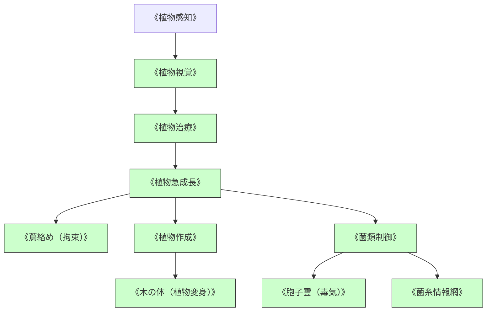

# 植物・菌類系呪文 (Plant & Fungal Spells)

本ドキュメントは、ガープス第4版サプリメント『Plant Spells』および関連データ（`magic_page_294`〜`295`）を基に、植物制御、樹木変異、菌類・胞子力学、および2026年現代における奥多摩・秩父魔境の森林・菌糸汚染対策を体系化した公式魔術アーカイブです。

---

## 1. 植物・菌類魔術の力学

植物・菌類系呪文は、光合成・細胞壁・菌糸ネットワークの生体サイクルをマナで急激に加速・変質させる生体媒介魔術です。

### 1.1 前提条件ツリー (Prerequisite Tree)

---

## 2. 植物・菌類系主要呪文データ一覧

| 呪文名（日 / 英） | 呪文クラス | 基本消費 / 維持 | 詠唱時間 | 前提条件 | 効果概要・力学 |
| :--- | :---: | :---: | :---: | :--- | :--- |
| **《植物感知》** Seek Plant | 情報 | 2 / 不可 | 1秒 | なし | 周囲の特定有用薬草、毒草、巨大植物魔境を探知。 |
| **《植物急成長》** Plant Growth | 範囲 | 2 / 1 | 2秒 | 《植物治療》 | 樹木や蔦を数秒で数メートル急成長させ、天然の遮蔽物を形成。 |
| **《蔦絡め》** Tanglefoot / Entangle | 範囲 | 3 / 2 | 2秒 | 《植物急成長》 | 周囲の草木が敵の脚に絡みつき、移動を完全封殺（ST対抗）。 |
| **《菌類制御》** Fungal Control | 通常 | 3 / 1 | 2秒 | 《植物急成長》 | カビ、キノコ、変異菌糸の増殖・休眠をコントロール。 |
| **《胞子雲》** Spore Cloud | 範囲 | 3 / 1 | 2秒 | 《菌類制御》 | 吸引すると呼吸器麻痺・幻覚をもたらす有毒胞子煙幕を散布。 |
| **《菌糸情報網》** Mycelial Network | 情報 | 4 / 2 | 3秒 | 《菌類制御》 | 地下に広がる菌糸を通じて森全体の足音・侵入者を遠隔索敵。 |
| **《木の体》** Body of Wood | 通常 | 8 / 3 | 3秒 | 《植物変身》 | 術者の肉体を強靭な樹木に変異（DR+5、火炎脆弱性）。 |

---

## 3. 現代魔境森林・バイオ防衛における適用

### 3.1 奥多摩・秩父アウトランドの菌糸汚染対策
奥多摩魔境深部では、マナ覚醒によって急速変異した「アビス胞子樹」が自生しており、侵入者の防護服を侵食して精神変異を引き起こします。自衛隊および壁外ハンターは、《菌類制御》のパッシブ防護マスクと火炎放射器・《火球》を併用して除染ルートを確保します。

### 3.2 都市緑地・防護壁の緑化偽装
東京の第2〜第3同心円要塞線では、《植物急成長》《蔦絡め》によって壁面に高密度の耐熱・防弾蔦（変異アイビー）を繁茂させ、魔獣の突進衝撃を吸収するクッション層として利用しています。
