# 防御・警戒系呪文 (Protection and Warning Spells)

本ドキュメントは、ガープス第4版『魔法大全』第25章（pp.155-161）および公式拡張サプリメント（『Magic: Artillery Spells』『Magic: Death Spells』『Magic: The Least of Spells』『Magic: Plant Spells』等）に準拠した、**全53種**の防御・警戒系呪文公式アーカイブです。マナ力学、生体媒介作用、ならびに2026年現代における結界都市防衛・軍事兵器工学・法規制（CR）の運用データを過不足なく完全網羅しています。

---

## 1. 防御・警戒系呪文の力学体系

防御・警戒系呪文は、マナの指向性周波数を介して対象の物理・生体・霊的パラメータを励起・変調・制御する魔術体系です。
- **生体媒介原則**: マナは術士の生体・神経系・霊体を介して作用し、直接の物質変換や物理エネルギー励起を行います。
- **現代技術インフラとの並行性**: 電子回路や通信網を直接破壊するのではなく、物理的現象（熱、圧力、電磁、物質変形等）を介して現代兵器や都市防護壁と相互作用します。

### 1.1 防御・警戒系呪文 前提条件ツリー (Prerequisite Tree)

```mermaid
graph TD
    %% クラススタイル定義（高コントラスト・ダークモード規格）
    classDef spell fill:#0f172a,stroke:#38bdf8,stroke-width:1.5px,color:#ffffff;
    classDef root fill:#0369a1,stroke:#38bdf8,stroke-width:2px,color:#ffffff,font-weight:bold;
    classDef ext fill:#1e293b,stroke:#94a3b8,stroke-width:1px,color:#cbd5e1,stroke-dasharray: 5 5;
    classDef special fill:#4c1d95,stroke:#c084fc,stroke-width:1.5px,color:#ffffff;

    %% 系統内呪文ノード定義
    subgraph Sub_571DE2FD ["41種"]
        Sp_1_64EE["《危機感知》<br>(（旧名：危険感知）)"]:::spell
        DetectPoison["《毒検知》<br>(Detect Poison)"]:::spell
        Magelock["《魔法の鍵》<br>(Magelock)"]:::special
        Sp_4_4BB2["《瞬間魔盾》<br>(（旧名：止め）)"]:::special
        Sp_5_418C["《瞬間魔鎧》<br>(（旧名：鎧硬化）)"]:::spell
        Watchdog["《番犬》<br>(Watchdog)"]:::spell
        ProtectAnimal["《動物保護》<br>(Protect Animal)"]:::spell
        Nightingale["《見張り》<br>(Nightingale)"]:::spell
        SenseObservation["《調査感知》<br>(Sense Observation)"]:::spell
        Sp_10_488C["《魔盾》<br>(（旧名：盾）)"]:::special
        Sp_11_9D1B["《魔鎧》<br>(（旧名：鎧）)"]:::spell
        Sp_12_2782["《瞬間峰打化》<br>(（旧名：刃返し）)"]:::spell
        Sp_13_2752["《峰打化》<br>(（旧名：刃よけ）)"]:::spell
        Umbrella["《雨傘》<br>(Umbrella)"]:::spell
        Sp_15_4908["《瞬間矢よけ》<br>(（旧名：射撃武器屈折）)"]:::spell
        MissileShield["《矢よけ》<br>(Missile Shield)"]:::spell
        CatchMissile["《矢つかみ》<br>(Catch Missile)"]:::spell
        ReverseMissiles["《矢返し》<br>(Reverse Missiles)"]:::spell
        Sp_19_3306["《瞬間矢返し》<br>(（旧名：飛び道具防御）)"]:::spell
        ReflectGaze["《視線反射*》<br>(Reflect Gaze)"]:::spell
        MysticMist["《魔法の霧》<br>(Mystic Mist)"]:::special
        Shade["《日傘》<br>(Shade)"]:::spell
        ResistPoison["《防毒》<br>(Resist Poison)"]:::spell
        ResistDisease["《無病》<br>(Resist Disease)"]:::spell
        ResistSound["《防音》<br>(Resist Sound)"]:::spell
        ResistWater["《防水》<br>(Resist Water)"]:::spell
        ResistLightning["《防電》<br>(Resist Lightning)"]:::spell
        Warmth["《暖房》<br>(Warmth)"]:::spell
        Coolness["《冷房》<br>(Coolness)"]:::spell
        IronArm["《鉄の腕》<br>(Iron Arm)"]:::spell
        WeatherDome["《避難所》<br>(Weather Dome)"]:::spell
        AtmosphereDome["《大気避難所》<br>(Atmosphere Dome)"]:::spell
        ResistPressure["《防圧》<br>(Resist Pressure)"]:::spell
        ResistRadiation["《放射線防護》<br>(Resist Radiation)"]:::spell
        ResistAcid["《防酸》<br>(Resist Acid)"]:::spell
        Freedom["《解放》<br>(Freedom)"]:::spell
        TeleportShield["《瞬間移動阻止》<br>(Teleport Shield)"]:::spell
        ForceDome["《物質障壁》<br>(Force Dome)"]:::spell
        ForceWall["《物質防壁》<br>(Force Wall)"]:::spell
        UtterDome["《完全障壁》<br>(Utter Dome)"]:::special
        UtterWall["《完全防壁》<br>(Utter Wall)"]:::spell
    end

    subgraph Sub_E032978 ["MAS / MDS 拡張 2種"]
        DiminishingDome["《狭窄障壁*》<br>(Diminishing Dome)"]:::special
        ForceBall["《連鎖球*》<br>(Force Ball)"]:::special
        BlackSphere["《黒球圏*》<br>(Black Sphere)"]:::special
        ForceGuillotine["《力場ギロチン*》<br>(Force Guillotine)"]:::special
    end

    %% 前提条件依存関係エッジ
    Ext_1 --> Sp_1_64EE
    Sp_1_64EE --> DetectPoison
    Ext_2 --> DetectPoison
    Req_3 --> Magelock
    Req_3 --> Sp_4_4BB2
    Sp_4_4BB2 --> Sp_5_418C
    Sp_1_64EE --> Watchdog
    Sp_11_9D1B --> ProtectAnimal
    Watchdog --> ProtectAnimal
    Sp_1_64EE --> Nightingale
    Sp_1_64EE --> SenseObservation
    Ext_4 --> SenseObservation
    Req_5 --> Sp_10_488C
    Sp_10_488C --> Sp_11_9D1B
    Ext_6 --> Sp_12_2782
    Ext_7 --> Sp_12_2782
    Sp_10_488C --> Sp_13_2752
    Sp_12_2782 --> Sp_13_2752
    Ext_8 --> Umbrella
    Sp_10_488C --> Umbrella
    Ext_6 --> Sp_15_4908
    Ext_6 --> MissileShield
    Sp_10_488C --> MissileShield
    Sp_15_4908 --> CatchMissile
    MissileShield --> ReverseMissiles
    ForceDome --> ReverseMissiles
    CatchMissile --> Sp_19_3306
    Ext_9 --> ReflectGaze
    Watchdog --> MysticMist
    Sp_10_488C --> MysticMist
    Ext_10 --> Shade
    Sp_10_488C --> Shade
    Ext_11 --> ResistPoison
    Ext_12 --> ResistDisease
    Ext_11 --> ResistDisease
    Req_13 --> ResistSound
    Umbrella --> ResistWater
    Ext_8 --> ResistWater
    Ext_14 --> ResistWater
    Req_15 --> ResistLightning
    Ext_16 --> Warmth
    Ext_17 --> Coolness
    Ext_18 --> IronArm
    Req_19 --> WeatherDome
    Ext_20 --> AtmosphereDome
    WeatherDome --> AtmosphereDome
    WeatherDome --> ResistPressure
    Req_21 --> ResistRadiation
    Ext_22 --> ResistAcid
    Req_23 --> Freedom
    Watchdog --> TeleportShield
    Ext_24 --> TeleportShield
    Ext_25 --> TeleportShield
    WeatherDome --> ForceDome
    Ext_6 --> ForceDome
    ForceDome --> ForceWall
    ForceDome --> UtterDome
    Ext_24 --> UtterDome
    UtterDome --> UtterWall
    Ext_26 --> UtterWall
    ForceDome --> DiminishingDome
    Ext_27 --> ForceBall
    ForceDome --> ForceBall
    Ext_1 --> ForceBall
    UtterDome --> BlackSphere
    ForceWall --> ForceGuillotine

    %% 外部系統・特殊前提ノード
    Ext_1["【他系統: 《敵感知》】"]:::ext
    Ext_2["【他系統: 《毒見》】"]:::ext
    Req_3["【前提: 素質1】"]:::ext
    Ext_4["【他系統: 《感知防御》】"]:::ext
    Req_5["【前提: 素質2】"]:::ext
    Ext_6["【他系統: 《念動》】"]:::ext
    Ext_7["【他系統: 《ひきつり》】"]:::ext
    Ext_8["【他系統: 《水変化》】"]:::ext
    Ext_9["【他系統: 《鏡》】"]:::ext
    Ext_10["【他系統: 《持続光》】"]:::ext
    Ext_11["【他系統: 《活力》】"]:::ext
    Ext_12["【他系統: 《除菌》】"]:::ext
    Req_13["【前提: 音声系4種】"]:::ext
    Ext_14["【他系統: 《水破壊》】"]:::ext
    Req_15["【前提: 風霊系6種】"]:::ext
    Ext_16["【他系統: 《加熱》】"]:::ext
    Ext_17["【他系統: 《冷却》】"]:::ext
    Ext_18["【他系統: 《痛み止め》】"]:::ext
    Req_19["【前提: 四大精霊系呪文から各2種】"]:::ext
    Ext_20["【他系統: 《空気浄化》】"]:::ext
    Req_21["【前提: 放射線系3種】"]:::ext
    Ext_22["【他系統: 《酸作成》】"]:::ext
    Req_23["【前提: 肉体操作系3種、移動系3種、防御・警戒系3種】"]:::ext
    Ext_24["【他系統: 《呪文障壁》】"]:::ext
    Ext_25["【他系統: 《瞬間移動》】"]:::ext
    Ext_26["【他系統: 《呪文防壁》】"]:::ext
    Ext_27["【他系統: 《呪文捕獲》】"]:::ext
```

---

## 2. ガープス第4版『魔法大全』基本防御・警戒系呪文（41種）

| 呪文名（日 / 英） | クラス | 持続時間 | 基本消費 / 維持 | 詠唱時間 | 前提条件 | 効果概要・力学 |
| :--- | :---: | :---: | :---: | :---: | :--- | :--- |
| **《危機感知》** （旧名：危険感知） Sense Danger | 情報 | 一瞬 | 3 | 1秒 | 《敵感知》ないし「危険感知」 | 防御・防御・呪文データ 防御・ |
| **《毒検知》** Detect Poison | 範囲/情報 | 一瞬 | 2 | 2秒 | 《危機感知》ないし《毒見》 | 防御・毒 の存在を明らかにし、その後、その物質がなんであるのかを正確に突き止めるための〈 毒物 〉の判定に+2の修正を与えます。 術者 は 呪文 をかけるさい、選んだ 毒 の種類をあらかじめ省くことができます（そうやってとくに神経系の物質を探したり、アルコールのような “ 良性の ” 毒 を除外したりでき |
| **《魔法の鍵》** Magelock | 通常 | 6時間 | 3/2 | 4秒 | 素質1 | _の 呪文 、 防御・魔法 で扉に鍵をかけます。 呪文 が除去されるか（で除去できます）、扉そのものが壊されないかぎり、扉は開きません。 |
| **《瞬間魔盾》** （旧名：止め） Block | 防御 | 一瞬 | 1/DB+1毎# | 1秒 | 素質1 | 呪文 防御・瞬間的に使えるです。1回の 防御判定 のみ、 目標 の 防御ボーナス が上がります。この 呪文 はの効果とは累積しません。どちらか高いほうを使ってください。 |
| **《瞬間魔鎧》** （旧名：鎧硬化） Hardiness | 防御 | 一瞬 | 1/DR+1毎# | 1秒 | 《瞬間魔盾》 | 呪文 防御・瞬間的に使えるです。1回の 攻撃 に対してのみ、 目標 の 防護点 が上がります。この 呪文 はの効果とは累積しません。どちらか高いほうを使ってください。 は1 ターン に1つしかかけられないことに注意してください。たとえば同じ 魔 |
| **《番犬》** Watchdog | 範囲 | 10時間 | 1/1 | 10秒 | 《危機感知》 | 防御・この 呪文 はある場所の周囲にかけます。敵対する意志を持つ誰か、あるいは何かがそこをまたぐと、 術者 に警告が届きます。 術者 は眠っていても瞬時に目を覚まし、 朦朧 とすることもありません。この 呪文 は警告を発しても消えません。自然に効果が切れるまで持続します。 |
| **《動物保護》** Protect Animal | 範囲 | 1分 | 1/同 | 1分 | 《魔鎧》、《番犬》、動物系3種 | 防御・場所にかける 呪文 で、効果範囲内にいる特定の 動物 すべてを保護します。保護された 動物 へ危害を及ぼそうとすると、目に見えない守護者がいるかのように防がれてしまいます。保護された 動物 は、 DB +3、 防護点 5を得ます。 エラッタ修正：【誤】ダメージ修正+5 【正】 DB +3 |
| **《見張り》** Nightingale | 範囲 | 10時間 | 2/2 | 1秒 | 《危機感知》 | 防御・扉や床の区画を「騒々しく」します。扉なら開くときギギィと大きな音が鳴り、地面の上を誰かが歩くとピシピシという音がひっきりなしにします。床ならミシミシといったところです。 術者 が聞こえる範囲内にいれば、自動的に警告が届いて目が覚めます。近くにいる者たちにも警告となるでしょう（まわりで他に音がしているなら、 知力 判定が必要です）。 |
| **《調査感知》** Sense Observation | 範囲 | 1時間 | 1/半# | 5秒 | 《危機感知》ないし《感知防御》 | 防御・誰か、あるいは何かが、 魔法 やその他の方法によって、 目標 の範囲をひそかに探ったり占ったりすれば、 術者 に警告が届きます。相手の 知力 か （、 など）の 目標値 と、の 目標値 で 即決勝負 を行ないます。後者が勝ったなら、 目標 の範囲が調査 |
| **《魔盾》** （旧名：盾） Shield | 通常 | 1分 | さまざま | 1秒 | 素質2 | 防御・呪文データ 防御・差替名称 |
| **《魔鎧》** （旧名：鎧） Armor | 通常 | 1分 | さまざま | 1秒 | 《魔盾》 | 防御・防御・呪文データ 名称修正希望 呪文 |
| **《瞬間峰打化》** （旧名：刃返し） Turn Blade | 防御/抵-敏捷力 | 一瞬 | 1 | 1秒 | 《念動》ないし《ひきつり》 | 防御・防御・差替名称 防御・白兵武器 |
| **《峰打化》** （旧名：刃よけ） Bladeturning | 通常/抵-特殊 | 1分 | 2/2 | 1秒 | 《魔盾》ないし《瞬間峰打化》 | 防御・防御・差替名称 防御・白兵武器 |
| **《雨傘》** Umbrella | 通常 | 10分 | 1/1 | 2秒 | 《水変化》ないし《魔盾》 | 年03月26日(火) 00:05:26 履歴 |
| **《瞬間矢よけ》** （旧名：射撃武器屈折） Deflect Missile | 防御 | 一瞬 | 1 | 1秒 | 《念動》 | 呪文 防御・目標 に向けられた1つの 長射程攻撃 をそらします――すべての を含みます。 戦闘 においては「 受け 」1回として扱います。 術者 自身が標的でない場合、 の 距離修正 がかかります。屈折させられた 攻撃 は、 |
| **《矢よけ》** Missile Shield | 通常 | 1分 | 5/2 | 1秒 | 《念動》ないし《魔盾》 | 防御・飛び道具をほんの少し、 目標 にぎりぎり当たらない程度に脇にそらします。ゲームの効果としては、飛び道具は 目標 のそばを通り過ぎ、そのまままっすぐ飛び続けます。あらゆる飛び道具――矢、弾丸、落石、 榴弾、クリーム・パイなど何でも――に効果があります。 GM は可能なかぎり、 術者 の敵にこの 呪文 の存在を明かさないようにし、ただ「外れたよ」 |
| **《矢つかみ》** Catch Missile | 防御 | 一瞬 | 2 | 1秒 | 《瞬間矢よけ》 | 防御・術者 は自分に命中しようとする飛び道具1つをつかむことができます。この 呪文 をかけるときは、つかもうとする飛び道具がどういうものかによって修正がかかります。 戦闘 の効果としては、 術者 は「 受け 」たものと考えてください。つかまえられた飛び道具は 非準備状態 です。 をつかむには、を使ってください。 飛び道具の種類 修正 |
| **《矢返し》** Reverse Missiles | 通常 | 1分 | 7/3 | 1秒 | 《矢よけ》ないし《物質障壁》 | 防御・長射程攻撃 （ を含む）の向きを変え、攻撃者に返します。「攻撃者の 命中判定 」が成功したら、それは攻撃者自身に当たります。判定に失敗したなら、攻撃者は飛び道具が自分に向かって飛んできて外れるのを目撃します。ゲームの効果としては、飛び道具は 呪文 の 目標 から攻撃者にまっすぐはね返るものと思ってください。 |
| **《瞬間矢返し》** （旧名：飛び道具防御） Return Missile | 防御 | 一瞬 | 2 | 1秒 | 《矢つかみ》 | 防御・目標 に命中しようとした飛び道具（ 呪文 を含む）1つの向きを変え、攻撃者に返します。「攻撃者の 命中判定 」が成功したら、それは自分自身に当たります。判定に失敗したなら、攻撃者は飛び道具が自分に向かって飛んできて外れるのを目撃します。 戦闘 の効果としては、（ 術者 が）「 受け 」たものと考えてください。 術者 本人が 目標 でないなら、通常の |
| **《視線反射*》** Reflect Gaze* | 防御/抵-特殊 | 一瞬 | 2 | 1秒 | 《鏡》 | （至難） _視線、 防御・目標 に命中しようとした視線 攻撃 （など、目を合わさなくてはならないあらゆる能力を含む）1つに抵抗します。成功すると、視線 攻撃 は 目標 からはね返されます。 成功度 が10以上、または クリティカル したなら、視線は |
| **《魔法の霧》** Mystic Mist | 範囲 | 10時間 | 1/同 | 5分 | 素質1、「《番犬》ないし《魔盾》」 | 防御・乳白色の濃霧を作り出し、そこに足を踏み入れた者を惑わします。2メートルより離れたところにいる人影は、を使わなくては見えません。 呪文 をかけられたときに範囲内にいた者は、この効果を受けません。ぼんやりちらちらしているようには感じますが、視力が影響されたり惑わされたりすることはありません。その他の者は1秒ごとに、 知力 +「 魔法の耐性 |
| **《日傘》** Shade | 通常 | 1時間 | 1/半 | 10秒 | 《持続光》ないし《魔盾》 | 光・防御・目標 に日よけを提供します。 日焼け を防ぎ、暑さを軽減します（ 目標 の周囲の実質的な気温を5度下げます。ただし主要な熱源が日光である場合にかぎります）。目に見えない傘を差しているようなものだと思ってください。 |
| **《防毒》** Resist Poison | 通常 | 1時間 | 4/3 | 10秒 | 《活力》 | 防御・目標 は |
| **《無病》** Resist Disease | 通常 | 1時間 | 4/3 | 10秒 | 《除菌》ないし《活力》 | 防御・目標 は |
| **《防音》** Resist Sound | 通常 | 1分 | 2/1 | 1秒 | 音声系4種 | 防御・目標 （人物、生き物、物体）と 目標 が持ち運んでいるものはすべて、音の影響を受けつけなくなります。で耳が聞こえなくなることはなく、音波武器にも傷つきません。で 朦朧 とすることもありません。ただし、には気が散るかもしれません。 文明レベル が高い世界ではひじょ |
| **《防水》** Resist Water | 通常 | 1分 | 2/1 | 1秒 | 《雨傘》ないし、 《水変化》と 《水破壊》 | 年03月26日(火) 00:08:06 履歴 |
| **《防電》** Resist Lightning | 通常 | 1分 | 2/1 | 1秒 | 風霊系6種 | 防御・目標 と、 目標 が持ち運んでいるものすべてに、電光と 電気 の効果に耐性を与えます。低い 文明レベル では、ふつうは敵の 魔法 から身を守るために利用されます。文明が進化するにつれ、専門職にとって不可欠な道具となります。 |
| **《暖房》** Warmth | 通常 | 1時間 | 2/1 | 10秒 | 《加熱》 | 防御・目標 は寒い場所でも快適な暖かさを得て、凍傷や体温低下の危険を回避することができます。これは 目標 の “ 体感温度 ” を快適な範囲（『 ベーシックセット 1巻』45ページ）まで、およそ18度分まで引き上げます。この 呪文 は、など 魔法 による冷気の 攻撃 は防げません。 |
| **《冷房》** Coolness | 通常 | 1時間 | 2/1 | 10秒 | 《冷却》 | 年03月26日(火) 00:04:30 履歴 |
| **《鉄の腕》** Iron Arm | 防御 | 一瞬 | 1 | 1秒 | 《痛み止め》、敏捷力11以上 | 防御・素手で打撃を止めます。 呪文 に成功すると、 一瞬 、 腕 が鉄より硬くなります。 術者 は傷つくことなく、 攻撃 してきた 武器 を自動的に受けます。 呪文 に失敗すると、 魔術師 はただの 腕 で受けたことになります！ この 呪文 を使っても、本来 剣 で受けられないような 攻撃 を受けることはできません。 戦闘 の効果としては、「 受け 」を行なっ |
| **《避難所》** Weather Dome | 範囲 | 6時間 | 3/2 | 1秒 | 四大精霊系呪文から各2種 | 防御・壁・あらゆる悪天候（の 呪文 、火山灰、カエルの雨、飛んでくる虫まで含みます！）を寄せ付けない、ちらちら光る丸天井を作り出します。洪水、地滑りなどの災害には壊れてしまいます。丸天井のなかでは、空気は常に新鮮で、気温は術者にとって快適と思えるもので保たれます。 |
| **《大気避難所》** Atmosphere Dome | 範囲 | 6時間 | 4/半 | 1秒 | 《空気浄化》、《避難所》 | と訳しているが、攻撃的にも使えるので「避難所」を用いるのは誤解を招きかねない。とかの方がより適切な訳かと。 「Dome」系の命名法則に揃えるなら「大気天蓋」「大気円蓋」あたりの名前になるかも。 呪文 防御・壁・《[[大気避難 |
| **《防圧》** Resist Pressure | 通常 | 1分 | さまざま | 1秒 | 《避難所》 | 防御・目標 を、適応する圧力よりも高い、あるいは低い圧力による影響から守り、「 耐圧 」や「 真空耐性 」と同等のものを与えます。 術者 は、 呪文 が与える 有利な特徴 と、 呪文 をかける時点でのそのレベルを特定しなくてはいけません。 この 呪文 は、科学を枠組とする舞台でとくにふさわしいでしょう。惑星間がふつうの空気で満ちていて、海底が川 |
| **《放射線防護》** Resist Radiation | 通常 | 1分 | さまざま# | 1秒 | 放射線系3種 | 放射線 防御・防御・ |
| **《防酸》** Resist Acid | 通常 | 1分 | 2/半# | 1秒 | 《酸作成》 | 防御・目標 （人、生き物、物体）と、それが持ち運びしているすべてが 酸 の影響を受けなくなります。 |
| **《解放》** Freedom | 通常 | 1分 | 2/修正+1毎/同 | 1秒 | 肉体操作系3種、移動系3種、防御・警戒系3種 | 防御・防御・ |
| **《瞬間移動阻止》** Teleport Shield | 範囲 | 1時間 | 1/同# | 10秒 | 《番犬》、《呪文障壁》ないし《瞬間移動》 | 防御・防御・呪文データ 呪文データ 壁・ |
| **《物質障壁》** Force Dome | 範囲 | 10分 | 3/2 | 1秒 | 《避難所》、《念動》 | 防御・壁・に似ていますが、これはすべての物理的な力と をはねつけます。なかに入れるのは光だけ、それもものを見るのにじゅうぶんな光だけです（内側はつねに夕暮れのようです）。同様に、外に出ていけるのも光だけです――それも、 術者 が望むならです。しかし、 魔法 や 魔法 生物、 魔法の品物 は、まるで障壁が存在しないかのよう |
| **《物質防壁》** Force Wall | 通常 | 10分 | 2/1m毎/同 | 1秒 | 《物質障壁》 | 防御・壁・ちらちら光る防壁を作り出します。物理的な力と はこれを通り抜けられません。光と、 ではない 呪文 だけが通り抜けられます。の高さは4メートルです。もっと高い防壁を作りたければ、比例して |
| **《完全障壁》** Utter Dome | 範囲 | 1分 | 6/4 | 1秒 | 素質2、《物質障壁》、《呪文障壁》 | 防御・壁・物理的な 攻撃 と 魔法 による 攻撃 から守ってくれます。とを組み合わせたような効果があります。ただし、このなかで生き物を召喚したり、障壁を消すために印をつけたりすることはできません。障壁を取り除くには、かを使うしかありません。 魔法 を使ってなかをのぞきこもうとしても |
| **《完全防壁》** Utter Wall | 通常 | 1分 | 4/1m毎/同 | 1秒 | 《完全障壁》、《呪文防壁》 | 押し入ろうとする 呪文 、 防御・壁・と似ていますが、物理的な 攻撃 と 魔法 による 攻撃 から守ってくれます。とを組み合わせたような効果があります。 |

---

## 3. 魔導兵器・砲兵戦術拡張呪文（MAS / MDS 拡張 2種）

| 呪文名（日 / 英） | クラス | 持続時間 | 基本消費 / 維持 | 詠唱時間 | 前提条件 | 効果概要・力学 |
| :--- | :---: | :---: | :---: | :---: | :--- | :--- |
| **《狭窄障壁*》** Diminishing Dome* | 範囲 | 1秒 | 4 | 1秒 | 素質4、《物質障壁》 | （至難）（きょうさくしょうへき。Diminishing Dome (VH)） p.24 （至難） 防御・壁・のドームを発生させます。このドームは出現し、縮小し（内容物を押しつぶし）、そして崩壊するまで持続します。呪文発動からドームの形成には1秒かかります。これは範囲内のすべての人物が脱出 |
| **《連鎖球*》** Force Ball* | 射撃 | 一瞬 | 2〜2×素質 | 1〜3秒 | 素質4、、《呪文捕獲》、《物質障壁》、《敵感知》 | （至難）（Force Ball (VH)） pp.24-25 （至難） 防御・片手に小型のの球体を作り出し、敵に向かって射出します。これは 正確さ +2、 最大射程 80ですが、 半致傷距離 はありません。 命中判定 には、〈 特殊攻撃 /射出物〉を用います。命中すると、ボールは |

---

## 4. 魔導兵器・砲兵戦術拡張呪文（MAS / MDS 拡張 2種）

| 呪文名（日 / 英） | クラス | 持続時間 | 基本消費 / 維持 | 詠唱時間 | 前提条件 | 効果概要・力学 |
| :--- | :---: | :---: | :---: | :---: | :--- | :--- |
| **《黒球圏*》** Black Sphere * | 通常/抵-特殊 | 一瞬 | 15 | 1秒 | 素質3、《完全障壁》 | （至難）（Black Sphere (VH)） p.20 （至難） _特殊 防御・壁・あらゆる物理的な対象（対象は生きている必要はありません）の周囲に球状のを召喚します。その後、これを内側に圧縮崩壊させ、対象をある一点まで押しつぶして物質的存在の世界から除去します。 ほとんどの対象 |
| **《力場ギロチン*》** Force Guillotine * | 通常/抵-生命力 | 一瞬 | 15 | 1秒 | 素質3、《物質防壁》 | （至難）（Force Guillotine (VH)） p.20 （至難） _ 生命力 防御・壁・単一の物質的な対象を二分する正確な角度のを力場の刃として召喚します。対象が抵抗に成功すると、力場の刃は実体化しません。抵抗に失敗した場合は、 術者 が指定した任意の単純な平 |

---

## 5. 魔導兵器・砲兵戦術拡張呪文（MAS / MDS 拡張 8種）

| 呪文名（日 / 英） | クラス | 持続時間 | 基本消費 / 維持 | 詠唱時間 | 前提条件 | 効果概要・力学 |
| :--- | :---: | :---: | :---: | :---: | :--- | :--- |
| **《鼻つまみ》（並）** （Stinkguard (A)） | 通常 | 一瞬 | 1・同 | 1秒 | -（簡単呪文なので） | （並）（Stinkguard (A)） p.6 （並） 防御・同意した対象の嗅覚をフィルタリングし、臭いによって引き起こされる「 吐き気 」や「 嘔吐 」を防ぎます。空気運びによる 窒息 、酸欠、 疲労 、または 負傷 、さらには嗅覚依存によるそれらにも効果はありません。また、臭いが原因でない「 吐き気 」や |
| **《鍋つかみ》（並）** （Oven Mitts (A)） | 通常 | 1分 | 1・同 | 1秒 | -（簡単呪文なので） | （並）（Oven Mitts (A)） p.9 （並） 防御・対象の 手 (だけ！) は、 熱 または 炎 による 焼き ダメージに対して DR 1を獲得します。その他の 肉体部位 や所持品は保護されません。 その他の 焼き ダメージ（例： 電光 ）や、 熱 ・ 炎 によれど「 焼き 」じゃないダメージには影 |
| **《深酒防止》（並）** （Bender Defender (A)） | 通常 | 1時間 | 2・1 | 10秒 | -（簡単呪文なので） | （並）（Bender Defender (A)） p.10 （並） 防御・対象者は、この 呪文 が重要になるまで維持されていれば、「 アルコールに強い 」と「 二日酔いしない 」の恩恵を受けます。しばしば禁止されているにもかかわらず、魔法学校では大流行しています。 |
| **《光害微減》（並）** （Goggles (A)） | 通常 | 1分 | 1・同 | 1秒 | -（簡単呪文なので） | （並）（ひかりがいびげん。Goggles (A)） p.12 （並） 光・防御・対象は明るい光による 視覚 ペナルティの -1点分を相殺し、眩しい効果（など）に抵抗するための 生命力 判定と明るい光による 集中切れ に抵抗するための 意志力判定 に+1ボーナスを得ます。 |
| **《小細工予期》（並）** （Anticipate (A)） | 通常 | 1分 | 2・同 | 1秒 | -（簡単呪文なので） | （並）（Anticipate (A)） p.15 （並） 防御・対象はトリッキーな攻撃に対して脆弱ではありません――側面からの 攻撃 、 トリック攻撃 、【 二刀流 】、 フレイル 、および フェイント からの 防御 に対する合計ペナルティは-1点分軽減されます。これらの状況のいずれも当てはまらない場合は、メリットはあり |
| **《虫よけ》（並）** （Insect Repellent (A)） | 通常 | 1時間 | 1・同 | 10秒 | -（簡単呪文なので） | （並）（Insect Repellent (A)） p.15 （並） 防御・対象は、刺すハエ、蚊、および同様の自然の害虫にとって魅力的ではなくなります。 術者 の TL で知られている忌避物質（防虫剤）と同じ効果があり、たいていは少しのお金の節約程度の恩恵でしょう。しかし、迷子になったり難破した探検家にとっては命 |
| **《音害微減》（並）** （Selective Hearing (A)） | 通常 | 1分 | 1・同 | 1秒 | -（簡単呪文なので） | （並）（Selective Hearing (A)） p.15 （並） 防御・対象は、騒音による 聴覚 ペナルティの-1修正分を無視し、耳をつんざくような騒音（など）に抵抗するための 生命力 判定と、音による 集中切れ に抵抗するための 意志力判定 に+1ボーナスを得ます。 |
| **《風害微減》（並）** （Storm Shelter (A)） | 通常 | 1時間 | 1・同 | 2秒 | -（簡単呪文なので） | （並）（Storm Shelter (A)） p.17 防御・悪天候は、 ビューフォート風力階級 で1段階緩和されているかのように、対象者 (家や 乗り物 ではなく) に個人的に影響します。ほとんどの場合、船外への 落下 を回避したり、豪雨の中で物事を見るなどの判定で、ペナルティが-1修正分 |

---

## 6. 2026年現代戦術・都市防衛・法規制（CR）における運用

### 6.1 警察・自衛隊・PMCにおける実戦配備
結界都市（セーフゾーン）警備および壁外アウトランドへの遠征作戦において、防御・警戒系呪文は索敵・突入支援・防壁維持・目標無力化の標準プロトコルとして統合運用されています。特に部隊随伴術士による即時展開は、通常兵器との複合火力（コンバインド・アームズ）として極めて高い戦闘効率を発揮します。

### 6.2 メガコーポ支配と特許利権
ヤマト重工、テイコク製薬、サエデル・シュティフトゥング、アレス等のメガコーポは、防御・警戒系呪文の工業・医療・防衛利用に関する独占特許を保有しており、民間術士に対するライセンス管理や魔導触媒・霊薬の市場流通を掌握しています。

### 6.3 国際魔導協定（IMA）および法規制（CR）
破壊力・精神汚染・非人道性の高い高位呪文は、国家公安委員会および国際魔導協定により**規制等級CR3〜CR4（要特別国家許可・戦時国際法規制）**に指定されており、無認可での行使・研究は厳罰に処されます。